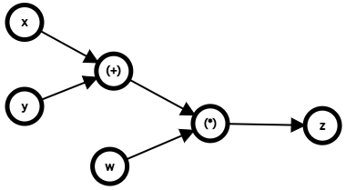

PyTorch는 메타 AI에서 개발한 파이썬 기반의 오픈 소스 딥러닝 프레임워크로서, 강력한 동적 계산 그래프를 제공하며 연구와 실무에서 널리 사용되고 있습니다. 
PyTorch의 핵심 개념과 내부 함수들을 살펴봅시다.

## 1. PyTorch의 주요 특징

PyTorch는 다음과 같은 특징을 가지고 있습니다:

- **동적 계산 그래프(Dynamic Computational Graph)**: 연산이 정의되는 시점에 그래프가 생성되며, 유연성과 디버깅 용이성을 제공합니다.
- **자동 미분(Autograd)**: 모든 텐서 연산에 대해 자동으로 그래디언트를 계산할 수 있습니다.
- **GPU 가속**: 간단한 코드 변경만으로 GPU를 활용할 수 있습니다. nvidia의 `cuda`를 지원합니다
- **다양한 커뮤니티와 생태계**: 풍부한 튜토리얼, 도구 및 모델들이 존재합니다.

### 계산 그래프란?

계산 그래프(Computation Graph)는 수학적 연산을 노드와 엣지를 이용한 그래프 구조로 표현한 것입니다.

- 노드(Node): 연산(예: 덧셈, 곱셈 등)이나 변수(입력값)를 의미합니다.
- 엣지(Edge): 데이터의 흐름과 의존 관계를 나타냅니다.

다음과 같은 수식을 가정해봅시다.

$$ 
z = (x+y)\cdot w 
$$

이 수식에 대한 계산 그래프는 다음과 같이 그릴 수 있습니다.



이와 같은 그래프를 통해 모델 학습 시 학습의 흐름을 구조화하고, 미분과 역전파를 효율적으로 계산할 수 있게 해줍니다.
그렇다면 동적 계산 그래프는 무엇일까요?

### 동적 계산 그래프란?

동적 계산 그래프는 연산을 수행할 때 실시간으로 그래프를 생성하는데, 정적 계산 그래프에서는 모델의 구조를 먼저 정의하고, 이후 입력이 이를 통과하도록 설계됩니다. 
반면, 동적 계산 그래프는 코드 실행 중에 그래프가 생성되고 변경됩니다. 

#### 동적 방식의 장점:

1. **유연성**: 계산 그래프가 실시간으로 생성되므로, 복잡한 제어 흐름(예: 조건문, 반복문)도 자연스럽게 처리할 수 있습니다.
2. **디버깅 용이성**: Python 디버깅 도구를 사용하여 연산을 추적하고 디버깅할 수 있습니다.
3. **간소화된 모델 개발**: 모델 구조를 실시간으로 변경할 수 있어 실험과 연구에 적합합니다.

```python
import torch

def dynamic_graph_example(x):
    if x > 0:
        y = x ** 2
    else:
        y = x ** 3
    return y

x = torch.tensor(2.0, requires_grad=True)
result = dynamic_graph_example(x)
result.backward()
print(x.grad)  # x > 0이므로 dy/dx = 2x = 4.0
```

## 2. PyTorch의 주요 구성 요소

### (1) Tensor

PyTorch의 기본 데이터 구조는 **Tensor**입니다. NumPy 배열과 유사하게 작동하며 GPU 가속을 지원합니다.

#### 텐서 생성 및 GPU 활용 예제

```python
import torch

# 텐서 생성
x = torch.tensor([[1, 2], [3, 4]], dtype=torch.float32)
print("Tensor x:", x)  # Tensor x: tensor([[1., 2.], [3., 4.]])

# GPU로 이동
if torch.cuda.is_available():
    x_gpu = x.to('cuda')
    print("Tensor on GPU:", x_gpu)  # Tensor on GPU: tensor([[1., 2.], [3., 4.]], device='cuda:0')
```

#### 주요 텐서 연산 예제

```python
x = torch.tensor([[1.0, 2.0], [3.0, 4.0]])

print("Sum:", torch.sum(x))         # Sum: tensor(10.)
print("Mean:", torch.mean(x))       # Mean: tensor(2.5)
print("Max:", torch.max(x))         # Max: tensor(4.)
print("Argmax:", torch.argmax(x))   # Argmax: tensor(3)
```
※PyTorch 텐서는 기본적으로 행렬을 1차원 배열처럼 펼친 순서로 인덱싱합니다.

#### 텐서 변환 및 조작 예제

```python
# 텐서 변환
x = torch.tensor([[1, 2], [3, 4]])

# Reshape
reshaped = x.reshape(4, 1)
print("Reshaped Tensor:", reshaped)  # Reshaped Tensor: tensor([[1], [2], [3], [4]])

# Transpose
transposed = torch.transpose(x, 0, 1)
print("Transposed Tensor:", transposed)  # Transposed Tensor: tensor([[1, 3], [2, 4]])

# Flatten
flattened = torch.flatten(x)
print("Flattened Tensor:", flattened)  # Flattened Tensor: tensor([1, 2, 3, 4])
```

#### 요소 반환 및 계산 함수
```python
x = torch.tensor([1, 2, 3, 4, 5], dtype=torch.float32)
print("Max:", torch.max(x))  # Max: tensor(5.)
print("Mean:", torch.mean(x))  # Mean: tensor(3.)
print("Variance:", torch.var(x))  # Variance: tensor(2.5)
```

#### 텐서 초기화
```python
# 특정 값으로 초기화
zeros = torch.zeros((2, 3))
ones = torch.ones((2, 3))
arange_tensor = torch.arange(0, 10, 2)

print("Zeros Tensor:", zeros)  # Zeros Tensor: tensor([[0., 0., 0.], [0., 0., 0.]])
print("Ones Tensor:", ones)  # Ones Tensor: tensor([[1., 1., 1.], [1., 1., 1.]])
print("Arange Tensor:", arange_tensor)  # Arange Tensor: tensor([0, 2, 4, 6, 8])

# 랜덤 값으로 초기화
rand_tensor = torch.rand((2, 3))  # 0과 1 사이의 균등 분포
randn_tensor = torch.randn((2, 3))  # 평균 0, 표준편차 1 정규분포

print("Random Tensor:", rand_tensor)  # Random Tensor: tensor([...])
print("Random Normal Tensor:", randn_tensor)  # Random Normal Tensor: tensor([...])
```

### (2) Autograd

PyTorch는 자동 미분 기능을 제공합니다. 신경망 학습 과정에서 필수적인 요소입니다.

```python
# 자동 미분 예제
x = torch.tensor(2.0, requires_grad=True)
y = x ** 3

y.backward()  # y를 x에 대해 미분
print("Gradient:", x.grad)  # Gradient: tensor(12.)
```

### (3) Neural Network (nn.Module)

PyTorch에서 신경망은 **`nn.Module`** 클래스를 상속하여 정의됩니다.

```python
import torch.nn as nn

class SimpleModel(nn.Module):
    def __init__(self):
        super(SimpleModel, self).__init__()
        self.linear = nn.Linear(2, 1)  # 입력 2, 출력 1

    def forward(self, x):
        return self.linear(x)

# 모델 생성
model = SimpleModel()
x = torch.tensor([[1.0, 2.0]])
output = model(x)
print("Model Output:", output)  # Model Output: tensor([[...]], grad_fn=<AddmmBackward0>)
```
`nn.Linear()`에 입출력 차원을 지정해주면 해당 차원들에 해당하는 선형변환이 만들어집니다.
이 선형변환에 대한 가중치 행렬의 값은 **Kaiming He 초기화(Kaiming Uniform Initialization)** 방법을 사용하여 초기화됩니다.

### (4) Optimizer

PyTorch는 다양한 최적화 알고리즘을 제공합니다. 가장 널리 사용되는 것은 **SGD**와 **Adam**입니다.

```python
import torch.optim as optim

optimizer = optim.SGD(model.parameters(), lr=0.01)
loss_fn = nn.MSELoss()
y_true = torch.tensor([[5.0]])

for epoch in range(10):
    optimizer.zero_grad()  # 기울기 초기화
    y_pred = model(x)      # 예측 값
    loss = loss_fn(y_pred, y_true)  # 손실 계산
    loss.backward()        # 역전파
    optimizer.step()       # 가중치 업데이트

    print(f"Epoch {epoch + 1}, Loss: {loss.item()}")
```

---
간단하게 파이토치의 개념과 사용법에 대해 알아보았습니다. 해당 포스트에서 언급된 Kaiming He 초기화(Kaiming Uniform Initialization), SGD, Adam 등과 같이 해당 포스트에서 다루지 못한 개념적 내용은 차후 포스트를 통해 더 알아보도록 하겠습니다.