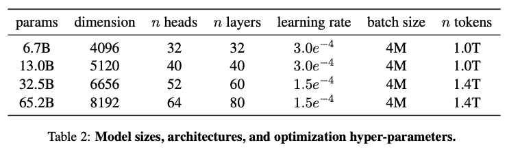

# 0. Abstract

LLaMA는 7B에서 65B 매개변수 규모의 대형 언어 모델(LLM)로, 공개 데이터만을 활용하여 훈련되었음.

LLaMA-13B는 GPT-3(175B)를 대부분의 벤치마크에서 능가하며, LLaMA-65B는 Chinchilla(70B)와 PaLM(540B)와 유사한 성능을 보임

# 1. Introduction

방대한 양의 텍스트로 학습된 거대 언어 모델들은 모델의 크기가 커지면 성능이 증가한다는 Scaling law에 따르며, 이에 따라 연구자들은 모델의 크기를 늘리는 데에 집중해왔음. 하지만 추론 비용의 관점에서 이는 비효율적인 것임. 추론 비용이란 모델을 배포할 때 고려해야할 주요 요소로, 훈련 단계 뿐만이 아니라 추론의 효율성까지 고려한 설계가 필요함.

이에 따라 LLaMA 모델은 추론 비용에서의 효율성을 위해 모델의 크기를 지나치게 키우지 않으면서도 통상적으로 학습에 사용되는 토큰보다 더 많은 토큰을 학습 데이터로 사용함(통상적으로 10B 모델은 20B 정도의 토큰으로 학습되지만, LLaMA-7B 모델은 1T 토큰으로 학습됨).

공개된 데이터만을 활용, 사회적, 윤리적 한계(예: 편향, 유해성) 개선

# 2 Approach

LLaMA는 효율적이고 강력한 대규모 언어 모델을 설계하기 위해 데이터 구성, 모델 아키텍처, 훈련 최적화의 세 가지 측면에서 혁신적인 접근법을 사용함

## 2.1 데이터 구성

LLaMA는 1.4조(1.4T) 토큰의 데이터를 사용하여 훈련되었으며, 모두 공개 데이터를 활용

데이터는 높은 품질을 유지하면서도 다양한 언어와 도메인을 포괄하도록 설계

| **데이터셋** | **비중(%)** | **특징** |
| --- | --- | --- |
| **CommonCrawl** | 67.0 | - CCNet 파이프라인을 통해 중복 제거, 품질 관리 강화. - 언어 필터링으로 비영어 데이터 제외. |
| **C4** | 15.0 | - CommonCrawl에서 추출된 고품질 서브셋.   - 문장 단위로 정제된 뉴스 및 웹 문서 포함. |
| **GitHub** | 4.5 | - 오픈소스 코드 저장소에서 데이터 수집.   - 라이선스 준수를 위해 데이터 정제. |
| **Wikipedia** | 4.5 | - 20개 언어 지원.   - 주석, 메타데이터 등 불필요한 정보 제거. |
| **기타(Books 등)** | 9.0 | - 과학 문서와 서적 포함(Gutenberg Project, Books3) |

## **2.2 모델 아키텍처**

LLaMA는 기존 Transformer 모델의 강점을 기반으로 하되, RMSNorm, SwiGLU, RoPE와 같은 개선된 기법을 도입해 성능과 효율성을 극대화

### **2.2.1. RMSNorm (Root Mean Square Normalization)**

RMSNorm은 입력 벡터의 평균값을 제거하지 않고, 벡터의 제곱 평균(Root Mean Square, RMS)으로 정규화

- 특징
    - Pre-normalization 방식으로 각 Transformer 레이어의 입력 안정성을 강화.
    - LayerNorm 대비 계산 비용이 적으며, 긴 문맥 학습에서도 안정적인 성능을 보임.
- 수식

$$
\text{RMSNorm}(x) = \frac{x}{\sqrt{\frac{1}{d}\sum_{i=1}^{d} x_i^2 + \epsilon}} \cdot \gamma
$$

※ LayerNorm의 수식

$$
LayerNorm(x)=\frac{x-\mu}{\sqrt(\sigma^2)+\epsilon}\cdot\gamma +\beta
$$

### **2.2.2. SwiGLU (Switchable Gated Linear Unit)**

SwiGLU는 ReLU대신 사용되는 활성화 함수로, 게이트 메커니즘을 활용해 그래디언트 소실을 줄이고 표현 학습 효율성을 극대화

- 특징
    - 두 개의 선형 변환을 시그모이드 게이트로 조합해 성능을 개선.
- **수식**
    
$$    
SwiGLU(x)=σ(xW_1)⊙(xW_2)
$$
※ $\sigma$는 시그모이드 함수, $W_1, W_2$는 선형 변환 행렬.

※ReLU와 비교했을때의 장점

- 입력 값 0 근처에서 부드러운 전환을 제공
- GLU(Gated Linear Unit)의 게이팅 메커니즘을 활용하여 정보 흐름을 동적으로 제어
    - $GLU(x,W,V,b,c)=(xW_1+b) ⊙ σ(xW_2+c)$

### **2.2.3. RoPE (Rotary Position Embedding)**

RoPE는 기존 Transformer의 절대 위치 임베딩을 대체하는 회전 기반 위치 임베딩 기법

- **특징**
    - 회전 변환을 통해 각 위치의 상대적 정보를 효율적으로 학습.
    - 긴 시퀀스 문맥에서도 문맥 외삽 능력을 향상.
- **수식**

$$
RoPE(q,k)=(qcos(θ)+q^′sin(θ))⋅(kcos(θ)−k^′sin(θ))
$$

## 2.3 Optimizer

### AdamW Optimizer

- Weight Decay: λ=0.1로 설정하여 일반화 성능 향상 및 과적합 방지.
- Beta 계수:
    - β1=0.9 (모멘텀)
    - β2=0.95 (그래디언트 제곱의 이동 평균)

### 코사인 학습률 스케줄링

- Warmup 단계:초기 3750 스텝 동안 학습률을 선형적으로 가.
    - 0에서 $4×10^{−3}$까지 상승.
- Cosine Decay 단계:Warmup 이후, 학습률은 훈련 스텝이 진행됨에 따라 코사인 곡선에 따라 점진적으로 감소.

## 2.4 효율적 구현

### 병렬화 전략

- 텐서 병렬화 (Tensor Parallelism):모델 파라미터를 여러 GPU로 분할하여 병렬 처리.
- 파이프라인 병렬화 (Pipeline Parallelism):모델 연산을 여러 단계로 나누고 각 단계를 다른 GPU에서 처리.

### 체크포인트 재활용

- 훈련 중간 결과를 저장하고 필요 시 재사용하여 GPU 메모리 사용량을 절감.
    - 더 큰 배치를 처리 가능.
    - GPU 자원을 효율적으로 활용.

### 하드웨어 구성

- GPU 사용:NVIDIA A100 GPU 2048개로 훈련.
- 훈련 기간:1.4조 토큰 학습을 약 21일 만에 완료.
- 혼합 정밀도:bfloat16과 float32를 혼합하여 메모리 사용량 절감 및 계산 효율성 증가.

# **3. Main Results**

LLaMA는 다양한 벤치마크에서 우수한 성능을 기록했으며, 기존의 대형 언어 모델(LLM)들과 비교해 더 효율적이고 강력한 결과를 보여주었음

## **3.1 Common Sense Reasoning**

8개의 일반 상식 추론 벤치마크에서 평가.

- **벤치마크**: BoolQ, PIQA, SIQA, HellaSwag, WinoGrande, ARC-Easy, ARC-Challenge, OpenBookQA.
- **성능 비교**:
    - LLaMA-65B는 Chinchilla-70B를 대부분의 벤치마크에서 능가했으며, PaLM-540B와도 경쟁 가능한 성능을 보임.
    - LLaMA-13B는 GPT-3(175B)보다 우수한 성능을 기록.

## **3.2 Closed-book Question Answering**

Natural Questions와 TriviaQA 데이터셋에서 평가

- **성능 결과**:
    - LLaMA-65B는 두 데이터셋 모두에서 기존 모델 대비 최고 성능을 달성.
    - LLaMA-13B는 GPT-3 및 Chinchilla와 유사한 수준의 성능을 보이며, 더 작은 크기로도 경쟁력을 입증.

## **3.3 Reading Comprehension**

RACE 데이터셋에서 평가된 결과:

- LLaMA-65B는 PaLM-540B와 비슷한 성능을 보였으며,
- LLaMA-13B는 GPT-3보다 약간 더 나은 결과를 기록.

## **3.4 Mathematical Reasoning**

MATH와 GSM8k라는 두 가지 수학적 추론 벤치마크에서 평가

- **MATH**: 중학교 및 고등학교 수학 문제로 구성된 데이터셋.
- **GSM8k**: 중학교 수준의 수학 문제를 포함.

LLaMA 모델의 주요 성과:

- LLaMA-65B는 **Minerva-62B**를 능가했으며, 이는 수학 데이터로 추가 학습 없이 이루어진 결과.
- LLaMA는 PaLM 및 Minerva와 비교하여 일부 영역에서 경쟁력 있는 성능을 보여줌.

**주요 특징**:

- "maj1@k"는 다수결 투표 방식을 사용한 평가로, 여러 샘플을 생성해 가장 빈번한 답을 선택하는 방식입니다.
- LLaMA-65B는 특히 GSM8k에서 Minerva와 유사한 성능을 보이며, 수학적 데이터 없이도 높은 정확도를 기록

※Minerva: ArXiv와 수학 웹 페이지 들에서 추출한 데이터로 PaLM 모델을 파인튜닝한 모델

## **3.5 Code Generation**

**HumanEval**과 **MBPP** 벤치마크를 통해 코드 생성 능력을 평가.

- **HumanEval**: 자연어로 제공된 함수 설명 및 테스트 케이스를 기반으로 Python 코드를 생성.
- **MBPP**: 프로그램 설명과 입출력 예제를 기반으로 코드 작성.

LLaMA의 성능:

- LLaMA는 코드에 특화되지 않은 일반 모델들과 비교해 우수한 성능을 보임.
- LLaMA-65B는 PaLM-62B보다 높은 정확도를 기록.

## **3.6 Massive Multitask Language Understanding (MMLU)**

- MMLU 벤치마크: 인문학, STEM, 사회과학 등 다양한 분야의 다중 선택 질문으로 구성
- LLaMA-65B는 평균적으로 Chinchilla-70B 및 PaLM-540B보다 약간 낮은 점수를 기록.
- 제한된 양의 책 및 학술 논문 데이터를 사용했기 때문에 이러한 차이가 발생했을 가능성이 있음.

## **3.7 Training Performance Evolution**

훈련 중 모델의 성능 변화가 몇 가지 벤치마크에서 추적됨

1. 대부분의 벤치마크에서 성능이 훈련 퍼플렉시티(perplexity)와 함께 꾸준히 향상됨.
2. 특정 데이터셋(SIQA, WinoGrande)에서는 성능 변동성이 크거나 훈련 퍼플렉시티와 상관관계가 낮음.

# **4. Instruction Finetuning**

- Instruction Finetuning은 모델이 사용자의 지시를 더 잘 따를 수 있도록 소량의 지시 데이터로 추가 학습하는 과정.
- LLaMA-65B는 기본적으로도 간단한 지시를 따를 수 있지만, 추가적인 Instruction Finetuning을 통해 성능이 크게 개선됨.

## **MMLU 벤치마크 성능**

- LLaMA-I(65B)는 68.9%의 정확도를 기록하며, 기존의 Instruction-tuned 모델들(예: OPT-IML, Flan-PaLM)을 능가.
- 그러나 GPT 코드-davinci-002(77.4%)와 같은 최첨단 모델에는 여전히 뒤처짐.

# **5. Bias, Toxicity, and Misinformation**

LLaMA 모델의 잠재적인 위험성을 평가하기 위해, 다양한 벤치마크를 사용하여 편향(Bias), 유해성(Toxicity), 및 허위 정보(Misinformation)를 분석

## **5.1 RealToxicityPrompts**

- **목적**: 모델이 생성할 수 있는 독성 언어(예: 욕설, 증오 발언 등)를 평가.
- **벤치마크**: 약 10만 개의 프롬프트로 구성된 RealToxicityPrompts를 사용.
- **결과**:
    - LLaMA 모델의 독성 점수는 모델 크기가 커질수록 증가하는 경향을 보임.
    - "정중한" 프롬프트(Respectful prompts)에서도 독성 점수가 더 높아짐.

## **5.2 CrowS-Pairs**

- **목적**: 사회적 편향(성별, 인종, 종교 등)을 측정.
- **방법**: 고정된 문장에서 편향적인 문장과 비편향적인 문장을 비교하여 모델이 어느 쪽을 선호하는지 평가.
- **결과**:
    - LLaMA는 평균적으로 GPT-3 및 OPT와 유사한 수준의 편향을 보였으나, 특정 카테고리(종교, 성별 등)에서 더 높은 편향을 나타냄.

## **5.3 WinoGender**

- **목적**: 성별 관련 직업 편향을 측정.
- **방법**: 성별 대명사("her", "his", "their")가 직업 또는 참여자를 참조하는 정확도를 평가.
- **결과**:
    - 중립적인 대명사("their")에서는 높은 정확도를 기록했지만, 성별 대명사("her", "his")에서는 성별 편향으로 인해 낮은 정확도를 보임.
    - 특히 "gotcha" 사례(직업의 성별이 예상과 다른 경우)에서 더 많은 오류를 발생.

## **5.4 TruthfulQA**

- **목적**: 모델이 사실에 기반한 응답을 생성할 수 있는 능력을 평가.
- **결과**:
    - LLaMA는 GPT-3보다 높은 점수를 기록했으나, 여전히 허위 정보 생성 가능성이 존재.

# 8. Conclusion

## **8.1 주요 성과**

- LLaMA는 7B에서 65B 매개변수 규모의 언어 모델로 구성되어 있으며, **공개 데이터만** 사용하여 훈련
- **LLaMA-13B**는 GPT-3(175B)보다 더 작은 크기임에도 불구하고 대부분의 벤치마크에서 이를 능가
- **LLaMA-65B**는 Chinchilla-70B 및 PaLM-540B와 같은 최첨단 모델과 경쟁할 만한 성능을 발휘

## **8.2 공개 및 연구 기여**

- 기존 대규모 언어 모델과 달리, LLaMA는 독점적이거나 접근할 수 없는 데이터셋에 의존하지 않고, 오직 공개적으로 이용 가능한 데이터로만 훈련
- 연구 커뮤니티에 모델을 공개함으로써 대규모 언어 모델의 접근성을 높이고, 연구자들이 이를 활용해 더 나은 모델을 개발하도록 돕는 것을 목표로 함

## **8.3 Instruction Finetuning**

- LLaMA 모델은 기본적으로도 지시를 따를 수 있지만, 소량의 지시 데이터로 추가 학습(Instruct-tuning)을 수행하면 성능이 크게 향상된다는 점을 관찰

## **8.4 향후 계획**

- 연구팀은 더 큰 사전 학습 데이터로 훈련된 더 큰 규모의 모델을 출시할 계획
- 이는 모델 크기와 데이터 규모를 확장함에 따라 지속적으로 성능이 개선된다는 관찰에 기반

---
생각보다 모델을 설명하는 논문들에서 아키텍쳐 설명이 자세하지 않은 것 같고, 성능을 과시하는 내용이 주가 되는 것 같습니다. 보다 더 비판적으로 논문을 읽어봐야겠습니다.