자동 음성 인식(Automatic Speech Recognition, ASR)이란 인간의 음성 신호를 디지털 신호로 분석하고, 이를 텍스트 데이터로 변환하는 기술입니다. Speech-to-Text(STT)라는 이름으로도 불립니다. 
이 포스트에서는 해당 기술에 대한 고전적 접근법부터 단계적으로 살펴본 다음, 시간의 변화에 따라 어떻게 발전해왔는지에 대해 기술해보겠습니다.

## 음성 신호 수집 & 전처리
당연한 이야기지만, 음성 신호를 텍스트로 옮기기 위해서는 가장 먼저 음성신호를 입력받아야 합니다. 이때, 연속적인 아날로그 신호인 인간의 음성을 불연속적 디지털 신호로 옮기기 위해서는 샘플링 과정이 필요합니다.
### 샘플링
샘플링이란 특정 신호를 일정 주기로 기록하는 것을 말합니다. 이때 기록을 보다 정확히 하기 위해선 짧은 주기로 기록하는 것이 좋을 것입니다. 하지만 너무 짧은 주기로 기록하게 되면 불필요한 정보들이 많아질 것입니다. 그렇다면 어느 정도의 주기가 아날로그 신호의 정보를 보존하기 위해 적당할까요?
**나이퀴스트 이론(Nyquist Theorem)** 에 따르면, 신호의 최대 주파수 성분(
  $f_{max}$  )의 두 배 이상의 샘플링 주파수(  $f_s$  )로 샘플링하면, 원래의 아날로그 신호를 손실 없이 복원할 수 있습니다.

$$
f_{max} \geq 2 f_s
$$

수식때문에 머리가 아플수도 있겠으나, 어찌보면 당연한 이야깁니다. 어떤 신호의 주파수가 주어져있다면, 그 신호를 손실없이 복원하기 위해서는 그 주파수의 두배의 주파수로만 샘플링을 진행해도 충분하다는 것이죠.

  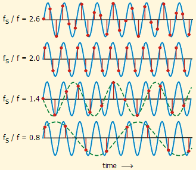
  
<em>샘플링 주파수에 따른 샘플링 차이</em>

인간의 가청 음역대는 20~20,000Hz 이지만, 음성 인식만이 목적이라면 그렇게 높은 주파수 대역까지 신경쓸 필요는 없습니다. 사람의 음성이 가질 수 있는 주파수 대역은 100~10,000Hz 정도이며, 일상 회화는 200~6,000Hz 영역으로 제한되기 때문입니다.
따라서 음성 인식에서 주로 사용되는 샘플링 주파수는 16kHz입니다. 해당 샘플링 주파수로 음성 신호의 정보를 효율적으로 복원해 낼 수 있습니다.

  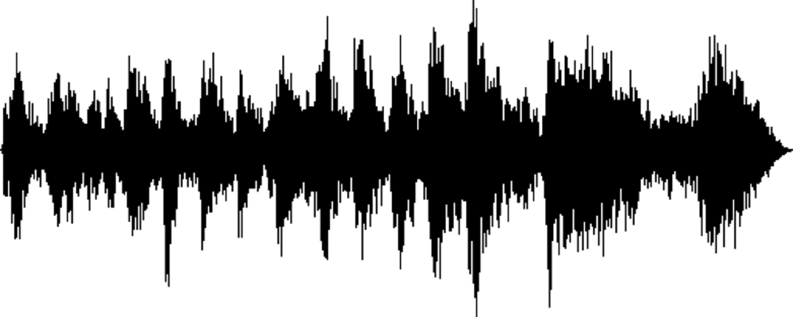

샘플링을 거쳐 음성 데이터의 파형을 얻어냈으나 이 원시 음성 데이터를 그대로 사용하지는 않습니다.  
원시 음성 데이터만으로는 여러 한계를 갖는데, 화자에 따라 같은 단어를 발음한 데이터라도 다른 신호로 표현될 수 있으며, 같은 화자가 발화한 같은 단어일지라도 같은 신호를 얻을 수 있다는 보장이 없습니다. 말하는 속도, 억양, 음량에 따라서 신호는 가변적으로 나타날 것입니다. 이와 같은 이유로, 일반적으로는 이 원시 음성 데이터에서 특징을 추출합니다.   
가장 간단하면서도 강력한 특징 추출은 스펙트로그램으로 얻어낼 수 있습니다.  
### 스펙트로그램
**스펙트로그램(Spectrogram)** 은 소리나 신호의 주파수 성분이 시간에 따라 어떻게 변화하는지 시각적으로 표현한 그래프입니다. 이는 음성, 음악, 환경 소음 등 다양한 신호를 분석하는 데 사용되며, 시간(Time), 주파수(Frequency), 그리고 진폭(Amplitude) 이라는 세 가지 차원을 포함합니다.

**스펙트로그램의 구성**
- **X축** (시간): 신호가 시간에 따라 어떻게 변화하는지를 나타냅니다.
- **Y축** (주파수): 신호에 포함된 주파수 성분을 나타냅니다.
- **색상 또는 밝기** (진폭/에너지): 특정 시간과 주파수에서의 신호 강도를 나타냅니다. 일반적으로 더 밝거나 짙은 색은 더 높은 진폭(소리의 크기)을 의미합니다.

  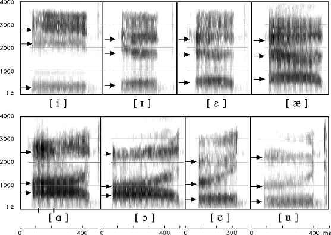
  
<em>영어 모음에 따른 스펙트로그램의 차이</em>

음성 언어의 음운은 해당 음운이 발화된 세기, 억양 등과 관계 없이 고유의 주파수 패턴을 가집니다. 이를 통해 우리는 음운 정보를 파악할 수 있습니다.  
그렇다면 1차원 원시 음성 데이터로부터 이런 스펙트로그램은 어떻게 얻어내는 것일까요?  
### 푸리에 변환
스펙트로그램은 **푸리에 변환**, 더 자세히 말하자면 **단시간 푸리에 변환(STFT, Short-Time Fourier Transform)** 을 통해 얻어낼 수 있습니다.

  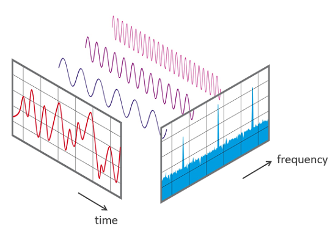

푸리에 변환에 대해 간단히 소개하자면, 복잡한 신호를 간단한 신호들의 합으로 풀어내는 것을 말합니다. 이를 통해 우리는 1차원 음성 신호를 구성하는 주파수들을 파악할 수 있고, 이로부터 음운의 정보를 얻어낼 수 있습니다.  

  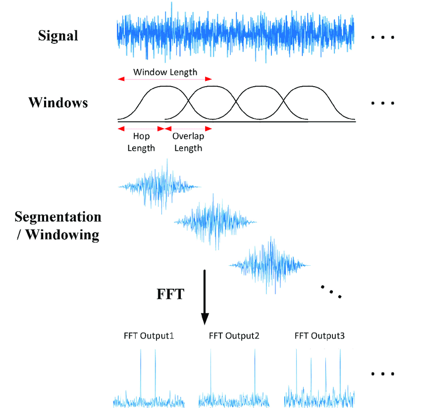

하지만 우리는 음성 신호 전체가 아닌 음운 하나하나의 정보를 파악해야하므로, 1차원 음성 신호를 잘게 쪼개 각 부분에서 음운에 대한 정보를 알아내야합니다. 이와 같이 신호를 일정한 시간 단위로 쪼개 각 신호에 대해 푸리에 변환을 적용하는 것을 단시간 푸리에 변환(STFT, Short-Time Fourier Transform)이라고 합니다.  

윈도잉을 진행할때, 보통 윈도우 사이즈는 20~25ms 정도로 잡는데, 20~25ms의 짧은 시간 구간 안에서는 음운의 정보가 유지되기 때문입니다. 또한 신호의 연속성 보장을 위해 보통 10ms 정도의 겹치는 구간을 두고 윈도잉을 진행합니다.  

### Mel spectrogram

  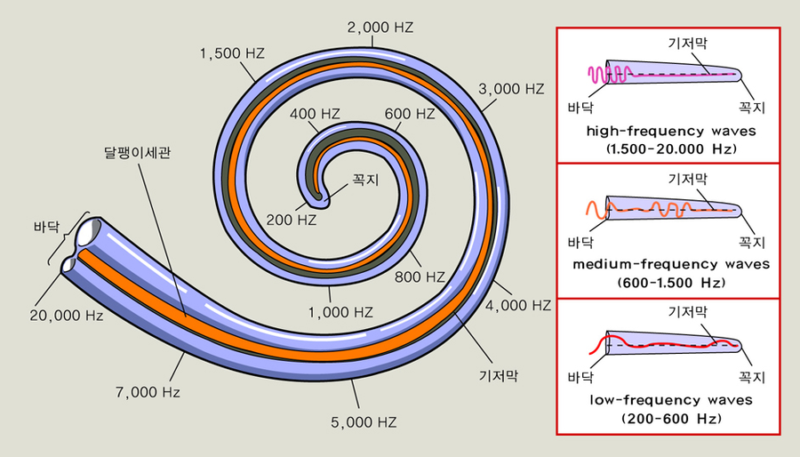

하지만 여기서 끝이 아니다?! 여기서 잠깐 인간의 청각 능력에 대해 이야기해보겠습니다. 인간의 청각 능력은 소리의 주파수 차이를 선형적으로 인식하지 않습니다. 이는 달팽이관의 구조에서 기인한 것으로, 달팽이관은 저주파수 대역의 소리에 대해서 민감하게 반응하는 반면, 고주파수 대역의 소리에 대해서는 덜 민감하게 반응합니다.  

  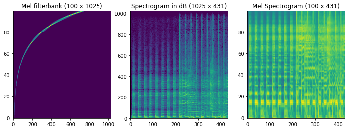

이러한 청각 특징을 반영하기 위해 우리는 Mel filterbank라는 필터를 통해 저주파수 대역의 정보를 강화시킨 **Mel spectrogram**을 얻게됩니다.  
여기서 로그 변환과 Discrete Cosine Transform (DCT) 연산을 통해 각 윈도우마다 특징 벡터를 얻을 수 있는데, 이를 **MFCC (Mel-Frequency Cepstral Coefficient)** 라고 부릅니다.  
이렇게 음성 데이터를 벡터화 하여 사용할 수 있는데, 고전적인 방법론에서는 음성을 MFCC 벡터화하여 사용하는 것이 일반적이었지만, 딥러닝 모델에서는 mel spectrogram 추출까지만 전처리로 진행하고 그  이미지만을 입력으로 사용해 **CNN(Convolutional Neural Networks)** 모델 등의 이미지 모델로 처리하는 것이 일반적입니다.  

## Decoding 단계
열심히 음성 데이터를 전처리했다면 이제 그 음성 데이터를 텍스트로 전사할 차례입니다. 그 전에 먼저 음성인식 문제를 수식으로 정의해보겠습니다.  

우리는 주어진 음성 데이터 $O$가 주어졌을때, 그를 기반으로 가장 높은 확률을 갖는 단어 시퀀스 $W$를 찾고자 합니다.  

$$
\hat{W} = \arg\max_{W}{P(W|O)}
$$

베이즈 정리에 따라 위 식을 다시 쓰면  

$$
\hat{W} = \arg\max_{W}{\frac{P(O|W)P(W)}{P(O)}}
$$

와 같이 쓸 수 있습니다.  

이때 분모의 $P(O)$ 는 $W$ 에 상관없이 동일하다는 것을 생각하면, 음성인식 문제를 최종적으로 다음과 같이 정의할 수 있겠습니다.  

$$
\hat{W} = \arg\max_{W}{P(O|W)P(W)}
$$

위 식을 해석하면, $P(O|W)$ 는 관측된 음성 데이터 $O$가 특정 단어 시퀀스 $W$에 의해 생성될 확률을 나타내며, $P(W)$는 특정 단어 시퀀스 $W$가 문맥적으로 자연스러울 확률을 나타냅니다.  
이에 대한 확률 모델을 각각 **음향 모델(Acoustic Model)** 과 **언어 모델(Language Model)** 로 표현할 수 있습니다.  
이 음향 모델과 언어 모델에 대한 접근법을 전통적인 접근법부터 최신 접근법까지 살펴보도록 하겠습니다.  

### 전통적 접근법(HMM 기반)
먼저 음성인식의 전통적 접근법에 대해 알아보겠습니다. 전통적인 음성인식에서는 **은닉 마르코프 모델(Hidden Markov Model, HMM)** 기반의 음향 모델과, **N-gram** 기반 언어 모델을 사용하였습니다.   

  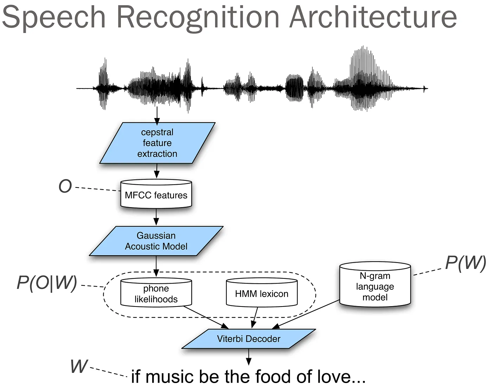

#### 음향 모델
전통적인 음향 모델 접근법에서는 은닉 마르코프 모델(Hidden Markov Model, HMM)이 주로 사용되는데요, 이 HMM에 대해 간단히 알아보겠습니다.
##### 은닉 마르코프 모델(Hidden Markov Model, HMM)
- 마르코프 모델의 확장  
마르코프 모델은 현재 상태가 바로 이전 상태에만 의존한다는 가정(마르코프 성질)을 기반으로 합니다. 예를 들어, 날씨 예측에서 오늘의 날씨는 어제의 날씨에 의존한다고 가정할 수 있습니다.  
$$P(q_t|q_{t-1},q_{t-2},\dots)=P(q_t|q_{t-1})$$은닉 마르코프 모델은 여기에 관찰 가능한 데이터와 은닉된 상태라는 두 가지 요소를 추가합니다. 은닉 상태는 직접 관찰할 수 없으며, 관찰 데이터를 통해 간접적으로 추론됩니다  
- 구성 요소  
  1. 은닉 상태 집합 ($Q$)  
  $Q = \{q_1, q_2, \dots, q_N\}$$  
  은닉 상태들의 집합을 나타냅니다. (예: 날씨 상태 {맑음, 비, 흐림})
  2. 관찰 기호 집합 ($Y$)  
  $Y = \{y_1, y_2, \dots, y_M\}$  
  관찰 가능한 데이터들의 집합을 나타냅니다. (예: 우산 사용 여부)  
  3. 초기 상태 확률 ($\pi$)  
  $\pi_i = P(q_1 = q_i), \quad i = 1, 2, ..., N, \quad \sum_{i=1}^N \pi_i = 1$  
  초기 시점에서 각 은닉 상태에 있을 확률 분포를 나타냅니다.  
  4. 상태 전이 확률 행렬 ($A$)  
  $a_{ij} = P(q_{t+1} = q_j \mid q_t = q_i)$  
  은닉 상태 간 전이 확률을 나타냅니다.  
  $a_{ij}$는 시간 $t+1$에 상태 $q_i$에서 상태 $q_j$로 전이될 조건부 확률입니다.  
  5. 방출 확률 행렬 ($B$)  
  $b_j(k) = P(O_t = y_k \mid q_t = q_j)$  
  각 은닉 상태에서 특정 관찰 기호가 발생할 확률을 나타냅니다.  
  $b_j(k)$는 시간 $t$에 상태 $q_j$​에서 관찰 기호 $v_k$​가 발생할 조건부 확률입니다.  

  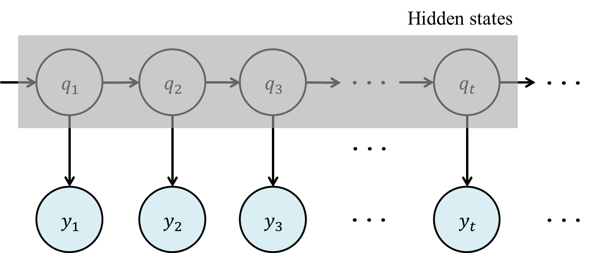
  
<em>은닉 마르코프 모델의 도식화</em>

수식들만 보고있자니 머리가 아픈데요, 생각보다 간단한 개념입니다. 마르코프 가정 아래 관찰 가능한 데이터와 관찰할 수 없는 은닉 상태 간의 확률적 관계를 모델링하여 순차적 데이터를 분석하는 통계적 모델입니다.  

이를 음향 모델에 적용한다면 다음과 같은 표로 나타낼 수 있겠습니다.  

| **HMM 구성 요소**      | **음향 모델에서의 역할**                                                                                            |
|-------------------------|---------------------------------------------------------------------------------------------------------------------|
| **은닉 상태 집합 ($Q$)** | 은닉된 심리적 소리인 음소(phoneme)를 나타냅니다. 음성 신호의 특정 구간이 어떤 음소에 대응하는지 추론하기 위해 사용됩니다.                          |
| **관찰 기호 집합 ($Y$)** | 관찰된 음성 기호입니다. 음성 신호에서 추출된 MFCC(Mel-Frequency Cepstral Coefficients) 등의 특성을 나타냅니다. |
| **초기 상태 확률 ($\pi$)** | 음소 상태 중 음성 시작 시점에서 어떤 상태에 있을 확률을 나타냅니다. 예를 들어, "시작 음소"로 시작할 확률을 모델링합니다.                     |
| **상태 전이 확률 행렬 ($A$)** | 한 음소에서 다음 음소로 전이될 확률을 나타냅니다. 예를 들어, 'ㄱ' 음소에서 'ㄴ' 음소로 전환될 확률을 모델링합니다.                              |
| **방출 확률 행렬 ($B$)**  | 특정 음소 상태에서 특정 음향 특징 벡터가 관찰될 확률을 나타냅니다. 음성 데이터와 음소 간의 관계를 학습하는 데 사용됩니다.                      |

이와 같이 HMM을 통해 음성인식 모델의 음향 모델을 모델링할 수 있습니다.

#### 언어 모델
전통적인 접근법에서 언어 모델은 N-gram 기반의 확률적 모델이 주로 사용되었습니다. N-gram 모델은 텍스트 데이터를 학습해 단어 시퀀스의 확률을 계산하는 간단하면서도 효과적인 방식입니다.

##### N-gram 모델
N-gram 모델은 이전 $N−1$개의 단어를 기반으로 현재 단어가 등장할 확률을 예측합니다. 이를 수식으로 표현하면 다음과 같습니다.

$$
𝑃(𝑊)=\prod_{i=1}^𝑛P(w_i|w_{i-(N-1),\dots,w_{i-1}})
$$

여기서 $w_i$는 단어 시퀀스의 𝑖번째 단어를 의미합니다.

**N-gram 모델의 한계**
- 희소성 문제:  
훈련 데이터에 없는 단어 조합은 확률이 0으로 계산되어 학습에 어려움이 생깁니다. 이를 완화하기 위해 스무딩 기법이 사용되지만, 여전히 한계가 존재합니다.

- 긴 문맥 처리의 한계:  
N-gram 모델은 고정된 N개의 단어만을 고려하므로, 긴 문맥 정보를 반영하기 어렵습니다.

- 언어 모델의 발전  
이후 통계적 기법의 한계를 극복하기 위해 신경망 기반 언어 모델(Neural Language Model)이 등장했습니다. Recurrent Neural Networks (RNN)과 Long Short-Term Memory (LSTM) 모델 등등 언어모델의 발전에 따라 음성 인식의 언어모델도 발전해나갔습니다.

### 최신 접근법(딥러닝 기반)
최신 음성인식 기술은 이전의 HMM-기반 접근법과는 달리, 음성 신호로부터 직접 텍스트를 생성하는 end-to-end 방식을 채택하고 있습니다. 이는 음향 모델과 언어 모델을 따로 학습할 필요 없이, 하나의 통합된 모델에서 음성을 텍스트로 변환할 수 있다는 장점이 있습니다.  
최신 음성 인식 모델 중 가장 유명한 모델인 **Wave2Vec**과 **Whisper**에 대해 알아봅시다.  

#### Wave2Vec
Meta AI에서 개발한 Wave2Vec은 자기지도학습(self-supervised learning) 방식을 통해 음성 데이터의 표현을 학습하는 모델입니다.

##### 작동 원리
- 사전학습 단계  
레이블이 없는 raw 음성 데이터만을 사용하여 음성의 특징을 학습합니다.  
음성의 일부를 마스킹하고, 이를 예측하는 방식으로 학습을 진행합니다.  
이는 BERT와 유사한 방식으로, 문맥을 통해 마스킹된 부분을 예측하는 것입니다.  
- 미세조정 단계  
사전학습된 모델에 음성-텍스트 쌍 데이터를 사용하여 특정 작업(ASR)에 맞게 조정합니다.  
CTC(Connectionist Temporal Classification) 손실 함수를 사용하여 음성-텍스트 정렬 문제를 해결합니다.  

##### CTC (Connectionist Temporal Classification)
CTC는 입력 시퀀스와 출력 시퀀스의 길이가 다른 경우에 사용되는 손실 함수입니다. 음성인식에서는 음성 프레임의 수가 텍스트 레이블의 길이보다 훨씬 길기 때문에 이러한 문제가 발생합니다.
- 기본 개념  
CTC는 모든 가능한 정렬(alignment)을 고려하여 확률을 계산합니다.  
빈 토큰(blank token)을 도입하여 반복되는 문자를 구분합니다.  
- 수식적 표현  
CTC 손실은 다음과 같이 계산됩니다:  

$$
\mathcal{L}{CTC} = -\log P(y|x) = -\log \sum{\pi \in \mathcal{B}^{-1}(y)} P(\pi|x)
$$

여기서  
$x$는 입력 시퀀스  
$y$는 target 레이블 시퀀스  
$\pi$는 가능한 정렬 경로  
$\mathcal{B}$는 CTC collapse 함수  

- Forward-Backward 알고리즘  
CTC 손실을 효율적으로 계산하기 위해 동적 프로그래밍 기반의 Forward-Backward 알고리즘을 사용합니다.
이를 통해 모든 가능한 정렬의 확률을 효율적으로 계산할 수 있습니다.  

  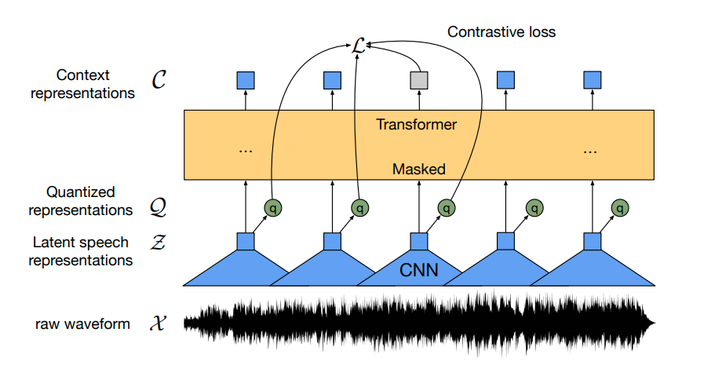
  
<em>Wave2Vec 모델의 구조</em>

Wave2Vec의 가장 큰 특징은 레이블이 없는 대량의 음성 데이터를 활용할 수 있다는 점입니다. 이를 통해 적은 양의 레이블된 데이터로도 높은 성능을 달성할 수 있습니다.  

#### Whisper
OpenAI에서 개발한 Whisper는 대규모 음성 데이터를 활용한 transformer 기반의 ASR 모델입니다.
##### 모델 구조

- Encoder  
입력 음성을 80-채널 mel spectrogram으로 변환합니다.  
Multi-head self-attention 레이어를 통해 음성의 문맥적 특징을 추출합니다.  
- Decoder  
Transformer decoder 구조를 사용합니다.  
Cross-attention을 통해 encoder의 출력을 참조하면서 텍스트를 생성합니다.  

- 손실 함수  
Whisper는 다음과 같은 여러 손실 함수의 조합을 사용합니다:  
$$Loss = λ₁L_{asr} + λ₂L_{lm} + λ₃L_{lang} + λ₄L_{task}$$  

여기서:  
$L_{asr}$: 음성인식을 위한 교차 엔트로피 손실  
$L_{lm}$: 언어 모델링을 위한 손실  
$L_{lang}$: 언어 식별을 위한 손실  
$L_{task}$: 작업 식별을 위한 손실  

- 특수 토큰 처리  
`<|startoftranscript|>`, `<|endoftext|>` 등의 특수 토큰을 사용하여 다양한 작업을 구분합니다.
언어 토큰(예: `<|en|>`, `<|ko|>`)을 사용하여 다국어 처리를 가능하게 합니다.

  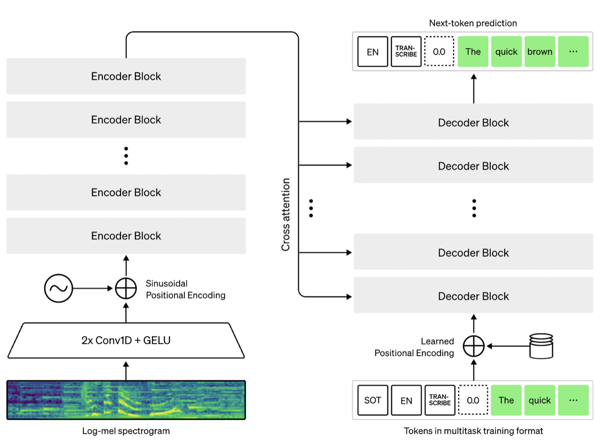
  
<em>Whisper 모델의 구조</em>

---
초기의 통계적 접근법에서 최신의 딥러닝 기반 모델까지 큰 발전을 이뤄온 ASR 기술을 살펴봤습니다.  최근의 Wave2Vec과 Whisper와 같은 end-to-end 모델들은 기존의 분리된 접근 방식의 한계를 뛰어넘어, 더욱 정확하고 효율적인 음성 인식을 가능하게 했습니다.  
차후 포스팅에선 이 글에서 다루지 못한 자세한 이론적 내용을 다뤄보겠습니다.  