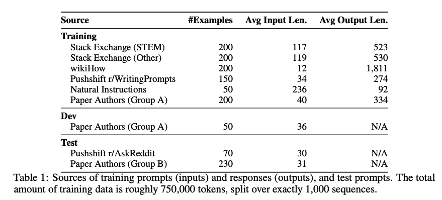

## 1. Introduction

대규모 언어 모델은 주로 Pretraining과 Alignment을 통해 학습됨

- **Pretraining**: 원시 텍스트를 기반으로 비지도 학습을 통해 일반적인 표현을 학습
- **Alignment**: 사용자 선호도 및 특정 작업에 맞게 모델 출력을 조정

기존의 연구에서는 정렬을 위해 지도학습, RLHF 등의 방법론을 채택해 수백만개의 데이터를 활용해 정렬함. 이와같은 방식은 대규모의 정렬 데이터와 계산 자원을 필요로 함.

하지만, 이 논문에서는 사전 학습 단계에서 대부분의 지식과 능력이 학습되며, 정렬 과정은 단순히 모델이 사용자와의 상호작용에서 적절한 스타일이나 형식을 학습하도록 하는 데 목적이 있으므로 대규모 데이터 없이 소량의 고품질 데이터로도 효과적인 정렬이 가능하다는 가설을 채택함.

이를 검증하기 위해 사전 학습된 65B LLaMA 모델을 활용해 1,000개의 선별된 고품질 프롬프트와 응답으로 모델을 미세 조정(fine-tuning)하여 RLHF나 대규모 데이터 없이도 GPT-4와 같은 최신 모델에 근접한 성능을 달성할 수 있는지 평가함.

RLHF로 정렬된 모델들인 Bard 대비 58%, DaVinci003 대비 65%에서 선호를 보이며 정렬 과정을 단순화 시켜도 좋은 성능의 정렬이 가능하다는 것을 보여줌

## 2. Alignment Data

**Superficial Alignment Hypothesis**

- 이 논문의 핵심 가설
- 모델의 지식과 능력은 주로 Pretraining에서 학습되며, 정렬은 주로 응답 형식 및 스타일을 학습시키는 데 초점이 맞춰짐
- 이 가설을 검증하기 위해 소량의 고품질 데이터로 모델을 정렬 가능하다고 가정
- 1000개의 프롬프트와 응답 데이터셋을 구축

### 2.1 Community Questions & Answers

**Stack Exchange**

- 179개의 전문 주제를 다루는 커뮤니티에서 데이터를 수집
- **STEM(과학, 기술, 공학, 수학)** 분야와 기타 주제로 나누어 각 200개의 질문과 답변 샘플을 선별
- 질문과 응답의 품질을 보장하기 위해
    - 높은 점수의 질문과 답변을 선택
    - 응답 길이 제한(1,200자 이상, 4,096자 이하)
    - 1인칭 표현("I", "my") 및 참조 답변( “as mentioned”) 제거

**wikiHow**

- 240,000개 이상의 "How to" 스타일의 가이드를 제공하는 사이트에서 데이터를 샘플링
- 19개 카테고리에서 고르게 200개의 기사를 선택
- 제목을 질문으로, 본문을 응답으로 사용
- 응답에서 불필요한 섹션(링크, 이미지 등)을 제거하고 자연스러운 AI 어시스턴트 스타일로 변환

**The Pushshift Reddit Dataset**

- Reddit의 r/AskReddit과 r/WritingPrompts에서 데이터를 선별.
- r/WritingPrompts: 문학적이고 창의적인 프롬프트와 고품질 응답 150개를 훈련 데이터로 추가.
- r/AskReddit: 70개의 프롬프트는 테스트 데이터로 사용.

### 2.2 Manually Authored Examples

**연구팀 작성 데이터**

- 연구자 그룹 A와 B가 각자 250개의 프롬프트를 작성
- 그룹 A: 훈련 데이터에 200개 포함, 나머지 50개는 검증 데이터로 사용
- 그룹 B: 20개의 문제적 프롬프트 제거 후, 230개의 프롬프트는 테스트 데이터로 사용
- 다양한 주제와 응답 스타일을 포함하여 AI 어시스턴트의 일관된 톤 유지

**안전성 데이터**

- 13개의 악의적이거나 민감한 프롬프트를 포함
- 적절히 거부하거나 안전하게 응답하는 예시 작성
- 테스트 세트에도 유사한 30개의 프롬프트 포함

**Super-Natural Instructions** 

- 자연어 생성 작업(예: 요약, 스타일 변환 등)에서 50개 샘플 추가
- 기존 데이터와 스타일을 일관되게 조정하여 모델의 대응력 강화

※ Super-Natural Instructions은 자연어 처리(NLP) 모델의 instruction tuning을 위한 대규모 데이터셋

## 3. Training LIMA

LIMA는 LLaMA 65B 모델을 기반으로, 총 1,000개의 정렬 데이터를 사용하여 미세 조정(fine-tuning)을 진행하였음. 학습 목표는 사용자와 어시스턴트 간의 상호작용 형식(스타일)을 학습하고 모델의 기존 사전 학습 지식을 효율적으로 활용하는 것.

사용자와 어시스턴트의 발화를 구분하기 위해 각 문장 끝에 특수 "발화 종료 토큰(EOT)"을 추가함. 

하이퍼파라미터는 Optimizer는 AdamW, 학습률은 초기 1e−5에서 선형적으로 1e−6까지 감소, 15 epoch, 32 batch size, Residual dropout을 적용하며, 레이어의 깊이에 따라 0.0~0.3 비율로 증가, 2048개 토큰을 입력 제한으로 설정함.

생성 품질과 perplexity가 꼭 일치하지 않으므로, 5~10번째 에포크 사이에서 50개의 검증 세트를 사용해 최적의 체크포인트를 수동으로 선택

## 4. Human Evaluation

52,000개의 예제로 훈련된 OpenAI의 RLHF 기반 DaVinci003과 65B 파라미터로 재현된 Alpaca보다 LIMA의 성능이 우수하며 종종 GPT-4보다 우수하거나 동일한 응답을 생성하는 것으로 나타남.

### **4.1 Experiment Setup**

**Baselines**

- Alpaca 65B
- DaVinci003 (OpenAI, RLHF로 훈련)
- Google Bard (PaLM 기반, RLHF로 훈련)
- Claude (Anthropic)
- GPT-4 (OpenAI)
- 이 모델들은 모두 동일한 300개의 테스트 데이터에 대해 평가됨

**Generation**

- 모든 모델은 동일한 프롬프트에 대해 하나의 응답만 생성
- Nucleus Sampling(Top-p Sampling) p=0.9 및 Temperature =0.7와 같은 설정 사용
- 최대 토큰 길이는 2048로 제한

**Methodology**

- **사람 평가자**: 각 프롬프트에 대해 두 모델의 응답을 비교하여 더 나은 응답을 선택하거나, 동등한 응답으로 표시.
- **GPT-4 평가자**: 동일한 평가 작업을 GPT-4에게 수행하도록 하여 결과를 확인.

**Inter-Annotator Agreement**

- 평가자 간의 일치도를 계산
    - 평가자 간 의견이 완전히 일치하면 1점을 부여
    - 한 평가자는 Tie(동등)로 표시하고 다른 평가자가 특정 응답을 선택하면 0.5점을 부여
    - 의견이 완전히 다르면 0점을 부여
- 인간 평가자 간 일치도: 78%~82%
- GPT-4와 인간 평가자 간 일치도: 78%~79%

### **4.2 Results**

평가 결과 LIMA는 Alpaca 65B와 DaVinci003보다 **더 나은 응답을 생성**하는 경우가 많음

Bard와 비교해 Bard의 응답이 더 나은 경우 42%, LIMA의 응답이 더 나은 경우: 58%로 나타남

Claude 및 GPT-4와 비교했을때 LIMA는 여전히 뒤처지지만, GPT-4의 응답보다 더 나은 경우가 19%로 나타남

**절대 평가시** LIMA 응답의 품질을 분석했을때, 50%:가 "Excellent"로, 38%가 "Pass(프롬프트 요구사항 충족)"로 12%가 "요구사항 미충족(Fail)"으로 평가

### **4.3 Analysis**

LIMA의 강점은 1,000개의 예제만으로도 다양한 프롬프트에 대해 높은 품질의 응답 생성 가능하다는 데에 있음

RLHF 없이도 DaVinci003과 경쟁함.

분석한 50개의 테스트 예제 중 6개에서 요구사항을 충족하지 못했는데, 여기서 주요 실패 요인은 관찰되지 않았음.

안전성에 대해서, 30개의 민감한 테스트 프롬프트에 대한 응답을 분석했을 때 80%의 경우 안전한 응답 생성함. 명백한 악의적 요청에 대해서는 거부했지만, 암묵적인 악의가 포함된 요청에는 여전히 개선의 여지가 있음.

## 5. Why is Less More? Ablations on Data Diversity, Quality, and Quantity

### Experiment Setup

7B 파라미터 LLaMa 모델을 Baseline으로 사용해 Nucleus Sampling(Top-p Sampling), p=0.9, Temperature=0.7 동일하게 사용함. ChatGPT(GPT-3.5 Turbo)를 활용하여 응답 품질을 6점 Likert 척도로 평가함

### **Diversity**

- **실험**
    - Stack Exchange(다양한 주제를 포함한 Q&A 데이터)와 wikiHow(주로 "How-to" 스타일 데이터)를 비교
    - 두 데이터셋 모두 2,000개의 고품질 샘플로 구성
- **결과**
    - Stack Exchange 데이터를 사용한 모델이 wikiHow 데이터를 사용한 모델보다 더 나은 성능을 보임
    - 이는 데이터의 다양성이 모델의 전반적인 성능에 중요한 역할을 함을 보여줌

### **Quality**

- **실험**
    - Stack Exchange 데이터에서 품질 기준(예: 길이 제한, 스타일 일관성, 중복 제거)을 적용한 필터링 데이터와 필터링하지 않은 데이터를 비교
- **결과**
    - 고품질 데이터로 훈련한 모델이 비필터링 데이터로 훈련한 모델보다 0.5점 높은 성능(6점 척도)을 기록
    - 응답 품질은 데이터의 양보다 데이터의 품질에 더 민감하게 반응

### **Quantity**

- **실험**
    - Stack Exchange에서 데이터를 2000, 4000, 8000, 16000, 32000개의 예제로 확장하면서 성능 변화를 측정
- **결과**
    - 데이터의 양이 증가해도 성능은 8000개 이후로 정체(plateau) 현상을 보임
    - 이는 데이터 양의 무작정 증가보다는 품질과 다양성이 더 중요함을 시사

## 6. **Multi-Turn Dialogue**

### Baseline의 **Multi-Turn Dialogue 성능**

- LIMA는 단일 턴 상호작용에만 기반하여 훈련되었음에도 불구하고, 다중 턴 대화에서 놀라운 일관성을 보여줌
- 이전 대화 내용을 참조하는 능력이 관찰되었는데, 이는 모델이 훈련 데이터 분포를 벗어난 상태에서 작동하고 있음을 시사함
- 10개의 라이브 대화를 테스트한 결과, 6개의 대화에서 3턴 이내에 프롬프트를 따르지 못하는 실패 사례가 발생함

### **Multi-Turn Dialogue를 위한** Fine-tuning

- 모델의 대화 능력을 개선하기 위해 30개의 다중 턴 대화 체인을 수집하여 훈련 데이터에 추가
    - 10개는 연구진이 직접 작성
    - 20개는 Stack Exchange의 댓글 체인을 기반으로 작성하고 AI 어시스턴트 스타일에 맞게 수정
- 이를 통해 총 1,030개의 예제를 사용하여 새로운 LIMA 모델을 fine-tuning

### **성능 향상**

- 다중 턴 대화 품질 분석
    - 기존 모델
    응답 중 45.2%가 Excellent로 평가되었으며, 실패율은 15/42턴
    - Dialogue Finetuned
    Excellent 응답 비율이 76.1%로 증가했으며, 실패율은 1/46턴으로 감소

## 7. Discussion

이 논문은 1,000개의 고품질 데이터만으로도 강력한 성능을 낼 수 있음을 입증하며, 복잡한 정렬 문제를 단순한 접근법으로 해결할 가능성을 제시함. 그러나 고품질 데이터 제작이 어렵다는 문제와, GPT-4와 같은 최첨단 모델만큼 강력하지 않다는 한계가 있음. 하지만 이 연구는 pretraining이 모델의 지식과 능력의 대부분을 학습시키며 제한된 정렬만으로도 이러한 능력을 효과적으로 활성화할 수 있다는 가설을 입증해냄.

---
오픈소스 LLM을 1000여개의 데이터셋만으로 튜닝해 복잡한 강화학습 과정 없이도 GPT-4와 같은 고품질 모델에 견줄수 있는 모델을 만들어낸 점이 인상적인 것 같습니다. 하지만 고품질 데이터의 기준을 정하기 어렵고, 데이터를 선별하는 과정이 까다롭다는 한계 또한 가진 것 같습니다.