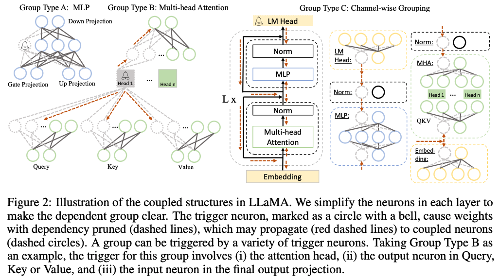

# 1. Introduction

대형 언어 모델(LLM)은 언어 이해와 생성에서 뛰어난 성능을 보이지만, 이러한 성능은 대규모 모델 크기로 인해 배포, 추론, 훈련 단계에서 높은 계산 비용과 긴 지연 시간을 초래함. 기존의 모델 압축 기법은 주로 특정 태스크에 맞춰져 있어 LLM의 다목적 활용성을 제한함.

본 논문은 LLM의 크기를 줄이면서도 다목적 태스크 해결 능력을 유지하기 위해 태스크 비의존적(task-agnostic)인 새로운 압축 접근법인 LLM-Pruner를 제안함.

기존 방법은 LLM의 방대한 훈련 데이터(최대 1조 토큰 이상)에 크게 의존하여 데이터 전송 및 후속 훈련 시간이 길어지는 문제, 후속 훈련에 긴 시간이 소요되는 문제가 있었음.

이를 해결하기 위해 LLM-Pruner는 모델 내 종속 구조(dependent structures)를 탐지하고, 중요도 기반으로 최적의 그룹을 선택해 pruning 수행 후 최소한의 데이터(50k 샘플)로 빠르게 후속 훈련을 통해 성능을 복구.

다양한 태스크 해결 능력을 유지하며 모델 크기를 줄이며, 50k 공개 샘플만으로 압축 가능하고, 전체 과정이 3시간 이내에 완료되며 수동 설계 없이 종속 구조를 자동 탐지한다는 장점이 있음.

# 2. Related Work

## **Compression of Language Model**

매개변수의 크기를 줄이고 지연 시간을 줄여야 할 필요성이 커짐에 따라 다양한 방법론이 제기됨

- Network Pruning
뉴런, 가중치 또는 연결을 제거하여 모델의 크기를 줄이는 일반적인 방법
- Knowledge Distillation
대형 모델의 지식을 소형 모델로 전이하여 성능을 유지하면서 크기를 줄이는 방법
- Quantization
가중치를 저비트 표현으로 변환하여 메모리 사용량과 계산 비용을 감소
- Early Exit
- Dynamic Token Reduction

이 연구에서는 뉴런, 필터, 채널, 레이어 등과 같은 구조적 단위를 제거하는 Structural Pruning 방법론 사용

## Efficient and Low Resource Compression

기존 방법은 대규모 훈련 데이터에 크게 의존하며, 데이터가 제한적인 경우 적용이 어려움,  압축 후 성능 복구를 위해 긴 훈련 시간이 필요함

모델의 오류를 선형 최소 제곱 문제로 정의하여 후속 훈련(post-training)을 가속화하는 방법, Optimal Brain Surgeon(OBS) 기법을 통해 레이어 단위로 최적의 pruning를 수행하여 모델 성능을 유지하면서도 압축 효율성을 높이는 방법이 제시됨.

뉴런 간 유사성을 측정하여 데이터를 사용하지 않고 모델을 pruning 하는 방법과 훈련 데이터 없이 모델을 증류(distillation)하는 방법 등이 제안됨.

그러나 이러한 방법은 사전 학습된 언어 모델을 역전파하여 샘플을 합성하는 등 시간이 너무 많이 소요된다는 단점이 있음.

# 3. Methods

LLM-Pruner는 대형 언어 모델(LLM)의 structural pruning를 수행하기 위해 Discovery Stage, Estimation Stage, Recovery Stage 세 단계로 구성함

## **3.1 Discovery of Coupled Structures in LLMs**

뉴런 간의 의존 관계를 분석하여 상호 연결된 구조를 함께 가지치기함. 한 뉴런이 다른 뉴런에 전적으로 의존할 경우, 후자가 가지치기되면 전자도 반드시 가지치기되어야 함.

### **의존성 규칙**

$$
N_j \in Out(N_i)\cap Deg^{-}(N_j) = 1 \rightarrow N_j\ is \  dependent\ on\  N_i
$$

$$
N_i \in In(N_j)\cap Deg^{+}(N_i) = 1 \rightarrow N_i\ is \  dependent\ on\  N_j
$$

- $In(N)$: 특정 뉴런으로 연결되는 모든 입력 뉴런들의 집합.
- $Out(N)$: 특정 뉴런에서 출력되는 모든 연결된 뉴런들의 집합.
- $Deg^{-}(N)$: 특정 뉴런의 입력 차수(in-degree).
- $Deg^+(N)$: 특정 뉴런의 출력 차수(out-degree).

“의존적인” 뉴런들은 함께 제거되도록 설계됨

### **의존 그래프 트리거링**

모델 내 임의의 뉴런을 초기 "트리거"로 선택하고, 자신에게 의존하는 다른 뉴런들을 활성화(트리거)하여 의존 관계를 탐색. 트리거된 뉴런은 자신과 연결된 의존 뉴런들을 추가로 활성화하며 연쇄적으로 의존성 탐색.

이 과정은 더 이상 새로운 의존성이 발견되지 않을 때까지 반복되며, 탐색 결과로 식별된 모든 뉴런들은 하나의 의존 그룹(dependency group)으로 묶음

트리거 뉴런(종 모양으로 표시된 원)은 가지치기를 시작하는 뉴런이고, 트리거 뉴런이 제거되면, 해당 뉴런에 의존하는 다른 뉴런들(점선 원으로 표시됨)도 함께 제거됨, 점선 화살표(red dashed lines)는 의존성 전파를 나타내며, 트리거된 뉴런이 다른 종속 뉴런들을 활성화시키는 과정을 의미함.

세 가지 주요 Group Type을 정의하여 모델의 의존성을 기반으로 구조를 분류함.

**Group Type A: MLP (Multi-Layer Perceptron)**

- 구성 요소: MLP 레이어, Norm 레이어, LM Head(언어 모델 출력), Embedding 레이어

**Group Type B: Multi-head Attention**

- **구성 요소**: Multi-head Attention(MHA)에서 Query, Key, Value 및 Output Projection의 각 헤드

**Group Type C: Channel-wise Grouping**

- **구성 요소**: MLP와 MHA에서 채널 단위로 그룹화된 구조

## 3.2 Grouped Importance Estimation of Coupled Structure

모델 내에서 의존 관계가 있는 구조들을 그룹화한 후, 각 그룹의 중요도를 평가해야함. 원래의 훈련 데이터에 접근하기 어려운 상황에서, 공개적으로 이용 가능한 데이터셋이나 수작업으로 생성된 샘플을 사용해 중요도를 추정함.

**Vector-wise Importance**와 **Element-wise Importance**를 평가 지표로 사용

### **Vector-wise Importance**

가중치 행렬 전체가 모델 성능에 미치는 영향을 평가

$$
I_{W_i} = |\Delta \mathcal{L}(\mathcal{D})| = \left| \mathcal{L}_{W_i}(\mathcal{D}) - \mathcal{L}_{W_i=0}(\mathcal{D}) \right|

$$

- $H$: 헤시안 행렬
- $\mathcal{L}$: 손실 함수
- $W_i$: 가중치 행렬
- $\Delta\mathcal{L}(\mathcal{D})$: 데이터셋 D에서 손실 변화량

위 식에서, $\mathcal{L_{W_i=0}}$ 는 해당 가중치를 0으로 설정했을 때의 손실을 나타냄

### **Element-wise Importance**

$W_i$내 개별 파라미터 $W_i^k$의 중요도를 세밀하게 평가

$$
I_{W_i^k} = |\Delta \mathcal{L}(\mathcal{D})| = \left| \frac{\partial \mathcal{L}}{\partial W_i^k} W_i^k - \frac{1}{2} W_i^k H_{kk} W_i^k + \mathcal{O}(\|W_i^k\|^3) \right|
$$

- 각 파라미터 $W_i^k$에 대해 손실함수 변화량을 나타냄

### **Group Importance**

위 두 가지 방법(Vector-wise 또는 Element-wise)을 사용하여 계산된 중요도를 기반으로 그룹화된 구조의 중요도 집계

- Summation
그룹 내 모든 중요도의 합
- Product
그룹 내 모든 중요도의 곱
- Max
그룹 내 가장 높은 중요도
- Last-Only
그룹 내 마지막 실행 구조의 중요도

## 3.3 Fast Recovery with Low-rank Approximation

모델 압축 후 성능 저하를 최소화하기 위해 LoRA(Low-rank Approximation)를 활용한 빠른 복구작업을 도입함.

# 4. Experiment

## 4.1 실험 설정

- **LLaMA-7B**, **Vicuna-7B**, **ChatGLM-6B**와 같은 세 가지 대규모 언어 모델(LLM)을 대상으로 실험을 수행
- **Zero-shot**
BoolQ, PIQA, HellaSwag, WinoGrande, ARC-easy, ARC-challenge, OpenbookQA 등 7개의 데이터셋을 사용해 성능 측정
- **Perplexity**
WikiText2와 PTB를 통해 모델의 언어 생성 품질을 평가
- **프루닝 단계**
    - 각 모델에 대해 10개의 샘플을 무작위로 선택하여 프루닝 데이터로 사용.
    - LLaMA와 Vicuna는 BookCorpus에서, ChatGLM은 DailyDialog에서 샘플을 추출
- **복구 단계**
    - Alpaca 데이터셋(약 50,000개 샘플)을 사용해 프루닝 후 모델 성능 복구
    - 단일 GPU에서 약 3시간 동안 2 에포크(epoch)로 미세 조정(fine-tuning)을 수행
- 복구 과정은 단일 GPU에서 약 3시간 동안 2 epoch로 진행
- **Statistics of the Compressed Model**
    - Strategy
        - **Block Strategy**: Group Type A(MLP)와 Group Type B(Multi-head Attention)를 포함하여 블록 단위로 프루닝
        - **Channel Strategy**: Group Type C(채널 단위 그룹화)를 기반으로 더 세밀한 단위에서 프루닝
    - 압축 비율
        - 20%와 50%의 매개변수 제거 비율로 실험
    - **평가 환경**
        - WikiText2 데이터셋을 사용해 64개의 토큰이 포함된 문장을 입력, NVIDIA A5000 GPU에서 추론 지연 시간을 측정

## 4.2 Zero-shot Performance

**LLaMA-7B (20% 압축)**

- 튜닝 없이도 원래 성능의 약 **89.8%** 유지
- 튜닝 후 성능이 **94.97%**까지 회복됨
- 일부 데이터셋에서는 압축된 모델(LLaMA-5.4B)이 ChatGLM-6B보다 더 나은 성능을 보임

**Vicuna-7B (20% 압축)**

- 튜닝 없이도 원래 성능의 약 **92.03%** 유지
- 튜닝 후 성능이 크게 개선되어 대부분의 데이터셋에서 높은 정확도를 기록

**ChatGLM-6B (10% 압축)**

- 10% 압축 시 성능 감소는 미미하며(0.89%), 튜닝을 통해 거의 완벽히 복구 가능
- 영어 데이터셋에서 상대적으로 낮은 성능을 보였으나, 튜닝 후 개선됨

### **Channel vs Block**

1. **Block Strategy**
    - Group Type A(MLP)와 B(Multi-head Attention)를 포함하는 블록 단위 프루닝
    - Channel 전략보다 성능 저하가 적음
    - 첫 번째와 마지막 레이어를 제외하고 프루닝하여 중요한 레이어를 보호함
2. **Channel Strategy**
    - Group Type C(채널 단위 그룹화)를 기반으로 미세하게 프루닝
    - 모든 레이어를 균일하게 처리하여 첫 번째와 마지막 레이어까지 프루닝되며, 이로 인해 성능 저하가 더 큼

## 4.3 추가 분석

### **압축 비율에 따른 영향**

1. **20% 압축**
    - 대부분의 모델에서 성능 유지 가능
    - 튜닝 후 원래 모델과 유사한 수준으로 복구됨
2. **50% 압축**
    - 성능 저하가 크게 발생(예: LLaMA-7B에서 정확도 약 7~8% 감소)
    - 튜닝 후 일부 회복되지만 여전히 높은 압축 비율에서는 도전 과제가 존재

### **Dependency-based Structural Pruning의 중요성 & Aggregation Strategies 비교**

- 모델 내 뉴런 간 의존성을 고려해 구조적으로 프루닝을 수행의 영향을 분석
- 의존성을 무시한 경우 제로샷 분류 및 생성 태스크에서 모델 성능이 거의 실패 수준으로 저하됨
- 그룹 중요도 평가를 위한 4가지 전략(Summation, Max, Production, Last-only)을 테스트
    - *Max*: 문장 생성 품질(퍼플렉시티)에서 가장 우수
    - *Last-only*: 제로샷 분류 성능에서 가장 우수
    - *Summation*: 생성 품질과 분류 성능의 균형을 보여 최적의 선택으로 평가됨

### **Comparison with DistilBERT**

- LLM-Pruner와 DistilBERT(Knowledge Distillation 기술을 사용하여 BERT) 비교
    - LLM-Pruner로 압축된 모델(LLaMA-3.35B)은 DistilBERT(3.5B)보다 작음.
    - LLM-Pruner는 제로샷 분류 태스크에서 평균적으로 DistilBERT보다 **4.24% 높은 성능**을 기록.
    - DistilBERT는 단순히 레이어를 절반으로 줄이는 방식으로 압축하여 모델의 구조적 의존성을 고려하지 않은 반면, LLM-Pruner는 의존성을 최소화하며 프루닝을 수행해 성능 손실을 줄임

### **Scratch Training vs. Pruning**

StableLM-3B와 LLaMA-3B (LLM-Pruner로 압축됨)

- 동일한 크기의 모델(3.6B)에서 LLaMA-3B가 StableLM-3B보다 제로샷 성능이 더 우수
- StableLM은 작은 데이터셋으로 처음부터 훈련되었으나, LLM-Pruner는 대형 언어 모델의 기존 지식을 유지하며 압축했기 때문
- **한계**: LLaMA-3B가 항상 우위를 보이는 것은 아니며, 이는 훈련 데이터 크기와 품질의 차이에 기인

# 5. Conclusion

LLM-Pruner는 대형 언어 모델(LLM)의 구조적 프루닝을 위한 새로운 접근법으로, 모델의 크기를 줄이면서도 다목적 태스크 해결 능력을 유지하도록 설계됨. 이 방법은 원본 훈련 데이터에 대한 의존성을 최소화하고, 빠른 복구 단계를 통해 성능 손실을 줄이는 것을 목표로 함. LLM-Pruner는 뉴런 간 의존성을 기반으로 종속된 구조를 자동으로 탐지하고 그룹화하여, 중요도가 낮은 그룹을 선택적으로 제거함. 이후 LoRA를 활용한 저자원 복구 단계를 통해 모델 성능을 회복시킴.

LLM-Pruner는 LLaMA, Vicuna, ChatGLM 등의 모델에서 실험되었으며, 제로샷 분류와 생성 태스크에서 우수한 성능을 유지하는 것으로 나타남. 20%의 매개변수를 제거한 경우에도 원래 모델 성능의 약 94.97%를 유지하며, 일부 데이터셋에서는 압축된 모델이 더 나은 결과를 보임. 50% 이상의 높은 프루닝 비율에서는 성능 저하가 두드러졌으며, 긴 문장 생성 시 품질 저하나 반복적인 토큰 생성과 같은 문제가 관찰.

LLM-Pruner는 DistilBERT와 같은 기존 압축 기법보다 적은 데이터로 더 나은 성능을 달성하며, 스크래치 트레이닝 모델과 비교해도 우위를 보이기도 함. 하지만 높은 프루닝 비율에서의 성능 저하와 과적합 문제는 여전히 해결해야 할 과제임.