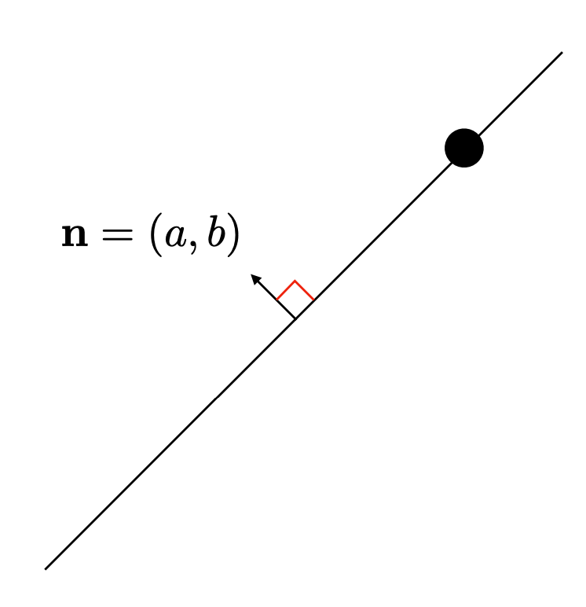
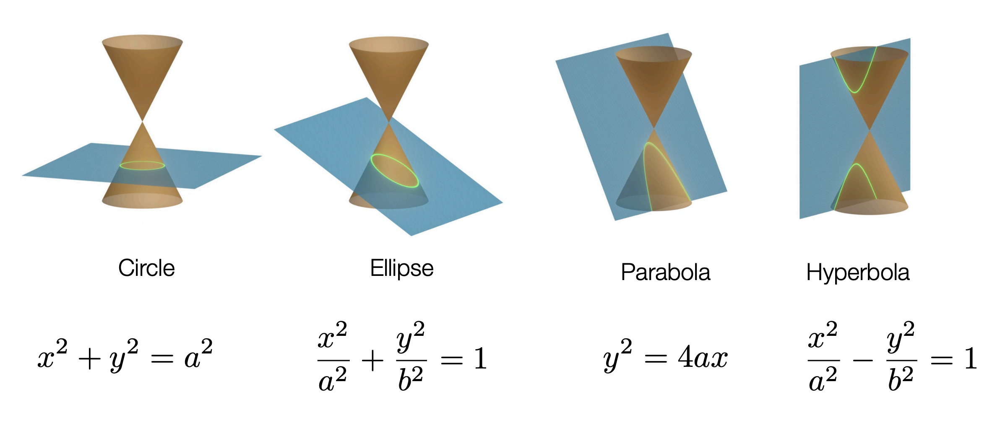

## Vector

- 벡터란?
    - 벡터 공간 $V$의 원소 (엄밀한 정의)
    - 1-D array of numbers (in Computer Science)
        - 이후 모든 정의는 Computer Science의 방식을 따름
- \# of elements in a vector = size(dimension, length) of a vector

$$\vec{x} = [1, 3, 6]^T \in \mathbb{R}^3$$

- 스칼라

$$ x_i \in \mathbb{R} $$

## Matrices
- 2-D array of numbers
- $A \in \mathbb{R}^{m \times n}$

$$
A = \begin{pmatrix}
a_{11} & a_{12} & \cdots & a_{1n} \\
a_{21} & a_{22} & \cdots & a_{2n} \\
\vdots & \vdots & \ddots & \vdots \\
a_{m1} & a_{m2} & \cdots & a_{mn}
\end{pmatrix}
$$

## Tensor
- 다차원 배열의 일반화된 개념
- 텐서의 차원 (rank)
    - 스칼라: 0차 텐서
    - 벡터: 1차 텐서
    - 행렬: 2차 텐서
    - 3차원 이상의 텐서
- 텐서의 표기법
    - $\mathcal{T} \in \mathbb{R}^{n_1 \times n_2 \times \cdots \times n_k}$
- 예시:
    - RGB 이미지 텐서
        - 3차원 텐서로 표현
        - 크기: $height \times width \times 3$
        - 각 채널 (R, G, B)은 2차원 행렬
        - 예시:
        $$
        \mathcal{I} = \begin{pmatrix}
        \begin{pmatrix}
        r_{11} & r_{12} & \cdots & r_{1w} \\
        r_{21} & r_{22} & \cdots & r_{2w} \\
        \vdots & \vdots & \ddots & \vdots \\
        r_{h1} & r_{h2} & \cdots & r_{hw}
        \end{pmatrix} &
        \begin{pmatrix}
        g_{11} & g_{12} & \cdots & g_{1w} \\
        g_{21} & g_{22} & \cdots & g_{2w} \\
        \vdots & \vdots & \ddots & \vdots \\
        g_{h1} & g_{h2} & \cdots & g_{hw}
        \end{pmatrix} &
        \begin{pmatrix}
        b_{11} & b_{12} & \cdots & b_{1w} \\
        b_{21} & b_{22} & \cdots & b_{2w} \\
        \vdots & \vdots & \ddots & \vdots \\
        b_{h1} & b_{h2} & \cdots & b_{hw}
        \end{pmatrix}
        \end{pmatrix}
        $$
    - 영상 텐서
        - 비디오 데이터는 4차원 텐서로 표현
            - 크기: $frames \times height \times width \times channels$
            - 각 프레임은 3차원 텐서 (RGB 이미지)
            - 예시:
            $$
            \mathcal{V} = \begin{pmatrix}
            \mathcal{I}_1 \\
            \mathcal{I}_2 \\
            \vdots \\
            \mathcal{I}_f
            \end{pmatrix}
            $$

## Identity Matrix
- 대각 원소가 모두 1이고 나머지는 0인 행렬
- 항등 행렬 $I \in \mathbb{R}^{n \times n}$

$$
I = \begin{pmatrix}
1 & 0 & \cdots & 0 \\
0 & 1 & \cdots & 0 \\
\vdots & \vdots & \ddots & \vdots \\
0 & 0 & \cdots & 1
\end{pmatrix}
$$

- 항등 행렬의 성질
    - $AI_n = A \ (\forall A \in \mathbb{R}^{m \times n})$
    - $I_mA = A \ (\forall A \in \mathbb{R}^{m \times n})$
    - $I^T = I$
    - $I^{-1} = I$

## Diagonal Matrix
- 대각 원소 외의 모든 원소가 0인 행렬
- 대각 행렬 $D \in \mathbb{R}^{n \times n}$

$$
D = \begin{pmatrix}
d_{11} & 0 & \cdots & 0 \\
0 & d_{22} & \cdots & 0 \\
\vdots & \vdots & \ddots & \vdots \\
0 & 0 & \cdots & d_{nn}
\end{pmatrix}
$$

- 대각 행렬의 성질
    - $D^T = D$
    - $D^{-1}$는 존재할 경우 대각 행렬
    - $D_1D_2 = D_2D_1$ (대각 행렬 간의 곱셈은 교환 법칙이 성립)

- Also denoted:
    $$
    D = \text{diag}(d_{11}, d_{22}, \ldots, d_{nn})
    $$

## Matrix-Matrix multiplication

- 두 행렬 $A \in \mathbb{R}^{m \times n}$, $B \in \mathbb{R}^{n \times p}$의 곱 $C \in \mathbb{R}^{m \times p}$는 다음과 같이 정의됨

$$
C = AB = \begin{pmatrix}
c_{11} & c_{12} & \cdots & c_{1p} \\
c_{21} & c_{22} & \cdots & c_{2p} \\
\vdots & \vdots & \ddots & \vdots \\
c_{m1} & c_{m2} & \cdots & c_{mp}
\end{pmatrix}
$$

- 각 원소 $c_{ij}$는 다음과 같이 계산됨

$$
c_{ij} = \sum_{k=1}^{n} a_{ik} b_{kj}
$$

- 행렬 곱셈의 성질
    - 결합 법칙: $A(BC) = (AB)C$
    - 분배 법칙: $A(B + C) = AB + AC$
    - 일반적으로 교환 법칙은 성립하지 않음: $AB \neq BA$
- 예시:
    - $A \in \mathbb{R}^{2 \times 3}$, $B \in \mathbb{R}^{3 \times 2}$인 경우

$$
A = \begin{pmatrix}
1 & 2 & 3 \\
4 & 5 & 6
\end{pmatrix}, \quad
B = \begin{pmatrix}
7 & 8 \\
9 & 10 \\
11 & 12
\end{pmatrix}
$$

$$
AB = \begin{pmatrix}
1 \cdot 7 + 2 \cdot 9 + 3 \cdot 11 & 1 \cdot 8 + 2 \cdot 10 + 3 \cdot 12 \\
4 \cdot 7 + 5 \cdot 9 + 6 \cdot 11 & 4 \cdot 8 + 5 \cdot 10 + 6 \cdot 12
\end{pmatrix} = \begin{pmatrix}
58 & 64 \\
139 & 154
\end{pmatrix}
$$

## Vector-Vector Product

- 내적 (Dot Product)
    - 두 벡터 $\vec{a}, \vec{b} \in \mathbb{R}^n$의 내적은 다음과 같이 정의됨
    $$
    \vec{a} \cdot \vec{b} = \sum_{i=1}^{n} a_i b_i
    $$
    - 예시:
    $$
    \vec{a} = \begin{pmatrix} 1 \\ 2 \\ 3 \end{pmatrix}, \quad \vec{b} = \begin{pmatrix} 4 \\ 5 \\ 6 \end{pmatrix}
    $$
    $$
    \vec{a} \cdot \vec{b} = 1 \cdot 4 + 2 \cdot 5 + 3 \cdot 6 = 32
    $$

- 외적 (Cross Product)
    - 두 벡터 $\vec{a}, \vec{b} \in \mathbb{R}^3$의 외적은 다음과 같이 정의됨
    $$
    \vec{a} \times \vec{b} = \begin{pmatrix}
    a_2 b_3 - a_3 b_2 \\
    a_3 b_1 - a_1 b_3 \\
    a_1 b_2 - a_2 b_1
    \end{pmatrix}
    $$
    - 예시:
    $$
    \vec{a} = \begin{pmatrix} 1 \\ 2 \\ 3 \end{pmatrix}, \quad \vec{b} = \begin{pmatrix} 4 \\ 5 \\ 6 \end{pmatrix}
    $$
    $$
    \vec{a} \times \vec{b} = \begin{pmatrix}
    2 \cdot 6 - 3 \cdot 5 \\
    3 \cdot 4 - 1 \cdot 6 \\
    1 \cdot 5 - 2 \cdot 4
    \end{pmatrix} = \begin{pmatrix}
    -3 \\
    6 \\
    -3
    \end{pmatrix}
    $$

### Representing 2D lines via Vector-Vector Product

$$
y = ax + b \newline
\rightarrow \{(x, y) | ax+by+c=0\} \newline
\rightarrow (a, b, c) \begin{pmatrix} x \\ y \\ 1 \end{pmatrix} = 0
$$

## Matrix-Vector Product

- $A \in \mathbb{R}^{m\times n}$ 의 행을 중심으로 볼 때:
    - $A$의 각 행을 $\vec{a}_i^T$로 나타낼 수 있음
    $$
    A = \begin{pmatrix}
    \vec{a}_1^T \\
    \vec{a}_2^T \\
    \vdots \\
    \vec{a}_m^T
    \end{pmatrix}
    $$
    - $A\vec{x}$는 각 $\vec{a}_i^T$와 $\vec{x}$의 내적을 포함하는 벡터
    $$
    A\vec{x} = \begin{pmatrix}
    \vec{a}_1^T \vec{x} \\
    \vec{a}_2^T \vec{x} \\
    \vdots \\
    \vec{a}_m^T \vec{x}
    \end{pmatrix}
    $$

- $A \in \mathbb{R}^{m\times n}$ 의 열을 중심으로 볼 때:
    - $A$의 각 열을 $\vec{a}_j$로 나타낼 수 있음
    $$
    A = \begin{pmatrix}
    \vec{a}_1 & \vec{a}_2 & \cdots & \vec{a}_n
    \end{pmatrix}
    $$
    - $A\vec{x}$는 각 $\vec{a}_j$와 $x_j$의 선형결합(linear combination)으로 나타낼 수 있음
    $$
    A\vec{x} = x_1\vec{a}_1 + x_2\vec{a}_2 + \cdots + x_n\vec{a}_n
    $$

## Hadamard Product (Element-wise Product)
- 두 행렬 $A \in \mathbb{R}^{m \times n}$, $B \in \mathbb{R}^{m \times n}$의 Hadamard 곱 $C \in \mathbb{R}^{m \times n}$는 다음과 같이 정의됨

$$
C = A \circ B = \begin{pmatrix}
a_{11} b_{11} & a_{12} b_{12} & \cdots & a_{1n} b_{1n} \\
a_{21} b_{21} & a_{22} b_{22} & \cdots & a_{2n} b_{2n} \\
\vdots & \vdots & \ddots & \vdots \\
a_{m1} b_{m1} & a_{m2} b_{m2} & \cdots & a_{mn} b_{mn}
\end{pmatrix}
$$

- 각 원소 $c_{ij}$는 다음과 같이 계산됨

$$
c_{ij} = a_{ij} b_{ij}
$$

- 예시:
    - $A \in \mathbb{R}^{2 \times 3}$, $B \in \mathbb{R}^{2 \times 3}$인 경우

$$
A = \begin{pmatrix}
1 & 2 & 3 \\
4 & 5 & 6
\end{pmatrix}, \quad
B = \begin{pmatrix}
7 & 8 & 9 \\
10 & 11 & 12
\end{pmatrix}
$$

$$
A \circ B = \begin{pmatrix}
1 \cdot 7 & 2 \cdot 8 & 3 \cdot 9 \\
4 \cdot 10 & 5 \cdot 11 & 6 \cdot 12
\end{pmatrix} = \begin{pmatrix}
7 & 16 & 27 \\
40 & 55 & 72
\end{pmatrix}
$$

## Transpose

- 행렬 $A \in \mathbb{R}^{m \times n}$의 전치는 $A^T \in \mathbb{R}^{n \times m}$로 나타내며, $A$의 행과 열을 뒤바꾼 행렬임

$$
A^T = \begin{pmatrix}
a_{11} & a_{21} & \cdots & a_{m1} \\
a_{12} & a_{22} & \cdots & a_{m2} \\
\vdots & \vdots & \ddots & \vdots \\
a_{1n} & a_{2n} & \cdots & a_{mn}
\end{pmatrix}
$$

- 전치 행렬의 성질
    - $(A^T)^T = A$
    - $(A + B)^T = A^T + B^T$
    - $(cA)^T = cA^T \ (\forall c \in \mathbb{R})$
    - $(AB)^T = B^T A^T$
- 예시:
    - $A \in \mathbb{R}^{2 \times 3}$인 경우

$$
A = \begin{pmatrix}
1 & 2 & 3 \\
4 & 5 & 6
\end{pmatrix}
$$

$$
A^T = \begin{pmatrix}
1 & 4 \\
2 & 5 \\
3 & 6
\end{pmatrix}
$$

## Trace
- 행렬 $A \in \mathbb{R}^{n \times n}$의 대각 원소의 합
- trace $tr(A)$는 다음과 같이 정의됨

$$
tr(A) = \sum_{i=1}^{n} a_{ii}
$$

- 성질
    - $tr(A + B) = tr(A) + tr(B)$
    - $tr(cA) = c \cdot tr(A) \ (\forall c \in \mathbb{R})$
    - $tr(A^T) = tr(A)$
    - $tr(AB) = tr(BA)$
- 예시:
    - $A \in \mathbb{R}^{3 \times 3}$인 경우

$$
A = \begin{pmatrix}
1 & 2 & 3 \\
4 & 5 & 6 \\
7 & 8 & 9
\end{pmatrix}
$$

$$
tr(A) = 1 + 5 + 9 = 15
$$

## Norms
### Vector Norms

- 벡터 $\vec{x} \in \mathbb{R}^n$의 norm은 벡터의 크기를 측정하는 방법
- $p$-norm ($L^p$ norm)
    - $p \geq 1$인 경우, $p$-norm은 다음과 같이 정의됨
    $$
    \|\vec{x}\|_p = \left( \sum_{i=1}^{n} |x_i|^p \right)^{\frac{1}{p}}
    $$
    - 특수한 경우:
        - $p = 1$: 맨하탄 norm (Manhattan norm)
        $$
        \|\vec{x}\|_1 = \sum_{i=1}^{n} |x_i|
        $$
        - $p = 2$: 유클리드 norm (Euclidean norm)
        $$
        \|\vec{x}\|_2 = \left( \sum_{i=1}^{n} x_i^2 \right)^{\frac{1}{2}}
        $$
        - $p \rightarrow \infty$: 최대 norm (Maximum norm)
        $$
        \|\vec{x}\|_\infty = \max_{i} |x_i|
        $$
            - $p \rightarrow \infty$ 일때 가장 큰 성분이 norm을 결정
        - $p = 0$: 제로 norm (Zero norm)
        $$
        \|\vec{x}\|_0 = \lim_{p \to 0} \left( \sum_{i=1}^{n} |x_i|^p \right)^{\frac{1}{p}} = \# \{i \mid x_i \neq 0\}
        $$
            - 제로 norm은 엄밀히 말해 norm이 아니며(homogeneity 만족하지 못함), 벡터에서 0이 아닌 원소의 개수를 측정함  
                ※ homogeneity: $\|\alpha\vec{x}\|\ = |\alpha|\|\vec{x}\|$

### Matrix Norms

- 행렬 $A \in \mathbb{R}^{m \times n}$의 norm은 행렬의 크기를 측정하는 방법
- 프로베니우스 norm (Frobenius norm)
    - 프로베니우스 norm은 행렬의 각 원소의 제곱합의 제곱근으로 정의됨
    $$
    \|A\|_F = \left( \sum_{i=1}^{m} \sum_{j=1}^{n} |a_{ij}|^2 \right)^{\frac{1}{2}}
    $$

## Linearly Dependent and Independent

- 벡터 집합 $\{\vec{v}_1, \vec{v}_2, \ldots, \vec{v}_k\}$가 주어졌을 때, 이 벡터들이 선형 독립인지 종속인지를 판단할 수 있음
- 선형 독립 (Linearly Independent)
    - 벡터 집합 $\{\vec{v}_1, \vec{v}_2, \ldots, \vec{v}_k\}$가 선형 독립이라는 것은, 이 벡터들 사이에 자명하지 않은 선형 결합이 존재하지 않음을 의미
    - 즉, $c_1\vec{v}_1 + c_2\vec{v}_2 + \cdots + c_k\vec{v}_k = \vec{0}$ 일 때, $c_1 = c_2 = \cdots = c_k = 0$ 이어야 함
- 선형 종속 (Linearly Dependent)
    - 벡터 집합 $\{\vec{v}_1, \vec{v}_2, \ldots, \vec{v}_k\}$가 선형 종속이라는 것은, 이 벡터들 사이에 자명하지 않은 선형 결합이 존재함을 의미
    - 즉, $c_1\vec{v}_1 + c_2\vec{v}_2 + \cdots + c_k\vec{v}_k = \vec{0}$ 일 때, 적어도 하나의 $c_i \neq 0$ 인 경우가 존재함
- 예시:
    - $\vec{v}_1 = \begin{pmatrix} 1 \\ 2 \\ 3 \end{pmatrix}$, $\vec{v}_2 = \begin{pmatrix} 4 \\ 5 \\ 6 \end{pmatrix}$, $\vec{v}_3 = \begin{pmatrix} 7 \\ 8 \\ 9 \end{pmatrix}$인 경우
    - $\vec{v}_1, \vec{v}_2, \vec{v}_3$는 선형 종속임
    - $-3\vec{v}_1 + 3\vec{v}_2 - \vec{v}_3 = \vec{0}$ 이기 때문

## Rank of A Matrix
- 행렬 $A \in \mathbb{R}^{m \times n}$의 rank는 행렬의 선형 독립인 행 또는 열 벡터의 최대 개수
- rank $r(A)$는 다음과 같이 정의됨
    - $r(A) = \text{dim}(\text{col space of } A) = \text{dim}(\text{row space of } A)$
- 성질
    - $r(A) \leq \min(m, n)$
    - $r(A) = r(A^T)$
    - $r(AB) \leq \min(r(A), r(B))$
    - $r(A+B) \leq r(A)+r(B)$
- 예시:
    - $A \in \mathbb{R}^{3 \times 3}$인 경우

$$
A = \begin{pmatrix}
1 & 2 & 3 \\
4 & 5 & 6 \\
7 & 8 & 9
\end{pmatrix}
$$

$$
r(A) = 2
$$

## Inverse of A Square Matrix
- 역행렬 (Inverse Matrix)
    - 정사각 행렬 $A \in \mathbb{R}^{n \times n}$의 역행렬 $A^{-1}$은 $AA^{-1} = A^{-1}A = I$를 만족하는 행렬
    - 역행렬이 존재하려면 $A$는 가역적 (invertible)이어야 함
    - 역행렬의 성질
        - $(A^{-1})^{-1} = A$
        - $(AB)^{-1} = B^{-1}A^{-1}$
        - $(A^T)^{-1} = (A^{-1})^T$

## Span and Projection
### Span
- 벡터 집합 $\{\vec{v}_1, \vec{v}_2, \ldots, \vec{v}_k\}$의 span은 이 벡터들의 선형 결합으로 표현될 수 있는 모든 벡터의 집합
- span $\text{span}(\{\vec{v}_1, \vec{v}_2, \ldots, \vec{v}_k\})$는 다음과 같이 정의됨
$$
\text{span}(\{\vec{v}_1, \vec{v}_2, \ldots, \vec{v}_k\}) = \{c_1\vec{v}_1 + c_2\vec{v}_2 + \cdots + c_k\vec{v}_k \mid c_1, c_2, \ldots, c_k \in \mathbb{R}\}
$$
- 예시:
    - $\vec{v}_1 = \begin{pmatrix} 1 \\ 0 \\ 0 \end{pmatrix}$, $\vec{v}_2 = \begin{pmatrix} 0 \\ 1 \\ 0 \end{pmatrix}$인 경우
    - $\text{span}(\{\vec{v}_1, \vec{v}_2\})$는 $\mathbb{R}^2$의 모든 벡터를 포함

### Projection

- $\vec{y} \in \mathbb{R}^m$를 $\text{span}(\{x_1, x_2, \ldots, x_n\})$에 Projection한 결과는 다음과 같은 문제로 정의될 수 있음  
$$
\arg \min_{\hat{y} \in \text{span}(\{x_1, x_2, \ldots, x_n\})} \|\vec{y} - \hat{y}\|_2
$$

- $\vec{y}$를 $\text{span}(\{x_1, x_2, \ldots, x_n\})$에 정사영한 결과는 $\hat{y}$로 나타낼 수 있음
$$
\hat{y} = X(X^TX)^{-1}X^T\vec{y}
$$
- 여기서 $X$는 $\{x_1, x_2, \ldots, x_n\}$를 열 벡터로 가지는 행렬
$$
X = \begin{pmatrix}
| & | & & | \\
x_1 & x_2 & \cdots & x_n \\
| & | & & |
\end{pmatrix}
$$
- 예시:
    - $\vec{y} = \begin{pmatrix} 1 \\ 2 \\ 3 \end{pmatrix}$, $x_1 = \begin{pmatrix} 1 \\ 0 \\ 0 \end{pmatrix}$, $x_2 = \begin{pmatrix} 0 \\ 1 \\ 0 \end{pmatrix}$인 경우
    - $\vec{y}$를 $\text{span}(\{x_1, x_2\})$에 정사영한 결과는 $\hat{y} = \begin{pmatrix} 1 \\ 2 \\ 0 \end{pmatrix}$

## Basis and Dimension
- Basis
    - 벡터 공간 $V$의 기저 (basis)는 $V$의 모든 벡터를 선형 결합으로 표현할 수 있는 선형 독립 벡터들의 집합
    - 기저 $\{\vec{v}_1, \vec{v}_2, \ldots, \vec{v}_n\}$는 다음과 같은 성질을 가짐
        - $\text{span}(\{\vec{v}_1, \vec{v}_2, \ldots, \vec{v}_n\}) = V$
        - $\{\vec{v}_1, \vec{v}_2, \ldots, \vec{v}_n\}$는 선형 독립
    - 예시:
        - $\mathbb{R}^3$의 표준 기저는 $\{\begin{pmatrix} 1 \\ 0 \\ 0 \end{pmatrix}, \begin{pmatrix} 0 \\ 1 \\ 0 \end{pmatrix}, \begin{pmatrix} 0 \\ 0 \\ 1 \end{pmatrix}\}$

- Dimension
    - 벡터 공간 $V$의 차원 (dimension)은 $V$의 기저를 이루는 벡터의 개수
    - $\text{dim}(V)$로 나타내며, $V$의 모든 기저는 동일한 개수의 벡터를 가짐
    
## Orthogonal Matrices
### Orthogonal and Orthonormal Vectors

- **Orthogonal Vectors**
    - 두 벡터 $\vec{u}, \vec{v} \in \mathbb{R}^n$가 직교한다는 것은, 이 두 벡터의 내적이 0임을 의미
    $$
    \vec{u} \cdot \vec{v} = 0
    $$

- **Orthonormal Vectors**
    - 두 벡터 $\vec{u}, \vec{v} \in \mathbb{R}^n$가 정규 직교한다는 것은, 이 두 벡터가 직교하고, 각각의 벡터의 norm이 1임을 의미
    $$
    \|\vec{u}\| = 1, \quad \|\vec{v}\| = 1, \quad \vec{u} \cdot \vec{v} = 0
    $$
    - 예시:
    $$
    \vec{u} = \begin{pmatrix} 1 \\ 0 \\ 0 \end{pmatrix}, \quad \vec{v} = \begin{pmatrix} 0 \\ 1 \\ 0 \end{pmatrix}
    $$

### Orthogonal Matrix

- **Orthogonal Matrix**
    - 행렬 $Q \in \mathbb{R}^{n \times n}$가 직교 행렬이라는 것은, $Q$의 열 벡터들이 서로 직교하고, 각 열 벡터의 norm이 1임을 의미
    - 즉, $Q$의 열 벡터들이 정규 직교 벡터들로 이루어져 있음
    - 직교 행렬의 성질
        - $Q^T Q = QQ^T = I$
        - $Q^{-1} = Q^T$
        - $Q$의 열 벡터와 행 벡터는 모두 정규 직교 벡터들로 이루어져 있음

## Rotation Matrix

- 회전 행렬은 벡터를 원점 기준으로 회전시키는 변환을 나타내는 행렬
- 2차원 회전 행렬 $R(\theta) \in \mathbb{R}^{2 \times 2}$는 다음과 같이 정의됨
$$
R(\theta) = \begin{pmatrix}
\cos \theta & -\sin \theta \\
\sin \theta & \cos \theta
\end{pmatrix}
$$
- 3차원 회전 행렬은 회전 축에 따라 다르게 정의됨
    - $x$축을 기준으로 회전하는 행렬 $R_x(\theta) \in \mathbb{R}^{3 \times 3}$
    $$
    R_x(\theta) = \begin{pmatrix}
    1 & 0 & 0 \\
    0 & \cos \theta & -\sin \theta \\
    0 & \sin \theta & \cos \theta
    \end{pmatrix}
    $$
    - $y$축을 기준으로 회전하는 행렬 $R_y(\theta) \in \mathbb{R}^{3 \times 3}$
    $$
    R_y(\theta) = \begin{pmatrix}
    \cos \theta & 0 & \sin \theta \\
    0 & 1 & 0 \\
    -\sin \theta & 0 & \cos \theta
    \end{pmatrix}
    $$
    - $z$축을 기준으로 회전하는 행렬 $R_z(\theta) \in \mathbb{R}^{3 \times 3}$
    $$
    R_z(\theta) = \begin{pmatrix}
    \cos \theta & -\sin \theta & 0 \\
    \sin \theta & \cos \theta & 0 \\
    0 & 0 & 1
    \end{pmatrix}
    $$
- 회전 행렬의 성질
    - 회전 행렬은 직교 행렬이므로 $R^T R = I$
    - 회전 행렬의 역행렬은 전치 행렬과 같음: $R^{-1} = R^T$
    - 회전 행렬은 행렬식이 1임: $\det(R) = 1$

### Special Orthogonal Group
- Special Orthogonal Group $SO(n)$은 $n \times n$ 정사각 행렬들로 이루어진 집합으로, 이 행렬들은 다음 두 조건을 만족함
    1. 행렬의 행과 열이 정규 직교 벡터들로 이루어져 있음
    2. 행렬의 행렬식(determinant)이 1임
- 회전행렬은 $SO(n)$의 원소

## Skew Symmetric Matrix
- 전치가 자신의 값에 음을 취한 것과 같은 행렬

$$
A^T = -A
$$

- 예시:
    - $A \in \mathbb{R}^{3 \times 3}$인 경우

$$
A = \begin{pmatrix}
0 & -2 & 3 \\
2 & 0 & -1 \\
-3 & 1 & 0
\end{pmatrix}
$$

- 스큐 대칭 행렬의 성질
    - 대각 원소는 항상 0임
    - $A$와 $B$가 스큐 대칭 행렬이면, $A + B$도 스큐 대칭 행렬임
    - $cA$도 스큐 대칭 행렬임 ($c \in \mathbb{R}$)
    - $A^T A$는 대칭 행렬임

## Gram Matrix
- 행렬 $A \in \mathbb{R}^{m \times n}$의 열 벡터들 $\{\vec{a}_1, \vec{a}_2, \ldots, \vec{a}_n\}$이 주어졌을 때, Gram Matrix $G$는 다음과 같이 정의됨

$$
G = A^TA = \begin{pmatrix}
\vec{a}_1 \cdot \vec{a}_1 & \vec{a}_1 \cdot \vec{a}_2 & \cdots & \vec{a}_1 \cdot \vec{a}_n \\
\vec{a}_2 \cdot \vec{a}_1 & \vec{a}_2 \cdot \vec{a}_2 & \cdots & \vec{a}_2 \cdot \vec{a}_n \\
\vdots & \vdots & \ddots & \vdots \\
\vec{a}_n \cdot \vec{a}_1 & \vec{a}_n \cdot \vec{a}_2 & \cdots & \vec{a}_n \cdot \vec{a}_n
\end{pmatrix}
$$

- 예시:
    - $A \in \mathbb{R}^{3 \times 2}$인 경우

$$
A = \begin{pmatrix}
1 & 2 \\
3 & 4 \\
5 & 6
\end{pmatrix}
$$

$$
\vec{a}_1 = \begin{pmatrix} 1 \\ 3 \\ 5 \end{pmatrix}, \quad \vec{a}_2 = \begin{pmatrix} 2 \\ 4 \\ 6 \end{pmatrix}
$$

$$
G = \begin{pmatrix}
\vec{a}_1 \cdot \vec{a}_1 & \vec{a}_1 \cdot \vec{a}_2 \\
\vec{a}_2 \cdot \vec{a}_1 & \vec{a}_2 \cdot \vec{a}_2
\end{pmatrix} = \begin{pmatrix}
35 & 44 \\
44 & 56
\end{pmatrix}
$$

- Gram Matrix의 성질
    - 대칭 행렬: $G = G^T$
    - 양의 준정부호 행렬: 모든 고유값이 0 이상
    - 벡터 집합이 선형 독립이면, Gram Matrix는 양의 정부호 행렬

## Nullspace
- 행렬 $A \in \mathbb{R}^{m \times n}$의 nullspace는 $A\vec{x} = \vec{0}$을 만족하는 모든 $\vec{x} \in \mathbb{R}^n$의 집합
- nullspace $\mathcal{N}(A)$는 다음과 같이 정의됨
$$
\mathcal{N}(A) = \{\vec{x} \in \mathbb{R}^n \mid A\vec{x} = \vec{0}\}
$$
- nullspace의 성질
    - $\mathcal{N}(A)$는 $\mathbb{R}^n$의 부분 공간
    - $A$의 열 벡터들이 선형 독립이면, $\mathcal{N}(A) = \{\vec{0}\}$
    - $A$의 rank와 nullity의 합은 $n$과 같음: $\text{rank}(A) + \text{nullity}(A) = n$
- 예시:
    - $A \in \mathbb{R}^{3 \times 3}$인 경우
$$
A = \begin{pmatrix}
1 & 2 & 3 \\
4 & 5 & 6 \\
7 & 8 & 9
\end{pmatrix}
$$
$$
\mathcal{N}(A) = \left\{ \begin{pmatrix} x \\ y \\ z \end{pmatrix} \in \mathbb{R}^3 \mid \begin{pmatrix}
1 & 2 & 3 \\
4 & 5 & 6 \\
7 & 8 & 9
\end{pmatrix} \begin{pmatrix} x \\ y \\ z \end{pmatrix} = \begin{pmatrix} 0 \\ 0 \\ 0 \end{pmatrix} \right\}
$$
$$
\mathcal{N}(A) = \left\{ \begin{pmatrix} t \\ -2t \\ t \end{pmatrix} \mid t \in \mathbb{R} \right\}
$$

## Determinant
- 행렬 $A \in \mathbb{R}^{n \times n}$의 determinant는 $A$가 확장하는 크기를 나타내는 값
- determinant $det(A)$는 다음과 같이 정의됨

$$
\text{det}(A) = \sum_{\sigma \in S_n} \text{sgn}(\sigma) \prod_{i=1}^{n} a_{i, \sigma(i)}
$$

- 여기서 $S_n$은 $n$개의 원소에 대한 순열 집합, $\text{sgn}(\sigma)$는 순열 $\sigma$의 부호
- 성질
    - $det(A^T) = det(A)$
    - $det(AB) = det(A) \cdot det(B)$
    - $det(A^{-1}) = \frac{1}{det(A)}$ (역행렬이 존재할 경우)
    - $det(cA) = c^n \cdot det(A) \ (\forall c \in \mathbb{R})$
    - $A$가 가역 행렬일 때, $det(A) \neq 0$
- 예시:
    - $A \in \mathbb{R}^{3 \times 3}$인 경우

$$
A = \begin{pmatrix}
1 & 2 & 3 \\
4 & 5 & 6 \\
7 & 8 & 9
\end{pmatrix}
$$

$$
\text{det}(A) = 1(5 \cdot 9 - 6 \cdot 8) - 2(4 \cdot 9 - 6 \cdot 7) + 3(4 \cdot 8 - 5 \cdot 7) = 0
$$

## Quadratic Forms

- 벡터 $\vec{x} \in \mathbb{R}^n$와 대칭 행렬 $A \in \mathbb{R}^{n \times n}$에 대해, 이차 형식 $Q(\vec{x})$는 다음과 같이 정의됨
$$
Q(\vec{x}) = \vec{x}^T A \vec{x}
$$
- 예시:
    - $\vec{x} = \begin{pmatrix} 1 \\ 2 \end{pmatrix}$, $A = \begin{pmatrix} 3 & 4 \\ 4 & 5 \end{pmatrix}$인 경우
    $$
    Q(\vec{x}) = \begin{pmatrix} 1 & 2 \end{pmatrix} \begin{pmatrix} 3 & 4 \\ 4 & 5 \end{pmatrix} \begin{pmatrix} 1 \\ 2 \end{pmatrix} = 1 \cdot 3 \cdot 1 + 1 \cdot 4 \cdot 2 + 2 \cdot 4 \cdot 1 + 2 \cdot 5 \cdot 2 = 3 + 8 + 8 + 20 = 39
    $$

- 이차 형식의 성질
    - $Q(\vec{x})$는 항상 실수 값을 가짐
    - $A$가 양의 정부호 행렬이면, $Q(\vec{x}) > 0 \ (\forall \vec{x} \neq \vec{0})$
    - $A$가 양의 준정부호 행렬이면, $Q(\vec{x}) \geq 0 \ (\forall \vec{x})$
    - $A$가 음의 정부호 행렬이면, $Q(\vec{x}) < 0 \ (\forall \vec{x} \neq \vec{0})$
    - $A$가 음의 준정부호 행렬이면, $Q(\vec{x}) \leq 0 \ (\forall \vec{x})$
    - $A$가 부호가 없는 행렬이면, $Q(\vec{x})$는 양수와 음수 모두 가질 수 있음
- 이차 형식의 예시:
    - $\vec{x} = \begin{pmatrix} 1 \\ 2 \\ 3 \end{pmatrix}$, $A = \begin{pmatrix} 1 & 0 & 0 \\ 0 & 1 & 0 \\ 0 & 0 & 1 \end{pmatrix}$인 경우
    $$
    Q(\vec{x}) = \begin{pmatrix} 1 & 2 & 3 \end{pmatrix} \begin{pmatrix} 1 & 0 & 0 \\ 0 & 1 & 0 \\ 0 & 0 & 1 \end{pmatrix} \begin{pmatrix} 1 \\ 2 \\ 3 \end{pmatrix} = 1 \cdot 1 \cdot 1 + 2 \cdot 1 \cdot 2 + 3 \cdot 1 \cdot 3 = 1 + 4 + 9 = 14
    $$

위와 같이 다양한 모양의 그래프를 다음과 같은 식으로 일반화해 표현 가능
$$
ax^2+bxy+cy^2+dx+ey+f=0
$$
이를 이차 형식으로 다시 표현하면
$$
\begin{pmatrix}
x & y & 1
\end{pmatrix}
\begin{pmatrix}
a & \frac{b}{2} & \frac{d}{2} \\
\frac{b}{2} & c & \frac{e}{2} \\
\frac{d}{2} & \frac{e}{2} & f
\end{pmatrix}
\begin{pmatrix}
x \\ y \\ 1
\end{pmatrix}
= 0
$$

## Eigenvalues and Eigenvectors

- 행렬 $A \in \mathbb{R}^{n \times n}$의 고유값 $\lambda$와 고유벡터 $\vec{v}$는 다음 조건을 만족함
$$
A\vec{v} = \lambda\vec{v}
$$
- 여기서 $\vec{v} \neq \vec{0}$, $\lambda \in \mathbb{R}$
- 고유값 $\lambda$는 다음과 같은 특성 방정식의 해로 구할 수 있음
$$
\text{det}(A - \lambda I) = 0
$$
- 고유벡터 $\vec{v}$는 고유값 $\lambda$에 대응하는 $\text{null}(A - \lambda I)$의 원소
- 예시:
    - $A \in \mathbb{R}^{2 \times 2}$인 경우
    $$
    A = \begin{pmatrix}
    4 & 1 \\
    2 & 3
    \end{pmatrix}
    $$
    - 고유값 $\lambda$는 다음과 같이 구할 수 있음
    $$
    \text{det}(A - \lambda I) = \text{det}\begin{pmatrix}
    4 - \lambda & 1 \\
    2 & 3 - \lambda
    \end{pmatrix} = (4 - \lambda)(3 - \lambda) - 2 = \lambda^2 - 7\lambda + 10 = 0
    $$
    - $\lambda = 2, 5$
    - 고유값 $\lambda = 2$에 대응하는 고유벡터 $\vec{v}$는 다음과 같이 구할 수 있음
    $$
    (A - 2I)\vec{v} = \begin{pmatrix}
    2 & 1 \\
    2 & 1
    \end{pmatrix}\vec{v} = \vec{0}
    $$
    - $\vec{v} = \begin{pmatrix} 1 \\ -2 \end{pmatrix}$
    - 고유값 $\lambda = 5$에 대응하는 고유벡터 $\vec{v}$는 다음과 같이 구할 수 있음
    $$
    (A - 5I)\vec{v} = \begin{pmatrix}
    -1 & 1 \\
    2 & -2
    \end{pmatrix}\vec{v} = \vec{0}
    $$
    - $\vec{v} = \begin{pmatrix} 1 \\ 1 \end{pmatrix}$

- 고유값과 고유벡터의 성질
    - $A$의 고유값의 합은 $A$의 대각 원소의 합과 같음: $\sum_{i=1}^{n} \lambda_i = \text{tr}(A)$
    - $A$의 고유값의 곱은 $A$의 행렬식과 같음: $\prod_{i=1}^{n} \lambda_i = \text{det}(A)$
    - $A$가 대칭 행렬이면, 모든 고유값은 실수임
    - $A$가 직교 행렬이면, 모든 고유값의 절댓값은 1임

## EigenDecomposition
- 행렬 $A \in \mathbb{R}^{n \times n}$는 고유값 분해(EigenDecomposition)할 수 있음
- 고유값 분해는 $A$를 다음과 같이 나타내는 것
$$
A = V \Lambda V^{-1}
$$
- 여기서 $V$는 $A$의 고유벡터들로 이루어진 행렬, $\Lambda$는 $A$의 고유값들로 이루어진 대각 행렬
- 예시:
    - $A \in \mathbb{R}^{2 \times 2}$인 경우
    $$
    A = \begin{pmatrix}
    4 & 1 \\
    2 & 3
    \end{pmatrix}
    $$
    - $A$의 고유값은 $\lambda_1 = 2$, $\lambda_2 = 5$
    - $A$의 고유벡터는 $\vec{v}_1 = \begin{pmatrix} 1 \\ -2 \end{pmatrix}$, $\vec{v}_2 = \begin{pmatrix} 1 \\ 1 \end{pmatrix}$
    - $V$와 $\Lambda$는 다음과 같이 나타낼 수 있음
    $$
    V = \begin{pmatrix}
    1 & 1 \\
    -2 & 1
    \end{pmatrix}, \quad
    \Lambda = \begin{pmatrix}
    2 & 0 \\
    0 & 5
    \end{pmatrix}
    $$
    - 따라서 $A$는 다음과 같이 고유값 분해할 수 있음
    $$
    A = V \Lambda V^{-1} = \begin{pmatrix}
    1 & 1 \\
    -2 & 1
    \end{pmatrix} \begin{pmatrix}
    2 & 0 \\
    0 & 5
    \end{pmatrix} \begin{pmatrix}
    1 & 1 \\
    -2 & 1
    \end{pmatrix}^{-1}
    $$

- 고유값 분해의 성질
    - $A$가 대칭 행렬이면, $V$는 직교 행렬이 됨: $V^T V = I$
    - $A$가 대칭 행렬이면, $A$는 다음과 같이 고유값 분해할 수 있음
    $$
    A = Q \Lambda Q^T
    $$
        - 여기서 $Q$는 $A$의 고유벡터들로 이루어진 직교 행렬, $\Lambda$는 $A$의 고유값들로 이루어진 대각 행렬
    - $A$가 양의 정부호 행렬이면, 모든 고유값은 양수(그 반대도 성립)
- 예시:
    - $A \in \mathbb{R}^{2 \times 2}$인 경우
    $$
    A = \begin{pmatrix}
    4 & 1 \\
    1 & 3
    \end{pmatrix}
    $$
    - $A$의 고유값은 $\lambda_1 = 5$, $\lambda_2 = 2$
    - $A$의 고유벡터는 $\vec{v}_1 = \begin{pmatrix} 1 \\ 1 \end{pmatrix}$, $\vec{v}_2 = \begin{pmatrix} -1 \\ 1 \end{pmatrix}$
    - $Q$와 $\Lambda$는 다음과 같이 나타낼 수 있음
    $$
    Q = \begin{pmatrix}
    \frac{1}{\sqrt{2}} & -\frac{1}{\sqrt{2}} \\
    \frac{1}{\sqrt{2}} & \frac{1}{\sqrt{2}}
    \end{pmatrix}, \quad
    \Lambda = \begin{pmatrix}
    5 & 0 \\
    0 & 2
    \end{pmatrix}
    $$
    - 따라서 $A$는 다음과 같이 고유값 분해할 수 있음
    $$
    A = Q \Lambda Q^T = \begin{pmatrix}
    \frac{1}{\sqrt{2}} & -\frac{1}{\sqrt{2}} \\
    \frac{1}{\sqrt{2}} & \frac{1}{\sqrt{2}}
    \end{pmatrix} \begin{pmatrix}
    5 & 0 \\
    0 & 2
    \end{pmatrix} \begin{pmatrix}
    \frac{1}{\sqrt{2}} & \frac{1}{\sqrt{2}} \\
    -\frac{1}{\sqrt{2}} & \frac{1}{\sqrt{2}}
    \end{pmatrix}
    $$

## Singular Value Decomposition (SVD)

- SVD는 임의의 $m \times n$ 행렬 $A$를 세 개의 행렬의 곱으로 분해하는 방법
$$
A = U \Sigma V^T
$$
- 여기서 $U \in \mathbb{R}^{m \times m}$, $\Sigma \in \mathbb{R}^{m \times n}$, $V \in \mathbb{R}^{n \times n}$
- $U$와 $V$는 직교 행렬, $\Sigma$는 대각 행렬
- $\Sigma$의 대각 원소는 $A$의 특이값 (singular values)
- $U$의 열 벡터는 $A$의 좌특이 벡터 (left singular vectors)
- $V$의 열 벡터는 $A$의 우특이 벡터 (right singular vectors)

- **특이값 (Singular Values)**
    - 특이값은 $\Sigma$의 대각 원소로, $A$의 크기를 나타내는 값
    - 특이값은 항상 0 이상
    - 특이값은 $A^T A$의 고유값의 제곱근으로 구할 수 있음

- **특이 벡터 (Singular Vectors)**
    - 좌특이 벡터는 $A A^T$의 고유벡터
    - 우특이 벡터는 $A^T A$의 고유벡터
    - 좌특이 벡터와 우특이 벡터는 각각 $U$와 $V$의 열 벡터

- **SVD의 계산 방법**
    1. $A^T A$와 $A A^T$의 고유값과 고유벡터를 계산
    2. $A^T A$의 고유벡터를 $V$의 열 벡터로 사용
    3. $A A^T$의 고유벡터를 $U$의 열 벡터로 사용
    4. $A^T A$의 고유값의 제곱근을 $\Sigma$의 대각 원소로 사용

- **SVD의 응용**
    - 차원 축소 (Dimensionality Reduction)
    - 노이즈 제거 (Noise Reduction)
    - 데이터 압축 (Data Compression)
    - 추천 시스템 (Recommendation Systems)

- **예시**
    - $A \in \mathbb{R}^{2 \times 2}$인 경우
    $$
    A = \begin{pmatrix}
    4 & 0 \\
    3 & -5
    \end{pmatrix}
    $$
    - $A^T A$와 $A A^T$의 고유값과 고유벡터를 계산
    $$
    A^T A = \begin{pmatrix}
    25 & -15 \\
    -15 & 25
    \end{pmatrix}, \quad
    A A^T = \begin{pmatrix}
    16 & -15 \\
    -15 & 34
    \end{pmatrix}
    $$
    - $A^T A$의 고유값은 $\lambda_1 = 40$, $\lambda_2 = 10$
    - $A A^T$의 고유값은 $\lambda_1 = 40$, $\lambda_2 = 10$
    - $A^T A$의 고유벡터는 $\vec{v}_1 = \begin{pmatrix} 1 \\ -1 \end{pmatrix}$, $\vec{v}_2 = \begin{pmatrix} 1 \\ 1 \end{pmatrix}$
    - $A A^T$의 고유벡터는 $\vec{u}_1 = \begin{pmatrix} 1 \\ -1 \end{pmatrix}$, $\vec{u}_2 = \begin{pmatrix} 1 \\ 1 \end{pmatrix}$
    - $U$, $\Sigma$, $V$는 다음과 같이 나타낼 수 있음
    $$
    U = \begin{pmatrix}
    \frac{1}{\sqrt{2}} & -\frac{1}{\sqrt{2}} \\
    -\frac{1}{\sqrt{2}} & -\frac{1}{\sqrt{2}}
    \end{pmatrix}, \quad
    \Sigma = \begin{pmatrix}
    \sqrt{40} & 0 \\
    0 & \sqrt{10}
    \end{pmatrix}, \quad
    V = \begin{pmatrix}
    \frac{1}{\sqrt{2}} & -\frac{1}{\sqrt{2}} \\
    \frac{1}{\sqrt{2}} & \frac{1}{\sqrt{2}}
    \end{pmatrix}
    $$
    - 따라서 $A$는 다음과 같이 SVD할 수 있음
    $$
    A = U \Sigma V^T = \begin{pmatrix}
    \frac{1}{\sqrt{2}} & -\frac{1}{\sqrt{2}} \\
    -\frac{1}{\sqrt{2}} & -\frac{1}{\sqrt{2}}
    \end{pmatrix} \begin{pmatrix}
    \sqrt{40} & 0 \\
    0 & \sqrt{10}
    \end{pmatrix} \begin{pmatrix}
    \frac{1}{\sqrt{2}} & \frac{1}{\sqrt{2}} \\
    -\frac{1}{\sqrt{2}} & \frac{1}{\sqrt{2}}
    \end{pmatrix}
    $$

---
해당 포스트는 서울대학교 컴퓨터공학부 주한별 교수님의 컴퓨터비전 25-1학기 강의를 정리한 내용입니다.