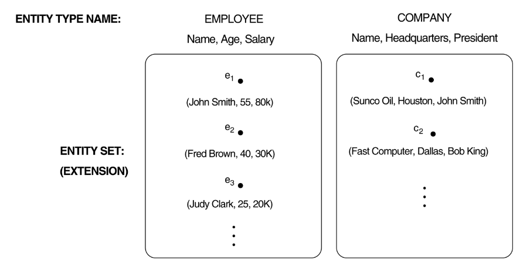
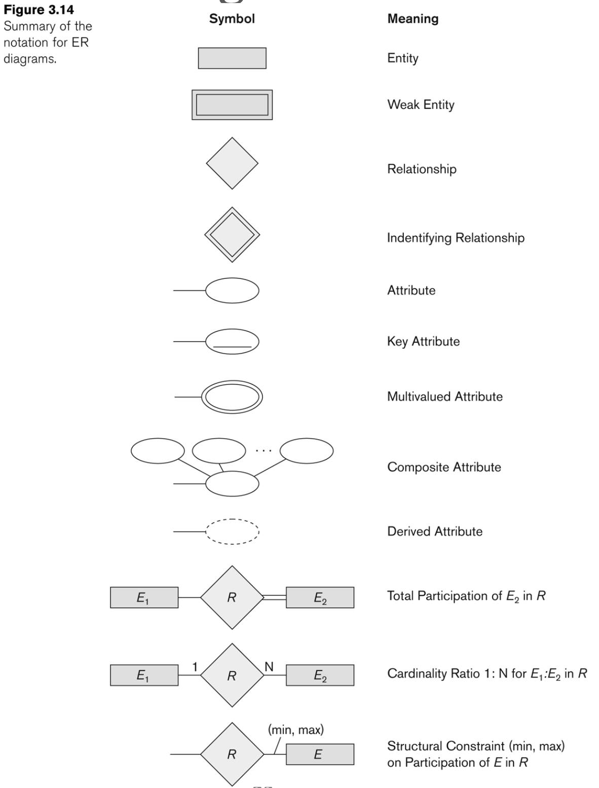
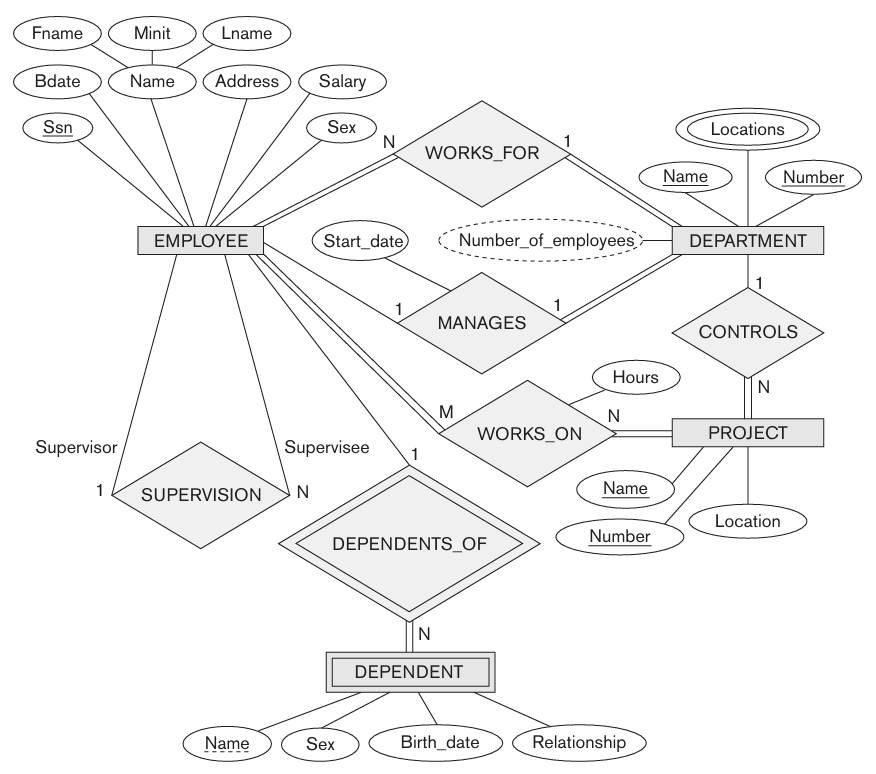
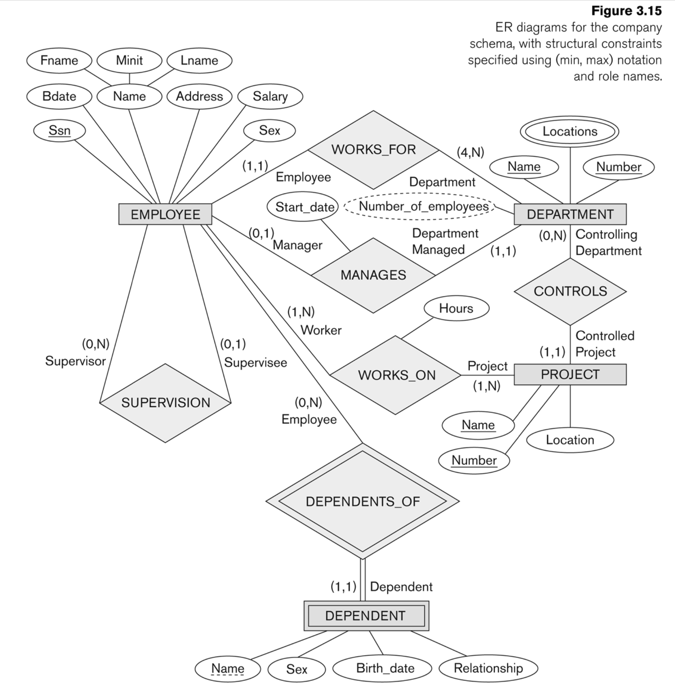
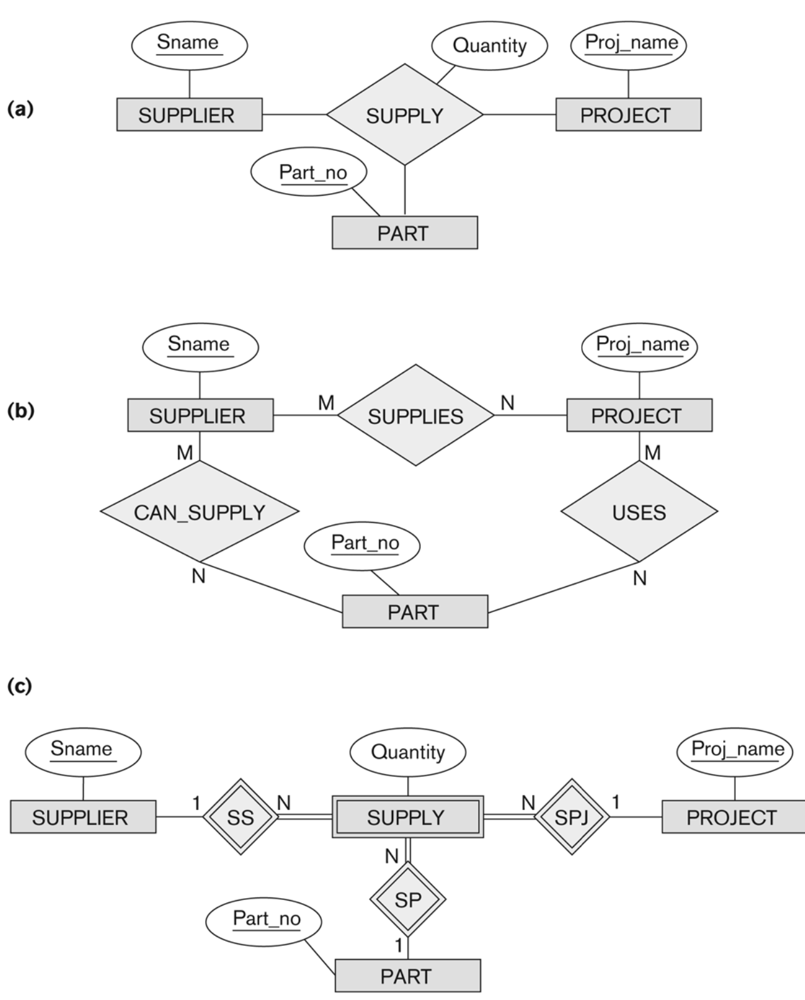
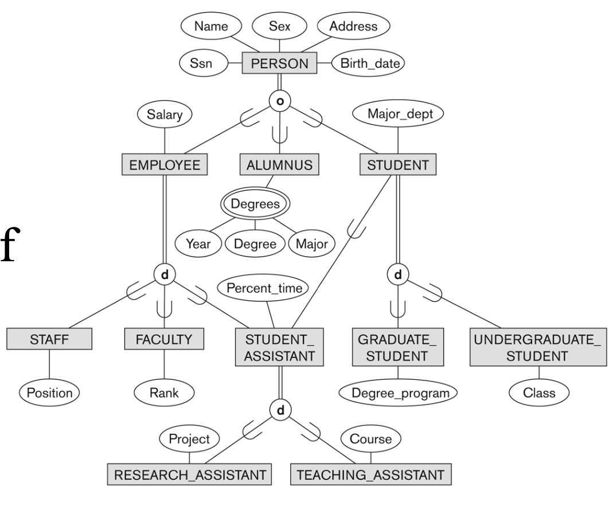

## DB 설계 예시

**회사**의 DB를 설계한다고 가정
- **부서**: 이름, 번호, 관리 직원 및 시작 날짜 저장. 여러 위치에 존재 가능
- **프로젝트**: 고유한 이름과 번호, 단일 위치 지정
- **직원**: 주민번호, 주소, 급여, 성별, 생년월일 저장. 하나의 부서에서 일하며 여러 프로젝트를 수행할 수 있음
- **부양가족**: 이름, 성별, 생년월일, 직원과의 관계 저장

## ER 모델

- **ER 모델(Entity-Relationship Model)**: 데이터를 **Entities**, **Attributes**, **Relationships** 로 표현  
- 데이터베이스의 구조를 개념적으로 정의하기 위한 모델

### Entity와 Attribute  
- entity: 현실 세계에서 독립적으로 존재할 수 있는 개체 (ex. 직원, 부서, 프로젝트)
- attribute: 엔터티의 특징을 나타내는 속성 (ex. 직원의 주민번호, 이름, 급여)

### Types of Attributes  
1. Composite attributes vs Simple attributes
    - Composite attributes: 더 작은 단위로 분해될 수 있는 특성 (ex. `주소 -> 도로 번호, 동호수`)
    - Simple attributes: 더 작은 단위로 나뉠 수 없는 속성 (ex. `성별, 급여`)
2. Single-Valued attributes vs Multi-Valued attributes
    - Single-Valued attributes: 하나의 값만 가질 수 있는 특성(ex. `주민번호, 생년월일`)
    - Multi-Valued attributes: 다양한 값을 한번에 가질 수 있는 특성(ex. `전공:['언어학', '인공지능'], 부양가족:['배우자', '자녀']`)
3. Stored attributes vs Derived attributes
    - Stored attributes: 저장되어있는 값
    - Derived attributes: 저장된 값으로부터 도출할 수 있는 내용(ex. `나이 = 현재 날짜 - 생년월일`)
4. Null values 허용 방식
    - unknown vs not applicable(NA)

### Entity Type & Entity Set

- **Entity Type**: 동일한 속성을 가진 entity의 추상화(ex. 직원, 회사)
- **Entity Set**: 특정 entity Type의 인스턴스들(ex. 저장된 직원 목록)

### Key Attributes
- 각 entity를 entity set 안에서 고유하게 식별하는 속성 (ex. 직원의 주민번호, 회사의 주소, 자동차 등록번호)
- 각 entity를 구별하기 위해 사용됨
- 하나의 entity type이 여러개의 Key attributes를 가질 수 있음(ex. 부서 이름, 부서 번호)
- Composite key: attributes의 집합이 Key attribute로 사용됨(ex. 경기 목록 테이블: 홈 팀, 원정 팀, 경기 날짜의 조합이 키가 됨)

### Value Sets of Attributes
- 특정 attribute가 가질 수 있는 가능한 값들의 집합을 **값 집합(Value Set)**이라고 함  
- entity type $E$의 attribute $A$가 값 집합 $V$를 가질 때, attribute $A$는 entity type $E$에서 $V$의 멱집합(Power Set)으로 매핑되는 함수로 표현됨  
- 즉, attribute $A$는 entity type $E$에 대해 $V$의 부분집합을 반환하는 함수로 정의됨:  
    $$A: E \rightarrow P(V)$$
    - 예를 들어, "직원의 전공"이라는 Attribute가 Value Set $V = \{\text{Computer Science, Economics, Linguistics, \dots}\}$을 가진다면, 특정 직원(Entity)의 전공 Attribute은 $V$의 부분집합인 $\{\text{Computer Science, Linguistics}\}$을 반환할 수 있음
- $A(e)$: 특정 Entity $e$에 대한 Attribute $A$의 값
    - attribute이 각 entity에 대해 하나의 값만 가질 경우 **Single-Valued Attributes**라고 함. 단일 값이므로 singleton set으로 표현
- Composite Attributes의 attribute은 여러 단순 속성으로 구성됨
    - 이때 값 집합 $V$는 각 구성 요소의 값 집합의 Cartesian Product로 정의됨  
    $$V = P(V_1) \times P(V_2) \times P(V_3) \times \dots P(V_n)$$
        - ex) 주소(Attribute)의 값 집합 $V$는 $\{\text{도로 번호}\} \times \{\text{동호수}\}$로 표현될 수 있음

### Relationship
- **Relationship**: 하나의 entity type의 attribute이 다른 entity type을 지시할 때, **관계(Relationship)** 가 존재한다고 말함.
    - ex) 직원의 Attribute 중 "근무 부서"라는 attribute은 부서라는 entity를 나타냄 $\rightarrow$ 관계 존재
- **Relationship type $R$**: n개의 entity type $E_1,\dots,E_n$에 대해 관계 집합 $R$은 Entity type들의 Cartesian Product의 부분집합으로 표시됨

$$
R \subseteq E_1 \times E_2 \times \dots \times E_n
$$

- **Relationship set $R$**: 관계 $r_i$들의 집합으로, 각 관계 $r_i$는 $n$개의 entity $(e_1, ..., e_n)$와 연관됨.  
    $$
    r_i = (e_1, e_2, \dots, e_n), \quad e_j \in E_j, \; 1 \leq j \leq n
    $$
    - $(e_1, e_2, \dots, e_n)$은 관계 $r_i$에 참여한다(participate)고 함.

#### Relationship Degree & Relationships as Attributes
- **Relationship Degree**: 관계에 참여하는 entity type의 수를 나타냄
    - **Unary Relationship (Degree 1)**: 하나의 entity type이 관계에 참여 (ex. 직원의 상사 관계)
    - **Binary Relationship (Degree 2)**: 두 개의 entity type이 관계에 참여 (ex. 직원과 부서 간의 관계)
    - **Ternary Relationship (Degree 3)**: 세 개의 entity type이 관계에 참여 (ex. 직원, 프로젝트, 부서 간의 관계)
    - 일반적으로 관계의 차수가 높아질수록 모델링이 복잡해짐
- **Binary Relationship (Degree 2)** 의 경우에는 관계를 속성으로 표현할 수 있음
    - ex) 직원과 부서 간의 관계를 "근무 부서"라는 속성으로 나타낼 수 있음

#### Role Names & Recursive Relationships

- **Role Names**: 관계에 참여하는 각 entity가 관계에서 수행하는 역할을 명확히 하기 위해 사용
    - ex) 직원과 부서 간의 관계에서, 직원은 "근무자" 역할을, 부서는 "근무 부서" 역할을 가질 수 있음
    - 동일한 entity type이 관계에 여러 번 참여할 경우, 역할 이름을 사용하여 구분
        - ex) 직원 간의 "상사-부하" 관계에서, 한 직원은 "상사" 역할을, 다른 직원은 "부하" 역할을 가짐 (Recursive Relationships)
- **Recursive Relationship**: 동일한 entity type이 관계에 여러 번 참여하는 경우
    - ex) 직원 간의 "상사-부하" 관계는 직원이라는 동일한 entity type이 두 번 참여하는 관계
    - Recursive Relationship은 각 참여에 대해 별도의 역할 이름을 지정하여 구분
        - ex) "상사"와 "부하"라는 역할 이름을 사용하여 관계를 명확히 표현
    - Recursive Relationship은 ER 다이어그램에서 동일한 entity type에서 출발하여 다시 해당 entity type으로 돌아오는 화살표로 표현됨

#### Relationship Constraints (Structural Constraints)

- **Relationship Constraints**: 관계에서 entity 간의 연관성을 제한하는 규칙으로, 데이터베이스의 무결성을 유지하기 위해 사용됨
    1. **Cardinality Ratio (Mapping Cardinalities)**: Binary Relationship에 참여하는 entity 간의 매핑 비율을 정의 
        - **1:1**: 한 entity가 다른 entity와 최대 하나의 관계를 가짐 (ex. 직원과 사물함)
        - **1:N**: 한 entity가 여러 entity와 관계를 가질 수 있음 (ex. 부서와 직원)
        - **M:N**: 여러 entity가 여러 entity와 관계를 가질 수 있음 (ex. 직원과 프로젝트)
    2. **Participation Constraints**: 관계에 참여하는 entity의 필수 여부를 정의
        - **Total Participation**: 모든 entity가 관계에 참여해야 함 (ex. 모든 직원은 반드시 부서에 속해야 함)
        - **Partial Participation**: 일부 entity만 관계에 참여할 수도 있음 (ex. 일부 직원만 프로젝트에 참여)

#### Attributes of Relationship Types

- 관계도 속성을 가질 수 있음. 특정 관계에서만 의미가 있는 정보를 저장할 때 사용됨.
    - ex) 직원이 프로젝트에서 일한 시간(Hours)을 기록해야 하는 경우, `WORKS_ON` 관계에 `근무시간` 속성이 필요
- **1:1 Relationship Type**: 관계의 속성은 두 엔터티 중 하나에 속성으로 포함될 수 있음
    - ex) 직원과 사물함 간의 1:1 관계에서, 사물함 번호를 직원 엔터티의 속성으로 추가하거나, 직원 ID를 사물함 엔터티의 속성으로 추가할 수 있음.
- **1:N Relationship Type**: 관계의 속성은 "N" 측 엔터티에 속성으로 포함될 수 있음  
    - ex) 부서와 직원 간의 1:N 관계에서, 직원 엔터티에 "부서 번호" 속성을 추가하여 관계를 표현할 수 있음.
- **M:N Relationship Type**: 관계의 속성은 독립적인 관계 엔터티에 포함되어야 함  
    - ex) 직원과 프로젝트 간의 M:N 관계에서, `WORKS_ON`이라는 관계 엔터티를 생성하고, 이 엔터티에 "근무시간"과 같은 속성을 추가하여 관계를 표현할 수 있음.

### Weak Entity Type

- **Weak Entity**: 고유한 Key Attribute가 없어 다른 Entity의 도움 없이는 고유하게 식별될 수 없는 Entity  
    - ex) "부양가족"은 직원의 도움 없이는 고유하게 식별될 수 없음
- **Identifying Relationship**: Weak Entity를 고유하게 식별하기 위해 사용되는 관계  
    - ex) "부양가족"은 직원과의 관계를 통해 고유하게 식별됨
- **Discriminator (Partial Key)**: Identifying Relationship 내에서 Weak Entity를 고유하게 식별하기 위해 사용되는 속성  
    - ex) "부양가족"의 이름은 직원과의 관계 내에서 고유하게 식별될 수 있음
- **Total Participation**: Weak Entity는 항상 Identifying Relationship에 Total Participation을 가짐  
    - ex) 모든 부양가족은 반드시 직원과의 관계를 가져야 함

### Refining ER Design for COMPANY DB

- 초기 설계된 ER 다이어그램에는 중복된 정보 또는 비효율적인 관계 표현이 존재할 수 있음
- 이를 개선하여 데이터 무결성을 유지하고 중복을 최소화해야 함
1. 부서 관리자 관계 - `MANAGES`
`MANAGES` 관계는 직원과 부서의 1:1 관계이며, 관리 시작일 속성을 가짐
2. 직원과 부서 관계 - `WORKS_FOR`
`WORKS_FOR` 관계는 직원과 부서 간의 1:N 관계로, 직원 엔터티에 "부서 번호" 속성을 추가하여 표현할 수 있음.  
이 관계는 모든 직원이 반드시 하나의 부서에 속해야 하므로 Total Participation을 가짐.
3. 부서와 프로젝트 관계 - `CONTROLS`
`CONTROLS` 관계는 부서와 프로젝트 간의 1:N 관계로, 각 프로젝트는 반드시 하나의 부서에 의해 관리되어야 함.  
이 관계는 Total Participation을 가지며, 프로젝트 엔터티에 "부서 번호" 속성을 추가하여 표현할 수 있음.
4. 직원과 프로젝트 관계 - `WORKS_ON`
`WORKS_ON` 관계는 직원과 프로젝트 간의 M:N 관계로, 관계 엔터티를 생성하여 표현해야 함.  
이 관계 엔터티는 "근무시간" 속성을 포함하며, 각 직원이 특정 프로젝트에서 일한 시간을 기록할 수 있음.  
또한, 관계 엔터티는 직원과 프로젝트의 Primary Key를 조합하여 Composite Key로 사용함.  
5. 직원과 감독 관계 - `SUPERVISION`
`SUPERVISION` 관계는 직원 간의 1:N 관계로, 한 직원이 다른 직원의 상사 역할을 수행함.  
이 관계는 Recursive Relationship으로 표현되며, "상사"와 "부하"라는 역할 이름을 사용하여 관계를 명확히 구분함.
6. 직원과 부양가족 관계 - `DEPENDENTS_OF`
`DEPENDENTS_OF` 관계는 직원과 부양가족 간의 1:N 관계로, 부양가족 entity는 직원 entity의 Primary Key를 포함하여 관계를 표현해야 함.  
이 관계는 Weak Entity와 Identifying Relationship으로 표현되며, 부양가족 entity는 직원 엔터티와의 관계를 통해 고유하게 식별됨.  

### conventions for ER diagrams
<figure>
  
  <figcaption>ER 디자인을 위한 diagram convention</figcaption>
</figure>

<figure>
  
  <figcaption>회사 ER 다이어그램 예시</figcaption>
</figure>

### Design Choices for ER Conceptual Design
- 특정 개념을 Entity, Attribute, Relationship 중 어디에 포함할지 결정해야 함
- 설계 과정에서 **반복적인 개선(Iterative Refinement)**이 필요함

1. Attribute vs Entity  
    특정 개념이 Attribute으로 표현될지 Entity로 표현될지 결정  
    ex) "부서 관리자"는 MANAGER Attribute이 아니라 EMPLOYEE와 DEPARTMENT 간의 Relationship으로 설정  
2. Attribute vs Relationship  
    Attribute이 Relationship을 대신할 수 있는 경우 Attribute을 선택 가능  
    ex) 부서와 직원의 WORKS_FOR Relationship에서 StartDate는 Entity Attribute으로 존재할 수도 있고, Relationship Attribute으로 유지될 수도 있음   
3. Entity vs Relationship  
    특정 개념을 독립적인 Entity로 만들지, Relationship로 표현할지 결정  
    ex) "강의"를 교수와 학생의 Relationship으로 표현하는 것이 아닌 하나의 Entity로 표현

### Alternative Notations for ER Diagrams
- Entity와 Relationship의 참여도를 `(min, max)` 제약 조건으로 표현 가능
    - `(0,1)`: Entity가 Relationship에 참여하지 않을 수도 있으며, 최대 하나의 Relationship에만 참여할 수 있음  
        - ex) 직원과 사물함의 1:1 Relationship에서, 일부 직원은 사물함을 가지지 않을 수 있음
    - `(1,1)`: 모든 Entity가 반드시 하나의 Relationship에 참여해야 함  
        - ex) 직원과 사물함의 1:1 Relationship에서, 모든 직원은 반드시 하나의 사물함을 가져야 함
    - `(0,N)`: Entity가 Relationship에 참여하지 않을 수도 있으며, 여러 Relationship에 참여할 수도 있음  
        - ex) 직원과 관리자의 1:N Relationship에서, 일부 직원은 아무 직원도 관리하지 않을 수 있으며, 여러 명의 부하직원을 둘 수 있음
    - `(1,N)`: 모든 Entity가 최소 하나의 Relationship에 참여해야 하며, 여러 Relationship에 참여할 수도 있음  
        - ex) 부서와 직원의 1:N Relationship에서, 모든 직원은 반드시 하나의 부서에 속해야 하며, 한 부서에 여러 직원이 속할 수 있음
    - `(M,N)`: Entity가 최소 $M$개에서 최대 $N$개의 Relationship에 참여할 수 있음  
        - ex) 직원과 부서의 Relationship에서, 한 부서가 최소 4명에서 최대 8명의 직원을 가질 수 있음
    

<figure>
  
  <figcaption>참여도가 표시된 ER 다이어그램</figcaption>
</figure>

### Ternary Relationships & Higher-Degree Relationships
- 대부분의 관계는 이항 관계 (Binary Relationship)이지만, 때때로 삼항(Ternary) 이상의 관계가 필요함
<figure>
  
</figure>

- 예시
    - 공급업체(Supplier), 부품(Part), 프로젝트(Project) 간의 관계
    - 관계 이름: `SUPPLIES`
    - 관계 속성: 공급량(Quantity)
    - 이 관계는 세 Entity Type과의 관계에서만 의미를 가짐
    - `SUPPLIES`를 하나의 weak entity로 만들어 binary relationship으로 관리할 수도 있음

## Enhanced ER(EER) Model
- **Enhanced ER Model (EER)**: 기존 ER 모델을 확장하여 더 복잡한 데이터베이스 구조를 표현할 수 있도록 설계된 모델
- EER 모델은 ER 모델에 다음과 같은 개념을 추가함:
    1. **Superclass**와 **Subclass**
    2. **Specialization**과 **Generalization**
    3. **Category (Union Type)**
    4. **Inheritance**

### Superclass와 Subclass
- **Superclass**: 공통 속성을 가진 상위 개념
- **Subclass**: Superclass의 속성을 상속받으며, 추가적인 속성을 가질 수 있는 하위 개념
    - ex) 직원을 Superclass로 설정하고, 비서와 엔지니어를 Subclass로 설정

#### Specialization
- **Specialization**: 상위 개념(Superclass)을 더 구체적인 하위 개념(Subclass)으로 나누는 과정
    - ex) 직원(Employee)을 관리자(Manager)와 엔지니어(Engineer)로 세분화
    - **Predicate-Defined Specialization**: 특정 Attribute의 논리 조건에 따라 Subclass를 정의
        - ex) 급여가 일정 금액 이상인 개발자는 시니어 개발자 Subclass에 포함
    - **Attribute-Defined Specialization**: 특정 Attribute 값에 따라 Subclass를 정의
        - ex) 직원의 JobType 속성 값에 따라 Subclass를 구분
    - **User-Defined Specialization**: 사용자가 임의로 Subclass를 정의

#### Generalization
- **Generalization**: 여러 하위 개념(Subclass)을 공통 속성을 가진 상위 개념(Superclass)으로 통합하는 과정
    - ex) 학부생(Undergraduate)과 대학원생(Graduate)을 학생(Student)으로 통합

#### Constraints on Specialization and Generalization
1. **Disjointness Constraint**: Subclass 간의 중복 여부를 정의
    - **Disjoint**: 하나의 Entity는 하나의 Subclass에만 속할 수 있음  
        - ex) 직원이 엔지니어 Subclass에 속하면 HR Subclass에는 속할 수 없음  
        - Attribute-Defined Specialization을 통해 정의된 Subclass는 자동으로 Disjoint 특성을 가짐
    - **Overlapping**: 하나의 Entity가 여러 Subclass에 속할 수 있음  
        - ex) 직원이 동시에 관리자와 엔지니어 Subclass에 속할 수 있음 
    - 중복 가능 여부에 따라 d, o로 표현

2. **Completeness Constraint**: 모든 Entity가 Subclass에 포함되어야 하는지 여부를 정의
    - **Total Specialization**: 모든 Entity가 반드시 최소 하나의 Subclass에 포함되어야 함
        - ex) 모든 직원은 Jop_type을 가져야함
    - **Partial Specialization**: 일부 Entity는 Subclass에 포함되지 않을 수 있음
        - ex) 모든 직원이 부서장 역할을 맡지 않아도 됨

#### Specialization Hierarchies vs Lattices

- **Specialization Hierarchies**: Subclass들이 계층 구조를 형성하며, 각 Subclass는 하나의 Superclass만 가질 수 있음
    - ex) 직원 → 관리자 → 부서 관리자
    - 계층 구조에서는 상위 Superclass의 Attribute와 관계가 하위 Subclass로 전파됨

- **Specialization Lattices**: Subclass들이 여러 Superclass를 가질 수 있는 구조(하나의 Subclass가 다중상속)
    - ex) 학생과 직원을 Superclass로 가지는 연구 조교
    - Lattice 구조에서는 Subclass가 여러 Superclass의 Attribute와 관계를 상속받음
    - Subclass는 상속받은 속성을 재정의하거나 추가적인 속성을 가질 수 있음
    - Lattice 구조는 더 복잡한 데이터 모델링을 가능하게 함
    - 다중 상속이 허용되지 않을때는 Class의 조합을 하나의 Class로 만들어서 관리하기도 함
        - ex) {학생, 직원, 학생직원}

### Category (Union Type)
- **Category**: 여러 Superclass에서 공통적으로 상속받는 Subclass
    - ex) 학생과 직원을 Superclass로 설정하고, 이 둘의 공통 속성을 가진 Subclass로 "대학 구성원"을 정의
- Category는 **Union** 연산을 통해 정의되며, Subclass는 Superclass의 속성을 선택적으로 상속받음
- 

#### Shared Subclass와의 차이점
- **Shared Subclass**: Subclass가 여러 Superclass로부터 Attribute와 관계를 상속받는 경우
    - ex) "연구 조교"는 "학생"과 "직원"의 공통 속성을 상속받는 Subclass
    - Shared Subclass는 여러 Superclass의 **Intersection**연산으로 정의됨

1. **Shared Subclass vs Category**
    - Shared Subclass는 여러 Superclass의 공통 속성을 상속받아 새로운 Subclass를 정의
    - Category는 여러 Superclass의 Union을 통해 Subclass를 정의하며, Superclass 간의 공통 속성을 반드시 요구하지 않음

2. **Inheritance**
    - Shared Subclass는 모든 Superclass의 Attribute와 관계를 상속받음
    - Category는 Union 관계를 통해 정의되므로, 상속받는 Attribute와 관계가 제한적일 수 있음

3. **Use Case**
    - Shared Subclass는 Superclass 간의 공통 Attribute을 명확히 정의하고, 이를 기반으로 Subclass를 설계할 때 사용
    - Category는 Superclass 간의 공통 Attribute이 명확하지 않거나, 다양한 Superclass의 Attribute을 통합할 필요가 있을 때 사용

### Inheritance
- **Inheritance**: Subclass가 Superclass의 Attribute을 상속받는 과정
    - Subclass는 Superclass의 모든 Attribute와 관계를 상속받음
    - Subclass는 추가적인 Attribute을 정의하거나, Superclass의 Attribute을 재정의할 수 있음

### EER Diagram Notations
- EER 다이어그램에서 Superclass와 Subclass는 삼각형으로 연결하여 표현
    - 삼각형 위에 Specialization/Generalization의 제약 조건(Disjoint, Overlapping, Total, Partial)을 표시
    - Category는 Union 관계를 나타내는 기호로 표현

<figure>
    
    <figcaption>EER 다이어그램 예시</figcaption>
</figure>

---
해당 포스트는 서울대학교 산업공학과 박종헌 교수님의 데이터관리와 분석 25-1학기 강의를 정리한 내용입니다.  
사진 출처 : Ramez Elmasri & Shamkant Navathe, "Fundamentals of Database Systems"