## 컴퓨터 비전의 전통적 방법
<figure>
    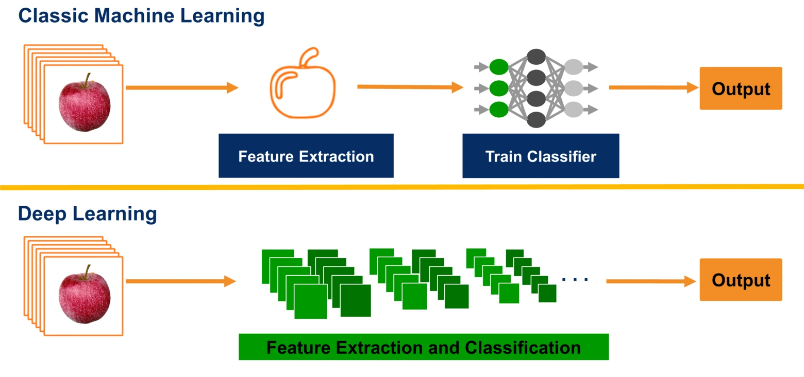
    <figcaption>이미지 출처: <a href="https://www.mvtec.com/technologies/deep-learning/classic-machine-vision-vs-deep-learning">MVTec</a></figcaption>
</figure>
태초에, 딥러닝이 있기 전 컴퓨터 비전의 문제를 풀기 위해선 사람이 손수 직접 이미지로부터 Feature를 뽑아내는 함수를 디자인해야만 했습니다. Detection의 예시를 들어보면, 찾고자 하는 대상의 이미지 특성을 추출하는 함수를 디자인해야만 Detection 문제를 풀 수 있었습니다. 그냥 비슷한 사진 골라내는게 뭐가 그리 어려웠을까요? 무엇이 문제인지를 알기 위해, 다음 예시를 살펴봅시다. 

<figure>
    
</figure>
위와 같은 고양이 사진에서, 고양이를 Detect하기 위해서 어떻게 해야할까요?

<figure>
    
</figure>

단순히 위와 같이 고양이 사진을 크롭해서 필터를 만들고, 사진의 모든 부분에 대해 내적값을 구해 가장 내적값이 높은 부분을 찾는 방법을 생각해 볼 수 있을 것 입니다.
이를 수식으로 표현하면 다음과 같습니다:

$$
S(x, y) = \sum_{i=1}^{H} \sum_{j=1}^{W} I(x+i, y+j) \cdot T(i, j)
$$

여기서,  
- $ S(x, y) $는 위치 $(x, y)$에서의 내적값입니다.  
- $ I(x+i, y+j) $는 입력 이미지의 픽셀 값입니다.  
- $ T(i, j) $는 고양이 사진의 픽셀값입니다.  
- $ H $와 $ W $는 템플릿의 높이와 너비입니다.

하지만 위와 같은 방법은 고양이의 자세, 고양이 사진의 방향, 이미지 사이즈, 시점, 조명 등의 다양한 변수가 하나도 변하지 않았다는 가정 아래 유효한 방법입니다. 예컨대, 고양이의 자세가 조금이라도 변한다면, 위의 방식으로 제작한 필터는 전혀 쓸모없는 필터가 되어버리겠죠.  

<figure>
    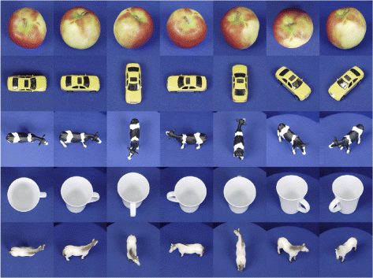
    <figcaption>이미지 출처: <a href="https://www.researchgate.net/figure/Several-object-examples-with-different-angles-from-ETH-dataset_fig3_320337507">ResearchGate</a></figcaption>
</figure>

물체의 방향, 상대적 크기, 색, 조명 등 다양한 요소가 달라질 때 마다 이미지 행렬의 값은 매우 달라집니다. 우리는 해당 요소들이 바뀐다 하더라도 쉽게 같은 의미를 갖는 이미지임을 인식하지만, 컴퓨터는 그렇지 못합니다.  
따라서 객체 인식의 문제를 풀기 위해서는 같은 객체들이 같은 "Feature"를 갖도록, 우리의 Feature Extraction function을 디자인해야합니다.

## Representation of Image

이미지는 기본적으로 픽셀 값의 집합으로 표현됩니다. 각 픽셀은 일반적으로 $ (R, G, B) $ 값으로 구성된 3차원 벡터로 나타내며, 이는 이미지의 색상 정보를 담고 있습니다. 예를 들어, $ 256 \times 256 $ 크기의 컬러 이미지는 $ 256 \times 256 \times 3 $ 크기의 행렬로 표현됩니다.  

이미지를 2차원 함수로 표현할 수도 있는데, 이를 수학적으로 나타내면 다음과 같습니다.   
$$
I(x, y) = \begin{bmatrix}
R(x, y) \\
G(x, y) \\
B(x, y)
\end{bmatrix} \in \mathbb{R}^{2^8 \times 2^8 \times 2^8 }
$$

여기서,  
- $ I(x, y) $는 위치 $(x, y)$에서의 픽셀 값입니다.  
- $ R(x, y) $, $ G(x, y) $, $ B(x, y) $는 각각 빨강, 초록, 파랑 채널의 값입니다.

이미지의 각 픽셀은 이러한 채널 값의 조합으로 표현되며, 이는 컴퓨터가 이미지를 처리하는 기본 단위가 됩니다.  

## Image Filtering
목적에 따라 다양한 필터링 방법을 사용할 수 있습니다

### Pixel-wise Filtering
픽셀 단위 필터링은 이미지의 각 픽셀에 대해 특정 연산을 수행하여 새로운 이미지를 생성하는 방법입니다. 가장 간단한 예로, 이미지의 밝기를 조정하거나 특정 색상을 강조하는 작업이 있습니다.

#### Brightness Adjustment
이미지의 밝기를 조정하려면 각 픽셀 값에 일정한 상수를 더하거나 빼는 연산을 수행합니다. 이를 수식으로 표현하면 다음과 같습니다:

$$
I'(x, y) = I(x, y) + b
$$

여기서,  
- $ I'(x, y) $는 조정된 이미지의 픽셀 값입니다.  
- $ I(x, y) $는 원본 이미지의 픽셀 값입니다.  
- $ b $는 밝기 조정 상수입니다.

#### Thresholding
Thresholding은 픽셀 값을 특정 임계값과 비교하여 이진화된 이미지를 생성하는 방법입니다. 수식은 다음과 같습니다:

$$
I'(x, y) =
\begin{cases} 
1 & \text{if } I(x, y) > T \\
0 & \text{otherwise}
\end{cases}
$$

여기서,  
- $ T $는 임계값입니다.  
- $ I'(x, y) $는 이진화된 이미지의 픽셀 값입니다.

#### Inversion
Inversion은 이미지의 색상을 반전시키는 필터링 기법입니다. 각 픽셀 값에 대해 최대값에서 해당 값을 빼는 연산을 수행합니다. 이를 수식으로 표현하면 다음과 같습니다:

$$
I'(x, y) = M - I(x, y)
$$

여기서,  
- $ I'(x, y) $는 반전된 이미지의 픽셀 값입니다.  
- $ I(x, y) $는 원본 이미지의 픽셀 값입니다.  
- $ M $은 픽셀 값의 최대값입니다 (예: 8비트 이미지의 경우 $ M = 255 $).

<figure>
    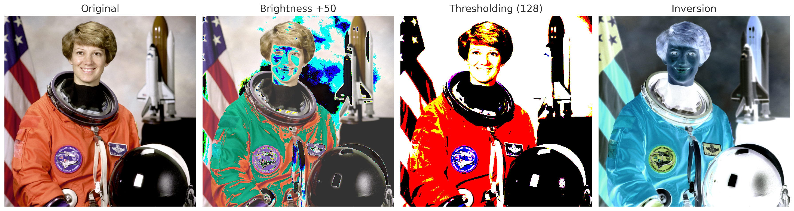
    <figcaption>순서대로 원본 이미지, Brightness Adjustment, Thresholding, Inversion</figcaption>
</figure>

위 사진은 원본사진(`skimage` 모듈의 `data.astronaut()`)에 각각의 필터링을 적용한 예시입니다. Thresholding 연산은 RGB 이미지에 대해 각 채널별로 연산이 됩니다.

### Spatial Filtering
우리가 이미지에 필터를 적용해서 얻고 싶은 정보는 경계선, 블러, 주변 색상과의 관계일 수 있습니다.  
이와 같은 정보는 단순한 pixel-wise filtering만으로는 얻어낼 수 없고, 픽셀 주변의 이웃 값들과 함께 연산하여 새로운 값을 계산해야합니다. 

#### Correlation
Correlation은 이미지의 특정 패턴을 강조하거나 감지하기 위해 사용되는 연산입니다. 이는 필터(또는 커널)와 이미지의 부분 영역 간의 내적을 계산하여 새로운 이미지를 생성합니다. 수식은 다음과 같습니다:

$$
I'(i, j) = \sum_{k,l \in \\{-1,0,1\\}}^{}I(i+k, j+l) \cdot K(i, j)
$$  

여기서,  
- $ I'(i, j) $는 필터링된 이미지의 픽셀 값입니다.  
- $ I(i+k, j+l) $는 원본 이미지의 픽셀 값입니다.  
- $ K(i, j) $는 필터(커널)의 값입니다.  
- $ k, l $은 필터의 크기에 따라 정의된 인덱스입니다.

- 예시  
    이미지 행렬  
    $$
    \begin{bmatrix}
    1 & 2 & 3 & 4 \\
    5 & 6 & 7 & 8 \\
    9 & 10 & 11 & 12 \\
    13 & 14 & 15 & 16
    \end{bmatrix}
    $$

    필터(커널) 행렬  
    $$
    \begin{bmatrix}
    a & b & c \\
    d & e & f \\
    g & h & i
    \end{bmatrix}
    $$

    Filtered image  
    $$
    \begin{bmatrix}
    1a + 2b + 3c + 5d + 6e + 7f + 9g + 10h + 11i & 2a + 3b + 4c + 6d + 7e + 8f + 10g + 11h + 12i \\
    5a + 6b + 7c + 9d + 10e + 11f + 13g + 14h + 15i & 6a + 7b + 8c + 10d + 11e + 12f + 14g + 15h + 16i
    \end{bmatrix}
    $$  

Filtered 된 행렬의 크기가 원본보다 줄어든 것을 알 수 있는데요.  
원본 이미지의 크기를 유지하기 위해 원본 이미지의 모서리에 0을 채워넣는 Zero pading 기법을 사용할 수 있습니다.

- 예시  
    Zero padding을 적용한 이미지 행렬  
    $$
    \begin{bmatrix}
    0 & 0 & 0 & 0 & 0 & 0 \\
    0 & 1 & 2 & 3 & 4 & 0 \\
    0 & 5 & 6 & 7 & 8 & 0 \\
    0 & 9 & 10 & 11 & 12 & 0 \\
    0 & 13 & 14 & 15 & 16 & 0 \\
    0 & 0 & 0 & 0 & 0 & 0
    \end{bmatrix}
    $$

    Filtered image
    $$
    \begin{bmatrix}
    1e + 2f + 5h + 6i & 1d + 2e + 3f + 5g + 6h + 7i & 2d + 3e + 4f + 6g + 7h + 8i & 3d + 4e + 7g + 8h \\
    1b + 2c + 5e + 6f + 9h + 10i & 1a + 2b + 3c + 5d + 6e + 7f + 9g + 10h + 11i & 2a + 3b + 4c + 6d + 7e + 8f + 10g + 11h + 12i & 3a + 4b + 7d + 8e + 11g + 12h\\
    5b + 6c + 9e + 10f + 13h + 14i & 5a + 6b + 7c + 9d + 10e + 11f + 13g + 14h + 15i & 6a + 7b + 8c + 10d + 11e + 12f + 14g + 15h + 16i & 7a + 8b +  11d + 12e + 15g + 16h \\
    9b + 10c + 13e + 14f  & 9a + 10b + 11c + 13d + 14e + 15f & 10a + 11b + 12c + 14d + 15e + 16f & 11a + 12b + 0c + 15d + 16e
    \end{bmatrix}
    $$   

    동일한 4 by 4 행렬이 생성됨을 알 수 있습니다.

##### Examples of Kernels
- **Identity**  
$$
\begin{bmatrix}
0 & 0 & 0 \\
0 & 1 & 0 \\
0 & 0 & 0
\end{bmatrix}
$$
해당 커널은 필터링 후에도 원본과 동일한 결과를 생성합니다.

- **Shifting**
$$
\begin{bmatrix}
0 & 0 & 0 \\
1 & 0 & 0 \\
0 & 0 & 0
\end{bmatrix}
$$
이 커널은 이미지를 오른쪽으로 한 픽셀 이동시키는 효과를 냅니다.  
1의 위치에 따라 이동의 방향을 다르게 할 수 있습니다.

- **Box Blur**
$$
\begin{bmatrix}
\frac{1}{9} & \frac{1}{9} & \frac{1}{9} \\
\frac{1}{9} & \frac{1}{9} & \frac{1}{9} \\
\frac{1}{9} & \frac{1}{9} & \frac{1}{9}
\end{bmatrix}
$$
이 커널은 이미지의 각 픽셀 값을 주변 픽셀 값들의 평균으로 대체하여 이미지를 부드럽게 만드는 효과를 냅니다.  
Box Blur는 노이즈 제거 및 이미지의 세부 사항을 흐리게 하는 데 사용됩니다.

- **Gaussian Blur**
$$
\begin{bmatrix}
\frac{1}{16} & \frac{2}{16} & \frac{1}{16} \\
\frac{2}{16} & \frac{4}{16} & \frac{2}{16} \\
\frac{1}{16} & \frac{2}{16} & \frac{1}{16}
\end{bmatrix}
$$
Gaussian 함수는 중심에서 가장 높은 값을 갖는 특성이 있습니다. Gaussian Blur 방식은 이 특징을 이용해 가운데 픽셀에 높은 가중치를 주는 방법으로 평균을 냅니다.   
해당 필터링을 통해 더 효과적인 노이즈 제거가 가능해집니다.  

    $$
    G(x, y) = \frac{1}{2\pi\sigma^2} e^{-\frac{x^2 + y^2}{2\sigma^2}}
    $$

    여기서,  
    - $ G(x, y) $는 Gaussian 커널의 값입니다.  
    - $ \sigma $는 표준 편차로, 블러의 강도를 조절합니다.  
    - $ x, y $는 커널의 좌표입니다.  

    <figure>
        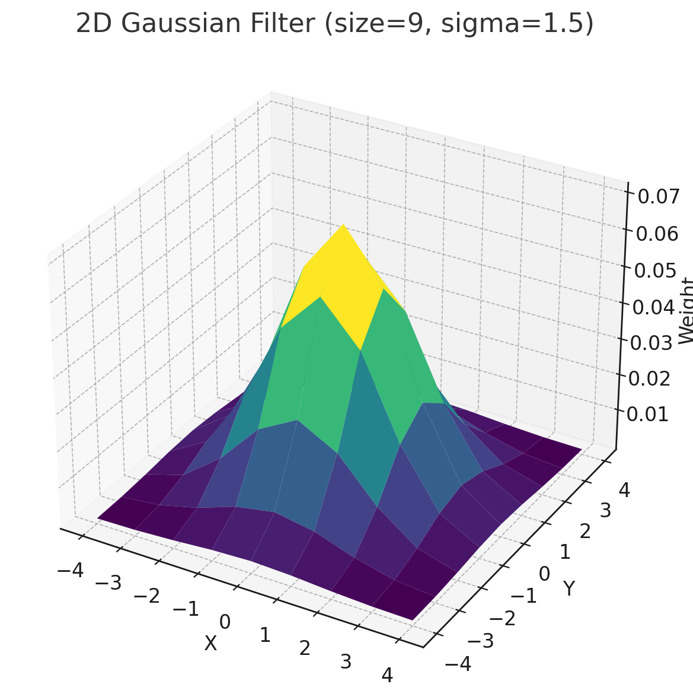
        <figcaption>Gaussian filter의 시각화</figcaption>
    </figure>

- **Image Sharpening**
$$
\begin{bmatrix}
0 & -1 & 0 \\
-1 & 5 & -1 \\
0 & -1 & 0
\end{bmatrix}
$$
이 커널은 이미지의 경계를 강조하고 세부 사항을 더 선명하게 만드는 데 사용됩니다.  
Sharpening 필터는 이미지의 중심 픽셀과 주변 픽셀간의 차이를 강조해 표현합니다.  

- **Image Differenciation**  
$$
\frac{\partial I}{\partial x}
$$
$$
\frac{1}{3}
\begin{bmatrix}
-1 & 0 & 1 \\
-1 & 0 & 1 \\
-1 & 0 & 1
\end{bmatrix}
$$
$$
\frac{\partial I}{\partial y}
$$
$$
\frac{1}{3}
\begin{bmatrix}
-1 & -1 & -1 \\
0 & 0 & 0 \\
1 & 1 & 1
\end{bmatrix}
$$

위의 커널들은 각각 $ x $-축과 $ y $-축 방향으로의 미분을 수행하여 이미지의 경계선을 감지하는 데 사용됩니다.  
이러한 미분 연산은 이미지의 밝기 변화가 급격한 영역(즉, 경계선)을 강조합니다.

### Convolution
Convolution은 필터링 연산의 또 다른 형태로, 필터를 이미지에 적용하는 과정에서 필터를 뒤집어 사용하는 것이 특징입니다. 이는 수학적으로 다음과 같이 표현됩니다:

$$
I'(i, j) = \sum_{k,l \in \\{-1,0,1\\}}^{}I(i+k, j+l) \cdot K(-k, -l)
$$

여기서,  
- $ K(-k, -l) $는 필터(커널)를 뒤집은 값입니다.  
- 나머지 변수는 Correlation과 동일합니다.

필터를 굳이 뒤집어 사용해야하는 이유는 다음과 같습니다.  

<figure>
    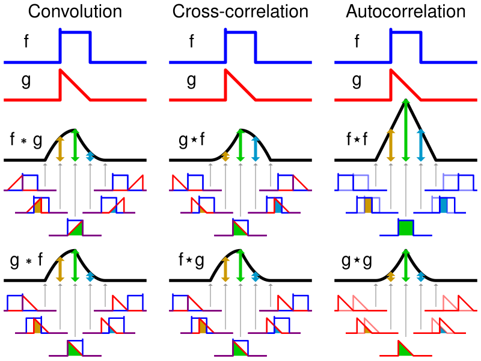
    <figcaption>Convolution, Cross-correlation, Autocorrelation의 비교</figcaption>
</figure>

이 예시에서 확인할 수 있는것은, Convolution은 순서를 바꿔 적용해도 같은 결과를 얻을 수 있게 된다는 것입니다.   
다시 말해, Convolution 연산은 commutative, associative한 특성을 갖게 됩나다. 

- Commutative:  
    $f*g = g*f$   
- Associative:  
    $f*(g*h) = (f*g)*h$  

따라서 Convolution 연산을 적용한다면 여러 필터를 한번에 적용할 수 있게 됩니다.  

#### Edge Detection
앞서 Image Differentiation을 통해 경계선의 정보를 알아낼 수 있었습니다. 하지만 해당 방법은 노이즈가 심해 엣지 정보가 왜곡되어보이는데요.

<figure>
    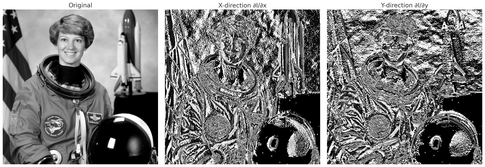
    <figcaption>원본 이미지, x축 미분, y축 미분</figcaption>
</figure>  

앞서 설명한 Convolution의 특성을 이용해 이를 개선한 새로운 필터를 만들 수 있습니다.  

##### Sobel Filter
Sobel 필터는 경계선 검출을 위해 이미지의 밝기 변화율을 계산하는 필터입니다. 이는 Gaussian Blur와 미분 연산을 Convolution으로 결합하여 노이즈에 강한 경계선 검출을 수행합니다. Sobel 필터는 $ x $-축과 $ y $-축 방향으로 각각 다음과 같은 커널을 사용합니다:

- $ x $-축 방향 필터:
$$
\begin{bmatrix}
-1 & 0 & 1 \\
-2 & 0 & 2 \\
-1 & 0 & 1
\end{bmatrix}
$$

- $ y $-축 방향 필터:
$$
\begin{bmatrix}
-1 & -2 & -1 \\
0 & 0 & 0 \\
1 & 2 & 1
\end{bmatrix}
$$

(수는 임의의 값)

위 필터들은 모두 Convolution의 특성을 이용해   
$$
    (I*\frac{\partial I}{\partial x})*Gaussian = I*(\frac{\partial I}{\partial x}*Gaussian)
$$
$$
    (I*\frac{\partial I}{\partial y})*Gaussian = I*(\frac{\partial I}{\partial y}*Gaussian)
$$
와 같이 얻어낸 필터입니다.

Sobel 필터를 적용한 결과는 다음과 같이 계산됩니다:
$$
G_x = I * K_x, \quad G_y = I * K_y
$$

<figure>
    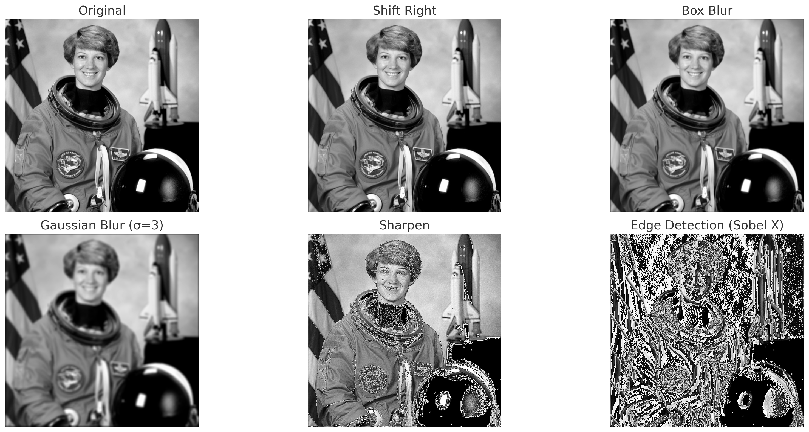
    <figcaption>원본 이미지, Shift, Box blur, Gaussian Blur, Sharpen, Sobel-X</figcaption>
</figure>  

위 이미지들은 위에서 정리했던 이미지 필터들을 원본이미지에 적용한 결과들입니다. 

##### Simple Gradient Thresholding

앞서 살펴본 내용과 같이 이미지의 편미분을 통해 밝기 변화율을 계산하여 수직, 수평의 경계선을 나타내보았는데요, 이 정보를 종합해서 경계선을 찾아낼 수 있습니다.  

$$
\frac{\partial I}{\partial x} ,  \frac{\partial I}{\partial y}
$$

이 두 편미분값은 이미지의 "그래디언트"인데요, 이 그래디언트는 이미지 밝기의 변화량과 가장 크게 변하는 방향에 대한 정보를 갖고 있습니다.  
이 두 미분 값을 결합하여 경계선의 크기와 방향을 계산할 수 있습니다.   

경계선의 크기는 다음과 같이 계산됩니다:

$$
||\nabla|| = \sqrt{\left(\frac{\partial I}{\partial x}\right)^2 + \left(\frac{\partial I}{\partial y}\right)^2}
$$

경계선의 방향은 다음과 같이 계산됩니다:

$$
\theta = \arctan\left(\frac{\frac{\partial I}{\partial y}}{\frac{\partial I}{\partial x}}\right)
$$

이러한 계산은 Sobel 필터와 같은 경계선 검출 필터를 통해 수행되며, 이미지의 구조적 특징을 분석하는 데 유용합니다.

<figure>
    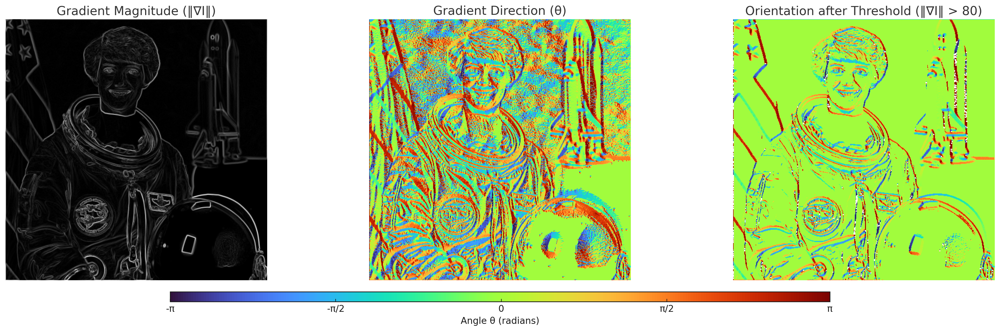
    <figcaption>그래디언트 크기, 방향, 크기를 Threshold로 방향 필터링</figcaption>
</figure>

<figure>
    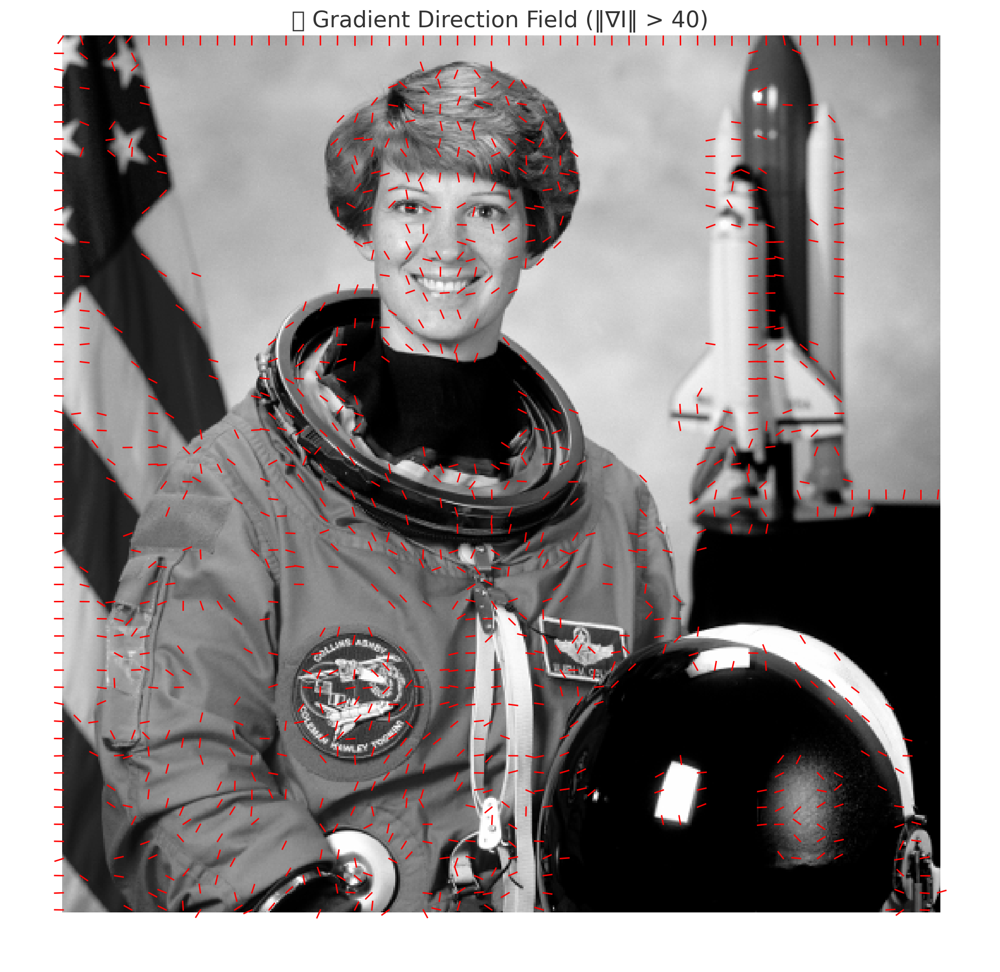
    <figcaption>그래디언트 필드 시각회</figcaption>
</figure>

##### Non-Maximum Suppression (NMS)
Non-Maximum Suppression (NMS)는 경계선 검출 과정에서 불필요한 픽셀을 제거하여 경계선을 더 얇고 명확하게 만드는 기법입니다. 이는 그래디언트 크기와 방향 정보를 활용하여 수행됩니다. NMS는 다음 단계를 따릅니다:

<figure>
     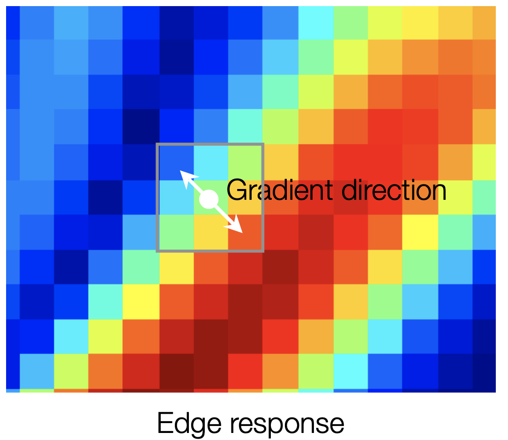
     <figcaption>Non-Maximum Suppression 적용 예시, 해당 픽셀은 local maximum이므로 살아남는다.(그라디언트에 직교하는 방향으로 비교해야함)</figcaption>
</figure>

1. **그래디언트 방향 계산**  
    각 픽셀의 그래디언트 방향을 기준으로 경계선이 가장 강한 방향을 결정합니다. 그래디언트 방향은 0°, 45°, 90°, 135°로 양자화됩니다.

2. **Local Maximum 비교**  
    현재 픽셀의 그래디언트 크기를 해당 그래디언트 방향과 직교하는(즉, 엣지의 방향) 픽셀과 비교합니다.  
    - 만약 현재 픽셀이 이웃 픽셀보다 크다면, 해당 픽셀은 유지됩니다.  
    - 그렇지 않다면, 해당 픽셀은 제거됩니다.
    - 0°, 45°, 90°, 135°로 양자화 하지 않고, 보간법을 이용해 해당 방법을 이용할 수 있습니다.

3. **결과 생성**  
    위 과정을 통해 얇고 명확한 경계선만 남게 됩니다.

<figure>
     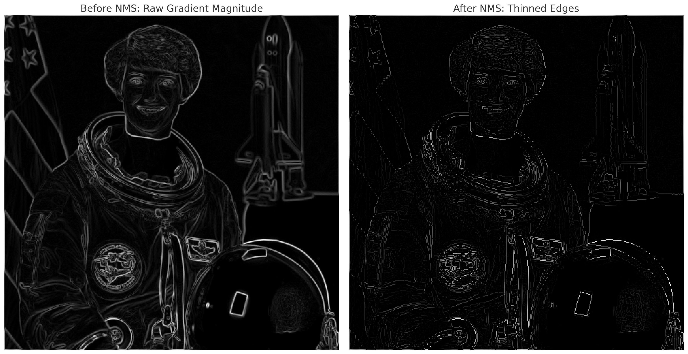
     <figcaption>Non-Maximum Suppression 적용 전후 비교</figcaption>
</figure>

##### Hysteresis Thresholding
균일한 Threshold를 사진 전체에 적용한다면, 한가지 기준으로 엣지가 판별됩니다.   
하지만 아래 사진과 같이 강한 엣지와 연결되어있는 엣지도 단일 Threshold로 인해 탐지가 되지 않는데요.  
<figure>
     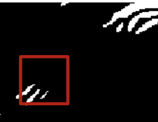
</figure>  

이를 보완하기 위해 Hysteresis Thresholding이라는 기법을 사용합니다.  
이 방법은 경계선 검출 과정에서 노이즈를 제거하고 연속적인 경계선을 유지하기 위해 두 개의 임계값 $ T_{high} $와 $ T_{low} $를 사용하여 경계선을 분류합니다. 다음은 Hysteresis Thresholding의 주요 단계입니다:

1. **강한 경계선 식별**  
    그래디언트 크기가 $ T_{high} $보다 큰 픽셀은 강한 경계선으로 간주됩니다. 이러한 픽셀은 항상 경계선으로 유지됩니다.

2. **약한 경계선 식별**  
    그래디언트 크기가 $ T_{low} $와 $ T_{high} $ 사이에 있는 픽셀은 약한 경계선으로 간주됩니다. 이러한 픽셀은 강한 경계선과 연결되어 있는 경우에만 경계선으로 유지됩니다.

3. **노이즈 제거**  
    그래디언트 크기가 $ T_{low} $보다 작은 픽셀은 노이즈로 간주되어 제거됩니다.

4. **결과 생성**  
    위 단계를 통해 연속적이고 명확한 경계선만 남게 됩니다.

<figure>
     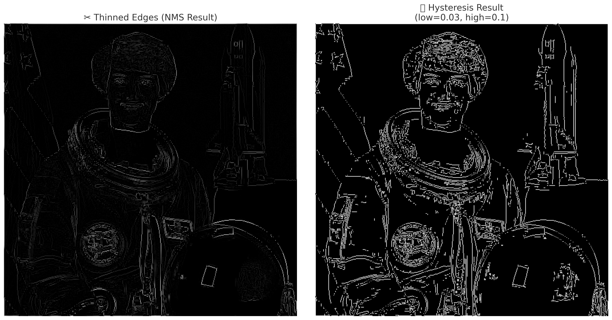
     <figcaption>Hysteresis Thresholding 적용 예시</figcaption>
</figure>

##### Canny Edge Detector
지금까지 살펴본 방법들을 모두 종합한 것이 Canny Edge Detector의 작동 방식입니다. 다시한번 그 단계를 살펴보겠습니다.  

1. **Gaussian Blur 적용**  
    이미지의 노이즈를 제거하기 위해 Gaussian Blur를 적용

2. **Gradient 계산**  
    Sobel 필터를 사용하여 이미지의 $ x $-축 및 $ y $-축 방향 그래디언트를 계산

3. **Non-Maximum Suppression (NMS)**  
    그래디언트 크기와 방향을 기반으로 경계선이 가장 강한 픽셀만 남기고 나머지는 제거

4. **Hysteresis Thresholding**  
    두 개의 임계값 $ T_{high} $와 $ T_{low} $를 사용하여 강한 경계선과 약한 경계선을 구분

5. **결과 생성**  
    위 단계를 통해 노이즈가 제거되고 연속적인 경계선만 남은 최종 결과를 생성합니다.

Canny Edge Detector는 이러한 단계를 통해 노이즈에 강하고, 연속적인 경계선을 효과적으로 검출할 수 있습니다. 아래는 Canny Edge Detector의 결과물을 시각화한 예시입니다:

<figure>
     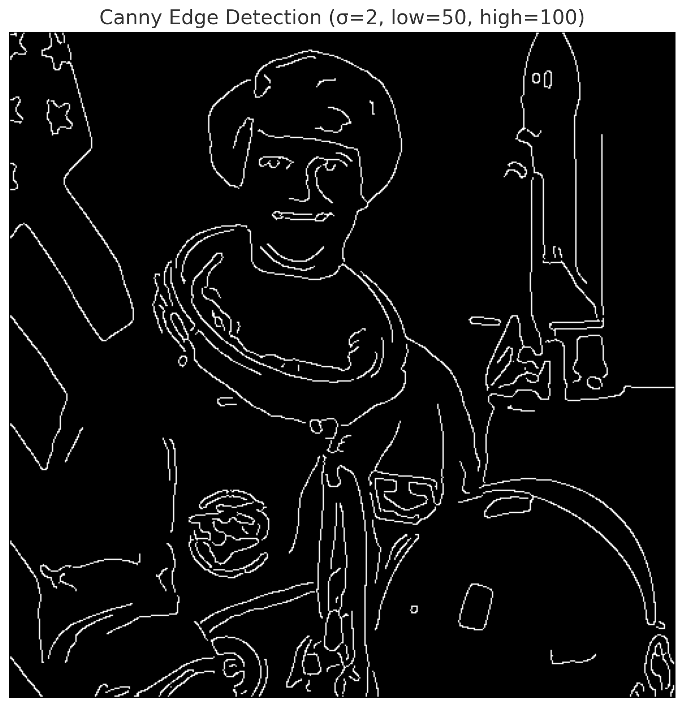
     <figcaption>Canny Edge Detector 적용사진</figcaption>
</figure>

`skimage` 모듈에서 제공하는 `canny` 인스턴스를 통해 Canny Edge Detector를 직접 적용해본 결과물입니다.  

---
해당 포스트는 서울대학교 컴퓨터공학부 주한별 교수님의 컴퓨터비전 25-1학기 강의를 정리한 내용입니다.