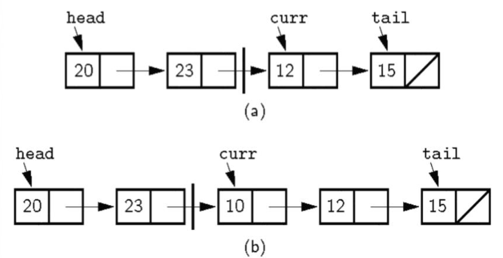

## List
- **리스트**: 순서가 있는 데이터의 집합.
  - 리스트의 원소는 **순서**가 있음.
- **표기**:
    - $<a_0, a_1, \ldots, a_{n-1}>$
- **Current Position**: 리스트에서 현재 원소를 가리키는 위치.
  - 현재 원소를 가리킴으로써 리스트의 원소에 접근하여 다양한 연산 및 작업을 수행.

### ADT
```java
public interface List<E> {
    public void clear(); // 리스트 초기화
    public void insert(E item); // 리스트의 현재 위치에 원소 삽입
    public void append(E item); // 리스트의 끝에 원소 삽입
    public E remove(); // 리스트의 현재 위치에 있는 원소 삭제
    public void moveToStart(); // 리스트의 첫 번째 원소로 이동
    public void moveToEnd(); // 리스트의 마지막 원소로 이동
    public void prev(); // 리스트의 현재 위치를 이전 원소로 이동
    public void next(); // 리스트의 현재 위치를 다음 원소로 이동
    public int length(); // 리스트의 길이 반환
    public int currPos(); // 리스트의 현재 위치 반환
    public void moveToPos(int pos); // 리스트의 현재 위치를 pos로 이동
    public E getValue(); // 리스트의 현재 위치에 있는 원소 반환
}
```
- **연산 종류**
  - `clear()`: 리스트 초기화
  - `insert(item)`: 리스트의 현재 위치에 원소 삽입
  - `append(item)`: 리스트의 끝에 원소 삽입
  - `remove()`: 리스트의 현재 위치에 있는 원소 삭제
  - `moveToStart()`: 리스트의 첫 번째 원소로 이동
  - `moveToEnd()`: 리스트의 마지막 원소로 이동
  - `prev()`: 리스트의 현재 위치를 이전 원소로 이동
  - `next()`: 리스트의 현재 위치를 다음 원소로 이동
  - `length()`: 리스트의 길이 반환
  - `currPos()`: 리스트의 현재 위치 반환
  - `moveToPos(pos)`: 리스트의 현재 위치를 pos로 이동
  - `getValue()`: 리스트의 현재 위치에 있는 원소 반환

- `find()`: 리스트에서 특정 원소가 존재하는지 확인하는 연산.   
  ```java
  public static boolean find(List<E> list, E item) {
      for (list.moveToStart(); list.currPos() < list.length(); list.next()) {
          if (list.getValue() == item) {
              return true;
          }
      }
      return false;
  }
  ```
#### Array-based List Implementation
```java
public class AList<E> implements List<E> {
    public static final int defaultSize = 10; // 기본 크기

    private int maxSize; // 최대 크기
    private int listSize; // 현재 크기
    private int curr; // 현재 위치
    private E[] listArray; // 리스트 배열

    Alist() {this(defaultSize); } // 기본 생성자
    Alist(int size) { // 크기 지정 생성자
        maxSize = size;
        listSize = curr = 0;
        listArray = (E[]) new Object[maxSize];
    }

    public void clear() { listSize = curr = 0; } // 리스트 초기화
    public void moveToStart() { curr = 0; } // 리스트의 첫 번째 원소로 이동
    public void moveToEnd() { curr = listSize; } // 리스트의 마지막으로 이동
    public void prev() { if (curr != 0) curr--; } // 리스트의 현재 위치를 이전 원소로 이동
    public void next() { if (curr < listSize) curr++; } // 리스트의 현재 위치를 다음 원소로 이동
    public int length() { return listSize; } // 리스트의 길이 반환
    public int currPos() { return curr; } // 리스트의 현재 위치 반환

    public void moveToPos(int pos) { // 리스트의 현재 위치를 pos로 이동
        assert (pos >= 0 && pos <= listSize) : "Position out of range";
        curr = pos;
    }

    public E getValue() { // 리스트의 현재 위치에 있는 원소 반환
        assert (curr >= 0 && curr < listSize) : "No current element";
        return listArray[curr];
    }

    public void insert(E item) { // 리스트의 현재 위치에 원소 삽입
        assert (listSize < maxSize) : "List is full";
        for (int i = listSize; i > curr; i--) {
            listArray[i] = listArray[i - 1];
        }
        listArray[curr] = item;
        listSize++;
    }

    public void append(E item) { // 리스트의 끝에 원소 삽입
        assert (listSize < maxSize) : "List is full";
        listArray[listSize++] = item;
    }

    public E remove() { // 리스트의 현재 위치에 있는 원소 삭제
        assert (curr >= 0 && curr < listSize) : "No current element";
        E item = listArray[curr];
        for (int i = curr; i < listSize - 1; i++) {
            listArray[i] = listArray[i + 1];
        }
        listSize--;
        return item;
    }
}
```
- **장점**: 
  - 인덱스를 사용하여 원소에 접근할 수 있어 빠른 검색 속도.
  - 메모리 할당이 연속적이므로 캐시 효율성이 높음.
  - `append()` 연산이 $O(1)$로 빠름.
  - 커서의 이동이 $O(1)$로 빠름.

- **단점**: 
  - 리스트의 크기를 미리 지정해야 하므로, 크기 초과 시 재할당이 필요함.
  - `find()`, `insert()`, `remove()` 연산이 $\Theta(n)$으로 느림.
  - 리스트의 크기를 미리 지정해야 하므로, 메모리 낭비가 발생할 수 있음.
  - `maxSize`가 `listSize`보다 매우 크다면, 메모리 낭비가 발생할 수 있음.
  
#### Linked List Implementation
리스트의 원소를 노드로 표현하고, 각 노드가 다음 노드를 가리키는 포인터를 사용하여 연결된 형태로 구현.

```java
class Link<E> {
    public E element; // 원소
    public Link<E> next; // 다음 노드

    public Link(E it, Link<E> nextval) { // 생성자
        element = it;
        next = nextval;
    }
    public Link(Link<E> nextval) { // 생성자
        next = nextval;
    }

    Link<E> next() { return next; } // 다음 노드 반환
    Link<E> setNext(Link<E> nextval) { return next = nextval; } // 다음 노드 설정
    E element() { return element; } // 원소 반환
    E setElement(E it) { return element = it; } // 원소 설정
}
```
Linked List에서 현재 위치(curr)에 새로운 원소를 삽입하고자 할 때, 다음과 같은 상황이 발생함:

- curr에 원소를 추가해야 함

- 하지만 연결 리스트는 단방향이기 때문에, curr 이전 노드를 찾기 어렵고 삽입 위치를 정확히 조절하려면 curr 포인터가 적절히 설정되어 있어야 함

- **Naive Method**

  - curr 포인터가 삽입하고 바로 그 위치를 가리킴

  - 삽입 시 새 노드를 현재 위치로 끼워 넣고, 연결을 조정함
  
  - 문제점: 
      - 새로 삽입된 원소가 curr 위치에 들어가고 기존 curr 위치의 데이터가 밀려나게 됨

      - 결국 원하는 위치 조작이 어렵고, 코드가 직관적이지 않음

- **Improved Method**

  - curr 포인터를 항상 "삽입할 위치의 앞 노드"를 가리키도록 유지
  - 삽입 시 curr 포인터가 가리키는 노드의 다음 노드에 새 노드를 연결하고, curr 포인터는 유지
  - 이를 위해 Head node는 항상 빈값으로 유지

```java
class LList<E> implements List<E> {
    private Link<E> head; // 헤드 노드
    private Link<E> tail; // 테일 노드
    protected Link<E> curr; // 현재 위치
    int cnt; // 리스트 크기

    LList(int size) { this(); } // 생성자
    LList() { // 기본 생성자
        curr = tail = head = new Link<E>(null); // 초기화
        cnt = 0; // 리스트 크기 초기화
    }

    public void clear() {
        curr = tail = head = new Link<E>(null); // 초기화
        cnt = 0; // 리스트 크기 초기화
    }

    public void moveToStart() { curr = head; } // 리스트의 첫 번째 원소로 이동
    public void moveToEnd() { curr = tail; } // 리스트의 마지막 원소로 이동
    public void length() { return cnt; } // 리스트의 길이 반환
    public void next() { // 리스트의 현재 위치를 다음 원소로 이동
        if (curr != tail) curr = curr.next(); // 다음 노드로 이동
    }
    
    public E getValue() { // 리스트의 현재 위치에 있는 원소 반환
        assert (curr != tail) : "No current element";
        return curr.element(); // 현재 노드의 원소 반환
    }
    
    public void insert(E item) { // 리스트의 현재 위치에 원소 삽입
        curr.setNext(new Link<E>(item, curr.next())); // 새 노드 생성 및 연결
        if (curr == tail) tail = curr.next(); // curr이 tail이면 tail 업데이트
        cnt++; // 리스트 크기 증가
    }
    
    public void append(E item) { // 리스트의 끝에 원소 삽입
        tail = tail.setNext(new Link<E>(item, null)); // 새 노드 생성 및 연결
        cnt++; // 리스트 크기 증가
    }
    
    public E remove() { // 리스트의 현재 위치에 있는 원소 삭제
        assert (curr != tail) : "No current element";
        E it = curr.next().element(); // 삭제할 원소 저장
        if (curr.next() == tail) { // curr이 tail이면 tail 업데이트
            tail = curr;
        }
        curr.setNext(curr.next().next()); // curr의 다음 노드 삭제
        cnt--; // 리스트 크기 감소
        return it; // 삭제한 원소 반환
    }
    
    public prev() { // 리스트의 현재 위치를 이전 원소로 이동
        if (curr == head) return; // curr이 head이면 이동 불가
        Link<E> temp = head; // 임시 노드 생성
        while (temp.next() != curr) { // curr의 이전 노드 찾기
            temp = temp.next();
        }
        curr = temp; // curr을 이전 노드로 이동
    }

    public int currPos() { // 리스트의 현재 위치 반환
        Link<E> temp = head; // 임시 노드 생성
        int i = 0; // 인덱스 초기화
        while (temp != curr) { // curr까지 이동
            temp = temp.next();
            i++;
        }
        return i; // 인덱스 반환
    }

    public void moveToPos(int pos) { // 리스트의 현재 위치를 pos로 이동
        assert (pos >= 0 && pos <= cnt) : "Position out of range";
        curr = head; // curr을 head로 초기화
        for (int i = 0; i < pos; i++) { // pos까지 이동
            curr = curr.next();
        }
    }
}
```
- **장점**: 
  - 크기를 미리 지정할 필요가 없음.
  - 삽입 및 삭제 연산이 $O(1)$로 빠름.
  - 메모리 낭비가 없음.
- **단점**: 
  - 인덱스를 사용하여 원소에 접근할 수 없어 검색 속도가 느림.
  - 메모리 할당이 비연속적이므로 캐시 효율성이 낮음.
  - 커서의 이동이 $O(n)$으로 느림.
  - 포인터를 사용하므로 메모리 오버헤드가 발생함.

##### Freelist
- 메모리 할당/해제 비용을 줄이기 위한 기법
- 삭제된 노드를 완전히 없애지 않고, 재사용하기 위해 따로 보관해두는 리스트
- 사용하는 이유
    - 자바에서 new와 garbage collection은 비교적 느림
    - insert와 remove를 자주 반복하면 많은 노드 생성/삭제 발생
    - 노드 삭제 시, 노드를 완전히 없애지 않고, 재사용하기 위해 따로 보관해두는 리스트를 사용
- 주의 사항
    - 노드의 재사용이란, 그 값을 재사용하는 것이 아니라, 노드의 메모리 주소를 재사용하는 것
  
```java
static Link freelist = null; // Freelist 초기화

static <E> Link<E> get(E it, Link<E> nextval) {
    if (freelist == null) { // Freelist가 비어있으면 새 노드 생성
        return new Link<E>(it, nextval); // 새 노드 생성
    }
    Link<E> temp = freelist; // Freelist에서 노드 가져오기
    freelist = freelist.next(); // Freelist에서 노드 삭제
    return temp; // 노드 반환
}

static void release() { // Freelist에 노드 추가
    element = null; // 원소 초기화
    next = freelist; // Freelist에 노드 추가
    freelist = this; // Freelist 업데이트
}

public void insert(E item) { // Freelist 활용한 삽입
    curr.setNext(get(item, curr.next())); // Freelist에서 노드 가져오기
    if (curr == tail) tail = curr.next(); // curr이 tail이면 tail 업데이트
    cnt++; // 리스트 크기 증가
}

public E remove() { // Freelist 활용한 삭제
    if (curr == tail) return null;
    E it = curr.next().element(); // 삭제할 원소 저장
    if (curr.next() == tail) { // curr이 tail이면 tail 업데이트
        tail = curr;
    }
    Link temp = curr.next(); // Freelist에 노드 추가
    curr.setNext(curr.next().next()); // curr의 다음 노드 삭제
    temp.release(); // Freelist에 노드 추가
    cnt--; // 리스트 크기 감소
    return it; // 삭제한 원소 반환
}
```

#### Compare Array-based List and Linked List
| Feature              | Array-based List | Linked List    |
| -------------------- | ---------------- | -------------- |
| insertion            | O(n)             | O(1)           |
| deletion             | O(n)             | O(1)           |
| access(prev/next)    | O(1)             | O(n)           |
| pre-allocated memory | Yes              | No             |
| memory overhead      | No               | Yes(pointers)  |
| memory allocation    | contiguous       | non-contiguous |

- **공간 비교**:  
    - Array-based List는 미리 List의 크기를 지정해야 하므로, 크기가 큰 경우 메모리 낭비가 발생할 수 있음.
    - Linked List는 포인터를 사용하므로, 각 노드마다 추가적인 메모리 공간이 필요함.
    - Break-even point: Array-based List와 Linked List의 메모리 사용량이 같아지는 지점. 이 지점을 기준으로 두 구현 방식을 선택할 수 있음.
    $$
    DE = n(P+E)\\
    n = \frac{DE}{P+E}
    $$
    - $D$: Array-based List의 최대 크기(초기화 시 지정한 크기)
    - $n$: Linked List의 노드 수(Linked List의 크기)
    - $E$: 데이터의 크기
    - $P$: 포인터의 크기
    - $DE$가 크면 Linked List가 유리하고, 작으면 Array-based List가 유리함.

### Doubly Linked List
- **Limitation of Linked List**: 
    - Linked List는 단방향으로만 연결되어 있어, 이전 노드로 이동하기 어려움.
    - 따라서, 이전 노드로 이동하는 연산이 O(n)으로 느림.
    - Linked List의 각 노드에 이전 노드를 가리키는 포인터를 추가하여, 양방향으로 연결된 리스트를 구현함.
    - Linked List에서 효율성을 위해 head를 더미 노드로 사용한 것과 유사하게, Doubly Linked List에서는 head뿐만 아니라 tail도 더미 노드로 사용함.

```java
class DLink<E> {
    public E element; // 원소
    public DLink<E> next; // 다음 노드
    public DLink<E> prev; // 이전 노드

    public DLink(E it, DLink<E> p, DLink<E> n) { // 생성자
        element = it;
        prev = p;
        next = n;
    }
    public DLink(DLink<E> p, DLink<E> n) { // 생성자
        prev = p;
        next = n;
    }
    DLink<E> next() { return next; } // 다음 노드 반환
    DLink<E> setNext(DLink<E> nextval) { return next = nextval; } // 다음 노드 설정
    DLink<E> prev() { return prev; } // 이전 노드 반환
    DLink<E> setPrev(DLink<E> prevval) { return prev = prevval; } // 이전 노드 설정
    E element() { return element; } // 원소 반환
    E setElement(E it) { return element = it; } // 원소 설정
}

public void insert(E item) { // 리스트의 현재 위치에 원소 삽입
    curr.setNext(new DLink<E>(item, curr, curr.next())); // 새 노드 생성 및 연결
    curr.next().next().setPrev(curr.next()); // curr의 다음 노드 설정
    cnt++; // 리스트 크기 증가
}

public void remove() { // 리스트의 현재 위치에 있는 원소 삭제
    if (curr == tail) return null;
    E it = curr.next().element(); // 삭제할 원소 저장
    curr.next().next().setPrev(curr); // curr의 다음 노드 삭제
    curr.setNext(curr.next().next()); // curr의 다음 노드 삭제
    cnt--; // 리스트 크기 감소
    return it; // 삭제한 원소 반환
}
```

- **장점**: 
  - 이전 노드로 이동하는 연산이 O(1)로 빠름.
  - 삽입 및 삭제 연산이 O(1)로 빠름.
  - 양방향으로 연결되어 있어, 양쪽 방향으로 탐색 가능함.
- **단점**: 
  - 포인터를 사용하므로 메모리 오버헤드가 발생함.
  - 각 노드에 두 개의 포인터가 필요하므로, 메모리 사용량이 증가함.
  - 구현이 복잡해짐.

- **Dummy Head & Tail**: 
  - Doubly Linked List에서 head와 tail을 더미 노드로 사용하여, 리스트의 시작과 끝을 쉽게 처리할 수 있도록 함.
  - **비교**  
  ```java
    // Dummy Tail이 없을 때 삽입
    public void insert(E item) { // 리스트의 현재 위치에 원소 삽입
        curr.setNext(new DLink<E>(item, curr, curr.next())); // 새 노드 생성 및 연결
        if (curr.next().next() != null) {
            curr.next().next().setPrev(curr.next()); // curr의 다음 노드 설정
        }
        if (curr == tail) {
            tail = curr.next(); // curr이 tail이면 tail 업데이트
        }
        cnt++; // 리스트 크기 증가
    }

    // Dummy Tail이 없을 때 삭제
    public E remove() { // 리스트의 현재 위치에 있는 원소 삭제
        if (curr == tail) return null;
        E it = curr.next().element(); // 삭제할 원소 저장
        if (curr.next() == tail) { // curr이 tail이면 tail 업데이트
            tail = curr;
        }
        if (curr.next().next() != null) {
            curr.next().next().setPrev(curr); // curr의 다음 노드 삭제
        }
        curr.setNext(curr.next().next()); // curr의 다음 노드 삭제
        cnt--; // 리스트 크기 감소
        return it; // 삭제한 원소 반환
    }
    ```
    - Dummy Tail을 사용하면, 리스트의 끝에 노드를 삽입하거나 삭제할 때, 조건 확인이나 tail 포인터를 업데이트하는 작업이 필요 없음.

## Stack
- **스택**: Last In First Out(LIFO) 방식으로 데이터를 저장하는 자료구조.
  - 가장 나중에 들어온 데이터가 가장 먼저 나감.
  - 스택의 맨 위에 있는 원소만 접근 가능함.
  - 스택의 크기는 동적으로 변할 수 있음.

### ADT
```java
public interface Stack<E> {
    public void clear(); // 스택 초기화
    public void push(E item); // 스택에 원소 삽입
    public E pop(); // 스택에서 원소 삭제
    public E topValue(); // 스택의 맨 위 원소 반환
    public int length(); // 스택의 길이 반환
}
```
- **연산 종류**
  - `clear()`: 스택 초기화
  - `push(item)`: 스택에 원소 삽입
  - `pop()`: 스택에서 원소 삭제
  - `topValue()`: 스택의 맨 위 원소 반환
  - `length()`: 스택의 길이 반환

### Stack Implementation
#### Array-based Stack Implementation
```java
public class ArrayStack<E> implements Stack<E> {
    private int maxSize; // 최대 크기
    private int stackSize; // 현재 크기
    private E[] stackArray; // 스택 배열

    ArrayStack(int size) { // 크기 지정 생성자
        maxSize = size;
        stackSize = 0;
        stackArray = (E[]) new Object[maxSize];
    }

    public void clear() { stackSize = 0; } // 스택 초기화
    public void push(E item) { // 스택에 원소 삽입
        assert (stackSize < maxSize) : "Stack is full";
        stackArray[stackSize++] = item;
    }
    public E pop() { // 스택에서 원소 삭제
        assert (stackSize > 0) : "Stack is empty";
        return stackArray[--stackSize];
    }
    public E topValue() { // 스택의 맨 위 원소 반환
        assert (stackSize > 0) : "Stack is empty";
        return stackArray[stackSize - 1];
    }
    public int length() { return stackSize; } // 스택의 길이 반환
}
```
- **장점**: 
  - 인덱스를 사용하여 원소에 접근할 수 있어 빠른 검색 속도.
  - 메모리 할당이 연속적이므로 캐시 효율성이 높음.
  - `push()`와 `pop()` 연산이 $O(1)$로 빠름.
- **단점**: 
  - 스택의 크기를 미리 지정해야 하므로, 크기 초과 시 재할당이 필요함.
  - 스택의 크기를 미리 지정해야 하므로, 메모리 낭비가 발생할 수 있음.
  - `maxSize`가 `stackSize`보다 매우 크다면, 메모리 낭비가 발생할 수 있음.

#### Linked Stack Implementation
```java
public class LinkedStack<E> implements Stack<E> {
    private Link<E> top; // 스택의 맨 위 노드
    private int stackSize; // 현재 크기

    LinkedStack() { // 기본 생성자
        top = null; // 스택 초기화
        stackSize = 0; // 스택 크기 초기화
    }

    public void clear() { top = null; stackSize = 0; } // 스택 초기화
    public void push(E item) { // 스택에 원소 삽입
        top = new Link<E>(item, top); // 새 노드 생성 및 연결
        stackSize++; // 스택 크기 증가
    }
    public E pop() { // 스택에서 원소 삭제
        assert (stackSize > 0) : "Stack is empty";
        E it = top.element(); // 삭제할 원소 저장
        top = top.next(); // 맨 위 노드 삭제
        stackSize--; // 스택 크기 감소
        return it; // 삭제한 원소 반환
    }
    public E topValue() { // 스택의 맨 위 원소 반환
        assert (stackSize > 0) : "Stack is empty";
        return top.element(); // 맨 위 노드의 원소 반환
    }
    public int length() { return stackSize; } // 스택의 길이 반환
}
```
- **장점**: 
  - 크기를 미리 지정할 필요가 없어 메모리 낭비가 없음.
  - 삽입 및 삭제 연산이 $O(1)$로 빠름.

- **단점**: 
  - 인덱스를 사용하여 원소에 접근할 수 없어 검색 속도가 느림.
  - 메모리 할당이 비연속적이므로 캐시 효율성이 낮음.
  - 포인터를 사용하므로 메모리 오버헤드가 발생함.

## Queue
- **큐**: First In First Out(FIFO) 방식으로 데이터를 저장하는 자료구조.
  - 가장 먼저 들어온 데이터가 가장 먼저 나감.
  - 큐의 맨 앞과 맨 뒤에 있는 원소만 접근 가능함.
  - 큐의 크기는 동적으로 변할 수 있음.

### ADT
```java
public interface Queue<E> {
    public void clear(); // 큐 초기화
    public void enqueue(E item); // 큐에 원소 삽입
    public E dequeue(); // 큐에서 원소 삭제
    public E frontValue(); // 큐의 맨 앞 원소 반환
    public E rearValue(); // 큐의 맨 뒤 원소 반환
    public int length(); // 큐의 길이 반환
}
```
- **연산 종류**
  - `clear()`: 큐 초기화
  - `enqueue(item)`: 큐에 원소 삽입
  - `dequeue()`: 큐에서 원소 삭제
  - `frontValue()`: 큐의 맨 앞 원소 반환
  - `rearValue()`: 큐의 맨 뒤 원소 반환
  - `length()`: 큐의 길이 반환

### Queue Implementation
#### Array-based Queue Implementation
```java
public class ArrayQueue<E> implements Queue<E> {
    private int maxSize; // 최대 크기
    private int queueSize; // 현재 크기
    private int front; // 큐의 맨 앞 인덱스
    private int rear; // 큐의 맨 뒤 인덱스
    private E[] queueArray; // 큐 배열

    ArrayQueue(int size) { // 크기 지정 생성자
        maxSize = size;
        queueSize = front = rear = 0;
        queueArray = (E[]) new Object[maxSize];
    }

    public void clear() { queueSize = front = rear = 0; } // 큐 초기화
    public void enqueue(E item) { // 큐에 원소 삽입
        assert (queueSize < maxSize) : "Queue is full";
        queueArray[rear] = item; // 원소 삽입
        rear = (rear + 1) % maxSize; // rear 인덱스 업데이트
        queueSize++; // 큐 크기 증가
    }
    public E dequeue() { // 큐에서 원소 삭제
        assert (queueSize > 0) : "Queue is empty";
        E it = queueArray[front]; // 삭제할 원소 저장
        front = (front + 1) % maxSize; // front 인덱스 업데이트
        queueSize--; // 큐 크기 감소
        return it; // 삭제한 원소 반환
    }

    public E frontValue() { // 큐의 맨 앞 원소 반환
        assert (queueSize > 0) : "Queue is empty";
        return queueArray[front]; // 맨 앞 원소 반환
    }
    public E rearValue() { // 큐의 맨 뒤 원소 반환
        assert (queueSize > 0) : "Queue is empty";
        return queueArray[(rear - 1 + maxSize) % maxSize]; // 맨 뒤 원소 반환
    }

    public int length() { return queueSize; } // 큐의 길이 반환
}
```
- **장점**: 
  - 인덱스를 사용하여 원소에 접근할 수 있어 빠른 검색 속도.
  - 메모리 할당이 연속적이므로 캐시 효율성이 높음.
  - `enqueue()`와 `dequeue()` 연산이 $O(1)$로 빠름.
- **단점**: 
  - 큐의 크기를 미리 지정해야 하므로, 크기 초과 시 재할당이 필요함.
  - 큐의 크기를 미리 지정해야 하므로, 메모리 낭비가 발생할 수 있음.
  - `maxSize`가 `queueSize`보다 매우 크다면, 메모리 낭비가 발생할 수 있음.
  - front와 rear 인덱스의 위치를 관리해야 하므로, 구현이 복잡해짐.

#### Linked Queue Implementation
```java
public class LinkedQueue<E> implements Queue<E> {
    private Link<E> front; // 큐의 맨 앞 노드
    private Link<E> rear; // 큐의 맨 뒤 노드
    private int queueSize; // 현재 크기

    LinkedQueue() { // 기본 생성자
        front = rear = null; // 큐 초기화
        queueSize = 0; // 큐 크기 초기화
    }

    public void clear() { front = rear = null; queueSize = 0; } // 큐 초기화

    public void enqueue(E item) { // 큐에 원소 삽입
        Link<E> newNode = new Link<E>(item, null); // 새 노드 생성
        if (rear != null) { // 큐가 비어있지 않으면
            rear.setNext(newNode); // rear의 다음 노드 설정
        }
        rear = newNode; // rear 업데이트
        if (front == null) { // 큐가 비어있으면
            front = newNode; // front 업데이트
        }
        queueSize++; // 큐 크기 증가
    }

    public E dequeue() { // 큐에서 원소 삭제
        assert (queueSize > 0) : "Queue is empty";
        E it = front.element(); // 삭제할 원소 저장
        front = front.next(); // 맨 앞 노드 삭제
        if (front == null) { // 큐가 비어있으면
            rear = null; // rear도 null로 설정
        }
        queueSize--; // 큐 크기 감소
        return it; // 삭제한 원소 반환
    }

    public E frontValue() { // 큐의 맨 앞 원소 반환
        assert (queueSize > 0) : "Queue is empty";
        return front.element(); // 맨 앞 원소 반환
    }
    public E rearValue() { // 큐의 맨 뒤 원소 반환
        assert (queueSize > 0) : "Queue is empty";
        return rear.element(); // 맨 뒤 원소 반환
    }
    public int length() { return queueSize; } // 큐의 길이 반환
}
```
- **장점**: 
  - 크기를 미리 지정할 필요가 없어 메모리 낭비가 없음.
  - 삽입 및 삭제 연산이 $O(1)$로 빠름.
- **단점**: 
  - 인덱스를 사용하여 원소에 접근할 수 없어 검색 속도가 느림.
  - 메모리 할당이 비연속적이므로 캐시 효율성이 낮음.
  - 포인터를 사용하므로 메모리 오버헤드가 발생함.

## Dictionary
- **사전**: 키와 값의 쌍으로 이루어진 자료구조.
  - 키를 사용하여 빠르게 값에 접근 가능
  - 각 레코드에 따라서 키로 사용되는 맥락이 다를 수 있음
  - 따라서 원하는 작업을 위해서 레코드에 따라 키를 설정하여 사용함

### ADT
```java
public interface Dictionary<Key, E> {
    public void clear(); // 사전 초기화
    public void insert(Key K, E e); // 사전에 원소 삽입
    public E remove(Key K); // 사전에서 원소 삭제
    public E removeAny(); // 사전에서 아무 원소 삭제
    public E find(Key K); // 사전에서 원소 검색
    public int length(); // 사전의 길이 반환
}
```
- **연산 종류**
  - `clear()`: 사전 초기화
  - `insert(K, e)`: 사전에 원소 삽입
  - `remove(K)`: 사전에서 원소 삭제
  - `removeAny()`: 사전에서 아무 원소 삭제
  - `find(K)`: 사전에서 원소 검색
  - `length()`: 사전의 길이 반환

### Dictionary Implementation
#### Unsorted Array List Dictionary Implementation
```java
public class UALdictionary<Key, E> implements Dictionary<Key, E> {
    public static final int defaultSize = 10;
    private ArrayList<KVpair<Key, E>> list; // 내부 리스트

    public UALdictionary() { // 기본 생성자
        this(defaultSize); // 기본 크기로 초기화
    }
    public UALdictionary(int size) { // 크기 지정 생성자
        list = new AList<KVpair<Key, E>>(size); // 리스트 초기화
    }

    public void clear() { list.clear(); } // 사전 초기화

    public void insert(Key K, E e) { // 사전에 원소 삽입
        KVpair<Key, E> tmp = new KVpair<Key, E>(K, e); // 키-값 쌍 생성
        list.append(tmp); // 리스트에 추가
    }

    public E remove(Key K) { // 사전에서 원소 삭제
        for (int i = 0; i < list.size(); i++) {
            if (list.get(i).key().equals(K)) {
                return list.remove(i).value(); // 키가 일치하는 원소 삭제 및 반환
            }
        }
        return null; // 키가 없으면 null 반환
    }

    public E removeAny() { // 사전에서 아무 원소 삭제
        if (list.size() > 0) {
            return list.remove(list.size() - 1).value(); // 마지막 원소 삭제 및 반환
        }
        return null; // 사전이 비어있으면 null 반환
    }

    public E find(Key K) { // 사전에서 원소 검색
        for (KVpair<Key, E> pair : list) {
            if (pair.key().equals(K)) {
                return pair.value(); // 키가 일치하는 값 반환
            }
        }
        return null; // 키가 없으면 null 반환
    }

    public int length() { return list.size(); } // 사전의 길이 반환
}

class KVpair<Key, E> { // 키-값 쌍 클래스
    private Key k; // 키
    private E v; // 값

    public KVpair(Key key, E value) { // 생성자
        k = key;
        v = value;
    }

    public Key key() { return k; } // 키 반환
    public E value() { return v; } // 값 반환
}
```

#### 사용예시(Payroll Class)
```java
class Payroll {
    private Integer id; // 직원 ID
    private String name; // 직원 이름
    private String address; // 직원 주소

    Payroll(int inID, String inName, String inAdd) { // 생성자
        id = inID;
        name = inName;
        address = inAdd;
    }

    public Integer getID() { return id; } // ID 반환
    public String getName() { return name; } // 이름 반환
    public String getAddress() { return address; } // 주소 반환
}
```
```java
Dictionary<Integer, Payroll> IDdict = new UALdictionary<Integer, Payroll>(); // 사전 생성

Dictionary<String, Payroll> namedict = new UALdictionary<String, Payroll>(); // 사전 생성

Payroll p1 = new Payroll(1001, "John Doe", "123 Main St");
Payroll p2 = new Payroll(1002, "Jane Smith", "456 Elm St");

IDdict.insert(p1.getID(), p1); // 사전에 원소 삽입
IDdict.insert(p2.getID(), p2); // 사전에 원소 삽입
namedict.insert(p1.getName(), p1); // 사전에 원소 삽입
namedict.insert(p2.getName(), p2); // 사전에 원소 삽입
Payroll findp1 = IDdict.find(1001); // 사전에서 원소 검색
Payroll findp2 = namedict.find("Jane Smith"); // 사전에서 원소 검색
```

#### Sorted Array List Dictionary Implementation
```java
public class SALdictionary<Key, E> implements Dictionary<Key, E> {
    public static final int defaultSize = 10;
    private AList<KVpair<Key, E>> list; // 내부 리스트

    public SALdictionary() { // 기본 생성자
        this(defaultSize); // 기본 크기로 초기화
    }
    public SALdictionary(int size) { // 크기 지정 생성자
        list = new AList<KVpair<Key, E>>(size); // 리스트 초기화
    }

    public void clear() { list.clear(); } // 사전 초기화

    public void insert(Key K, E e) { // 사전에 원소 삽입
        KVpair<Key, E> tmp = new KVpair<Key, E>(K, e); // 키-값 쌍 생성
        int i = 0;
        while (i < list.size() && list.get(i).key().compareTo(K) < 0) {
            i++; // 정렬된 위치 찾기
        }
        list.insert(i, tmp); // 리스트에 추가
    }
    public E remove(Key K) { // 사전에서 원소 삭제
        for (int i = 0; i < list.size(); i++) {
            if (list.get(i).key().equals(K)) {
                return list.remove(i).value(); // 키가 일치하는 원소 삭제 및 반환
            }
        }
        return null; // 키가 없으면 null 반환
    }

    public E removeAny() { // 사전에서 아무 원소 삭제
        if (list.size() > 0) {
            return list.remove(list.size() - 1).value(); // 마지막 원소 삭제 및 반환
        }
        return null; // 사전이 비어있으면 null 반환
    }
    public E find(Key K) { // 사전에서 원소 검색
        for (KVpair<Key, E> pair : list) {
            if (pair.key().equals(K)) {
                return pair.value(); // 키가 일치하는 값 반환
            }
        }
        return null; // 키가 없으면 null 반환
    }
    public int length() { return list.size(); } // 사전의 길이 반환
}
```

- **비교**  
  
| Feature   | Unsorted Array List Dictionary | Sorted Array List Dictionary |
| --------- | ------------------------------ | ---------------------------- |
| insertion | O(1)                           | O(n)                         |
| deletion  | O(n)                           | O(n)                         |
| search    | O(n)                           | O(log n)                     |
| memory    | O(n)                           | O(n)                         |

- Unsorted Array List Dictionary는 삽입이 빠름.
- Sorted Array List Dictionary는 검색이 빠름.
- 따라서, 검색이 자주 일어나는 경우 Sorted Array List Dictionary를 사용하고, 삽입이 자주 일어나는 경우 Unsorted Array List Dictionary를 사용하는 것이 좋음.


---
해당 포스트는 서울대학교 컴퓨터공학부 강유 교수님의 자료구조 25-1학기 강의를 정리한 내용입니다.