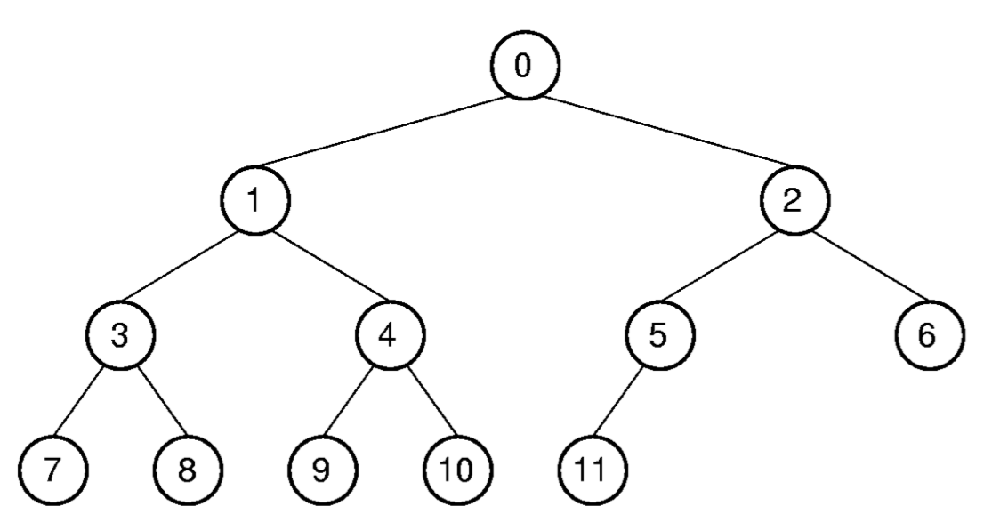

## Binary Tree
- **정의**  
    이진 트리(Binary Tree)는 각 노드가 최대 두 개의 자식을 가지는 계층적 자료구조.  
- **Notations**  
  - Node: 데이터를 저장하는 기본 단위
  - Edge: 노드 간의 연결을 나타내는 선
  - Child: 어떤 노드의 자식 노드
  - Parent: 어떤 노드의 부모 노드
  - Ancestor: 어떤 노드의 조상 노드
  - Descendant: 어떤 노드의 자손 노드
  - Path: 노드 간의 연결 경로
  - Depth: 노드의 깊이
  - Height: 트리의 높이
  - Level: 노드의 레벨
  - Root: 트리의 최상위 노드
  - Leaf: 자식 노드가 없는 최하단 노드
  - Internal Node: 자식 노드가 있는 노드
  - Subtree: 트리의 일부로서 루트 노드와 그 자식 노드들로 구성된 부분 트리

### Full Binary Tree
- **정의**  
    모든 노드가 0개 또는 2개의 자식을 가지는 이진 트리.

#### Full Binary Tree Theorem
비어있지 않은 Full Binary Tree의 Leaf Node의 개수는 `Internal Node의 개수` + 1이다.
  - **증명(수학적 귀납법)**  
    - Base Case: Internal Node가 1개일때, Leaf Node는 2개이다.
    - Induction Hypothesis: 어떤 Full Binary Tree의 Internal Node가 $n-1$개일때, Leaf Node는 $n$개이다.
    - Inductive Step:  
      - $T$가 $n$개의 Internal Node를 갖는 Full Binary Tree라고 가정하자.
      - $T$의 노드 중 자식 노드가 두개인 노드를 선택하여 해당 노드의 자식 노드를 제거하면
        - $T$는 정의에 따라 여전히 Full Binary Tree이고, $n-1$개의 Internal Node를 갖게된다.
        - 따라서 Induction Hypothesis에 의해 Leaf Node는 $n$개가 된다.
      - 이제 $T$에 다시 자식 노드를 2개 추가하면
        - $T$는 다시 Full Binary Tree가 되고, Internal Node는 $n+1$개가 된다.
        - 따라서 Leaf Node는 $n+1$개가 된다.
      - 따라서 Full Binary Tree $T$의 Internal Node의 개수는 $n$일때 Leaf Node의 개수는 $n+1$개이다.
  - **파생 정리**  
    - 비어있지 않은 Binary Tree의 null pointer의 개수는 전체 노드의 개수 - 1이다.
      - 만약 Null pointer를 leaf node로 간주한다면, 해당 트리는 Full Binary Tree가 되고, 모든 노드는 Internal Node가 된다.
      - 따라서 위의 정리에 따라 null pointer의 개수는 전체 노드의 개수 - 1이 된다.

### ADT for Binary Tree Node

```java
public interface BineNode<E> {
    public E element(); // 노드의 데이터 반환
    public E setElement(E e); // 노드의 데이터 설정

    public BineNode<E> left(); // 왼쪽 자식 노드 반환
    public BineNode<E> right(); // 오른쪽 자식 노드 반환

    public boolean isLeaf(); // 자식 노드가 없는지 확인
}
```
### Traversal
- **정의**  
    트리의 모든 노드를 방문하는 과정.

#### Preorder Traversal
- **정의**  
    루트를 방문하고 왼쪽 서브트리를 방문한 후 오른쪽 서브트리를 방문하는 방법.

- **순서**
  1. Root Node 방문
  2. Left Subtree 방문
  3. Right Subtree 방문
  
- **예시**
  ```mathematica
          A
         / \
        B   C
      / \
     D   E
  ```
  방문 순서: A, B, D, E, C

#### Postorder Traversal
- **정의**  
    왼쪽 서브트리를 방문한 후 오른쪽 서브트리를 방문하고 마지막으로 루트를 방문하는 방법.

- **순서**
  1. Left Subtree 방문
  2. Right Subtree 방문
  3. Root Node 방문
   
- **예시**
  ```mathematica
          A
         / \
        B   C
      / \
     D   E
  ```
  방문 순서: D, E, B, C, A

- **사용 사례**
  - 계산기 구현
    - 수식을 Postorder Traversal을 사용하여 계산할 수 있다.
    - 예를 들어, `A + B * C`는 `A B C * +`로 표현.

#### Inorder Traversal
- **정의**  
    왼쪽 서브트리를 방문한 후 루트를 방문하고 마지막으로 오른쪽 서브트리를 방문하는 방법.

- **순서**
  1. Left Subtree 방문
  2. Root Node 방문
  3. Right Subtree 방문

- **예시**
  ```mathematica
          A
         / \
        B   C
      / \
     D   E
  ```
  방문 순서: D, B, E, A, C


#### Implemeting Traversals
```java
public void preorder(BinNode rt) {
    if (rt == null) return;
    visit(rt);
    preorder(rt.left());
    preorder(rt.right());
}

public void postorder(BinNode rt) {
    if (rt == null) return;
    postorder(rt.left());
    postorder(rt.right());
    visit(rt);
}

public void inorder(BinNode rt) {
    if (rt == null) return;
    inorder(rt.left());
    visit(rt);
    inorder(rt.right());
}
```

### Binary Tree Implementation
- **Recusion**
  ```java
  int count(BinNode rt) {
      if (rt == null) return 0;
      return 1 + count(rt.left()) + count(rt.right());
  }
  ```
  - 이진 트리의 노드 개수를 세는 방법.
  - 왼쪽 서브트리와 오른쪽 서브트리의 노드 개수를 재귀적으로 세고, 1(루트 노드)을 더하여 반환.

#### Two ways of implementing Binary Tree
1. Single Node Implementation
    - Leaf Node와 Internal Node를 구분하지 않고, 모든 노드를 동일하게 처리하는 방법.
    - Leaf Node의 자식 노드는 null로 설정.

2. Two Node Implementation
    - Leaf Node와 Internal Node를 구분하여 처리하는 방법.
    - Leaf Node를 예외처리하여 자식 노드를 null로 설정하지 않음.

- **예시(계산기 구현)**  

```java
public interface VarBinNode {
  public boolean isLeaf(); // 자식 노드가 없는지 확인
}

class VarLeafNode implements VarBinNode {
  private Sting operand;
  public VarLeafNode(String val) {
    operand = val;
  }
  public boolean isLeaf() { return true; }
  public String value() { return operand; }
}

class VarIntNode implements VarBinNode {
  private VarBinNode left, right;
  private Character operator;

  public VarIntNode(String op, VarBinNode l, VarBinNode r) {
    operator = op;
    left = l;
    right = r;
  }

  public boolean isLeaf() { return false; }
  public String operator() { return operator; }
  public VarBinNode left() { return left; }
  public VarBinNode right() { return right; }
}

public static void traverse(VarBinNode rt) {
    if (rt == null) return;
    if (rt.isLeaf()) {
        VisitLeafNode(((VarLeafNode) rt).value());
    } else {
        traverse(((VarIntNode) rt).left());
        VisitInternalNode(((VarIntNode) rt).operator());
        traverse(((VarIntNode) rt).right());
    }
}
```  

##### Comparison
- Single Node Implementation
  - 장점: 구현이 간단하고, 코드가 짧음.
  - 단점: Leaf Node와 Internal Node를 구분하지 않기 때문에, Leaf Node의 자식 노드를 null로 설정해야 함(메모리 오버헤드 발생).

- Two Node Implementation
  - 장점: Leaf Node와 Internal Node를 구분하여 처리하기 때문에, Leaf Node의 자식 노드를 null로 설정하지 않음(메모리 오버헤드 감소).
  - 단점: 구현이 복잡하고, 코드가 길어짐.

- Space Overhead = (non data space(pointer space)) / (data space)
  - Full Binary Tree Theorem에 의해, Single Node Implementation의 경우
    - Space Overhead = 1 / 2 (null pointer의 개수는 전체 노드의 개수의 절반)
  - 만약 Leaf Node가 데이터 저장에만 사용된다면, 오버헤드는 tree가 얼마나 채워졌는지에 따라 달라진다.

- **예시**
  - 가정: Full Binary Tree, 모든 노드는 2개의 포인터와 1개의 데이터 저장 공간을 가짐.
    - $p$ = 포인터의 크기, $d$ = 데이터의 크기, $n$ = 노드의 개수일때
    - (총 요구되는 메모리) = $(3p + d) * n$   
      각 자식 노드에 2개의 포인터와 1개의 데이터 포인터, 하나의 데이터 저장 공간
    - (포인터 메모리) = $3pn$
    - (오버헤드) = $3pn / (3pn + d) \approx 3/4$ ($p$와 $d$가 유사하면)
  - Two Node Implementation
    - (총 요구되는 메모리) = $(\frac{n}{2}) 2p + np + nd$
      - Internal Node만 자식 노드를 위한 포인터를 가짐 : $(\frac{n}{2}) 2p$
      - 모든 노드는 데이터 저장 공간과 포인터를 가짐 : $np + nd$
    - (포인터 메모리) = $np + \frac{n}{2}p$
    - (오버헤드) = $(np + \frac{n}{2}p) / (np + \frac{n}{2}p + nd) \approx 2/3$ ($p$와 $d$가 유사하면)
      - 오버헤드가 줄어듦.

### Binary Search Tree
- **정의**  
    이진 탐색 트리(Binary Search Tree)는 이진 트리의 일종으로, 각 노드의 왼쪽 서브트리에는 해당 노드보다 작은 값이 저장되고, 오른쪽 서브트리에는 해당 노드보다 큰 값이 저장되는 트리.  
    (따라서 Inorder Traversal을 수행하면 오름차순으로 정렬된 값을 얻을 수 있다.)


#### ADT for Binary Search Tree
```java
class BSTNode<K, E> implements BinNode<E> {
    private K key; // 키 값
    private E element; // 데이터 값
    private BSTNode<K, E> left; // 왼쪽 자식 노드
    private BSTNode<K, E> right; // 오른쪽 자식 노드

    public BSTNode() { left = right = null; }

    public BSTNode(K k, E e) {
        key = k;
        element = e;
        left = null;
        right = null;
    }

    public BSTNode(K k, E e, BSTNode<K, E> l, BSTNode<K, E> r) {
        key = k;
        element = e;
        left = l;
        right = r;
    }

    public K key() { return key; }
    public setKey(K k) { key = k; }

    public E element() { return element; }
    public setElement(E e) { element = e; }

    public BSTNode<K, E> left() { return left; }
    public BSTNode<K, E> setLeft(BSTNode<K, E> l) { left = l; }

    public BSTNode<K, E> right() { return right; }
    public BSTNode<K, E> setRight(BSTNode<K, E> r) { right = r; }
    public boolean isLeaf() { return (left == null && right == null); }
}
```

##### ADT for BST implementation for Dictionary
```java
public BST<K, E> implemets Dictionary<K, E> {
    private BSTNode<K, E> root; // 루트 노드
    private int size; // 트리의 크기

    public BST() { root = null; size = 0; }

    public void clear() { root = null; size = 0; }

    public void insert(K k, E e) {
        root = inserthelp(root, k, e);
        size++;
    }

    public E remove(K k) {
        E tmp = findhelp(root, k);
        if (tmp != null) {
            root = removehelp(root, k);
            size--;
        }
        return tmp;
    }

    public E find(K k) { return findhelp(root, k); } // 키에 해당하는 데이터 반환

    public E removeAny() {
        if (root != null) {
            E tmp = root.element();
            root = removehelp(root, root.key());
            size--;
            return tmp;
        }
        return null;
    }

    public int size() { return size; }
}
```

##### Checking BST
```java
boolean checkBST(BSTNode<K, E> rt, Integer low, Integer high) {
    if (rt == null) return true;
    Integer rootKey = rt.key();
    if (rootKey < low || rootKey > high) return false;
    if (!checkBST(rt.left(), low, rootKey-1)) return false;
    return checkBST(rt.right(), rootKey, high);
}
```
- **과정**
  ```mathematica
           10  
          /  \
         5    15
        / \   / \
      3   7  12 20
  ```
  - `checkBST(10, Integer.MIN_VALUE, Integer.MAX_VALUE)` 
    - 10은 범위에 포함됨
    - 왼쪽 서브트리 확인: `checkBST(5, Integer.MIN_VALUE, 9)`
      - 5는 범위에 포함됨
      - 왼쪽 서브트리 확인: `checkBST(3, Integer.MIN_VALUE, 4)`
        - 3은 범위에 포함됨
        - 왼쪽 서브트리 확인: `checkBST(null, Integer.MIN_VALUE, 2)` (null)
          - true 반환
        - 오른쪽 서브트리 확인: `checkBST(null, 3, 4)` (null)
          - true 반환
        - true 반환
      - 오른쪽 서브트리 확인: `checkBST(7, 5, 9)`
        - 7은 범위에 포함됨
        - 왼쪽 서브트리 확인: `checkBST(null, 5, 6)` (null)
          - true 반환
        - 오른쪽 서브트리 확인: `checkBST(null, 7, 9)` (null)
          - true 반환
        - true 반환
      - true 반환
    - 오른쪽 서브트리 확인: `checkBST(15, 10, Integer.MAX_VALUE)`
      - 15는 범위에 포함됨
      - 왼쪽 서브트리 확인: `checkBST(12, 10, 14)`
        - 12는 범위에 포함됨
        - 왼쪽 서브트리 확인: `checkBST(null, 10, 11)` (null)
          - true 반환
        - 오른쪽 서브트리 확인: `checkBST(null, 12, 14)` (null)
          - true 반환
        - true 반환
      - 오른쪽 서브트리 확인: `checkBST(20, 15, Integer.MAX_VALUE)`
        - 20은 범위에 포함됨
        - 왼쪽 서브트리 확인: `checkBST(null, 15, 19)` (null)
          - true 반환
        - 오른쪽 서브트리 확인: `checkBST(null, 20, Integer.MAX_VALUE)` (null)
          - true 반환
        - true 반환
      - true 반환
    - true 반환
    - 모든 서브트리가 true이므로, BST임을 확인할 수 있다.

##### BST search
```java
public E findhelp(BSTNode<K, E> rt, K k) {
    if (rt == null) return null;
    if (rt.key().compareTo(k) > 0) {
        return findhelp(rt.left(), k);
    } else if (rt.key().compareTo(k) == 0) {
        return rt.element();
    } else {
        return findhelp(rt.right(), k);
    }
}
```
- **과정**
  ```mathematica
           10  
          /  \
         5    15
        / \   / \
      3   7  12 20
  ```
  - `findhelp(10, k)` 
    - k가 10보다 작으면 왼쪽 서브트리 탐색: `findhelp(5, k)`
    - k가 10보다 크면 오른쪽 서브트리 탐색: `findhelp(15, k)`
    - k가 10과 같으면 해당 노드 반환: `return rt.element()`

##### BST insert
```java
public BSTNode<K, E> inserthelp(BSTNode<K, E> rt, K k, E e) {
    if (rt == null) {
        return new BSTNode<K, E>(k, e);
    }
    if (rt.key().compareTo(k) > 0) {
        rt.setLeft(inserthelp(rt.left(), k, e));
    } else {
        rt.setRight(inserthelp(rt.right(), k, e));
    }
    return rt;
}
```
- **과정**
  ```mathematica
           10  
          /  \
         5    15
        / \   / \
      3   7  12 20
  ```
  - `inserthelp(10, 8, e)`
    - 10보다 작으면 왼쪽 서브트리 탐색: `inserthelp(5, 8, e)` 
    - 5보다 크면 오른쪽 서브트리 탐색: `inserthelp(7, 8, e)`
    - 7보다 크면 오른쪽 서브트리 탐색: `inserthelp(null, 8, e)`
      - null이면 새로운 노드 생성: `return new BSTNode<K, E>(8, e)`
    - 왼쪽 서브트리의 오른쪽 자식 노드에 8을 삽입: `rt.setRight(new BSTNode<K, E>(8, e))`
    - 최종적으로 트리에 8이 삽입됨.  
    
    ```mathematica
               10  
              /  \
             5    15
            / \   / \
          3   7  12 20
               \
                8
    ```
##### BST get/remove min/max
```java

public BSTNode<K, E> getMin(BSTNode<K, E> rt) {
    if (rt.left() == null) return rt;
    else return getMin(rt.left());
}

public BSTNode<K, E> getMax(BSTNode<K, E> rt) {
    if (rt.right() == null) return rt;
    else return getMax(rt.right());
}

```


```java

public BSTNode<K, E> removeMin(BSTNode<K, E> rt) {
    if (rt.left() == null) return rt.right();
    else rt.setLeft(removeMin(rt.left()));
    return rt;
}

public BSTNode<K, E> removeMax(BSTNode<K, E> rt) {
    if (rt.right() == null) return rt.left();
    else rt.setRight(removeMax(rt.right()));
    return rt;
}

```
- **과정**
  ```mathematica
           10  
          /  \
         5    15
        / \   / \
      3   7  12 20
           \
            8
  ```
  - `getMin(10)` 
    - 왼쪽 서브트리 탐색: `getMin(5)`
      - 왼쪽 서브트리 탐색: `getMin(3)`
        - 왼쪽 서브트리 탐색: `getMin(null)` (null)
          - null이면 현재 노드 반환: `return rt`
      - 최종적으로 3 반환.

  - `getMax(10)` 
    - 오른쪽 서브트리 탐색: `getMax(15)`
      - 오른쪽 서브트리 탐색: `getMax(20)`
        - 오른쪽 서브트리 탐색: `getMax(null)` (null)
          - null이면 현재 노드 반환: `return rt`
      - 최종적으로 20 반환.

  - `removeMin(10)` 
    - 왼쪽 서브트리 탐색: `removeMin(5)`
      - 왼쪽 서브트리 탐색: `removeMin(3)`
        - 왼쪽 자식 노드가 null이므로 오른쪽 자식 노드(null) 반환: `return rt.right()`
      - 5의 왼쪽 서브트리에 null을 설정
    - 최종적으로 3이 제거됨.

  - `removeMax(10)` 
    - 오른쪽 서브트리 탐색: `removeMax(15)`
      - 오른쪽 서브트리 탐색: `removeMax(20)`
        - 오른쪽 자식 노드가 null이므로 왼쪽 자식 노드(null) 반환: `return rt.left()`
      - 15의 오른쪽 서브트리에 null을 설정
    - 최종적으로 20이 제거됨.

##### BST remove
- **Main Idea**  
  - 삭제할 노드가 Leaf Node인 경우: 해당 노드를 삭제하고 null을 반환.
  - 삭제할 노드가 Internal Node인 경우: 
    - 오른쪽 서브트리의 최소값을 찾고, 해당 값을 삭제한 후 현재 노드에 대입.

```java
public BSTNode<K, E> removehelp(BSTNode<K, E> rt, K k) {
    if (rt == null) return null;
    if (rt.key().compareTo(k) > 0) {
        rt.setLeft(removehelp(rt.left(), k));
    } else if (rt.key().compareTo(k) < 0) {
        rt.setRight(removehelp(rt.right(), k));
    } else {
        if (rt.left() == null) return rt.right();
        else if (rt.right() == null) return rt.left();
        else {
            BSTNode<K, E> tmp = getMin(rt.right());
            rt.setKey(tmp.key());
            rt.setElement(tmp.element());
            rt.setRight(removeMin(rt.right()));
        }
    }
    return rt;
}
```
- **과정**
  ```mathematica
           10  
          /  \
         5    15
        / \   / \
      3   7  12 20
           \
            8
  ```
  - `removehelp(10, 5)`
    - `rt.setLeft(removehelp(5, 5))`
      - `BSTNode<K, E> tmp = getMin(rt.right())`
        - 오른쪽 서브트리의 최소값을 찾음: `getMin(7)`
          - 7 반환
        - `rt.setElement(tmp.element())`
          - 5의 값을 7로 변경
        - `rt.setRight(removeMin(rt.right()))`
          - 오른쪽 서브트리에서 7을 제거: `removeMin(7)`
          - 7의 위치에 8이 들어감
      - `return rt`(5)
    - `return rt`(10)
  - 최종적으로 5가 제거됨.
  
  ```mathematica
           10  
          /  \
         7    15
        / \   / \
      3   8  12 20
  ```

#### Time Complexity of BST Operations
- **BST Operations**
  - Search: $O(h)$
  - Insert: $O(h)$
  - Remove: $O(h)$
  - Min/Max: $O(h)$
  - Where $h = height\ of\ the\ tree$
  - 만약 트리가 균형잡혀 있다면, $h = log\ n$
  - 하지만 최악의 경우(편향 트리)에는 $h = O(n)$이 될 수 있다.

### Array Implementation of Binary Tree
- Complete Binary Tree를 배열로 구현



| Position (Index) | 0   | 1   | 2   | 3   | 4   | 5   | 6   | 7   | 8   | 9   | 10  | 11  |
| ---------------- | --- | --- | --- | --- | --- | --- | --- | --- | --- | --- | --- | --- |
| Parent           | -   | 0   | 0   | 1   | 1   | 2   | 2   | 3   | 3   | 4   | 4   | 5   |
| Left Child       | 1   | 3   | 5   | 7   | 9   | 11  | -   | -   | -   | -   | -   | -   |
| Right Child      | 2   | 4   | 6   | 8   | 10  | -   | -   | -   | -   | -   | -   | -   |
| Left Sibling     | -   | -   | 1   | -   | 3   | -   | 5   | -   | 7   | -   | 9   | -   |
| Right Sibling    | -   | 2   | -   | 4   | -   | 6   | -   | 8   | -   | 10  | -   | -   |

- 부모, 자식, 형제 노드에 대한 배열을 만들어 이진 트리의 정보를 저장
- **인덱스 관계 공식**    

  | 연산            | 수식                                          |
  | --------------- | --------------------------------------------- |
  | Parent(r)       | $\lfloor \frac{r-1}{2} \rfloor$ (단 r>0일 때) |
  | LeftChild(r)    | $2r+1$ (단 2r+1< n일 때)                      |
  | RightChild(r)   | $2r+2$ (단 2r+2< n일 때)                      |
  | LeftSibling(r)  | $r-1$ (단 r이 홀수이고 r-1>0일 때)            |
  | RightSibling(r) | $r+1$ (단 r이 짝수이고 r+1< n-1일 때)         |

### Priority Queue
- **정의**  
    우선순위 큐(Priority Queue)는 각 요소가 우선순위를 가지며, 우선순위가 높은 요소가 먼저 처리되는 큐.  
    일반적인 큐와는 달리, FIFO(First In First Out) 방식이 아닌 우선순위(크기)에 따라 요소가 처리됨.
- **장점**  
    - 정렬된 배열 - 삽입 $\Theta(n)$, 삭제 $\Theta(1)$
    - 정렬되지 않은 배열 - 삽입 $\Theta(1)$, 삭제 $\Theta(n)$
    - 우선순위 큐 
      - 힙을 사용해 구현시 삽입과 삭제 모두 $\Theta(log\ n)$

### Heap
힙(Heap)은 Full Binary Tree의 일종으로, 각 노드가 자식 노드보다 크거나 작은 값을 가지는 특성을 가진 자료구조.  
- Max Heap: 부모 노드가 자식 노드보다 크거나 같은 값을 가짐.
- Min Heap: 부모 노드가 자식 노드보다 작거나 같은 값을 가짐.
- 이때, BST와는 달리 전체 정렬이 아닌 부분 정렬만 보장됨.
- 배열을 사용하여 구현.

- **Max Heap 예시**
  ```mathematica
             20
            /  \
           15   10 
          / \   / \
        8   5  7   3
  ```
  배열 표현: [20, 15, 10, 8, 5, 7, 3]
- **Max/Min Heap Property**  
  - $n$개 노드 Max/Min Heap에서 Leaf Node의 위치:
    - $\lfloor \frac{n}{2} \rfloor$ 부터 $n-1$까지의 인덱스에 위치
    - **증명**
      - 자식 노드의 인덱스는 $2i+1$과 $2i+2$로 표현됨.
      - 따라서 자식 노드가 있기 위해선 $2i+1 \leq n-1$이 성립해야 함.
      - 즉, $i \leq \lfloor \frac{n-2}{2} \rfloor = \lfloor \frac{n}{2} \rfloor - 1$
      - 따라서 자식 노드가 존재할 수 있는 최대 인덱스는 $\lfloor \frac{n}{2} \rfloor - 1$이므로, Leaf Node는 $\lfloor \frac{n}{2} \rfloor$ 부터 $n-1$까지의 인덱스에 위치하게 됨.

#### Max Heap Implementation
```java
public class MaxHeap<E> {
  private E[] Heap; // 힙 배열
  private int size; // 힙의 최대 크기
  private int n; // 힙의 현재 크기

  public MaxHeap(E[] h, int num, int max) 
  { Heap = h; size = max; n = num; }

  public int heapSize() { return n; } // 힙의 크기 반환
  
  public boolean isLeaf(int i) {
    return (i >= n/2 && i < n);
  }
  public int leftChild(int i) {
    assert(i >= 0 && i < n/2) : "Position has no left child";
    return 2*i + 1;
  }
  public int rightChild(int i) {
    assert(i >= 0 && i < n/2) : "Position has no right child";
    return 2*i + 2;
  }
  public int parent(int i) {
    assert(i > 0 && i < n) : "Position has no parent";
    return (i-1)/2;
  }
}
```
#### Building Heap
- **Building Heap Ideas(Max(Min) Heap)**
  - Max(Min) Heap을 만들기 위해서는 각 노드가 자식 노드보다 크(작)거나 같은 값을 가져야 함.
  - Shift Down Method
    - 부모 노드와 자식 노드를 비교하여 부모 노드가 자식 노드보다 작으(크)면 자식 노드와 교환.
    - 마지막 Internal Node부터 시작하여 루트 노드까지 반복.
      - 이때, 루트 노드부터 시작하지 않는 이유는 부모 노드를 먼저 정리해도, 자식 노드가 나중에 바뀌면 힙 성질이 깨질 수 있음
      - 거꾸로 올라가면 그 아래는 정렬되어있으므로, 부모 노드만 정리하면 됨.

```java
public void buildHeap() {
    for (int i = n/2 - 1; i >= 0; i--) {
        shiftDown(i);
    }
}

private void shiftDown(int i) {
    assert(i >= 0 && i < n) : "Position is not in heap";
    while (!isLeaf(i)) {
        int j = leftChild(i);
        if (j < n-1 && Heap[j].compareTo(Heap[j+1]) < 0) {
            j++; // j는 오른쪽 자식 노드
        }
        if (Heap[i].compareTo(Heap[j]) >= 0) return; // 부모 노드가 자식 노드보다 크거나 같음
        swap(i, j); // 부모 노드와 자식 노드 교환
        i = j; // 자식 노드로 이동
    }
}
```
#### Removing Max/Min
- **Remove Max 예시**
  ```mathematica
             20
            /  \
           15   10 
          / \   / \
        8   5  7   3
  ```
  1. 최상위 root node(20)를 제거하고, 마지막 노드(3)를 root로 이동.
  ```mathematica
             3
            /  \
           15   10 
          / \   / \
        8   5  7   -
  ```
  2. Shift Down을 통해 root node(3)를 적절한 위치로 이동.
  ```mathematica
            15
            /  \
          3    10 
          / \   / \
        8   5  7   -
  ```
  ```mathematica
            15
            /  \
          8    10 
          / \   / \
        3   5  7   -
  ```
##### Implementing Remove Max 

```java
public E removeMax() {
    assert(n > 0) : "Heap is empty";
    E max = Heap[0]; // 최대값 저장
    Heap[0] = Heap[n-1]; // 마지막 노드를 root로 이동
    n--; // 힙 크기 감소
    shiftDown(0); // root 노드에서 Shift Down 수행
    return max; // 최대값 반환
}

public void insert(E x) {
    assert(n < size) : "Heap is full";
    Heap[n] = x; // 새로운 노드 삽입
    n++; // 힙 크기 증가
    while (n > 0 && Heap[parent(n)].compareTo(Heap[n]) < 0) {
        swap(n, parent(n)); // 부모 노드와 교환
        n = parent(n); // 부모 노드로 이동
    }
}
```

#### Heap building analysis
- **시간 복잡도**
  - Naive approach
    - 모든 노드를 `insert`하여 힙을 만드는 방법
    - 삽입의 시간 복잡도는 $O(log\ n)$
    - n개의 노드를 삽입하면 $O(n\ log\ n)$
  - Shift Down
    - 아래쪽 노드의 shift down은 비교적 적은 시간이 걸림
    - 위쪽 노드의 shift down은 횟수는 많지만, 아래부분이 이미 정렬되어있어 비교적 적은 시간이 걸림
    - level 1을 leaf node라 할 때, level $i$의 노드가 shift down을 수행하면 $i-1$의 시간이 걸림
    - level $i$의 노드 개수는 $\frac{n}{2^{i}}$
    - Heap의 높이는 $h = \lfloor log_{2} n \rfloor$
    - 따라서 전체 수행 시간은
    $$
    \sum_{i=1}^{log_{2} n} (i-1)  \frac{n}{2^{i}} = \frac{n}{2} \sum_{i=1}^{log_{2} n} (i-1) \frac{1}{2^{i-1}} = \frac{n}{2} 2 - \frac{log_{2} n+2}{2^{log_{2} n}} = O(n)
    $$


### Huffman Coding Tree
- **정의**  
    허프만 코딩 트리는 데이터 압축을 위한 알고리즘으로, 각 문자에 가변 길이의 이진 코드를 할당하여 데이터를 압축하는 방법.  
    자주 등장하는 문자는 짧은 코드로, 드물게 등장하는 문자는 긴 코드로 표현하여 전체 데이터의 크기를 줄임.

- **목표**
  - external path weight를 최소화하는 binary tree 만들기
  - external path weight = $\sum_{i=1}^{n} c_i \cdot f_i$
    - $f_i$ = frequency of character(leaf) $i$
    - $c_i$ = depth of character(leaf) $i$(# of bits)

- **과정** 
  1. 각 문자와 그 빈도를 Leaf Node로 저장
  2. Leaf Node를 우선순위 큐에 삽입
  3. 우선순위 큐에서 두 개의 노드를 꺼내어 새로운 Internal Node를 생성
  4. 생성된 Internal Node를 다시 우선순위 큐에 삽입
  5. 모든 노드가 하나의 트리로 합쳐질 때까지 반복
  6. 최종적으로 생성된 트리가 허프만 코딩 트리

- **예시**

  | 문자 | 빈도수 |
  | ---- | ------ |
  | A    | 5      |
  | B    | 9      |
  | C    | 12     |
  | D    | 13     |
  | E    | 16     |
  | F    | 45     |

  - 우선순위 큐에 삽입
  ```mathematica
  [A(5), B(9), C(12), D(13), E(16), F(45)]
  ```
  - A와 B를 꺼내어 새로운 Internal Node 생성
  ```mathematica
  [C(12), D(13), (A-B)(14), E(16), F(45)]
  ```
  - C와 D를 꺼내어 새로운 Internal Node 생성
  ```mathematica
  [(A-B)(14), (C-D)(25), E(16), F(45)]
  ```
  - (A-B)와 E를 꺼내어 새로운 Internal Node 생성
  ```mathematica
  [(C-D)(25), ((A-B)-E)(30), F(45)]
  ```
  - (C-D)와 ((A-B)-E)를 꺼내어 새로운 Internal Node 생성
  ```mathematica
  [(((A-B)-E)-(C-D))(55), F(45)]
  ```
  - (((A-B)-E)-(C-D))와 F를 꺼내어 새로운 Internal Node 생성
  ```mathematica
  [((((A-B)-E)-(C-D))-F)(100)]
  ```
  - 최종적으로 생성된 트리가 허프만 코딩 트리
  ```mathematica
               100
            1/    \0
           55        F(45)
          1/  \0
        25    30
      1/ \0  1/ \0
     C    D 14   E
          1/ \0
           A  B
  ```
  | 문자 | 빈도수 | 허프만 코드 |
  | ---- | ------ | ----------- |
  | A    | 5      | 1011        |
  | B    | 9      | 1010        |
  | C    | 12     | 111         |
  | D    | 13     | 110         |
  | E    | 16     | 100         |
  | F    | 45     | 0           |

- 허프만 코드를 encode하기 위해선, 단순히 이어붙이면 됨.
  - 예를 들어, "AABBC"는 1011101110101010111111로 인코딩됨.
  - 하나의 문자에 대한 허프만 코드는 절대로 다른 문자에 대한 허프만 코드의 prefix가 될 수 없음.
    - **증명**
      - 허프만 코드는 이진 트리의 경로로 표현됨.
      - 만약 A의 허프만 코드가 B의 허프만 코드의 prefix라면, A는 B보다 더 깊은 노드에 위치해야 함.
      - 하지만 허프만 코드는 모든 문자가 Leaf Node로 표현되므로, A는 B보다 더 깊은 노드에 위치할 수 없음.
      - 따라서 허프만 코드는 prefix-free property를 만족함.
- **Expected Cost**
  - 허프만 코드를 사용하여 인코딩할 때, 허프만 코드의 길이(bits)의 가중평균이 Expected Cost
  - $E = \frac{1}{f_T} \sum_{i=1}^{n} c_i \cdot f_i$
    - where $f_T$ = total frequency
  - $E$는 허프만 코드를 사용하여 인코딩할 때의 평균 비트 수를 나타냄.
  - 위의 예시에서
    - $f_T = 5 + 9 + 12 + 13 + 16 + 45 = 100$
    - $E = \frac{1}{100} (5 \cdot 4 + 9 \cdot 4 + 12 \cdot 3 + 13 \cdot 2 + 16 \cdot 3 + 45 \cdot 1) = \frac{1}{100} (20 + 36 + 36 + 26 + 48 + 45) = \frac{211}{100} = 2.11$
    - 따라서 평균적으로 2.11비트로 인코딩할 수 있음.
    - 이는 기존의 ASCII 코드(8비트)보다 훨씬 적은 비트 수로 인코딩할 수 있음을 의미함.

- **Uniqueness of Huffman Code**
  - 주어진 문자 집합과 빈도수에 대해 허프만 코드는 유일하게 결정되지 않음.
  - 예를 들어, A와 B를 새로운 Internal Node로 만들 때, A와 B의 순서를 바꿔도 허프만 코드의 성질을 위배하지 않음.

- **Optimality of Huffman Code**
  - 허프만 코드는 주어진 문자 집합과 빈도수에 대해 최적의 인코딩을 제공함.
  - 증명
    - Contradiction
      - 가정: 최적의 트리 $T$에서, 가장 낮은 빈도수를 가진 두 문자 $x$와 $y$ ($f_x \leq f_y \leq \dots$)가 가장 깊은 노드에 위치하지 않는다고 가정.
        - 즉, $c_z > c_y$인 문자 $z$가 존재.
        - 이 경우, $x$와 $y$가 가장 낮은 빈도수를 가지기 때문에, $f_z \geq f_y$
        - 이때, $y$와 $z$를 교환하면 가중치 변화는 다음과 같음:   

          $$
          \Delta E = f_y c_z + f_z c_y - f_y c_y - f_z c_z = (f_y - f_z)(c_z - c_y)
          $$
        
        - $f_y - f_z \leq 0$이고, $c_z - c_y \geq 0$이므로 $\Delta E \leq 0$
        - 즉, external path weight가 감소함.
        - 이는 모순이므로, $x$와 $y$는 가장 깊은 노드에 위치해야 함.

    - Induction
      - Base case: n=2
        - 두 문자가 있을 때, 허프만 트리는 최적
      - Inductive step: n=k+1
        - k개의 문자가 있을 때, 해당하는 허프만 트리가 최적이라고 가정.
        - k+1번째 문자를 추가할 때, k개의 문자 중 가장 낮은 빈도수를 가진 두 문자 $x$와 $y$를 선택.
        - 두 문자를 하나의 새로운 노드 $z$로 치환하고, $x$와 $y$의 빈도수를 더한 값을 $z$의 빈도수로 설정.
        - 이렇게 바꾼 트리는 k개의 문자에 대한 허프만 트리와 같음.
        - 따라서 k+1개의 문자를 포함하는 허프만 트리도 최적임.
          


#### Search Tree vs Trie(Prefix Tree)
- **Search Tree**
  - 이진 탐색 트리(BST)와 같은 자료구조로, 각 노드가 키를 가지고 있음.
- **Trie**
  - 문자열을 저장하기 위한 트리 구조로, 각 노드가 문자 하나를 저장함.
  - 문자열의 접두사(prefix)를 공유하는 노드들이 같은 경로를 가짐.
  - 하나의 경로가 하나의 키가 됨.
    - 한 노드의 모든 후손 노드들은 그 노드의 접두사를 공유함.

---
해당 포스트는 서울대학교 컴퓨터공학부 강유 교수님의 자료구조 25-1학기 강의를 정리한 내용입니다.