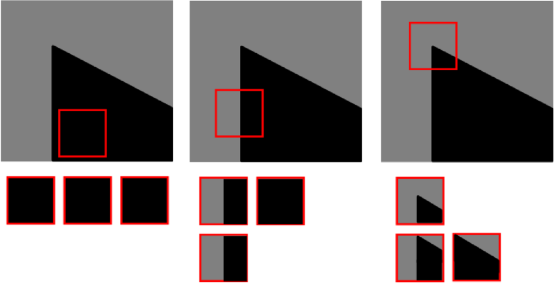
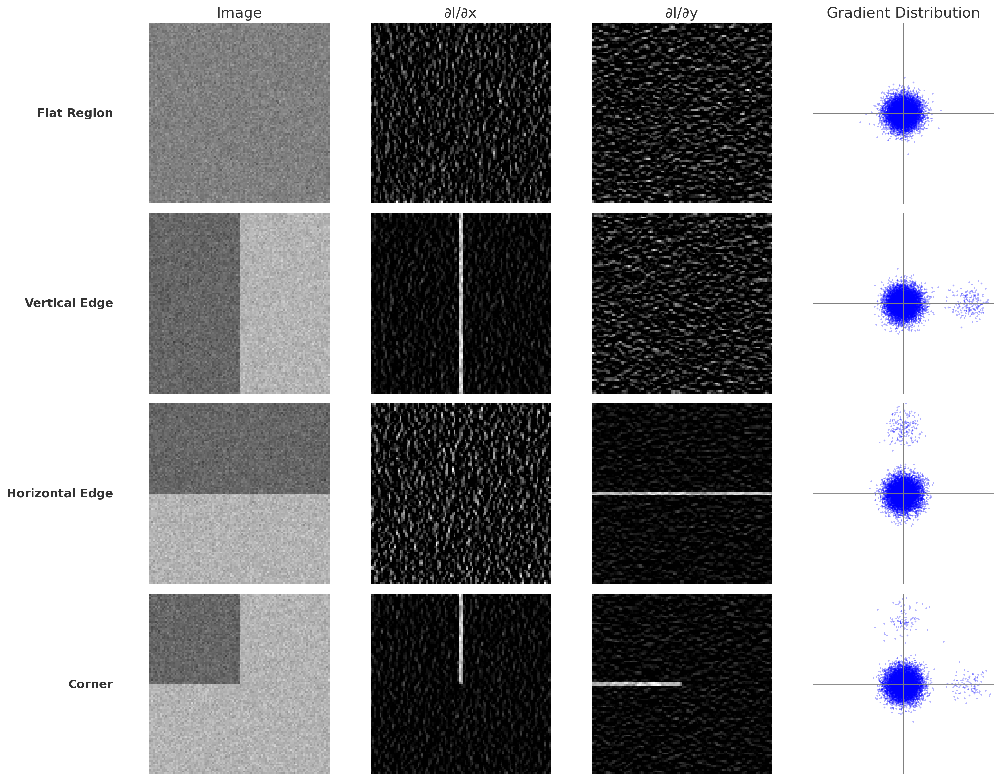
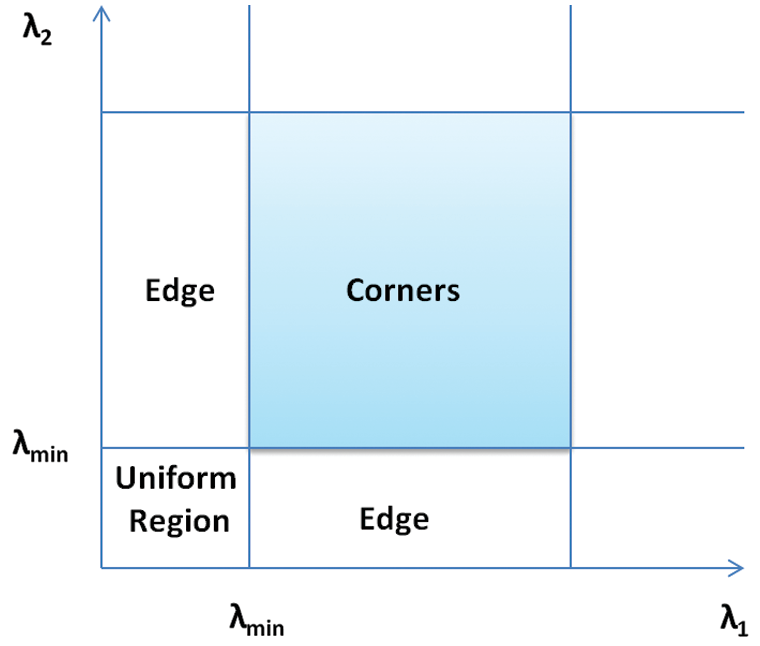

이미지에서 어떤 Object의 위치를 찾을 때, 정확히 위치를 찾기 위해서는 Corner를 찾는 것이 중요하다.  

## Flat, Edge, Corner
<figure>
    
    <figcaption>각각 flat, edge, corner에서 위치변화에 따른 window 내용의 변화(이미지 출처: <a href="https://vincmazet.github.io/bip/detection/corners.html" target="_blank">vincmazet.github.io/bip/detection/corners.html</a>)</figcaption>
</figure>
위 그림에서 볼 수 있듯이, flat 영역에서는 위치를 이동해도 window의 내용이 변하지 않고, edge 영역에서는 특정 방향으로 이동할 때만 window의 내용이 변하는 반면, corner 영역에서는 모든 방향으로 이동할 때 window의 내용이 변한다.  
따라서, corner 영역은 위치에 대한 변화에 민감하므로, corner를 찾는 것이 Object의 위치와 그 변화를 찾는 데 유리하다.   

<figure>
    
    <figcaption>flat, edge, corner의 각 축에 대한 그라디언트와 그 분포</figcaption>
</figure>

위 그림에서 볼 수 있듯이, 
- flat 영역에서는 모든 방향으로 그라디언트가 0에 가까움
- vertical edge 영역에서는 x축 방향으로만 그라디언트가 존재
- horizontal edge 영역에서는 y축 방향으로만 그라디언트가 존재 
- corner 영역에서는 x축과 y축 방향 모두에서 그라디언트가 존재

그라디언트의 분포도를 보면, 
- flat 영역에서는 균일하게 분포
- vertical edge 영역에서는 y축 방향의 그라디언트는 0에 모여있고, x축 방향의 그라디언트는 양수 값에 모여있음
- horizontal edge 영역에서는 x축 방향의 그라디언트는 0에 모여있고, y축 방향의 그라디언트는 양수 값에 모여있음
- corner 영역에서는 x축 방향의 그라디언트 y축 방향의 그라디언트가 각각 양수 영역에 모여있음  

따라서, corner를 찾기 위해서는 그라디언트의 분포를 이용할 수 있다.

### Mathematical Formulation to Detect Corners
특정 위치에서 윈도우를 $(u, v)$만큼 이동했을 때, 이동 후 변화량은 다음과 같이 표현할 수 있다.

$$
\begin{align}
    E(u, v) &= \sum_{(x,y) \in W} [I(x + u, y + v) - I(x, y)]^2 \\
\end{align}
$$
위 식에서 $I(x, y)$는 이미지의 intensity를 의미하고, $W$는 윈도우를 의미한다.  
만약 $\min E(u, v)$가 크다면, 해당 위치에서 윈도우를 이동했을 때 변화량이 크다는 것을 의미하므로 corner라고 인식할 수 있다.

이떄 $I(x+u, y + v)$는 1차 Taylor 전개를 통해 다음과 같이 근사할 수 있다.

$$
I(x + u, y + v) \approx I(x, y) + u \frac{\partial I}{\partial x} + v \frac{\partial I}{\partial y}
$$

따라서 $E(u, v)$는 다음과 같이 표현할 수 있다.

$$
E(u, v) \approx \sum_{(x,y) \in W} [u \frac{\partial I}{\partial x} + v \frac{\partial I}{\partial y}]^2 = [u, v] 
\left(
\sum_{(x,y) \in W}
\begin{bmatrix}
    \left(\frac{\partial I}{\partial x}\right)^2 & \frac{\partial I}{\partial x} \frac{\partial I}{\partial y} \\
    \frac{\partial I}{\partial x} \frac{\partial I}{\partial y} & \left (\frac{\partial I}{\partial y}\right)^2
\end{bmatrix}
\right)
\begin{bmatrix}
    u \\
    v
\end{bmatrix} 
$$
여기서 $E(u, v)$는 $u$와 $v$에 대한 2차식으로 표현된다.  
따라서, $E(u, v)$의 최소값을 찾기 위해서는 $E(u, v)$의 Structure Tensor $M$을 이용해 해당 행렬의 고유값을 구하면 해당 위치에서의 변화량의 최소값을 구할 수 있다.(Covariance Matrix)

다시 위의 그라디언트 분포도를 살펴보면,
- flat 영역에서는 모든 방향으로 그라디언트가 0에 가까움
- vertical edge 영역에서는 x축 방향으로만 그라디언트가 존재(타원형)
- horizontal edge 영역에서는 y축 방향으로만 그라디언트가 존재(타원형)
- corner 영역에서는 x축 방향의 그라디언트 y축 방향의 그라디언트가 각각 양수 영역에 모여있음(원형)

따라서 마치 공분산 행렬의 고유값 분해를 통해 각 축에 대한 분산을 구하는 것과 유사하게, flat 영역에서는 모든 방향으로 분산이 0에 가까워지고, edge 영역에서는 특정 방향으로만 분산이 존재하고, corner 영역에서는 모든 방향으로 분산이 커지는 것을 알 수 있다.  
따라서 $M$의 고유값을 구하면, flat, edge, corner를 구분할 수 있다.  
- flat 영역: $M$의 고유값이 모두 0에 가까움
- edge 영역: $M$의 고유값이 하나는 0에 가까움, 나머지 하나는 양수
- corner 영역: $M$의 고유값이 모두 큰 양수값
($M$은 positive semi-definite matrix이므로, 음의 고유값은 존재하지 않음)

<figure>
    
    <figcaption>고유값에 따른 corner detection(이미지 출처: <a href="https://www.researchgate.net/figure/An-illustration-of-Shi-Tomasi-corner-detection-in-l1-l2-space_fig1_357907112" target="_blank">researchgate.net</a>)</figcaption>
    </figcaption>
</figure>

### Harris Corner Detection
Harris Corner Detection은 corner detection을 위한 알고리즘으로, 위의 과정을 기반으로 한다.  
위의 과정에서는 Stucture Tensor $M$의 고유값을 구하여 작은 eigenvalue를 기준으로 corner를 찾는 방법을 사용했다.  
Harris Corner Detection에서는 $M$의 고유값을 구하는 대신, $M$의 행렬식과 trace를 이용하여 다음과 같이 corner를 찾는다.  

$$
R = det(M) - k \cdot trace(M)^2
$$

이와 같은 방법을 사용할 수 있는 이유는 다음과 같다:
- $M$의 고유값을 $\lambda_1, \lambda_2$라고 할 때, $M$의 행렬식은 $\lambda_1 \cdot \lambda_2$이고, trace는 $\lambda_1 + \lambda_2$이다.
- 따라서, $det(M)$과 $trace(M)$의 식을 위와 같이 변형하면, 다음과 같은 식이 성립한다.
$$
R = \lambda_1 \cdot \lambda_2 - k \cdot (\lambda_1 + \lambda_2)^2 = (1-2k) \cdot \lambda_1 \cdot \lambda_2 - k \cdot (\lambda_1^2 + \lambda_2^2)
$$
- 위 식에서 $k$는 상수로, 일반적으로 0.04~0.06의 값을 사용한다.
  - $k$의 값이 작다면 edge에 덜 민감하게 반응하고, 크다면 edge에 더 민감하게 반응한다.
- 위 식에서 $\lambda_1$과 $\lambda_2$가 모두 큰 값이라면, $\lambda_1 \cdot \lambda_2$가 큰 값이 되고, 따라서 $R$은 양수 값이 된다.(corner 영역)
- 반면, $\lambda_1$과 $\lambda_2$가 둘 중 하나만 작은 값이라면, $\lambda_1 \cdot \lambda_2$가 뒤의 항에 비해 작아지므로 $R$은 음수 값이 된다.(edge 영역)
- 마지막으로 $\lambda_1$과 $\lambda_2$가 모두 작은 값이라면, $R$은 0에 가까운 값이 된다.(flat 영역)  
- 이와 같은 방법을 사용하는 이유는, 행렬식과 trace를 구하는 것이 고유값을 구하는 것보다 계산량이 훨씬 적기 때문이다.

이와 같은 방법으로 찾은 후보 corner들을 Non-Maximum Suppression(NMS) 기법을 사용하여 가지치기 제거하여 최종 corner들을 찾는다.

- **주의사항**  
  - 실제로는, 단순한 window $W$를 사용한다면 corner를 찾는 데 어려움이 있을 수 있다.
  - 따라서 실제 사용사례에선 window $W$의 중심 픽셀과의 거리에 따라 가중치를 부여하여 corner를 찾는 방법을 사용한다.

---
해당 포스트는 서울대학교 컴퓨터공학부 주한별 교수님의 컴퓨터비전 25-1학기 강의를 정리한 내용입니다.