Object detection 문제에서, 어떤 사진에서 특정 템플릿과 유사한 물체를 찾기 위해서는 단순히 템플릿과 해당 사진의 일부를 비교하는 것만으로는 부족하다.   
찾고자하는 물체가 사진 안에서 회전하거나, 크기가 변하거나, 조명이 달라지는 등 다양한 변화를 겪을 수 있기 때문이다.   

<figure>
    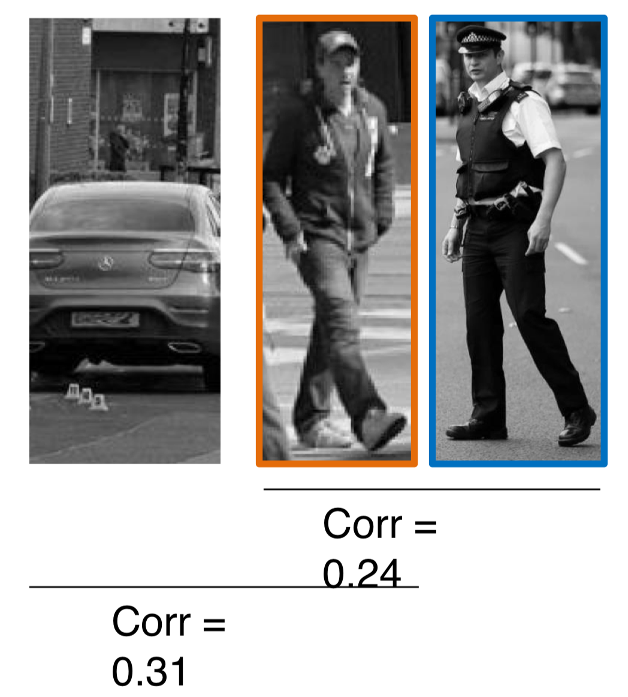
    <figcaption>사람 사진과 차 사진간의 유사도와 두 사람 사진 사이 간의 유사도</figcaption>
</figure>

위 그림에서 보듯이, 보행자 객체 인식 문제를 풀때, 단순히 템플릿과 사진의 일부를 비교하는 방법은 보행자와 자동차를 구분할 수 없다.  
따라서, 물체를 찾기 위해서는 물체의 모양을 잘 나타내는 특징을 추출하고, 이 특징을 바탕으로 템플릿과 비교하는 방법이 필요하다.  
이를 위한 한가지 방법 중 하나로, 그라디언트의 분포를 이용하는 방법이 있다.  

<figure>
    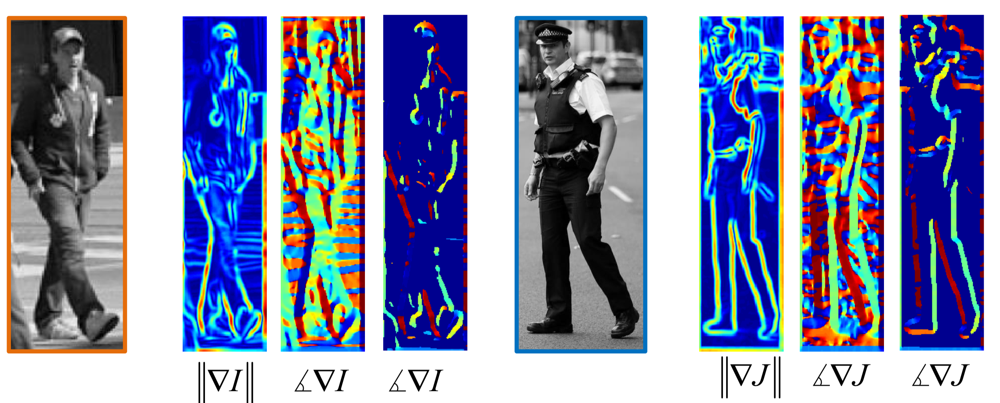
    <figcaption>사람 사진들의 그라디언트 이미지</figcaption>
</figure>
<figure>
    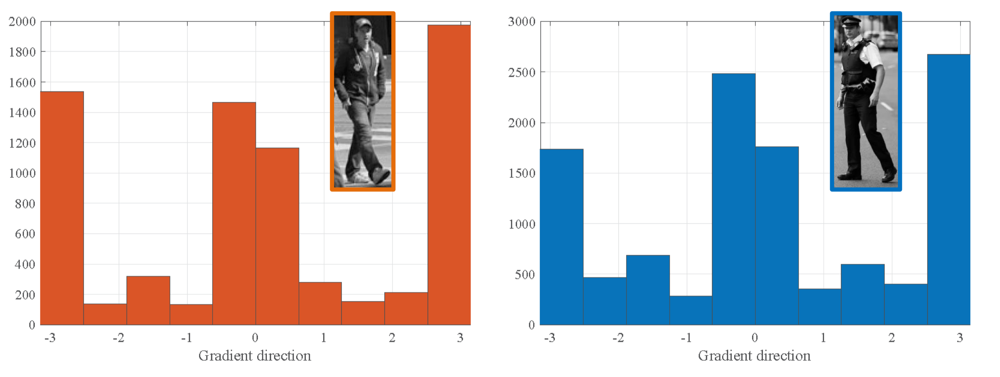
    <figcaption>사람 사진들의 그라디언트 분포</figcaption>
</figure>
<figure>
    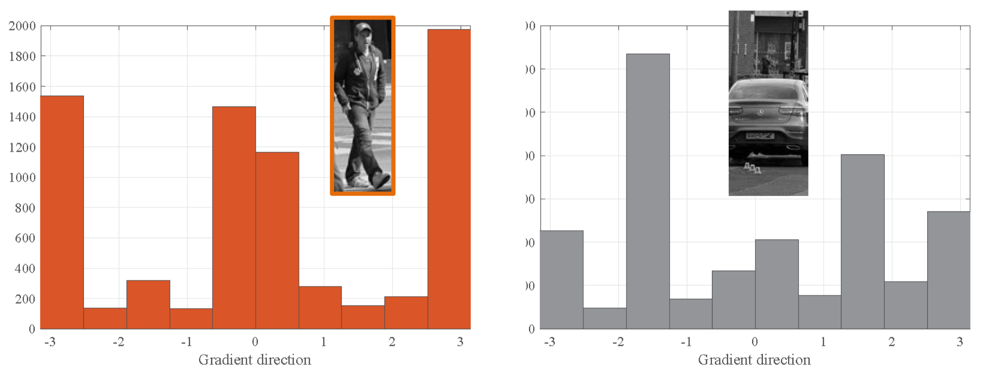
    <figcaption>사람 사진과 자동차 사진의 그라디언트 분포</figcaption>
</figure>

위 그림에서 볼 수 있듯이, 사람 사진은 수직 방향의 엣지가 많으므로, 그라디언트 분포는 0과 $\plusmn\pi$ 근처에서 집중되어 있는 반면, 자동차 사진의 그라디언트 분포는 수평 방향의 엣지가 많아 $\plusmn\pi/2$ 근처에서 집중되어 있다.   
이와 같이, 그라디언트의 분포를 이용하면 타겟과 비슷한 물체를 구분하는 단서를 만들 수 있다.  
이와 같은 방법으로, 그라디언트의 분포를 이용하여 물체를 구분하는 방법을 **Histogram of Oriented Gradients(HOG)**라고 한다.

## Global Gradient vs Local Gradient
<figure>
    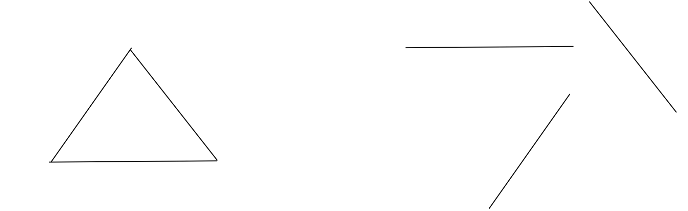
    <figcaption>삼각형의 사진과 그 변들을 다시 배치한 것</figcaption>
</figure>

위 두 그림은 전혀 다른 모양을 갖고있지만, 그라디언트의 분포는 동일하다. 즉, 사진 전체의 그라디언트 분포를 사용하게 된다면 원래 이미지가 갖고있는 공간적 정보를 잃어버리게 된다.  
이를 해결하기 위해, 사진을 여러개의 작은 블록으로 나누고, 각 블록에서 그라디언트를 계산하여 블록의 특징으로 사용한다.

<figure>
    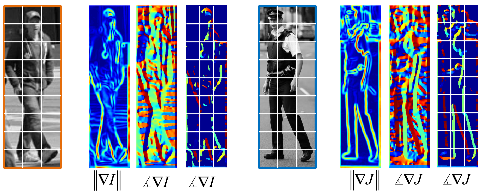
    <figcaption>블록을 나누고, 각 블록에서 그라디언트를 계산한 것</figcaption>
</figure>

위와 같이 사진을 여러개의 블록으로 나누고, 각 블록에서 그라디언트를 계산하여 블록의 특징으로 사용해 같은 위치의 각 블록간의 그라디언트 분포 유사도를 비교한다면 공간적 정보는 잃어버리지 않으면서도, 물체를 구분할 수 있는 특징을 만들 수 있다.  

## Oriental Binning
그라디언트의 방향은 연속적이므로, 이를 특징벡터로 사용하기 위해서는 이산적인 값으로 변환해야 한다.  
이를 위해, 그라디언트의 방향을 여러개의 bin으로 나누고, 각 bin에 해당하는 그라디언트의 세기를 더하여 histogram을 만든다.  
<figure>
    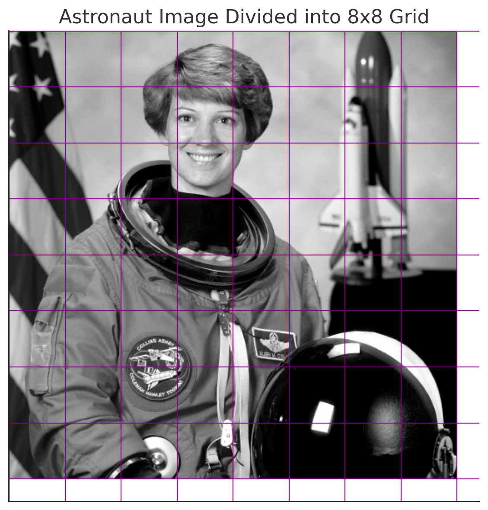
</figure>
<figure>
    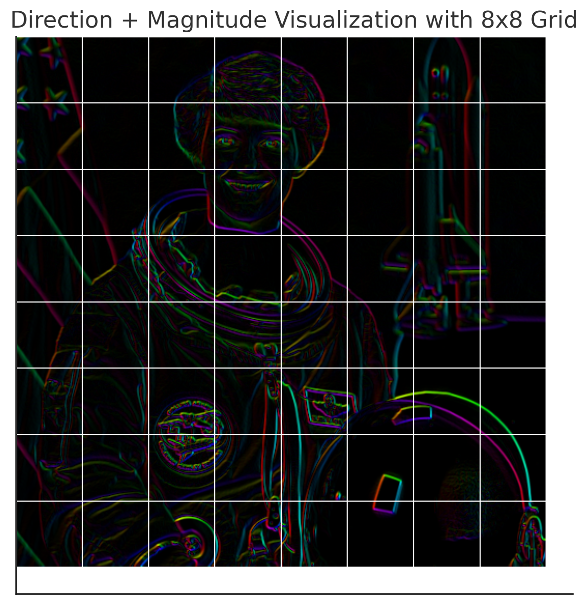
    <figcaption>이미지 그라디언트</figcaption>
</figure>
<figure>
    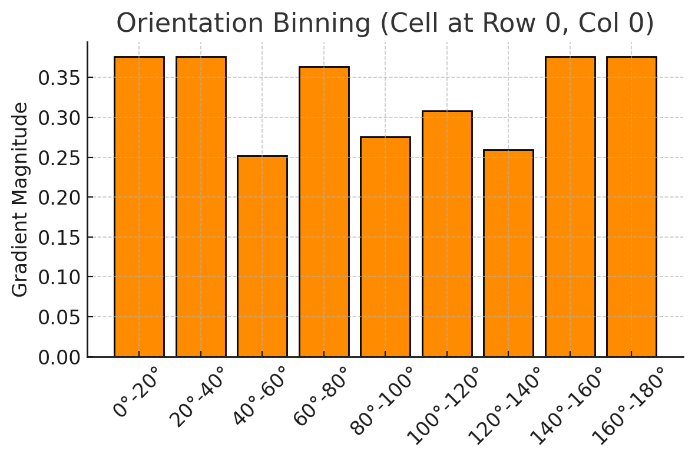
    <figcaption>위의 이미지 셀의 (0,0)의 그라디언트 분포</figcaption>
</figure>
위 사진은 우주비행사 사진에 대해, 8 by 8 셀로 나누고, 첫 셀의 그라디언트 분포를 나타낸 것이다.  
각 셀의 그라디언트 방향을 0도에서 180도까지 9개의 bin(20도 간격)으로 나누고, 각 bin에 해당하는 그라디언트의 세기를 더하여 histogram을 만든다.  

각 셀의 그라디언트 방향을 $0$도에서 $180$도까지 $K$개의 bin으로 나누면, 각 셀의 histogram은 $K$차원 벡터가 된다. 이때 이미지를 $N$ by $M$의 셀로 나누기 때문에, 최종적으로 $N \times M$개의 $K$차원 벡터를 얻을 수 있다.  

<figure>
    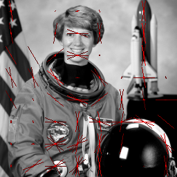
    <figcaption>각 셀의 histogram을 시각화한 것</figcaption>
</figure>

## Block Normalization
사진의 Contrast에 따라 histogram의 분포가 비슷하더라도 scale이 달라지기 때문에 두 블록의 유사도에 왜곡이 생길 수 있다.  
따라서, histogram을 정규화하여 scale에 대한 영향을 줄여준다.  
정규화는 각 블록에 대해, 오른쪽, 아래, 대각선 방향으로 이웃한 4개의 셀을 하나의 블록으로 묶고, 이 블록에 대해 L2 정규화를 수행한다.  

<figure>
    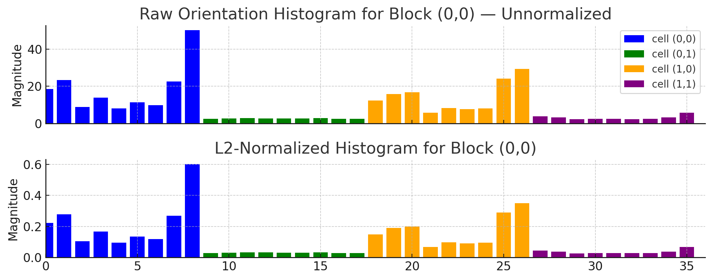
    <figcaption>블록 정규화</figcaption>
</figure>

위 사진은 (0,0) 셀을 기준으로, 오른쪽, 아래, 대각선 방향으로 이웃한 4개의 셀을 하나의 블록으로 묶고, 이 블록에 대해 L2 정규화를 수행한 것이다.  
분포는 동일하지만 gradient magnitude가 0에서 1 사이로 정규화된 것을 볼 수 있다.
정규화된 histogram은 $4 \times K$ 차원 벡터가 되고, 이 벡터를   각 블록의 특징벡터로 사용한다.
이떄, 오른쪽 끝과 아래쪽 끝의 셀은 블록을 만들 수 없으므로, 블록을 만들 수 있는 셀의 개수는 $(N-1) \times (M-1)$개가 된다.
이렇게 만들어진 $(N-1) \times (M-1)$개의 블록에 대해 histogram을 정규화하면, 최종적으로 $(N-1) \times (M-1) \times 4K$ 차원 벡터를 얻을 수 있다.

## Face Detection
<figure>
    <figure style="display: flex; flex-direction: row; justify-content: space-between; align-items: center;">
        

            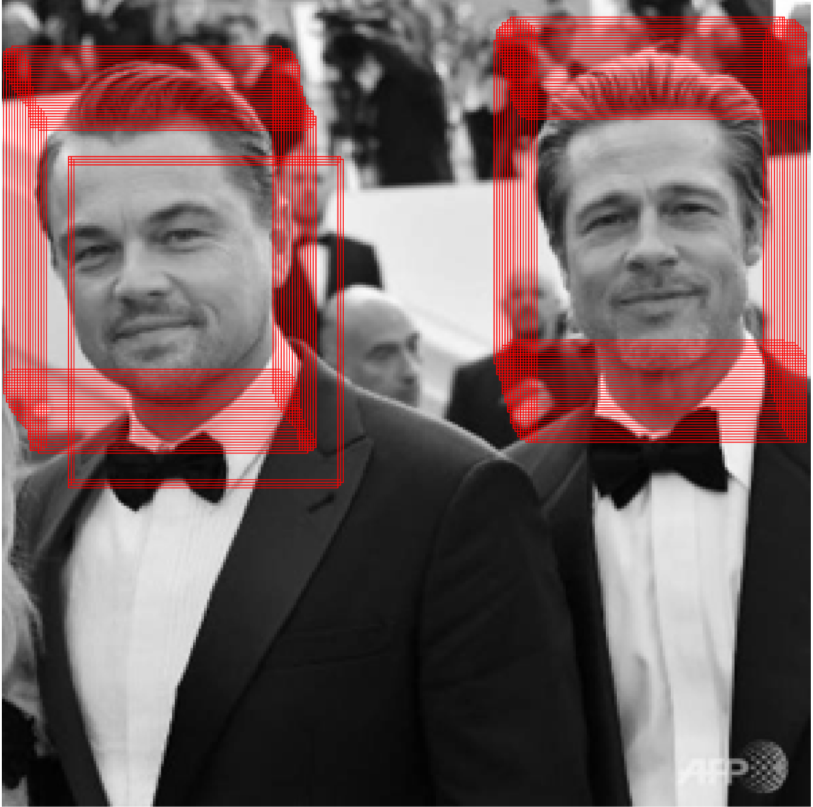
            <figcaption>HOG를 이용한 얼굴 인식</figcaption>
        

        

            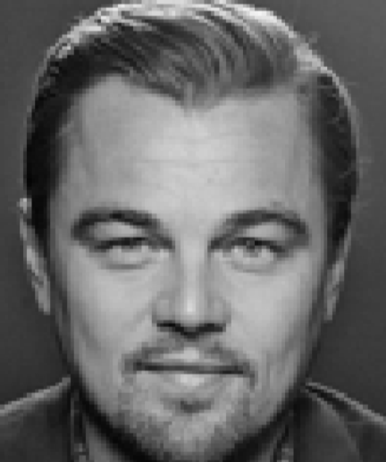
            <figcaption>얼굴 인식의 템플릿</figcaption>
        

    </figure>
    
</figure>

HOG feature를 통해 템플릿의 특징을 추출하고, 이 특징을 바탕으로 원본 이미지를 슬라이딩 윈도우로 나누어 각 윈도우에 대해 템플릿과 비교하여 유사도가 특정 threshold 이상인 윈도우를 찾는다.  
이떄 사진에서 볼 수 있듯이, 검출된 윈도우 중 겹치는 부분이 많기 때문에, 겹치는 부분을 제거하는 방법이 필요하다.

### Non-Maximum Suppression
Non-Maximum Suppression(NMS)은 겹치는 윈도우를 제거하는 방법으로, 각 윈도우에 대해 confidence score를 계산하고, 겹치는 윈도우 중 confidence score가 가장 높은 윈도우를 선택한다.

- **IoU(Intersection over Union)**: 두 윈도우가 겹치는 정도를 나타내는 지표로, 두 윈도우의 교집합 영역을 합집합 영역으로 나눈 값이다.  
  - IoU = $\frac{Area(A \cap B)}{Area(A \cup B)}$
  - IoU가 0에 가까울수록 두 윈도우는 겹치지 않고, 1에 가까울수록 두 윈도우는 완전히 겹친다.

## Object Recognition with HOG
Object recognition 문제는 Detection 문제와는 달리, 사진에서 물체를 찾는 것이 아니라, 사진이 어떤 물체를 담고있는지(ex. 고양이, 개, 자동차 등) 분류하는(classification) 문제이다.  
HOG는 일반적으로 Detection 문제에 많이 사용되지만, classification 문제에도 사용할 수 있다.  
HOG Feature를 사용하여 classification 문제를 풀기 위해서는, HOG Feature를 바탕으로 SVM(Support Vector Machine)과 같은 분류기를 학습시켜야 한다.  

$$
f(x) = \begin{cases}
    1 & \text{if } w^T x + b > 0 \\
    -1 & \text{if } w^T x + b < 0
\end{cases}
$$
- $x$: HOG Feature
- $w$: SVM의 weight
- $b$: SVM의 bias

## Scale Invariance
HOG는 사진을 여러개의 블록으로 나누고, 각 블록에서 그라디언트를 계산하여 histogram을 만든다.  
이때, 사진의 크기가 달라지면 블록의 크기도 달라지기 때문에, HOG Feature는 scale에 대해 불변하지 않다.  
따라서 HOG Feature를 사용하여 물체를 인식하기 위해서는, 사진의 resoltion을 조정해 여러 scale의 사진을 만들고, 각 scale에 대해 HOG Feature를 계산하여 Object Detection/Recognition을 수행해야 한다.

## Extension: Deformable Part Model
HOG는 물체의 고정된 구조의 템플릿만을 사용하기 때문에, 물체의 변형에 대해 Robust하지 않다.(ex. 사람의 팔, 다리 등은 뻗어있거나 구부러져 있을 수 있다.)  
Deformable Part Model(DPM)은 HOG를 사용하여 물체의 고정된 구조를 템플릿으로 사용하고, 각 부분의 위치를 조정할 수 있는 방법이다.  

---
해당 포스트는 서울대학교 컴퓨터공학부 주한별 교수님의 컴퓨터비전 25-1학기 강의를 정리한 내용입니다.