Canny Edge Detector, SIFT, HOG 등과 같은 다양한 방법을 통해 이미지에서 Edge를 찾을 수 있다. 하지만, Edge를 찾는 것만으로는 원하는 문제를 해결하기 어려운 경우가 있다.

예를 들어, 자율주행 자동차를 설계하기 위해 도로의 경계선을 찾는 경우를 생각해보자. 단순히 Edge를 찾는 것만으로는 계속해서 이어지고 변화하는 도로의 경계선을 찾기 어렵다. 해당 문제를 해결하기 위해서는 Edge를 찾는 것 외에도, 계속해서 이어지는 Line을 찾는 방법이 필요하다.  

## Line Fitting
주어진 데이터 포인트 $(x_i, y_i)$에 대해, 해당 포인트를 통과하는 직선의 방정식은 다음과 같이 표현할 수 있다.
$$
y = mx + b
$$
여기서 $x, y$는 변수, $m,\ b$는 직선의 파라미터이다.   

이 파라미터를 구하기 위해서는 여러 개의 데이터 포인트를 이용하여 직선을 피팅할 수 있다.(Linear Regression, Least Square Method 등)  

하지만 이 방법은 데이터 포인트에 포함된 노이즈 혹은 이상치(outlier)에 민감하다.  

<figure>
    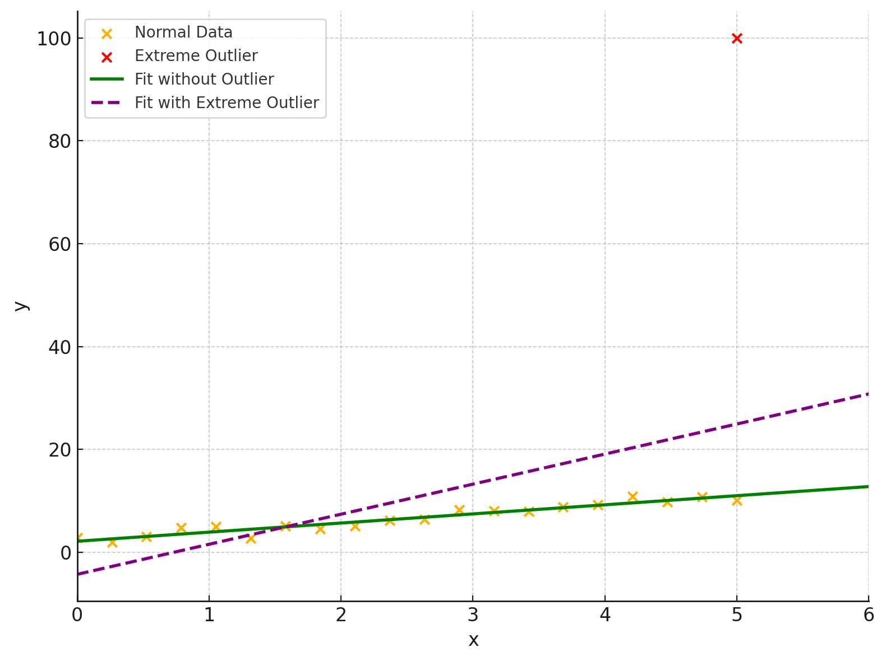
    <figcaption>Linear Regression에서 이상치의 영향</figcaption>
</figure>

이와 같은 문제를 해결하기 위해, Hough Transform을 사용할 수 있다.

### Hough Transform
Hough Transform은 이미지에서 직선을 찾기 위한 방법으로, 직선의 방정식 $y = mx + b$를 파라미터 공간으로 변환하여 직선을 찾는 방법이다.

<figure>
    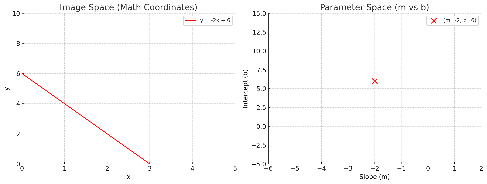
    <figcaption>직선의 방정식 y = -2x +6을 파라미터 공간으로 변환</figcaption>
</figure>

위 그림에서 볼 수 있듯이, 직선의 방정식 $y = mx + b$를 파라미터 공간으로 변환하면, 직선의 기울기 $m$과 절편 $b$에 대한 점 $(m, b)$를 얻을 수 있다.

반대로, 변수 공간의 점 $(x, y)$에 대해 직선의 방정식 $y = mx + b$를 변환하면, 파라미터 공간에서 직선의 방정식 $b = -mx + y$를 얻을 수 있다.  

<figure>
    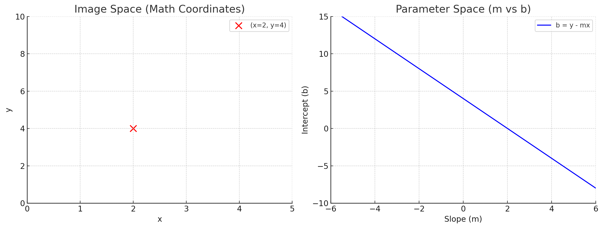
    <figcaption>변수 공간의 점 (2, 4)에 대한 파라미터 공간의 직선의 방정식 b = -2m + 4</figcaption>
</figure>

변수 공간의 각 점 $(x, y)$는 그에 해당하는 직선의 방정식 $b = -mx + y$를 갖는다.   

이때, 서로 다른 두 점 $(x_1, y_1)$, $(x_2, y_2)$에 대해, 두 점을 통과하는 직선의 방정식은 두 점에 대응하는 파라미터 공간의 직선의 교차점으로 표현할 수 있다.

<figure>
    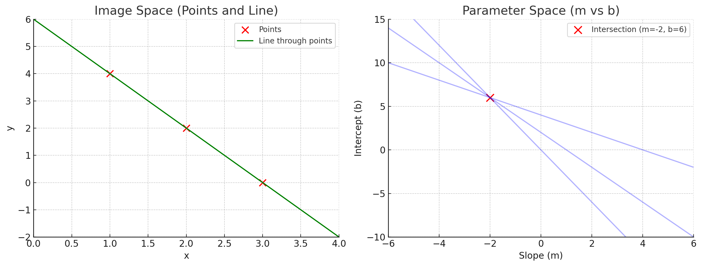
    <figcaption>변수 공간의 점들에 대한 파라미터 공간의 직선의 교차점</figcaption>
</figure>

바로 이 성질을 이용하여, 데이터 포인트로부터 가장 최적의 직선을 찾을 수 있다.  

#### Hough voting   
Hough Transform을 통해 직선을 찾기 위해서는 다음과 같은 과정을 거친다.

1. 파라미터 공간을 양자화한다(원활한 voting을 위해).  
2. Accumulator array $A(M, C)$를 생성한다.
3. 이미지의 각 edge point $(x_i, y_i)$에 대해
    - Accumulator array $A(M, C)$의 각 원소 $(m_j, c_j)$에 대해
      - 해당 순서쌍 $(m_j, c_j)$가 edge point $(x_i, y_i)$를 통과하는지 확인하고, 
        - 통과한다면 Accumulator array $A(m_j, c_j)$의 해당 위치를 1 증가시킨다.
4. Accumulator array $A(M, C)$에서 가장 큰 값을 갖는 위치를 찾는다.

- **한계**  
    해당 방법은 직선의 방정식 $y = mx + b$를 사용하기 때문에, 수직인 직선의 경우 기울기 $m$이 무한대가 되어 계산이 불가능하다.

#### Better Parameterization(Polar Coordinates)
직선의 방정식 $y = mx + b$를 사용하게 되면, 수직인 직선의 경우 기울기 $m$이 무한대가 되어 계산이 불가능하다.  
이를 해결하기 위해, 직선의 방정식을 극좌표계로 변환하여 사용한다.

- **Polar Coordinates**  
    직선의 방정식 $y = mx + b$를 극좌표계로 변환하면, 다음과 같이 표현할 수 있다.
    $$
    r = x \cos \theta + y \sin \theta
    $$
    여기서 $r$은 원점에서 직선까지의 거리, $\theta$는 직선과 x축 사이의 각도이다.  
    이때, 직선의 방정식은 기울기 $m$과 절편 $b$ 대신에 각도 $\theta$와 거리 $r$로 표현된다.

<figure>
    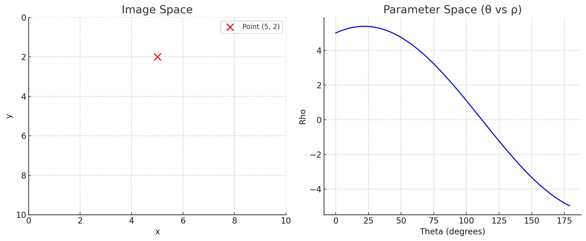
    <figcaption>이미지 공간의 점 (5, 2)에 대한 파라미터 극좌표계 공간의 곡선</figcaption>
</figure>

위 그림에서 $\theta = 0, \pi$일 때, 수직선의 방정식을 나타낼 수 있게 된다.   
여기서 $\theta = 0, \rho = 5$, $\theta = \pi, \rho = -5$인 이유는 두 선은 같은 선을 나타내지만 법선의 방향이 반대이기 때문이다.($(cos 0, sin 0)$과 $(cos \pi, sin \pi)$)  

- **Two way of representing a line**  
    - Positive Rho
        - $r = x \cos \theta + y \sin \theta$
    - Negative Rho
        - $-r = x \cos(\theta + \pi) + y \sin(\theta + \pi)$

이와 같은 극좌표계 공간 역시, 두 점 $(x_1, y_1)$, $(x_2, y_2)$에 대해 두 점을 통과하는 직선의 방정식은 두 점에 대응하는 극좌표계 공간의 곡선의 교차점으로 표현할 수 있다.   

<figure>
    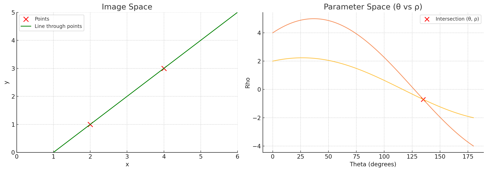
    <figcaption>변수 공간의 점들에 대한 극좌표계 공간의 곡선의 교차점</figcaption>
</figure>

이와 같이 극좌표계 공간을 이용할 경우 역시, 같은 방법으로 Hough voting을 수행할 수 있다.

- **Hough voting**  
    1. 파라미터 공간을 양자화한다(원활한 voting을 위해).  
    2. Accumulator array $A(\Theta, \Rho)$를 생성한다.
    3. 이미지의 각 edge point $(x_i, y_i)$에 대해
        - Accumulator array $A(\Theta, \Rho)$의 각 원소 $(\theta_j, r_j)$에 대해
          - 해당 순서쌍 $(\theta_j, r_j)$가 edge point $(x_i, y_i)$를 통과하는지 확인하고, 
            - 통과한다면 Accumulator array $A(\theta_j, r_j)$의 해당 위치를 1 증가시킨다.
    4. Accumulator array $A(\Theta, \Rho)$에서 가장 큰 값을 갖는 위치를 찾는다.

<figure>
    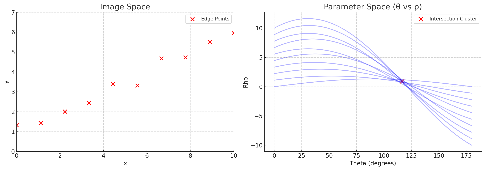
    <figcaption>점들에 대한 극좌표계 공간의 곡선의 교차점</figcaption>>
</figure>

- **Basic Shapes in Parameter Space**  
    <figure>
        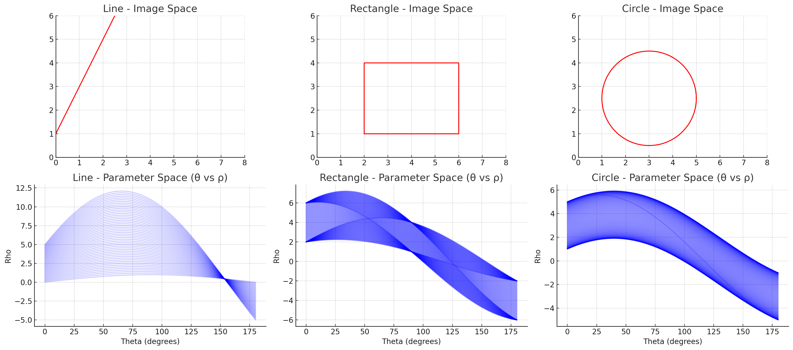
        <figcaption>직선, 직사각형, 원의 극좌표계 공간에서의 표현</figcaption>
    </figure>
    - 직선
        - 직선 위의 모든 점들이 파라미터 공간에서 만드는 곡선들은 하나의 점에서 교차
        - 이 교차점은 직선을 고유하게 표현하는 (θ, ρ) 값
    - 직사각형
        - 각 변은 파라미터 공간에서 하나의 뚜렷한 점으로 나타남
        - 결과적으로 파라미터 공간에서 4개의 뚜렷한 점(피크)으로 표현됨
    - 원
        - 원 위의 각 점은 서로 다른 법선 방향(θ)을 가짐
        - 하지만 이 법선 벡터들의 길이(ρ)는 원의 중심 위치와 반지름에 의해 결정되는 일정한 범위 내에서 변화
        - 원의 중심이 원점일 경우 모든 점에서 ρ는 반지름과 같음
        - 원의 중심이 원점이 아닐 경우, ρ는 θ에 따라 사인곡선 형태로 변화하지만 특정 패턴(원의 중심과 반지름에 의해 결정되는)을 형성

- **실제 사례**
    <figure>
      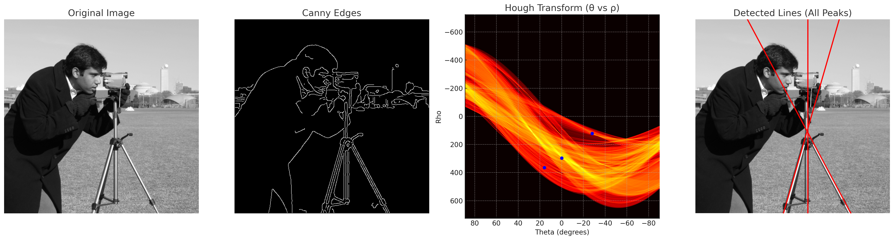
      <figcaption>Hough Transform을 이용한 직선 검출</figcaption>
    </figure>
    위 사진은 실제 사진에 Hough Transform을 적용하여 직선을 검출한 결과이다. 세개의 peak point가 검출되었고, 이들은 각각 직선의 방정식으로 변환되어 직선으로 표현되었다.

#### Circle Detection by Hough Transform
Hough Transform은 직선뿐만 아니라 원을 검출하는 데에도 사용될 수 있다.  

##### 반지름 r이 주어진 경우
어떤 원의 방정식 $(x - a)^2 + (y - b)^2 = r^2$이 주어졌을 때, 원 위의 점 $(x_i, y_i)$는 다음과 같은 방정식을 만족한다.

$$
(x_i - a)^2 + (y_i - b)^2 = (a - x_i)^2 + (b - y_i)^2 = r^2
$$

따라서, 어떤 점 $(x_i, y_i)$가 주어졌을 때, 원의 방정식의 파라미터 $a, b$는 파라미터 공간에서 $(x_i, y_i)$를 중심으로 하고 반지름 $r$인 원을 그린 것과 같다.   

<figure>
    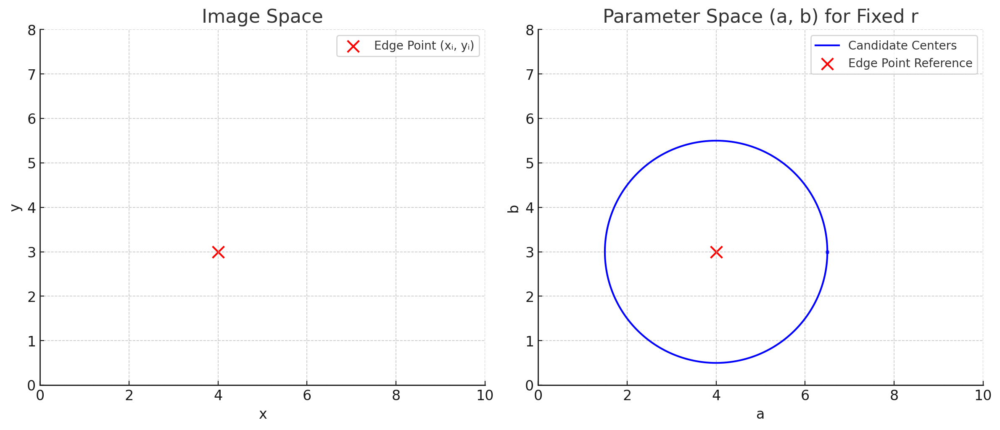
    <figcaption>원 위의 점 (2, 3)에 대한 파라미터 공간의 원</figcaption>
</figure>

따라서, 반지름과 그 원을 통과하는 점들이 주어졌을 때, 같은 방법으로 Hough voting을 수행하면, 원의 중심을 찾을 수 있다.  

<figure>
    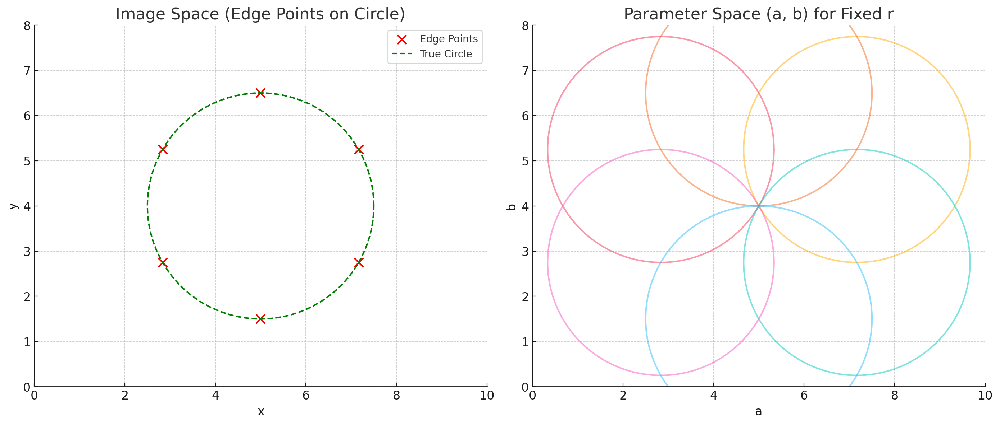
    <figcaption>Hough voting을 이용한 원 검출</figcaption>
</figure>
위 사진에서 볼 수 있듯이, 파라미터 공간의 원의 교차점이 원의 중심을 나타내게 된다.  

##### 반지름이 주어지지 않은 경우
가능한 모든 반지름 $r$에 대해 Hough voting을 수행하여야 한다.  
따라서 이와 같은 경우, 파라미터 공간은 $(a, b, r)$이 되고, 계산량이 많아지게 된다.  

##### 반지름, 엣지 포인트가 주어지고, 엣지 방향까지 주어진 경우
각 엣지 포인트는 엣지가 연결되어있다면, 그에 대한 엣지 방향이 존재한다.  
이 엣지 방향을 이용하여, 원의 중심을 찾는 방법도 있다.  
해당 엣지 포인트에서의 엣지 방향에 대해 반지름만큼 수직으로 이동한 점이 원의 중심이 된다.  
이때, 어느 수직 방향이 원의 중심인지 Transform 단계에서 알 수 없으므로, 양쪽 모두 Hough voting을 수행하여야 한다.  

<figure>
    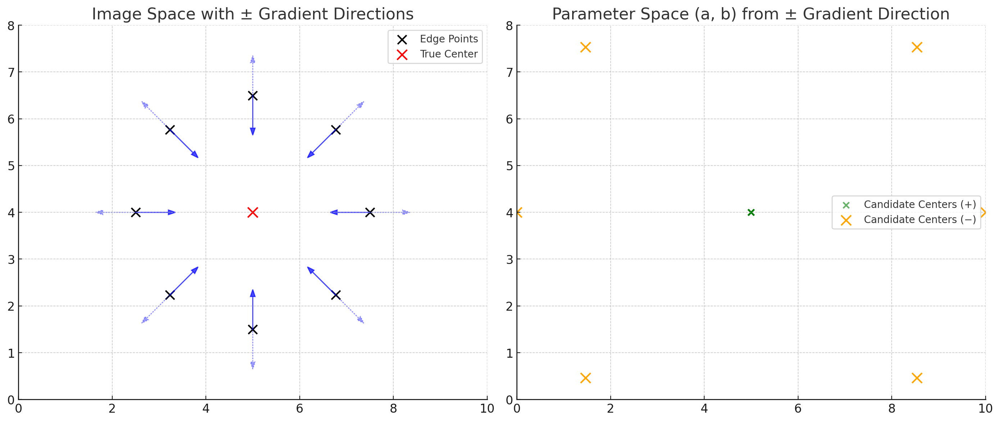
    <figcaption>엣지 방향을 이용한 Hough voting</figcaption>
</figure>

#### Generalized Hough Transform
지금까지 설명한 Hough Transform은 직선과 원을 검출하는 방법이다.  
하지만, Hough Transform은 일반화된 형태로 다양한 도형을 검출하는 데에도 사용될 수 있다.  
<figure>
    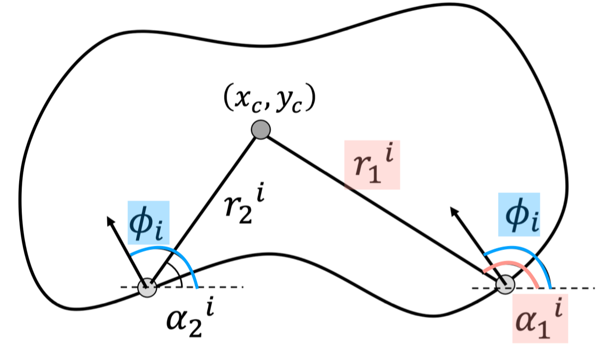
    <figcaption>Generalized Hough Transform</figcaption>
</figure>

1. 도형의 모양을 정의한다.  
    검출하고자 하는 도형의 모양을 edge contour와 중심점($x_c, y_c$)으로 정의한다.
2. $\phi$-Table을 생성한다.  
    $\phi_i$는 도형의 각 edge point의 그라디언트 방향을 의미한다.  
    $\phi_i$의 그라디언트 값을 갖는 각 edge point가 중심으로부터 얼마나 떨어져있는지($r$), 중심점과의 방향은 어떤지($\alpha$)를 $\phi$-Table에 저장한다.
    
    | edge direction | $\vec{r} = (r, \alpha)$                             |
    | -------------- | --------------------------------------------------- |
    | $\phi_1$       | $\vec{r_1}^{(1)}, \vec{r_2}^{(1)}, \vec{r_3}^{(1)}$ |
    | $\phi_2$       | $\vec{r_1}^{(2)}, \vec{r_2}^{(2)}$                  |
    | $\phi_3$       | $\vec{r_1}^{(3)}$                                   |
    | ...            | ...                                                 |
    | $\phi_n$       | $\vec{r_1}^{(n)}, \vec{r_2}^{(n)}, \vec{r_3}^{(n)}$ |

3. Accumulator array $A(x_C, y_C)$를 생성한다.
    - 이미지의 각 edge point $(x_i, y_i, \phi_i)$에 대해
        - $\phi$-Table에서 $(\phi_i, \vec{r_k}^{i})$를 찾는다.
        - $\vec{r}$의 각 원소에 대해
            - $x_c = x_i \plusmn r_k^{(i)} \cos(\alpha_k^i)$
            - $y_c = y_i \plusmn r_k^{(i)} \sin(\alpha_k^i)$
            - 위 두 조건을 만족하는 $(x_i, y_i)$에 대해 Accumulator array $A(x_C, y_C)$의 해당 위치를 1 증가시킨다.

4. Accumulator array $A(x_C, y_C)$에서 가장 큰 값을 갖는 위치를 찾는다.

##### Handling Scale and Rotation
Accumulator array $A(x_C, y_C, s, \theta)$를 생성하여, 가능한 모든 scale $s$와 회전 $\theta$에 대해 Hough voting을 수행할 수 있다.   
$$
x_c = x_i \plusmn s \cdot r_k^{(i)} \cos(\alpha_k^i + \theta)
$$
$$
y_c = y_i \plusmn s \cdot r_k^{(i)} \sin(\alpha_k^i + \theta)
$$
해당 방법은 높은 계산량을 요구하지만, 다양한 변형에 대한 도형을 검출할 수 있는 장점이 있다.

---
해당 포스트는 서울대학교 컴퓨터공학부 주한별 교수님의 컴퓨터비전 25-1학기 강의를 정리한 내용입니다.