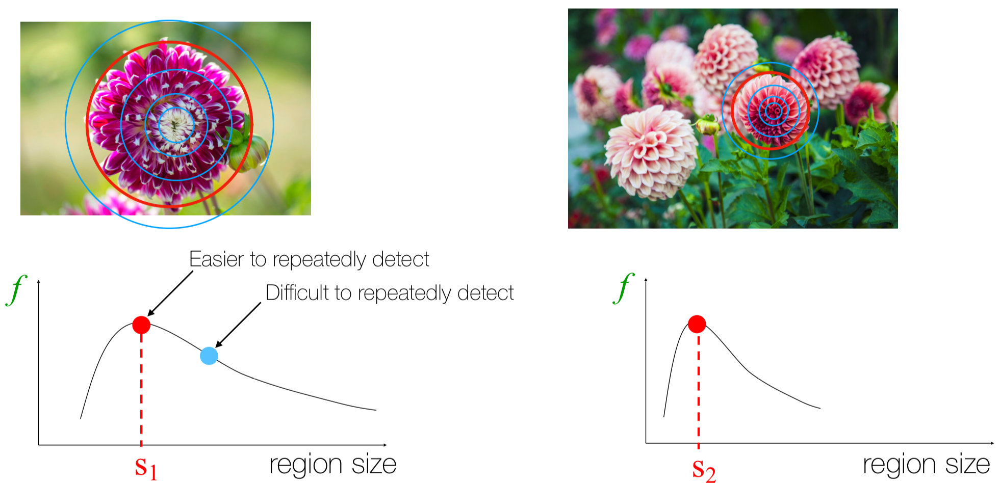

Correspondence Search 문제는 서로 다른 두 이미지에서 같은 포인트를 찾는 문제이다.  
예를 들어, 아래 그림과 같이 왼쪽 이미지와 그를 회전시키고 크기를 조정한 오른쪽 이미지에서 같은 포인트를 찾는 경우를 생각해보자.  

<figure>
    
    <figcaption>왼쪽 이미지와 오른쪽 이미지에서 같은 포인트를 찾는 경우</figcaption>
</figure>

이와 같은 문제를 해결하기 위해서는 다양한 이미지 변환에 대해 불변성을 갖는 robust한 local feature를 찾아야 한다.  
이러한 local feature를 찾기 위해서는 다음의 세 단계를 거칠 수 있다:  
    1. **Detection**: 이미지의 특징점(interest point)을 찾는다.  
        - 이때 특징점은 동일한 대상에 대한 두 이미지에서 "의미적으로 같은" 포인트를 찾아낼 수 있어야 한다.
    2. **Description**: 찾은 특징점의 주변 정보를 바탕으로 특징 벡터를 만든다.  
        - 이 특징 벡터는 이미지의 회전, 크기 변화, 조명 변화에 대해 robust해야 한다.
    3. **Matching**: 특징 벡터를 바탕으로 서로 다른 이미지의 특징점들을 매칭해 같은 포인트를 찾는다.  

이러한 과정을 거쳐서, 서로 다른 두 이미지에서 같은 포인트를 찾는 방법을 **Scale Invariant Feature Transform(SIFT)**라고 한다.

## Detection
SIFT의 Detection 단계에서는 이미지에서 특징점을 찾기 위해 "Blob"을 찾는다.
- **Blob**: 이미지에서 국소적으로 뚜렷한 구조를 가진 영역
    <figure>
        
        <figcaption>Blob의 예시</figcaption>
    </figure>

Blob을 찾기 위해서는 특정 데이터 포인트에 대해 원의 반지름을 변화시키면서 이미지의 변화를 살펴보는 방법을 사용할 수 있다.
<figure>
    
    <figcaption>Blob을 찾기 위한 방법</figcaption>
</figure>
위 그림에서, 왼쪽 그림의 해당 포인트에서 특정 region size $s1$일때 local maxima를 찾을 수 있으므로 해당 영역이 Blob이라고 할 수 있다.  
마찬가지로 오른쪽 그림의 해당 포인트에서 $s2$일때 local maxima를 찾을 수 있으므로 해당 영역도 Blob이라고 할 수 있다.  
이와 같은 방식으로 여러 scale에 대해 local maxima를 구할 수 있다.  
그렇다면, 이와 같은 방법으로 Blob을 찾기 위해서는 어떤 방법을 사용할 수 있을까?  

### Laplacian of Gaussian(LoG)
Laplacian of Gaussian(LoG)은 가우스 필터의 이차 미분.
<figure>
    
    <figcaption>여러 표준편차에 대한 Gaussian</figcaption>
</figure>

<figure>
    
    <figcaption>여러 표준편차에 대한 LoG</figcaption>
</figure>
<figure>
    
    <figcaption>2차원 공간에서의 LoG</figcaption>
</figure>

- **LoG의 수식**
    $$
    L = \nabla \left( 
        \frac{\partial G}{\partial x}i + \frac{\partial G}{\partial y}j
     \right)
    = \frac{\partial^2 G}{\partial x^2} + \frac{\partial^2 G}{\partial y^2}
    $$
    - $G$: 가우스 필터
    - $\sigma$: 가우스 필터의 표준편차

#### Edge detection with LoG

LoG를 사용하면, Edge detection 문제도 해결할 수 있다.
<figure>
    
    <figcaption>LoG를 사용한 Edge detection</figcaption>
</figure>
위 그림에서 볼 수 있듯이, 이미지의 경계에서는 LoG의 값이 0에 가까워진다.  
이는 LoG는 가우스 필터를 적용한 이미지에 대해 2차 미분을 수행하는 필터인데, Edge는 "급격한 변화"가 발생하는 부분이고, 따라서 미분값이 최대값이 되눈 부분이므로 이차 미분값은 0에 가까워지기 때문이다.  

#### Blob detection with LoG

<figure>
    
    <figcaption>LoG를 사용한 Blob detection</figcaption>
</figure>

Laplacian kernel은 convolution 연산이 일어나는 window의 이미지 값 분포가 kernel의 음수값 범위 내에 모여있을 때, convolution 연산의 결과가 큰 절대값을 갖게 된다.

<figure>
    
    <figcaption>2차원 공간에서의 Laplacian과 signal의 convolution</figcaption>
</figure>

다양한 scale($\sigma$)에 대해 LoG를 적용하면, 다양한 크기의 Blob을 찾을 수 있다.  

<figure>
    
    <figcaption>여러 scale에 대해 LoG를 적용한 결과</figcaption>
</figure>
각 scale마다 감지하는 Blob의 크기가 다르므로, 다양한 scale에 대해 LoG를 적용하여야 Scale Invariant한 특징점들을 찾을 수 있다. 

하나의 포인트가 여러 scale에서 Blob으로 감지될 수 있다. 이때, 해당 포인트의 Blob은 그 response 값이 가장 큰 scale이 선택된다.

### Scale invariance interest points
위의 과정을 종합허여, Scale invariance interest points를 찾는 방법은 다음과 같다.

1. 이미지에 대해 여러 sigma에 대해 LoG를 적용하여, 각 sigma에서의 response 값을 구한다.
2. 각 sigma에서의 response 값에 대해 local maxima(3x3 이웃과 비교)를 찾는다.
3. local maxima를 찾은 포인트에 대해, 직전 sigma와 다음 sigma의 response 값을 비교하여, 해당 포인트가 local maxima인지 확인한다.
4. 해당 포인트가 local maxima라면, 해당 포인트를 interest point로 선택한다.
5. 해당 과정을 여러 scale의 이미지에 대해 반복한다.

따라서 어떤 포인트 (x,y)가 SIFT의 interest point가 되기 위해서는 3차원 공간에서 26개의 이웃(3x3x3)과 비교하여 local maxima가 되어야 한다.  

<figure>
    
    <figcaption>SIFT의 interest point</figcaption>
</figure>

### Difference of Gaussian(DoG)
LoG는 계산량이 많기 때문에, LoG를 근사하는 방법으로 Difference of Gaussian(DoG)를 사용할 수 있다.  
DoG는 두 개의 Gaussian을 빼는 방법으로, LoG를 근사할 수 있다.
<figure>
    
    <figcaption>1차원 공간에서의 DoG와 LoG</figcaption>
</figure>

- **DoG의 수식**
    $$
    DoG(x,y,\sigma) = G(x,y,k\sigma) - G(x,y,\sigma)
    $$
    - $G$: 가우스 필터
    - $\sigma$: 가우스 필터의 표준편차

<figure>
    
    <figcaption>LoG와 DoG의 비교</figcaption>
</figure>

DoG는 LoG를 근사하는 방법으로, LoG와 DoG는 서로 다른 필터이지만, 더 적은 계산량으로 비슷한 결과를 얻을 수 있다.

### Scale Invariant Interest Point 알고리즘 최종 정리
1. 이미지에 대해 여러 $\sigma$($\sigma, k\sigma, k^2\sigma$,...)에 대해 Gaussian kernel을 슬라이딩 윈도우로 적용하여, 블러 이미지를 `number of interval + 3`개 구한다.
2. 각 블러 이미지들을 차례로 빼서 `number of interval + 2`개의 DoG 이미지를 구한다.
3. 2번째 DoG 이미지부터 마지막에서 하나 전 DoG 이미지까지, 각 DoG 이미지에 대해 3x3x3 이웃과 비교하여 local extrema를 찾는다.(따라서 `number of interval`개의 DoG 이미지에 대해 local extrema를 찾는다.)
4. local extrema를 찾은 포인트에 대해, 직전 sigma와 다음 sigma의 response 값을 비교하여, 해당 포인트가 local extrema인지 확인한다.
5. 해당 포인트가 local extrema라면, 해당 포인트를 interest point로 선택한다.
6. 해당 과정을 원본 이미지의 절반의 크기로 줄인 이미지(next octave)에 대해 반복한다.

## Description
SIFT의 Description 단계에서는 찾아낸 특징점을 설명하기 위해, 특징점 주변의 정보를 바탕으로 특징 벡터를 만든다.  
<figure>
    
    <figcaption>30도 회전한 이미지</figcaption>
</figure>

이때 특징점 주변의 정보를 바탕으로 특징 벡터를 만들기 위해서는, 특징점의 회전과 크기 변화에 대해 robust해야 한다.  
크기 변화에 대응하기 위해서는, 단순한 scale normalization(16x16 픽셀로 정규화) 방법을 사용할 수 있다.  
회전 변화에 대응하기 위해서는, 특징점 내의 gradient 분포를 확인해, 가장 dominant한 방향을 찾고, 해당 방향을 기준으로 회전시켜야 한다.

<figure>
    
    <figcaption>dominant direction</figcaption>
</figure>
<figure>
    
    <figcaption> 각 이미지에 대한 histogram of gradients</figcaption>
</figure>

위 그림에서 원본 이미지의 dominant direction은 270도이고, 회전된 이미지의 dominant direction은 210도이다.  
따라서 두 이미지를 회전 변화에 대해 robust하게 비교하기 위해서는, dominant direction을 기준으로 사전 정의된 방향으로 회전시켜야 한다.(어떤 방향으로 회전시켜도 상관없음)

회전시킨 다음에는, 특징점 주변을 4x4 셀로 나누고, 각 셀에 대해 8개의 방향으로 양자화된 histogram을 만든다.  
<figure>
    
    <figcaption>각 셀에 대한 histogram of gradients</figcaption>
</figure>

최종적으로, 4x4 셀에 대해 8개의 방향으로 양자화된 histogram을 만들면, 각 Interest Point에 대해 $4 \times 4 \times 8 = 128$ 차원 벡터를 얻을 수 있다.

## Matching
SIFT의 Matching 단계에서는, 특징 벡터를 바탕으로 서로 다른 이미지의 특징점들을 특징 벡터를 매칭해 같은 포인트를 찾는다.  
이때, 특징 벡터는 128차원 벡터이므로, 특징 벡터 간의 거리를 계산하여 매칭을 수행할 수 있다.  

---
해당 포스트는 서울대학교 컴퓨터공학부 주한별 교수님의 컴퓨터비전 25-1학기 강의를 정리한 내용입니다.