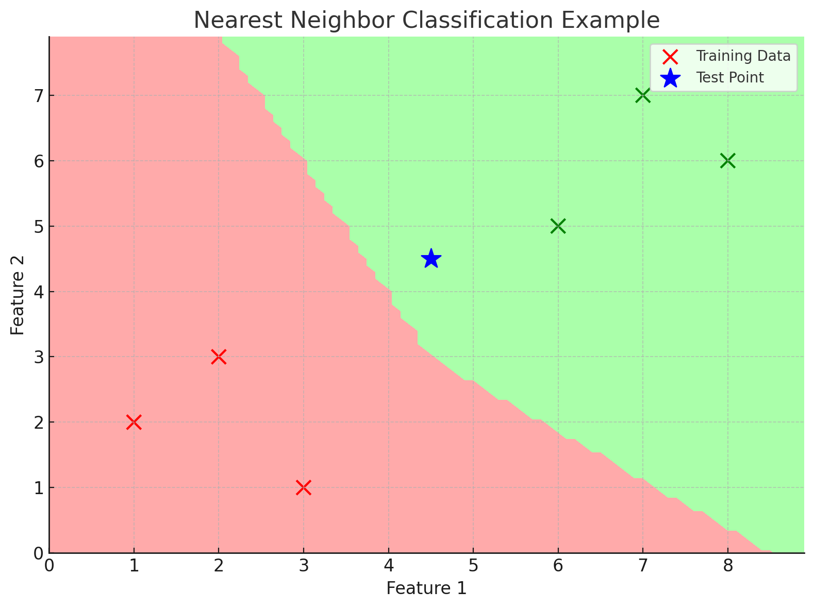
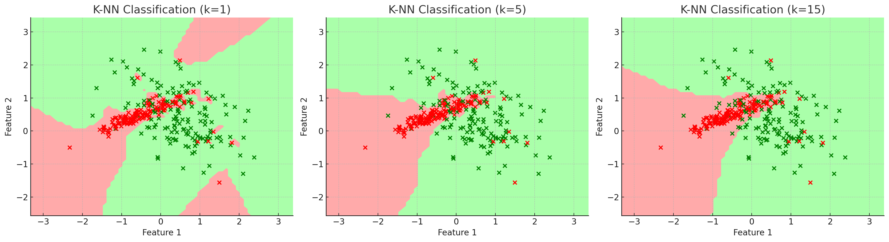
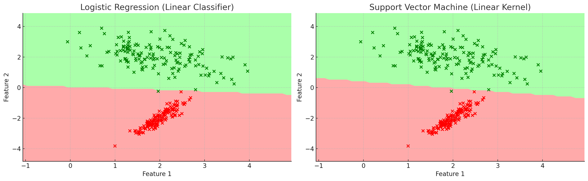
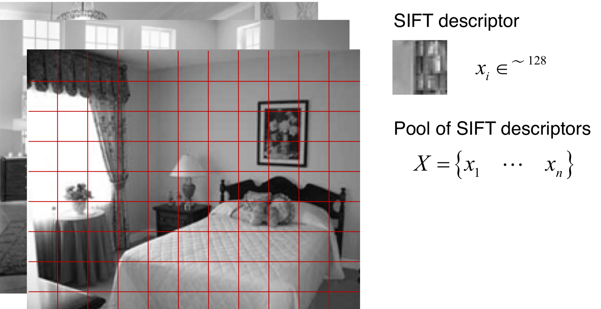
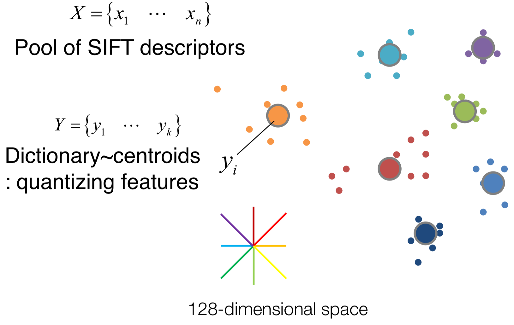
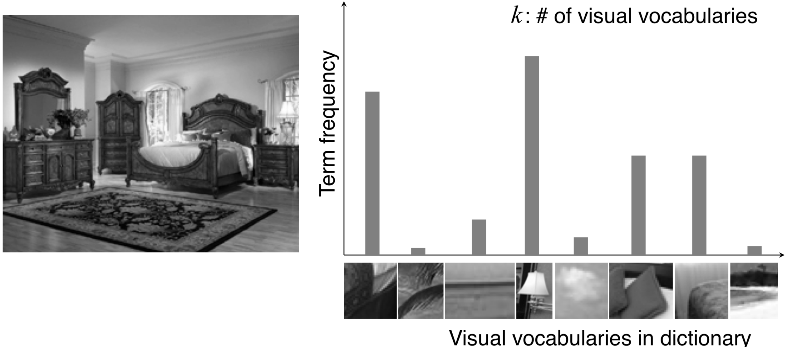

Object Recognition 문제는 주어진 이미지가 어떤 Class에 속하는지를 찾는 Classification 문제이다.  
Classification 문제를 풀기 위해서 Classifier 모델을 이용해야하는데, 다양한 Classifier 모델을 사용할 수 있다.  

## Nearest Neighbor Classifier
Nearest Neighbor Classifier는 주어진 이미지의 feature vector와 가장 가까운 Class의 feature vector를 찾아 해당 Class에 속한다고 판단하는 방법이다.

<figure>
    
    <figcaption>Nearest Neighbor Classifier</figcaption>
</figure>

위 그림은 Nearest Neighbor Classifier의 예시이다.  
어떤 데이터 포인트가 주어졌을때, 해당 데이터 포인트와 가장 가까운 Class의 feature vector를 찾아 해당 Class에 속한다고 판단한다.  
해당 방법은 따로 파라미터를 조정하거나 학습할 필요가 없고, 오직 training data에만 의존하기 때문에 매우 간단하다.  
다만 input이 주어졌을 때, 모든 training 데이터와 비교를 해야하기 때문에 계산량이 많고, training data에 따라 성능이 크게 달라질 수 있다.  
또한 outlier나 mislabeled data가 존재할 때, 성능에 큰 영향을 미치게 된다.  
이런 취약성을 보완하기위해 k개의 neighbor를 고려하는 방법이 있다.  

### k-Nearest Neighbor Classifier
k-Nearest Neighbor Classifier는 Nearest Neighbor Classifier의 변형으로, k개의 neighbor를 고려하여 가장 많이 등장하는 Class를 선택하는 방법이다.  
k개의 neighbor를 고려하기 때문에, outlier나 mislabeled data에 대해 비교적 강건하고 일반화된 boundary를 찾을 수 있다.
<figure>
    
    <figcaption>k-Nearest Neighbor Classifier</figcaption>
</figure>
위 그림에서 볼 수 있듯이, k값이 커질수록 Outlier와 mislabeled data에 대해 Robust한 Boundary를 찾을 수 있다.  

## Linear Classifier(Logistic Regression, SVM)
Linear Classifier는 주어진 데이터 포인트에 대해 Linear한 Decision Boundary를 찾는 방법이다.  
해당 방법은 Decision Boundary에 대한 기울기와 절편을 구하는 방법으로, 주어진 데이터 포인트에 대해 Linear한 Decision Boundary를 찾을 수 있다.  
<figure>
    
    <figcaption>Linear Classifier(Logistic Regression, SVM)</figcaption>
</figure>

## Bag of Words
이미지를 잘 분류하기 위해선, 이미지의 특징을 잘 표현할 수 있는 feature vector를 만들어야 한다. feature vector만 잘 만들면, 다양한 Classifier 모델을 사용해 이미지를 분류할 수 있다.  

하지만, 이미지의 특징을 잘 표현할 수 있는 feature vector를 만드는 것은 쉽지 않다.

만약 우리가 두개의 침실 사진을 비교해, 높은 correlation score를 갖게해서 침실라는 Class에 속한다고 판단하게 하도록 feature vector를 만들고 싶다고 가정해보자.  
해당 방법을 위해서는 SIFT, HOG와 같은 방법을 사용하더라도 그리 효과적인 성능을 보이기 어렵다. 왜냐하면, 침실라는 Class에 속하는 사진은 다양한 모양, 색깔, 방향 등을 갖고있을 것이기 때문이다.  

<figure style="display: flex; justify-content: space-around; align-items: center; gap: 20px;">
    

        
        <figcaption>침실1</figcaption>
    

    

        
        <figcaption>침실2</figcaption>
    

</figure>

위의 두 사진을 비교해보면, 침실라는 Class에 속하는 사진임을 쉽게 알 수 있지만, 색깔, 모양, 방향 등이 전혀 다르기 때문에, SIFT로 특징점을 잡아 비교하기도, HOG로 Edge를 잡아 비교하기도 힘들다.  

따라서, 해당 문제에 접근하기 위해서는, 침실이라는 Class에 속하는 사진의 부분적 구성요소를 찾아내고, 이를 바탕으로 침실이라는 Class에 속하는 사진을 표현할 수 있는 방법이 필요하다.  

예를 들어, 베개, 램프, 침대 등과 같은 침실을 구성하는 부분적 구성요소를 찾아내고, 이를 바탕으로 침실이라는 Class에 속하는 사진을 표현할 수 있다.  

이를 위해 일반적으로 사용되는 방법이 Bag of Words이다.

### How to Build Visual Dictionary

Bag of Words는 이미지의 부분적 구성요소를 찾아내고, 이를 바탕으로 어떤 Class에 속하는지를 판단하는 방법이다.  

이 부분적 구성 요소를 Visual Word라고 부르며, Visual Word를 담는 Visual Dictionary를 만들어야 한다.  

#### Step 1: Feature Extraction

<figure>
    
    <figcaption>Feature Extraction</figcaption>
</figure>

먼저, 이미지를 설명할 수 있는 Local Patch를 통해 해당 이미지를 설명할 수 있는 feature vector를 만들어야 한다.  

이 Local Patch는 무작위의 Patch를 선택해도 되지만, 그 이미지의 특징을 잘 설명할 수 있도록 SIFT, HOG와 같은 방법을 사용해 특징점을 잡을 수도 있다.  

이와 같은 방법으로, 주어진 데이터셋에 대해 Local Patch를 추출해 feature vector를 만들 수 있다.

#### Step 2: Clustering

<figure>
    
    <figcaption>Clustering</figcaption>
</figure>

이제, 주어진 데이터셋에 대해 Local Patch를 추출해 feature vector를 만들었으니, 해당 feature vector를 바탕으로 Clustering을 진행해야 한다.  

k-means clustering을 사용해 feature vector를 Clustering하면, 각 클러스터의 중심점이 Visual Word가 된다.  

#### Step 3: Representing Images by Frequency of Visual Words

이제, Visual Word를 바탕으로 이미지를 표현할 수 있다.

새로운 이미지가 입력되면, 해당 이미지에 대해 HOG, SIFT와 같은 방법을 사용해 feature vector들을 추출하고, 그 feature vector들이 어떤 Visual Word에 속하는지(가장 가까운 클러스터의 중심점) 찾아낸다.  

이제, 각 해당 이미지에서 뽑아낸 feature vector들이 어떤 Visual Word에 속하는지를 term frequency를 계산하면, 해당 이미지에 대한 histogram vector(Bag of Words)를 만들 수 있다.

<figure>
    
    <figcaption>Bag of Words</figcaption>
</figure>

#### Step 4: Classification

이렇게 추출한 histogram vector를 바탕으로, 분류기 모델(KNN, SVM 등)을 사용해 이미지를 분류할 수 있다.

## Connection to Modern Deep Learning
Bag of Words는 이미지의 부분적 구성요소를 찾아내고, 이를 바탕으로 어떤 Class에 속하는지를 판단하는 방법이다.  

위 방법은 사람이 직접 feature extractor를 설계하고, 해당 feature extractor의 출력값을 바탕으로 classifier를 기계학습하는 방법이다.  

하지만 오늘날의 Deep Learning에서는, feature extractor 역시 기계학습 과정에서 학습하도록 설계된다. 

---
해당 포스트는 서울대학교 컴퓨터공학부 주한별 교수님의 컴퓨터비전 25-1학기 강의를 정리한 내용입니다.