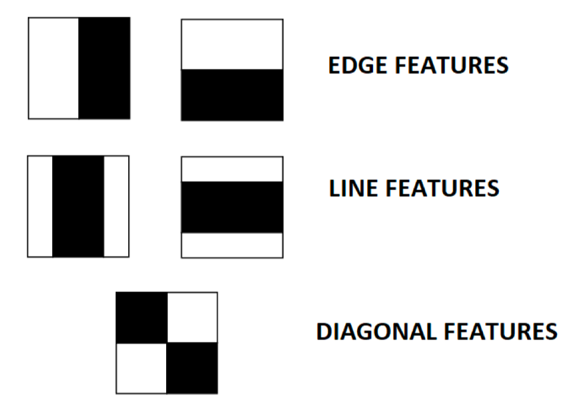
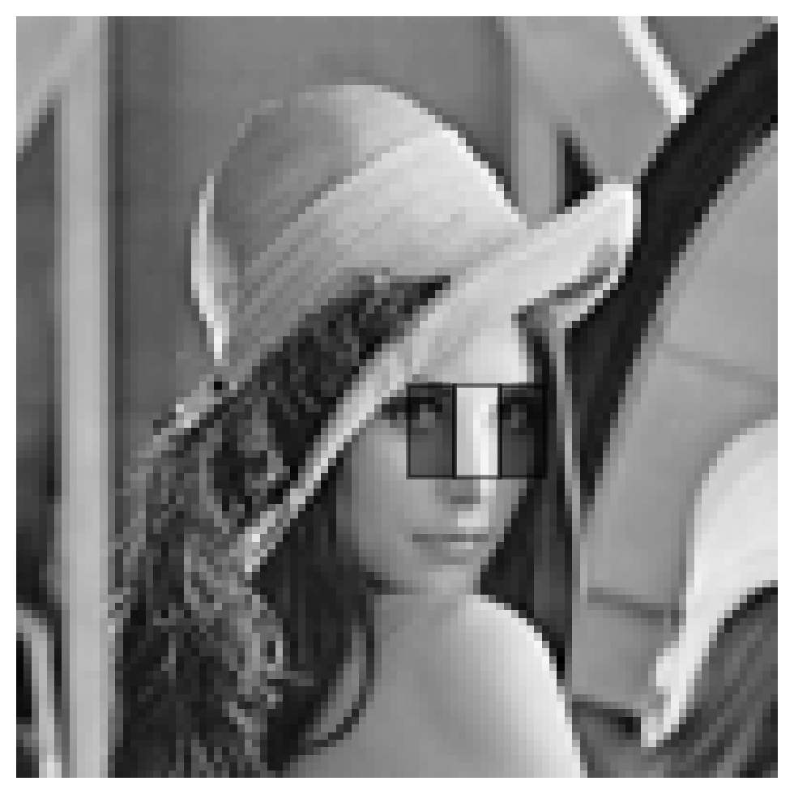
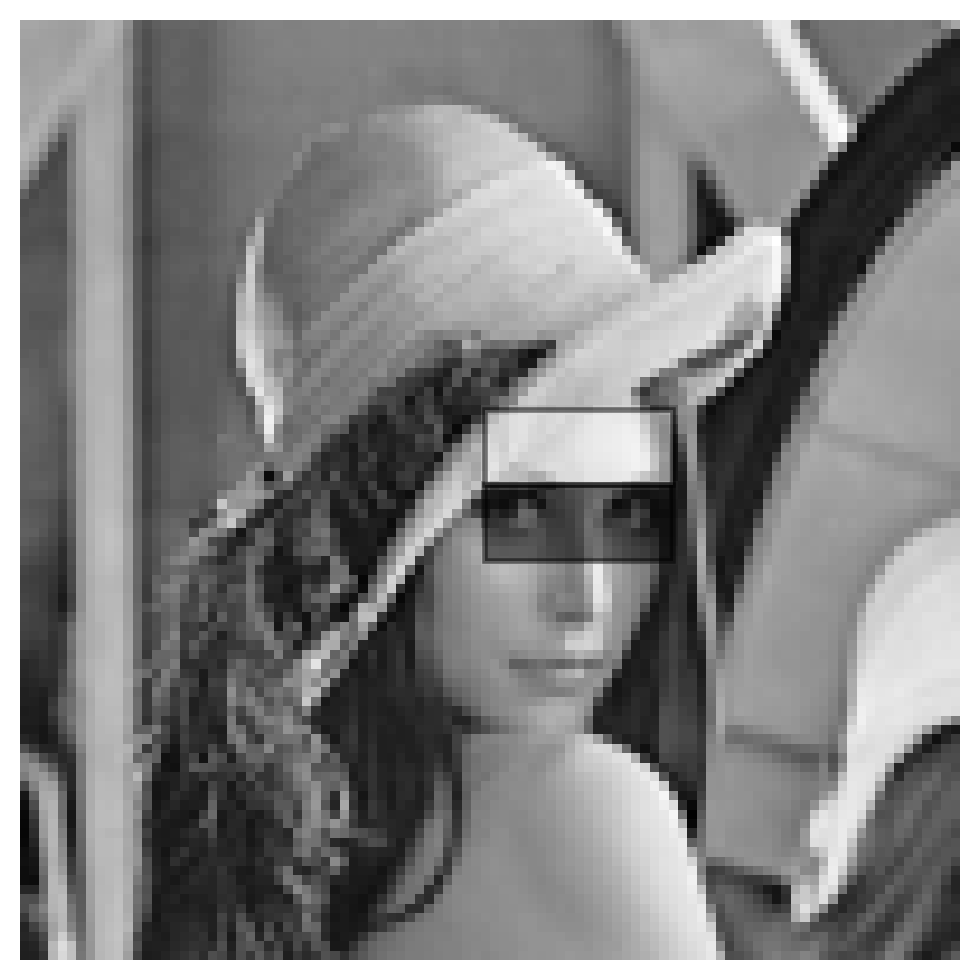
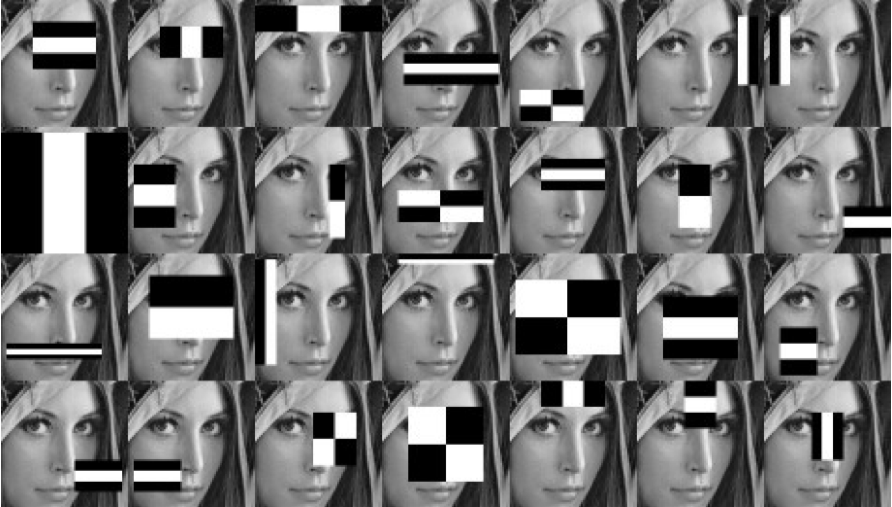
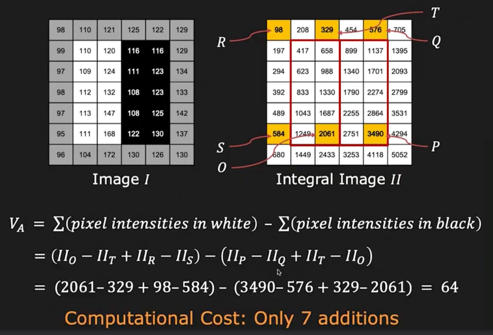
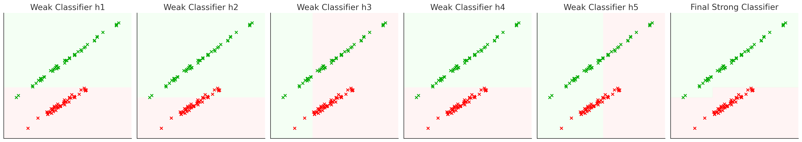
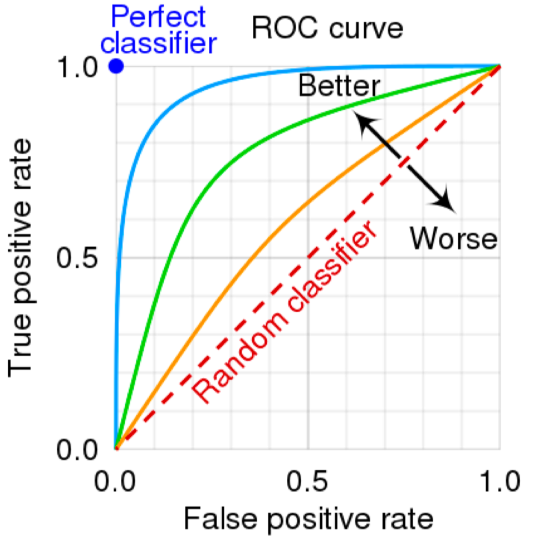
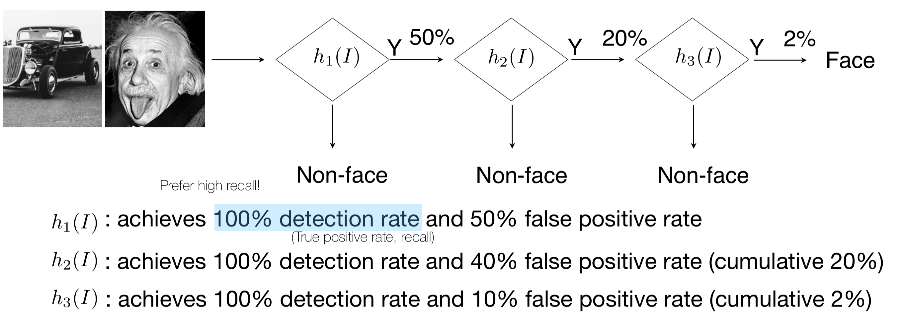

## Face Detection
Face Detection은 이미지에서 얼굴을 찾는 문제이다. 이 문제는 같은 얼굴을 찾는 Face Recognition 문제와는 다르다.  

Face Detection을 위해서 HOG와 같은 방법을 사용한다면, 정확한 얼굴을 찾을 수 있더라도, 모든 sliding window에 대해 HOG를 계산해야하기 때문에 계산량이 많고 느리다. 또한 어떤 이미지에서 얼굴 사진이 갖는 비율은 보통 매우 낮기 때문에, 확인하지 않아도 되는 수많은 window(negative sample)에 대해 HOG를 계산해야하기 때문에 비효율적이다.  

만약 얼굴 인식이 실시간으로 이루어져야 한다면, HOG와 같은 방법을 사용하기에는 계산량이 너무 많고 느리다.  

### Viola-Jones Face Detector
Viola-Jones Face Detector는 얼굴을 특징짓는 특별한 filter인 Haar-like feature를 사용하여 얼굴을 찾는 방법이다. 

#### Haar-like feature
Haar-like feature는 얼굴의 특징을 나타내는 여러 개의 직사각형 영역을 사용하여 얼굴을 찾는 방법이다. Haar-like feature는 Haar wavelet을 기반으로 하며, 이미지의 밝기 차이를 이용하여 특징을 추출한다.   

<figure>
    
    <figcaption>Haar-like feature(Edge, Line, Diagonal)</figcaption>
</figure>

<figure style="display: flex; justify-content: space-around; align-items: center; gap: 20px;">
    

        
        <figcaption>Haar-like feature(Nose)</figcaption>
    

    

        
        <figcaption>Haar-like feature(Eye)</figcaption>
    

</figure>

위 사진의 필터 모양에서 흰색 영역의 픽셀 값의 합에서 검은색 영역의 픽셀 값을 뺀 값이 Haar-like feature의 값이 된다.

위와 같이 얼굴의 특징을 나타낼 수 있는 여러 수많은 Haar-like feature를 이미지의 여러 위치에 적용하여, 얼굴을 찾게 된다.  

Harr-like feature는 24x24 픽셀의 작은 윈도우에 대해 적용되며, 수많은 크기와 모양의 서로 다른 Haar-like feature가 사용된다.  

따라서 한 윈도우 안에 수십만개의 적용 가능한 Haar-like feature가 존재하지만, 모든 Haar-like feature가 유용한 것은 아니다. 따라서, 주어진 데이터셋에 대해 효과적인 Haar-like feature를 선택하는 방법이 필요하다.  

<figure>
    
    <figcaption>수많은 Haar-like feature</figcaption>
</figure>

#### Computing Haar-like feature

효과적인 Haar-like feature를 선택하는 방법에 앞서, Haar-like feature를 계산하는 방법을 알아보자.  

Haar-like feature는 이미지에서 특정 영역과 특정 영역의 밝기 차이를 이용하여 계산된다. 즉, filter가 sliding window를 통해 움직일 때마다 해당 영역에 해당하는 직사각형 영역의 픽셀 값의 합을 계산하여야 한다.  

하지만 이와 같이 수많은 필터에 대해 매번 픽셀 차이를 계산하는 것은 비효율적이다$O(n^2)$. 따라서, 시간 복잡도를 줄이기 위해, Integral Image라는 방법을 사용한다.

- **Integral Image**: 이미지의 각 픽셀에 대해, 해당 픽셀을 이전의 픽셀들을 모두 더한 값을 저장하는 이미지 행렬.  

    $$
    I'(x, y) = \sum_{i=0}^{x} \sum_{j=0}^{y} I(i, j)
    $$

    - 예시:  

    $$
    I = \begin{bmatrix}
        1 & 2 & 3 \\
        4 & 5 & 6 \\
        7 & 8 & 9
    \end{bmatrix}
    \Rightarrow
    I' = \begin{bmatrix}
        1 & 3 & 6 \\
        5 & 12 & 21 \\
        12 & 27 & 45
    \end{bmatrix}
    $$  

    위 행렬에서, 이미지 $I$의 $(1,1)$으로부터 $(2,2)$까지의 영역의 합은 $I'(2, 2) - I'(0, 2) - I'(2, 0) + I'(0, 0)$로 계산할 수 있다.  

    $$
    I = \begin{bmatrix}
        A & B \\
        C & D
    \end{bmatrix}
    $$  

    위 행렬에서, $D$영역을 계산하고 싶다면, $D - B - C + A$로 계산할 수 있다.  

    이와 같이 Integral Image를 사용하면, Haar-like feature를 계산하는데 필요한 픽셀 차이를 빠르게 계산할 수 있다.

    <figure>
        
        <figcaption>Integral Image를 이용해 Haar-like feature를 7번의 연산만에 계산</figcaption>
    </figure>  

#### AdaBoost Training

Haar-like feature를 계산하는 방법을 알았다면, 이제 효과적인 Haar-like feature를 선택하는 방법을 알아보자.  

수많은 Haar-like feature가 존재하지만, 모든 Haar-like feature가 유용한 것은 아니다. 따라서, 주어진 데이터셋에 대해 효과적인 Haar-like feature를 선택하는 방법이 필요하다.  

효과적인 Haar-like feature를 선택하기 위해, AdaBoost라는 머신러닝 알고리즘을 사용한다.   

**AdaBoost**는 여러 개의 약한 분류기를 결합하여 강한 분류기를 만드는 방법이다. AdaBoost는 여러 개의 약한 분류기를 평가하여, 가장 좋은 분류기들을 선택하고, 이들을 결합하여 효과적인 강한 분류기를 만드는 방법이다.  

<figure>
    
    <figcaption>단계별 분류기</figcaption>
</figure> 
 
위 그림과 같이, AdaBoost는 여러 개의 약한 분류기를 결합하여 강한 분류기를 만든다. 첫 단계에서는 가장 주어진 데이터셋에 대해 잘 분류하는 약한 분류기를 선택하고, 이후 단계에서는 이전 단계에서 잘 분류하지 못한 데이터셋에 대해 가중치를 부여하여, 다음 단계에서는 이전 단계에서 잘 분류하지 못한 데이터셋을 잘 분류하는 약한 분류기를 선택한다.  
이러한 과정을 반복하여, 여러 개의 약한 분류기를 결합하여 강한 분류기를 만든다.  

실제로 Haar-like feature를 AdaBoost를 사용하여 선택하는 방법은 다음과 같다.

1. 데이터 구성과 초기 가중치 설정  
   이미지 내 모든 샘플(24x24 픽셀의 윈도우)에 대해, $(x_i, y_i)$의 데이터셋을 구성한다. 이때 $x_i$는 하나의 샘플을 의미하고, $y_i$는 해당 샘플이 얼굴인지 아닌지를 나타내는 레이블이다.  
   각 샘플은 가중치 $w_i$를 갖는다. 초기 가중치는 모든 샘플에 대해 동일하게 설정하는데, 레이블이 균형이 맞지 않더라도 양쪽 합이 0.5가 되도록 설정한다.  

   $$ 
   w_{1,i} = \frac{1}{2m} \ \text{or} \ \frac{1}{2n}
   $$

   - $m$: number of negative samples(비얼굴)
   - $n$: number of positive samples(얼굴)
   - $w_{1,i}$: $i$번째 샘플의 초기 가중치(모든 샘플에 대해 동일하게 설정)

2. 반복학습  
    $t$번째 반복학습에서는 다음과 같은 과정을 거친다.  
    1. 전 단계에서 업데이트된 가중치 $w_{t,i}$를 다음과 같이 정규화한다.  

        $$
        w_{t,i} = \frac{w_{t,i}}{\sum_{j=1}^{n} w_{t,j}}
        $$

    2. 각 Haar-like feature $h_j$에 대해 오류율 $\epsilon_j$를 계산한다.  
        오류율은 다음과 같이 계산된다.  

        $$
        \epsilon_j = \sum_{i=1}^{n} w_{t,i} \cdot I(h_j(x_i) \neq y_i)
        $$

        - $I(h_j(x_i) \neq y_i)$: $h_j$가 $x_i$를 잘 분류하지 못한 경우 1, 잘 분류한 경우 0
        - $h_j$: Haar-like feature
        - $x_i$: $i$번째 샘플
        - $y_i$: $i$번째 샘플의 레이블
        - $w_{t,i}$: $i$번째 샘플의 $t$번째 반복학습에서의 가중치
    
    3. 오류율($\epsilon_j$)이 가장 작은 Haar-like feature $h_j$를 현재 단계의 weak classifier $h_t$로 선택한다.  

    4. 해당 오류율 $\epsilon_t$를 기반으로, 새로운 가중치 $w_{t+1,i}$를 계산한다.  
        새로운 가중치는 다음과 같이 계산된다.  

        $$
        w_{t+1,i} = w_{t,i} \cdot \beta_t^{1 - e_i}, \quad \text{where} \ \beta_t = \frac{\epsilon_t}{1 - \epsilon_t}
        $$  
        - $e_i$: $i$번째 샘플이 잘 분류되지 않은 경우 1, 잘 분류한 경우 0

    5. 해당 과정을 $T$번 반복한다.  

3. 최종 분류기
    최종 분류기는 다음과 같이 계산된다.  

    $$
    H(x) = \sum_{t=1}^{T} \alpha_t h_t(x), \quad \text{where} \ \alpha_t = \log \frac{1 - \epsilon_t}{\epsilon_t}
    $$

    - $H(x)$: 최종 분류기
    - $h_t(x)$: $t$번째 약한 분류기
    - $\alpha_t$: $t$번째 약한 분류기의 가중치  

    해당 분류기는 입력된 이미지 $x$에 대해, 각 약한 분류기 $h_t(x)$의 가중치 $\alpha_t$를 곱하여 합산한 값이 0보다 크면 얼굴로 판단하고, 0보다 작으면 얼굴이 아니라고 판단한다.  

#### Cascade Classifier
이렇게 훈련한 단일 분류기로도 높은 정확도로 얼굴을 찾을 수 있지만, 수많은 Haar-like feature를 사용하기 때문에 계산량이 많고 느리다. 얼굴 인식 문제에서 시간이 낭비되는 것은, 얼굴이 아닌 수많은 negative sample에 대해 Haar-like feature를 계산하는 것이다.  

확실히 얼굴이 아닌 negative sample에 대해서는 Haar-like feature를 계산하지 않도록 설계한다면, 계산량을 줄일 수 있다. 이를 위해 Cascade Classifier를 사용한다.  

Cascade Classifier는 여러 개의 분류기를 순차적으로 적용하여, 각 단계에서 얼굴이 아닌 negative sample을 제거하는 방법이다. 초기 단계에서는 "느슨한" 분류기를 사용하여, positive sample이 걸러지지 않도록 하며 negative sample을 최대한 제거한다. 이후 단계가 올라갈수록 점점 "엄격한" 분류기를 사용하여, positive sample이 걸러지지 않도록 하며 negative sample을 제거한다.  

- **Measuring Classification Performance**  
    - True Positive: Positve를 Positive로 잘 분류한 경우
    - True Negative: Negative를 Negative로 잘 분류한 경우
    - False Positive: 비얼굴을 얼굴로 잘못 분류한 경우
    - False Negative: 얼굴을 비얼굴로 잘못 분류한 경우

    | Predicted\Actual | Positive       | Negative       |
    | ---------------- | -------------- | -------------- |
    | Positive         | True Positive  | False Negative |
    | Negative         | False Positive | True Negative  |

    - **Precision**: Positive로 분류한 것 중에서 실제 Positive인 것의 비율(얼마나 엄격하게 Positive로 분류했는지)  

        $$
        Precision = \frac{TP}{TP + FP}
        $$  

    - **Recall**: 실제 Positive 중에서 Positive로 분류한 것의 비율(얼마나 Positive를 놓치지 않았는지)  

        $$
        Recall = \frac{TP}{TP + FN}
        $$

    - **F1 Score**: Precision과 Recall의 조화 평균  

        $$
        F1 = \frac{2 \cdot Precision \cdot Recall}{Precision + Recall}
        $$

    - **Accuracy**: 전체 샘플 중에서 잘 분류한 것의 비율  

        $$
        Accuracy = \frac{TP + TN}{TP + TN + FP + FN}
        $$  

    - **ROC Curve**: True Positive Rate와 False Positive Rate의 관계를 나타내는 그래프  

    <figure>
        
    </figure>

    - **AUC**: ROC Curve 아래 면적. AUC가 1에 가까울수록 좋은 성능을 나타낸다.

<figure>
    
    <figcaption>Cascade Classifier의 예시</figcaption>
</figure>

위 그림에서는, 각 단계별 분류기가 어떤 성능으로 분류하는지를 나타낸다. 
- 첫번째 분류기는 100%의 Recall, 50%의 False Positive가 발생한다. 
- 두번째 분류기는 100%의 Recall, 40%의 False Positive가 발생한다. 
- 세번째 분류기는 100%의 Recall을 가지지만, 10%의 False Positive가 발생한다.  

각각의 분류기들은 비교적 높은 False Positive를 가지지만, 세 분류기를 거쳐 남는 False Positive는 2%에 불과하다.  

즉 많은 feature를 사용하여 하나의 좋은 AdaBoost 분류기를 만드는 것보다, 여러 개의 적은 feature를 사용한 AdaBoost 분류기를 여러 개 만드는 것이 성능은 유지하면서 계산량을 줄일 수 있다.  

---
해당 포스트는 서울대학교 컴퓨터공학부 주한별 교수님의 컴퓨터비전 25-1학기 강의를 정리한 내용입니다.