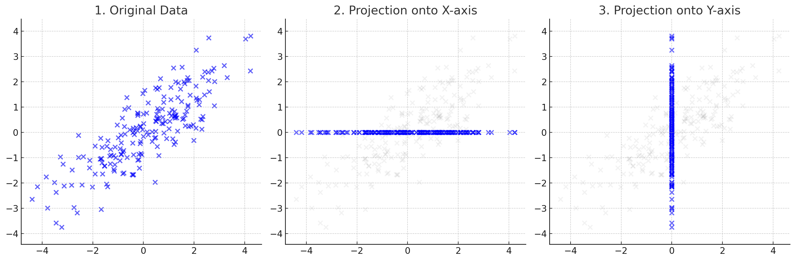
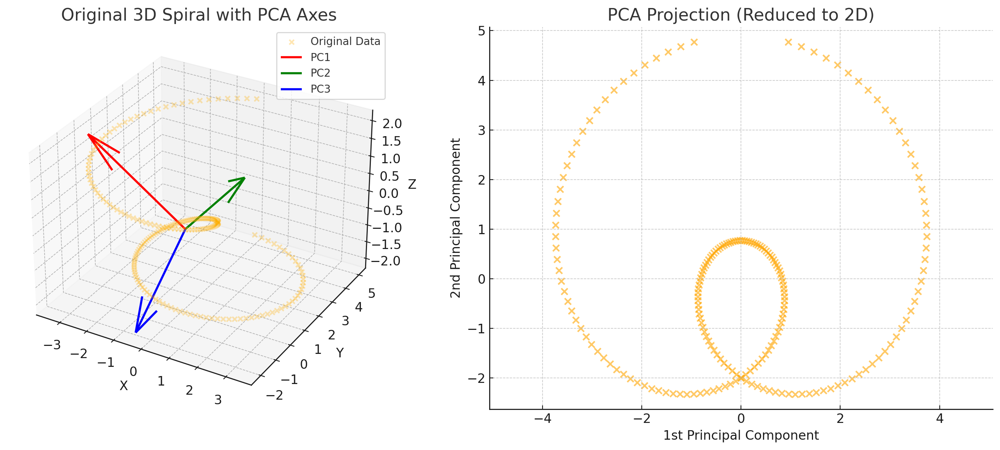
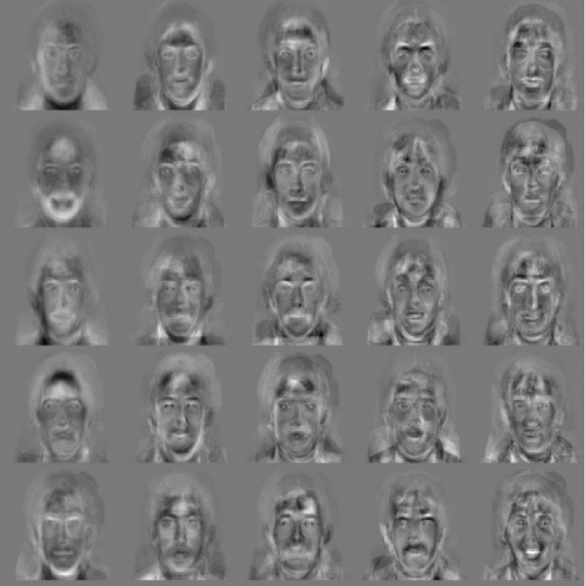

## PCA

어떤 고차원의 정보를 저차원으로 압축할 때, 가장 정보를 잘 보존하는 방법은 무엇일까? 

<figure>
    
    <figcaption>2차원 정보 1차원으로 압축</figcaption>
</figure>

위 그림은 2차원 데이터를 각각 x축과 y축으로 압축한 것이다. 하지만, 이와 같은 압축이 최적이라고 말하긴 어렵다. 압축했을때의 정보 손실, 즉 각 축에서 데이터포인트까지의 거리를 최소화할 때, 원래 데이터의 정보를 잘 보존한다고 할 수 있다.  

**PCA(Principal Component Analysis)** 는 이러한 압축을 수행하는 방법 중 하나로, 데이터의 분산을 최대화하는 방향을 축으로하여 저차원으로 압축하는 방법이다.  

PCA는 데이터의 분산을 최대화하는 방향을 찾기 위해, 공분산 행렬을 계산하고, 이 행렬의 고유벡터를 구하여 새로운 축을 정의한다.  

이와 같은 방법으로 분산을 최대화할 수 있는 이유는 다음과 같다:

- 주어진 데이터가 $u$방향으로 projection 되었을 때, 가장 큰 분산을 갖도록 하는 $u$를 찾도록 해야한다.(평균이 0이라고 가정)

- 주어진 데이터 $x_i$에 대해, $u$방향으로 projection된 값은 $u^T x_i$이다.

- 이때, $u$방향으로 projection 되었을 때의 분산은 다음과 같이 표현할 수 있다.

$$
\frac{1}{M}\sum_{i=1}^M (u^T x_i)^2
$$

- 위 식에서 $u^T x_i$는 $x_i$를 $u$방향으로 projection한 스칼라 값이다.
- 위 식은 해당 값의 제곱을 평균한 값으로, 평균이 0이라고 가정했으므로, 분산을 의미한다.
- 위 식을 다음과 같이 변형할 수 있다.  

$$
\frac{1}{M}\sum_{i=1}^M (u^T x_i)^2 = \frac{1}{M}\sum_{i=1}^M u^T x_i x_i^T u = u^T \left(\frac{1}{M}\sum_{i=1}^M x_i x_i^T\right) u
$$

- 위 식에서 $C = \frac{1}{M}\sum_{i=1}^M x_i x_i^T$는 공분산 행렬이다. 

- 따라서, $u$방향으로 projection 되었을 때의 분산은 $u^T C u$로 표현할 수 있다.

- 따라서 $u$를 찾는 문제는 $u^T C u$를 최대화하는 $u$를 찾는 문제로 변환할 수 있다.  

- 이때, $u$는 단위 벡터이므로, $||u||^2 = 1$이라는 제약조건을 추가할 수 있다.
- 따라서, $u$를 찾는 문제는 다음과 같이 표현할 수 있다.  

$$
\begin{align}
    \max_{u} u^T C u \\
    s.t. \quad ||u||^2 = 1
\end{align}
$$

- 위 문제는 Lagrange multiplier를 사용하여 다음과 같이 변형할 수 있다.  

$$
\begin{align}
    \max_{u} u^T C u - \lambda (u^T u - 1) \\
    \frac{\partial}{\partial u} (u^T C u - \lambda (u^T u - 1)) = 0
\end{align}
$$

- 위 식을 정리하면 다음과 같다.  

$$
C u = \lambda u
$$

- 위 식은 고유값 문제로, $C$의 고유값 $\lambda$와 고유벡터 $u$를 찾는 문제로 변환할 수 있다.
- 따라서, 공분산 행렬 $C$의 고유값과 고유벡터를 구하면, 투영시 분산을 최대화 하는 축을 찾을 수 있다.

### Dimensionality Reduction

위 사례에서는 한개의 축(가장 큰 고유값에 해당하는 고유벡터)만을 사용하여 저차원으로 압축하였다. 하지만, PCA는 고차원의 정보를 원하는 만큼 축을 선택하여 해당 차원으로 압축할 수 있다.  

예를 틀어 $m$차원의 데이터 $x_i \in \mathbb{R^m}$에 대해 $n$차원 정보로 압축하고 싶다면, 공분산 행렬 $C$의 고유값을 내림차순으로 정렬하여 $n$개의 고유벡터를 선택하면 된다.

$$
y_i = \begin{bmatrix}
    u_1^T x_i \\
    u_2^T x_i \\
    \vdots \\
    u_n^T x_i
\end{bmatrix} \in \mathbb{R^n}
$$

<figure>
    
    <figcaption>3차원 정보 2차원으로 압축</figcaption>
</figure>

### PCA as SVD
위 과정에서 "주성분" $u_i$를 찾기 위해 공분산 행렬 $C$의 고유값을 구하는 방법을 사용하였다. 이때, 공분산 행렬 $C$는 $\frac{1}{M} X^T X$로 표현된다. 이는 scaling factor $1/M$을 제외하면, $X^T X$와 같다. 따라서 지금껏 수행한 PCA는 $X^T X$의 고유값과 고유벡터를 구하는 과정과 같다.   

따라서, PCA는 SVD(Singular Value Decomposition)로도 표현할 수 있다.

$$
X = U \Sigma V^T
$$

- $X$: $n$차원의 데이터 $M$개로 구성된 $n \times M$ 행렬
- $U$: $X^T X$(공분산)의 고유벡터로 구성된 $n \times n$ 직교행렬
- $\Sigma$: $X^T X$의 고유값으로 구성된 $n \times M$ 대각행렬
- $V$: $X X^T$의 고유벡터로 구성된 $M \times M$ 직교행렬

이때, $k$개의 주성분으로 데이터를 압축하는 것은, $U$, $\Sigma$, $V$의 앞 $k$개 행렬을 선택하여 $X$를 근사하는 것이다.  

$$
X \approx U_k \Sigma_k V_k^T
$$

이때, $\Sigma_k V_k^T$의 열벡터는 각각 $x_i$가 k개의 주성분으로 표현된($y_i = U^T x_i$) 값이다. 즉, $y_i$는 $x_i$를 $k$개의 주성분으로 표현한 값이다.

원본 데이터 $x_i$를 거꾸로 $U_k$의 $k$개의 주성분으로 표현할 수도 있다.

$$
x_i \approx y_i^1 u_1 + y_i^2 u_2 + \cdots + y_i^k u_k
$$  

- $y_i^j$: $y_i$의 $j$번째 원소

즉 압축된 데이터 $y_i$의 원소를 계수로 주성분 $u_1, u_2, \cdots, u_k$를 선형결합하여 원본 데이터 $x_i$를 근사할 수 있다.

## Eigenface
Eigenface는 PCA를 사용하여 얼굴 이미지를 압축하고, 얼굴 인식에 활용하는 방법이다.    

앞서 살펴본 PCA는 원본 데이터 정보를 최대한 그 특징을 보존하면서 저차원으로 압축하는 방법이다.  

인간의 얼굴 역시 고차원 정보를 갖고 있지만, 공통적인 패턴을 갖고 있고, 이 패턴을 PCA를 사용해 저차원 정보로 압축한다면 특징을 보존하면서 저차원으로 압축할 수 있다.  

### Procedure
Eigenface는 다음과 같은 과정을 거쳐 얼굴 이미지를 압축한다.  

1. 얼굴 이미지 데이터셋을 준비한다.
2. 얼굴 이미지의 평균을 계산한다.
3. 각 얼굴 이미지에서 평균을 빼준다.
4. 각 얼굴 이미지에 대해 공분산 행렬을 계산한다.
5. 공분산 행렬의 고유값과 고유벡터를 구한다.
6. $k$개의 고유벡터($u_1, u_2, \cdots, u_k$)를 선택한다.

이제 각 얼굴은 다음과 같이 근사될 수 있다.  

$$
x_i \approx \bar{x} + \sum_{j=1}^k \alpha_i^j u_j
$$

- $x_i$: $i$번째 얼굴 이미지
- $\bar{x}$: 얼굴 이미지의 평균
- $u_j$: $j$번째 주성분
- $\alpha_i^j$: $u_j^T(x_i - \bar{x})$로, 주성분 $u_j$에 대한 $x_i$의 계수

각 eigenface $u_j$는 얼굴 이미지의 주성분을 나타내며, 각 얼굴 이미지는 이 주성분을 선형 결합하여 근사할 수 있다. 해당 값에 대응되는 이미지는 흐릿한 얼굴 모양의 패턴 이미지로 나타난다. 

<figure>
    
</figure>

### How to Recognize

Eigenface를 사용하여 얼굴을 인식하는 방법은 다음과 같다.

- **학습**  
    1. 얼굴 이미지 데이터셋을 준비한다.
    2. 평균 얼굴 및 주성분(eigenface)을 계산한다.
    3. 각 얼굴 이미지 $x_i$를 주성분으로 투영하고, 특징벡터($\alpha_i$)를 저장한다.

- **인식**
    1. 인식할 얼굴 이미지 $x$를 준비한다.
    2. 평균 얼굴을 빼준다.
    3. 주성분으로 투영하고, 특징벡터($\alpha_{test}$)를 계산한다.
    4. 학습된 특징벡터($\alpha_i$)와 인식된 특징벡터($\alpha_{test}$) 간의 거리를 계산한다.
    5. 가장 가까운 특징벡터를 갖는 얼굴 이미지를 인식 결과로 선택한다.

---
해당 포스트는 서울대학교 컴퓨터공학부 주한별 교수님의 컴퓨터비전 25-1학기 강의를 정리한 내용입니다.