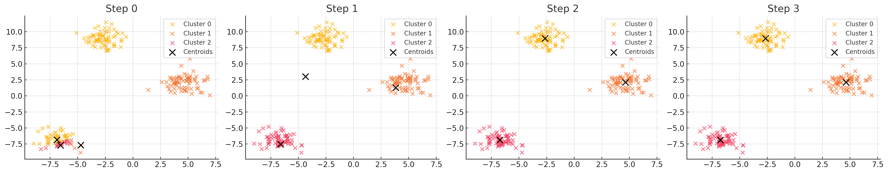
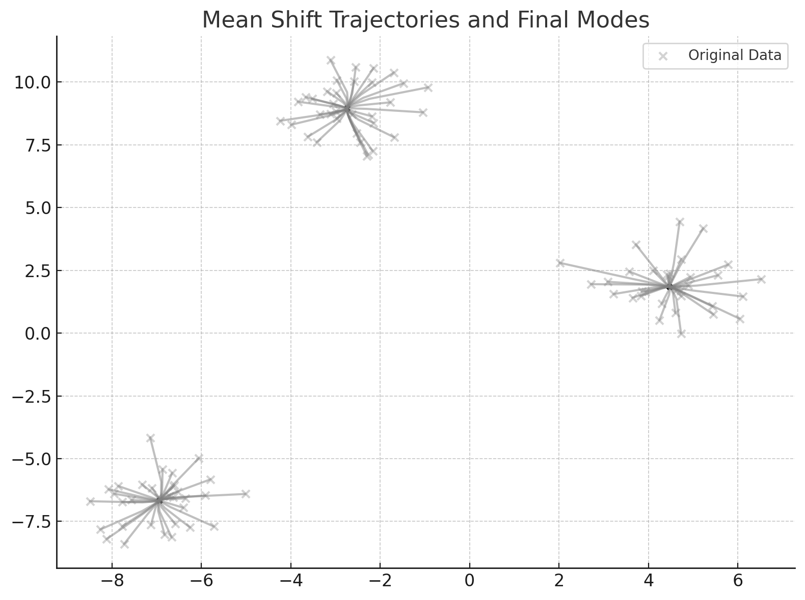
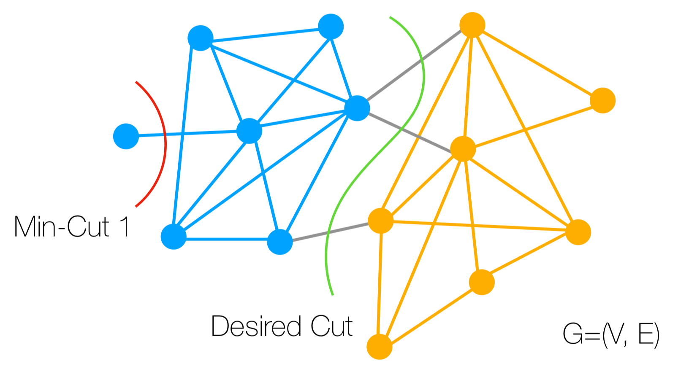

## Segmentation
Segmentation은 이미지에서 서로 다른 객체를 구분하는 작업을 의미한다.  

이때, 단순한 Object Detection과 달리 Segmentation은 이미지의 각 픽셀에 대해 객체의 레이블을 할당하는 작업이다.
즉, Segmentation은 이미지의 각 픽셀에 대해 해당 픽셀이 어떤 객체에 속하는지를 판단하는 작업이다.  

예를 들어 이미지에서, 도로, 보행자, 자동차 등과 같은 서로 다른 객체를 구분하는 작업 혹은 배경과 객체를 구분하는 작업을 Segmentation이라고 할 수 있다.  

### Clustering
Segmentation을 수행하기 위해 가장 먼저 할 수 있는 방법은 Clustering을 사용하는 것이다.  

Clustering은 레이블이 없는 각 데이터 포인트를 서로 비슷한 데이터끼리 묶는 방법이다.  
Clustering을 통해 Segmentation을 수행하기 위해서는, 각 픽셀을 데이터 포인트로 간주하고, 각 픽셀의 특징을 바탕으로 Clustering을 수행하여 서로 비슷한 픽셀끼리 묶는 방법을 사용할 수 있다.

#### K-means Clustering
K-means Clustering은 가장 간단한 Clustering 방법 중 하나로, 각 데이터 포인트를 K개의 클러스터로 나누는 방법이다.   

K-means Clustering은 다음과 같은 과정을 통해 수행된다:  
1. K개의 클러스터 중심을 랜덤하게 초기화한다.  

    $$
    c_1, c_2, \ldots, c_k \in \mathbb{R}^d
    $$

2. 각 데이터 포인트를 가장 가까운 클러스터 중심에 할당한다.  
    
    $$
    m_j := \arg\min_{i} ||x_j - c_i||^2
    $$

    여기서 $m_j$는 데이터 포인트 $x_j$가 속하는 클러스터의 인덱스이다.

3. 각 클러스터 중심을 해당 클러스터에 속하는 데이터 포인트의 평균으로 업데이트한다.  

    $$
    c_i := \frac{1}{|C_i|} \sum_{j \in C_i} x_j
    $$  

5. 2-3단계를 반복하여 클러스터 중심이 더 이상 변화하지 않을 때까지 수행한다.

<figure>
    
    <figcaption>K-means Clustering</figcaption>
</figure>

위 그림은 K-means Clustering을 수행하는 과정을 보여준다. 초기에는 무작위로 초기화되어 이해하기 힘든 클러스터링이 이루어지지만, 반복을 통해 클러스터 중심이 업데이트되고, 각 데이터 포인트가 가장 가까운 클러스터에 할당되면서 점점 더 명확한 클러스터링이 이루어진다.  

K-means Clustering은 다음과 같은 사항들을 고려해야 한다:
- K-means Clustering은 클러스터의 개수를 미리 지정해야 하는데, 어떤 k값을 선택해야 할지 알기 어렵다.
- 초기 Centroid의 위치를 정하는 기준 역시 없다.
- 유클리드 거리가 최소화되는 클러스터링을 수행하기 때문에, 클러스터의 모양이 구형으로 가정된다.

#### Mean Shift
Mean Shift는 K-means Clustering의 단점을 보완하기 위해 제안된 방법으로, 클러스터의 개수를 미리 지정할 필요가 없고, 클러스터의 모양이 구형이 아닐 때에도 사용할 수 있는 방법이다.  

Mean Shift는 데이터 포인트의 밀도가 높은 곳으로 이동하는 방법으로, 데이터 포인트의 밀도가 높은 곳을 클러스터 중심으로 설정하는 방법이다.  

Mean Shift는 다음과 같은 과정을 통해 수행된다:   
1. 각 데이터 포인트 $x_i$에 대해, 해당 데이터 포인트를 중심으로 하는 추적용 포인트 $x_i^{(t)}$를 초기화한다.  

    $$
    x_i^{(0)} = x_i
    $$

2. 추적용 포인트 $x_i^{(t)}$에 대해, 해당 포인트를 중심으로 하는 반경 $r$의 영역 내의 데이터 포인트들의 가중 평균을 계산한다.  

    $$
    x_i^{(t+1)} = \frac{\sum_{j=1}^{n} K(x_i^{(t)} - x_j) x_j}{\sum_{j=1}^{n} K(x_i^{(t)} - x_j)}
    $$

    여기서 $K$는 커널 함수이다.
    - $K(x_i^{(t)} - x_j)$는 $x_i^{(t)}$와 $x_j$의 거리에 대한 커널 함수로, 일반적으로 가우시안 커널을 사용한다.
    - $r$은 반경으로, 데이터 포인트의 밀도를 계산하는 범위를 의미한다.
      - $r$이 너무 작으면, 데이터 포인트의 밀도가 너무 세밀하게 계산되어 노이즈에 민감해질 수 있다.
      - $r$이 너무 크면, 데이터 포인트의 밀도가 너무 부드럽게 계산되어 클러스터가 합쳐질 수 있다.

3. 2단계를 반복하여, 추적용 포인트 $x_i^{(t)}$가 더 이상 변화하지 않을 때까지 수행한다.

4. 모든 데이터 포인트에 대해 위의 과정을 반복하고, 각 데이터 포인트가 수렴한 위치(Attraction Basin)에 따라 클러스터를 형성한다.

<figure>
    
    <figcaption>Mean Shift</figcaption>
</figure>

Mean Shift는 K-means Clustering과 달리 클러스터의 개수를 미리 지정할 필요가 없고, 클러스터의 모양이 구형이 아닐 때에도 사용할 수 있다.  
하지만, Mean Shift는 계산량이 많고, 커널 함수의 선택에 따라 결과가 달라질 수 있다. 또한 고차원 데이터에 대해서는 성능이 저하될 수 있다.  

### Graph-based Segmentation
Graph-based Segmentation은 이미지의 픽셀을 그래프의 노드 $V$로 간주하고, 픽셀 간의 유사성을 그래프의 엣지 $E$로 표현하여 Segmentation을 수행하는 방법이다.  

- **Measuring Affinity**  
    픽셀 간의 유사성을 측정하기 위해, 픽셀 간의 거리를 측정하는 방법을 사용한다.  
    두 픽셀 $i$와 $j$에 대해 해당 픽셀의 feature가 $f_i$와 $f_j$라고 하면, pixel dissimilarity는 다음과 같이 정의된다.  

    $$
    S(f_i, f_j) = \sqrt{\sum_{k} (f_i^k - f_j^k)^2}
    $$  

    Pixel Affinity는 다음과 같이 정의된다.  

    $$
    w(i,j)=A(f_i, f_j) = \exp^{-\frac{S(f_i, f_j)}{2\sigma^2}}
    $$  

    이 값을 vertix(pixel) $i$와 vertix(pixel) $j$의 Affinity로 정의한다.

#### Graph Cut
Graph Cut은 그래프의 엣지를 잘라서 서로 다른 클러스터를 만드는 방법이다. Graph Cut에는 Cost라는 개념이 있다. Cost는 그래프의 엣지를 잘라서 서로 다른 클러스터를 만들 때, 얼마나 많은 비용이 드는지를 나타내는 값이다. 이때 Cost는 다음과 같이 정의된다.  

$$
cut(A, B) = \sum_{i \in A, j \in B} w(i,j)
$$

즉, 클러스터 $A$와 $B$의 Cost는 클러스터 $A$와 $B$로 그래프를 나누었을 때, 잘린 엣지의 가중치의 합으로 정의된다. 

- **Min Cut**  
    Min Cut은 그래프를 나누었을 때, Cost가 최소가 되는 방법을 찾는 방법이다.  
    하지만 Min Cut은 정의상 "작은 부분"을 잘라내는 것을 선호해, 의미없는 결과를 낳을 수 있다.  

    <figure>
        
    </figure>

- **Normalized Cut**  
    Normalized Cut은 Min Cut의 단점을 보완하기 위해 제안된 방법으로, 그래프를 나누었을 때, Cost가 최소가 되는 방법을 찾는 방법이다.  
    Normalized Cut은 다음과 같이 정의된다.  

    $$
    Ncut(A, B) = \frac{cut(A, B)}{assoc(A, V)} + \frac{cut(A, B)}{assoc(B, V)}
    $$

    여기서 $assoc(A, V)$는 클러스터 $A$와 전체 그래프 $V$의 Affinity를 나타내는 값이다.  
    즉 나누려는 클러스터 $A$와 $B$의 Cost만 고려하는 것이 아니라, 각각의 클러스터가 전체 그래프와 얼마나 연결되어 있는지를 고려하여 연결성이 낮다면 불이익을 주고, 연결성이 높다면 이익을 주는 방법이다.  

### Other Segmentation Methods
- **GrabCut**: 사용자 입력 기반 전경/배경 분리
- **Superpixels (SLIC)**: 작은 의미 단위로 이미지 분할
- **Deep Learning** 기반 방법들:
  - Semantic Segmentation: 픽셀 수준 분류
  - Instance Segmentation: 각 객체 구분하여 세그멘테이션
  - Object Detection과 결합된 세그멘테이션

---
해당 포스트는 서울대학교 컴퓨터공학부 주한별 교수님의 컴퓨터비전 25-1학기 강의를 정리한 내용입니다.
