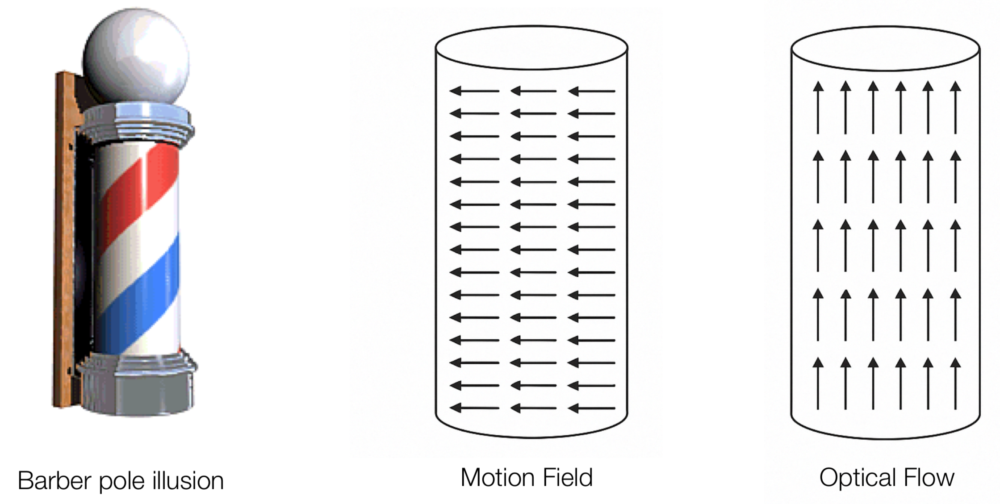
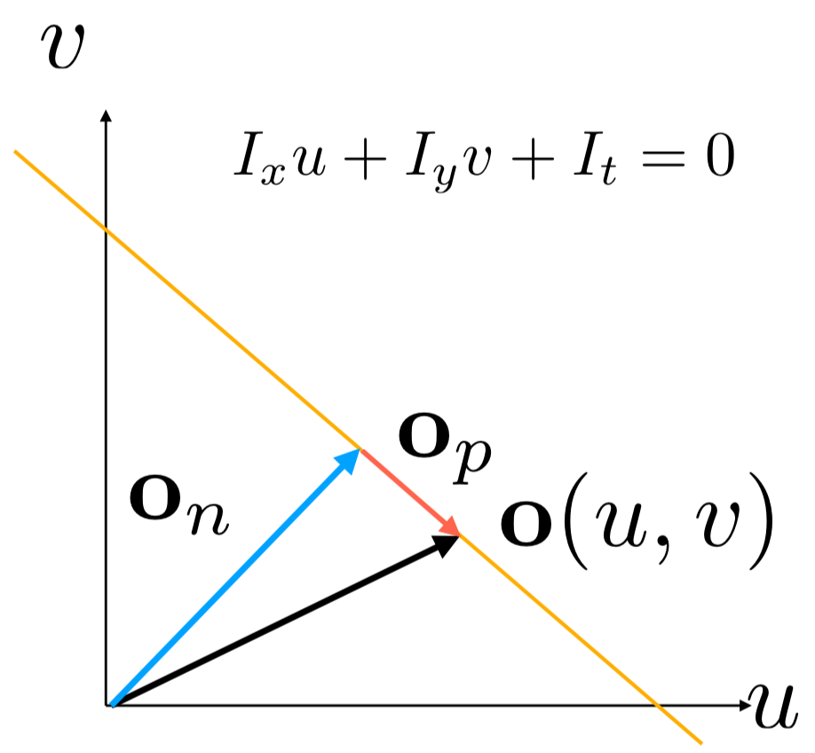
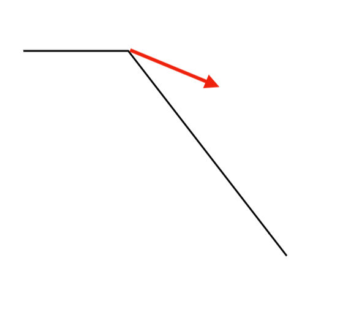
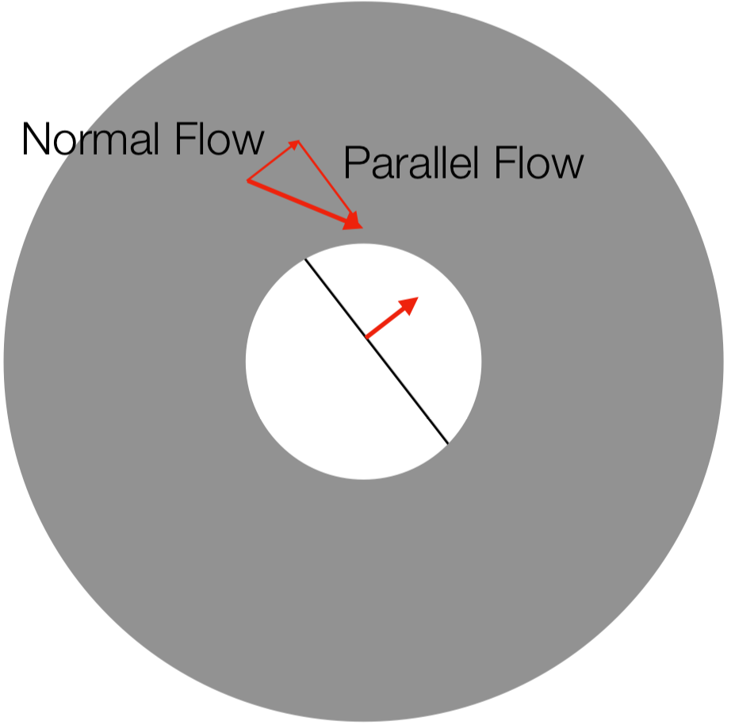

## Optical Flow
Optical Flow는 연속된 이미지 시퀀스에서 물체의 움직임을 추정하는 방법이다. 
이때 Optical Flow는 Motion Field와는 전혀 다른 개념이다. Motion Field는 물체의 움직임을 나타내는 벡터 필드로, 물체의 속도와 방향을 나타낸다. 반면 Optical Flow는 빛의 흐름을 나타내는 벡터 필드로, 물체의 움직임을 나타내는 것이 아니라, 이미지의 픽셀 값이 어떻게 변화하는지를 나타낸다.  

Optical Flow는 때로는 Motion Field와 전혀 다른 방향으로 움직이기도 한다. 예를 들어, 이발소의 삼색등이 회전하는 경우에는, 삼색등은 가로로 회전하지만, Optical Flow는 위로 향하는 벡터 필드를 갖는다.  

<figure>
    
</figure>

### Computing Optical Flow  
비디오는 $I(x, y, t)$로 표현되는 텐서이다. 이떄 $x, y$는 공간 좌표, $t$는 시간 좌표를 나타낸다.  
이때, 특정 픽셀 $(x, y)$와 $\delta t$ 시간 후의 픽셀 $(x + \delta x, y + \delta y)$에 대해, Optical Flow는 다음과 같이 표현할 수 있다.  

$$
\text{Optical Flow} = \left(\frac{\delta x}{\delta t}, \frac{\delta y}{\delta t}\right)
$$

이때, Optical Flow는 다음과 같은 가정 하에 계산된다:
- **Brightness Constancy Assumption**: 물체의 밝기는 시간에 따라 변하지 않는다. 즉, $I(x, y, t) = I(x + \delta x, y + \delta y, t + \delta t)$이다.
- **Spatial Coherence Assumption**: 물체의 움직임은 공간적으로 연속적이다. 즉, Displacement $(\delta x, \delta y)$와 $\delta t$는 매우 작은 값이다.  

#### Taylor Series Expansion
Taylor 전개는 다음과 같이 표현할 수 있다.  

$$
f(x + \delta x) = f(x) + \frac{df}{dx} \delta x + \frac{d^2f}{dx^2} \frac{\delta x^2}{2!} + \ldots 
$$  

만약 $\delta x$가 매우 작은 값이라면, $f(x + \delta x)$는 다음과 같이 근사할 수 있다.

$$
f(x + \delta x) \approx f(x) + \frac{df}{dx} \delta x
$$

따라서, Optical Flow의 두번째 가정에 따라, $\delta x$와 $\delta y$는 매우 작은 값이므로, Taylor 전개를 통해 다음과 같이 근사할 수 있다.

$$
I(x + \delta x, y + \delta y, t + \delta t) \approx I(x, y, t) + \frac{\partial I}{\partial x} \delta x + \frac{\partial I}{\partial y} \delta y + \frac{\partial I}{\partial t} \delta t
$$

첫번째 가정에 따라, $I(x + \delta x, y + \delta y, t + \delta t) = I(x, y, t)$이므로, 위 식을 정리하면 다음과 같이 표현할 수 있다.

$$
\frac{\partial I}{\partial x} \delta x + \frac{\partial I}{\partial y} \delta y + \frac{\partial I}{\partial t} \delta t = 0
$$

Optical Flow는 $\delta x$와 $\delta y$를 $\delta t$로 나눈 값이므로, 위 식을 정리하면 다음과 같이 표현할 수 있다.

$$
\frac{\partial I}{\partial x} \frac{\delta x}{\delta t} + \frac{\partial I}{\partial y} \frac{\delta y}{\delta t} + \frac{\partial I}{\partial t} = 0
$$

$\frac{\partial I}{\partial x}$, $\frac{\partial I}{\partial y}, \frac{\partial I}{\partial t}$를 각각 $I_x$, $I_y$, $I_t$로 표현하면, Optical Flow는 다음과 같이 표현할 수 있다.

$$
I_x \frac{\delta x}{\delta t} + I_y \frac{\delta y}{\delta t} + I_t = 0
$$

이때 $I_t, I_x, I_y$는 각각 다음과 같이 표현할 수 있다.

$$
I_t = I(x, y, t + 1) - I(x, y, t) \\
I_x = I(x + 1, y, t) - I(x - 1, y, t) \\
I_y = I(x, y + 1, t) - I(x, y - 1, t)
$$

Optical Flow를 간단히 ($u, v$)로 표현하면, 다음과 같이 표현할 수 있다.

$$
I_x u + I_y v + I_t = 0
$$  

즉 이를 해석하면, "시간에 따른 밝기 변화를 상쇄하기 위해 $x$축 방향으로 $u$만큼, $y$축 방향으로 $v$만큼 이동해야 한다"는 의미이다. 같은 물체에 대한 픽셀의 밝기는 변하지 않는다고 가정했으므로, 시간에 따른 밝기 변화가 없기 위해선, $x$축 방향으로 $u$만큼, $y$축 방향으로 $v$만큼 이동해야 한다는 의미이다.   

또한 이 식은 $u$와 $v$에 대한 직선의 방정식으로 생각할 수 있다. 

<figure>
    
    <figcaption>Optical Flow의 직선 방정식</figcaption>
</figure>

이와 같이 Optical Flow는 직선의 방정식으로 표현하게 되면, Optical flow $of$는 다음과 같이 표현할 수 있다.  

$$
o(u, v) = o_n + o_p
$$

- $o_n$: normal flow, 이미지 그라디언트에 수직인 방향
- $o_p$: parallel flow, 이미지 그라디언트에 평행한 방향

이때 우리가 관측할 수 있는 optical flow는 $o_n$뿐이다.  

#### Aperture Problem
작은 윈도우를 사용하여 Optical Flow를 계산할 때, edge가 움직이더라도, 우리는 해당 edge의 움직임을 normal flow로만 관측할 수 있다.  

    <figure style="flex: 1; text-align: center; margin-right: 10px;">
        
        <figcaption>parallel flow</figcaption>
    </figure>
    <figure style="flex: 1; text-align: center; margin-left: 10px;">
        
        <figcaption>aperture problem</figcaption>
    </figure>

이는 픽셀이 아무리 움직여도, 좁은 범위 안에선 그라디언트에 수직인 방향 이외의 움직임은 관측할 수 없기 때문이다.  

### Lucas-Kanade Method
위에서 살펴본 것과 같이, Optical Flow는 Under-constrained Problem이다. 한개의 식으로는 두 개의 미지수를 구할 수 없기 때문이다.  
따라서, Optical Flow를 구하기 위해서는 여러개의 식을 사용해야 한다.
이때, 여러개의 식을 사용하여 Optical Flow를 구하는 방법이 Lucas-Kanade Method이다.  

Lucas-Kanade Method는 한 픽셀에 대해서만 optical flow의 직선의 방정식을 구하는 것이 아니라, 윈도우 내의 주변 픽셀에 대해서도 optical flow의 직선의 방정식을 구하여, 해당 직선의 방정식이 모두 만족하는 optical flow를 구하는 방법이다.  
Lucas-Kanade Method는 다음과 기존의 가정 외의 다음의 가정을 추가한다. 

- **Local Constant Flow Assumption**: 윈도우 내의 모든 픽셀에 대해 optical flow는 일정하다. 즉, $u$와 $v$는 윈도우 내의 모든 픽셀에 대해 일정하다.

따라서 Lucas-Kanade Method는 한 $n\times n$ Window $W$의 모든 점 $(k, l)$에 대해 직선의 방정식을 구한다(선형시스템 구성).

$$
\begin{bmatrix}
    I_x(1, 1) & I_y(1, 1) \\
    I_x(1, 2) & I_y(1, 2) \\
    \vdots & \vdots \\
    I_x(n, n) & I_y(n, n)
\end{bmatrix}
\begin{bmatrix}
    u \\
    v
\end{bmatrix} =
\begin{bmatrix}
    -I_t(1, 1) \\
    -I_t(1, 2) \\
    \vdots \\
    -I_t(n, n)
\end{bmatrix}\\
$$  

$$
A \qquad \qquad \qquad o \quad = \quad B
$$

즉 $Ao = B$의 선형시스템을 풀어, $o$를 구하는 방법이다. ($A \in \mathbb{R}^{n^2 \times 2}, B \in \mathbb{R}^{n^2}$, $o = (u, v)^T$)

이는 Least Square Method를 사용하여 풀 수 있다.
$$
A^T A o = A^T B 
$$  

$$
o = (A^T A)^{-1} A^T B
$$

이때 $A^T A$는 structure tensor로, $A^T A$의 고유값을 통해 윈도우 내의 모양을 알 수 있다. structure tensor의 고유값이 둘 다 높을 경우, 해당 윈도우는 corner 영역이므로, optical flow를 더 안정적으로 구할 수 있다.  

- **Limitation of Lucas-Kanade Method**: 
    - Optical Flow는 작은 움직임을 가정하고 계산하기 때문에, 큰 움직임이 있는 경우에는 Optical Flow를 정확하게 계산할 수 없다.
    - 해당 한계를 해결하기 위해, 다양한 Resolution에서 Optical Flow를 계산하는 방법이 있다.
      - 큰 모션이라도 큰 픽셀 단위에서는 작은 움직임으로 보일 수 있으므로, 저해상도에서 Optical Flow를 계산한 후, 고해상도로 올라가면서 Optical Flow를 보간하는 방법이다.

---
해당 포스트는 서울대학교 컴퓨터공학부 주한별 교수님의 컴퓨터비전 25-1학기 강의를 정리한 내용입니다.