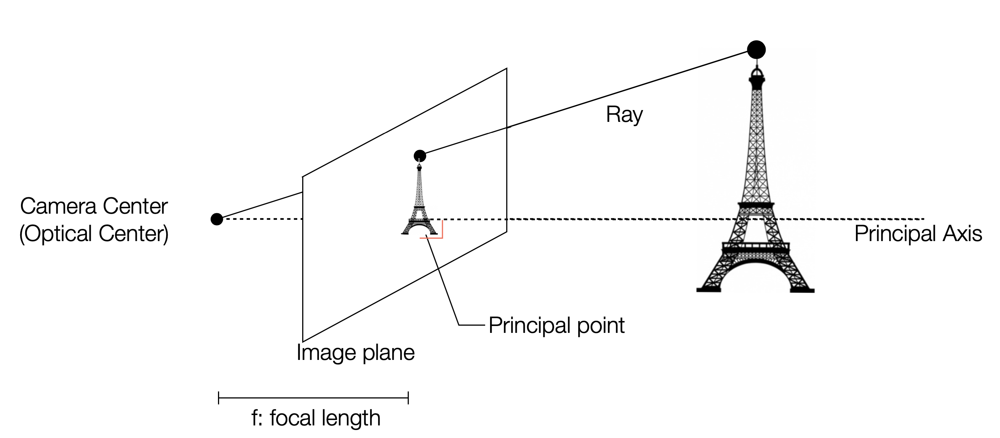
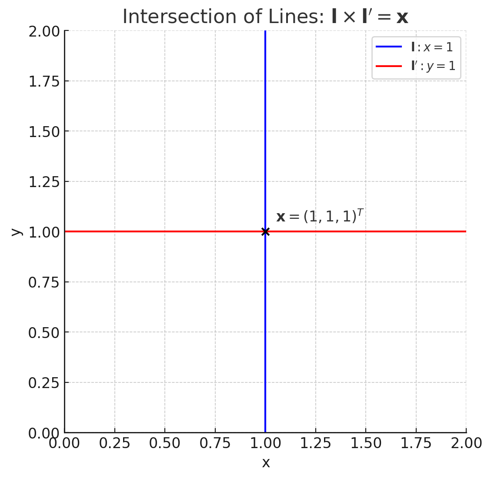
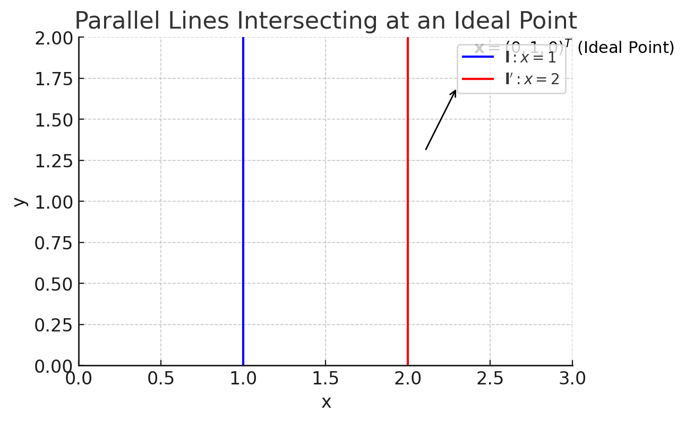
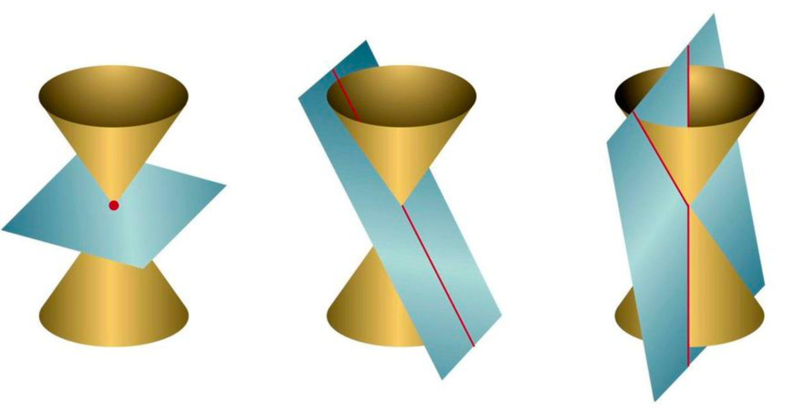

## Projective Geometry
우리는 3차원 공간에 살고 있지만, 이미지가 표현하는 것은 2D 위치정보 뿐이다. 우리의 시각 지능은 2차원의 이미지를 3차원 위치 정보로 변환하여 세계를 인식한다.  

우리 세계는 Euclid 공간이지만, 2D 이미지에 투영될 때는 Euclid 공간의 특성을 보존하지 않는다.

<figure>
    
</figure>

위 사진을 살펴보면, 만나지 않아야하는 평행선들이 투영공간(이미지)에서는 한 점에서 만나게 되고, 직사각형들은 그 각도가 왜곡되어 더이상 직각이 아니게 된다. 이와 같이 Euclid 공간의 거리와 각도를 보존하지 못하는 이미지 변환은 새로운 기하적 체계로 표현되어야 하며, 이를 위해 사용되는 것이 **Projective Geometry**이다.  

### Homogeneous Coordinates
Homogeneous Coordinates는 유클리드 공간의 점을 투영 공간에서 표현하기 위해 사용된다. 이는 이미지 상($\mathbb{R^2}$)의 2D 좌표 $(x_1, x_2)$를 3D 좌표 $(x_1, x_2, 1)$로 확장하여 나타낸다. 이 3D 좌표는 **Projective Space** $\mathbb{P^2}$ 상의 점이며, $(x_1, x_2, 1) \equiv (kx_1, kx_2, k)$와 같이 취급된다. 

### Projective Space

<figure>
    
</figure>

위 사진에서 볼 수 있듯이, 3D 공간의 한 점(에펠탑 꼭대기)은 이미지 위의 한 점으로 투영된다. 이때, 이미지 위의 점과 투영이 되는 점을 잇는 직선을 그려 보면, 해당 직선에 위치하는 모든 점은 같은 점에 투영됨을 알 수 있다.  

따라서 Projective Space는 $\mathbb{R^3}$ 공간에서의 점을 scaling factor에 관계 없이 "비율"만 같다면 모두 같은 점으로 매핑한다.  

Projective Space는 다음과 같이 정의된다:  

$$
\mathbb{P^2} = \mathbb{R^3} \backslash {(0,0,0)}
$$

Projective Space에서 Euclidean Space로 다음과 같이 변환할 수 있다:  

$$
(x_1, x_2, x_3)^T =  (x_1/x_3, x_2/x_3)
$$  

따라서 동일한 방향을 갖는 벡터는 동일한 점으로 매핑된다. 예를 들어, $(1, 2, 3)$과 $(2, 4, 6)$은 동일한 점으로 매핑된다.  

$$
(x_1, x_2, x_3) \equiv (kx_1, kx_2, kx_3)
$$

- Ideal Point  
    Projective Space에서 $x_3 = 0$인 점은 **Ideal Point**라고 불리며, 이는 무한대에 위치하는 점으로 해석된다. 예를 들어, $(1, 2, 0)$은 Ideal Point로, 이는 위에서 설명한 평행선이 만나는 점으로 해석될 수 있다.

#### Line and Point in Projective Space

- 일반적인 2D 직선의 방정식은 다음과 같이 표현된다:  
$$
ax_1 + bx_2 + c = 0
$$  

- 이를 Homogeneous Coordinates로 표현하면:  

$$
\mathbf{x} = (x_1, x_2, 1)^T, \quad \mathbf{l} = (a, b, c)^T
$$  

- 따라서 직선의 방정식은 다음과 같이 표현된다:   
$$
\mathbf{l}^T \mathbf{x} = 0
$$  

  - 선과 점이 내적 관계로 표현되고, 내적이 0이면 점이 선 위에 위치한다.

- 직선 $\mathbf{l} = (a, b, c)^T$는 Homogeneous Coordinates에서 정규화되어 표현될 수 있다:  
$$
\mathbf{l} = (a, b, c)^T \equiv (n_x, n_y, d)^T
$$  
  - $(a, b) = \mathbf{n} = (n_x, n_y), \quad ||\mathbf{n}||_2=1$: 직선의 법선 벡터
  - $c = d$: 상수항
  - 법선 벡터 $\mathbf{n}$와 직선 위 두 점을 연결하는 벡터 $\mathbf{p}$는 수직 관계를 가짐(Projective Space이든 Euclidean Space이든)  

- 두 점 $\mathbf{x}$와 $\mathbf{x'}$가 주어졌을 때, 이 두 점을 연결하는 직선은 다음과 같이 표현된다:  
$$
\mathbf{l} = \mathbf{x} \times \mathbf{x'} = (x_1, x_2, 1)^T \times (x'_1, x'_2, 1)^T
$$  
  - 여기서 $\times$는 벡터의 외적을 의미한다. 
  - 외적은 두 벡터가 이루는 평면에 수직인 벡터를 생성한다
    - Projective Space의 직선은 그 위를 지나는 점과 수직이므로 두 점의 외적은 두 점을 지나는 직선과 같다.

- 마찬가지로, 두 직선 $\mathbf{l}$과 $\mathbf{l'}$가 주어졌을 때, 이 두 직선을 연결하는 점은 다음과 같이 표현된다:  
$$
\mathbf{x} = \mathbf{l} \times \mathbf{l'} = (a, b, c)^T \times (a', b', c')^T
$$  
  - 여기서 $\times$는 벡터의 외적을 의미한다. 
  - 외적은 두 직선이 만나는 점을 생성한다
    - Projective Space의 점은 그 위를 지나는 직선과 수직이므로 두 직선의 외적은 두 직선이 만나는 점과 같다.

#### Cross Product as Matrix Multiplication  

외적은 행렬 곱 형식으로도 표현될 수 있다.

$$
a \times b = \begin{bmatrix}
    a_2 b_3 - a_3 b_2 \\
    a_3 b_1 - a_1 b_3 \\
    a_1 b_2 - a_2 b_1
\end{bmatrix} = \begin{bmatrix}
    0 & -a_3 & a_2 \\
    a_3 & 0 & -a_1 \\
    -a_2 & a_1 & 0
\end{bmatrix} \begin{bmatrix}
    b_1 \\
    b_2 \\
    b_3
\end{bmatrix}
$$  

이를 $a \times b = [a]_{\times}b$와 같이 표현하고, $[a]_{\times}$는 벡터 $a$의 외적 행렬(Skew-Symmetric Matrix)로 정의한다.  
이와 같이 외적을 표현하는 이유는, 컴퓨터 비전에서는 행렬 곱셈이 많은 연산에서 활용되고, 외적을 행렬 곱셈으로 표현하면 코드 구현이 간편해지기 때문이다.

#### Degree of Freedom

- Point in Projective Space:    
    Projective Space에서의 점은 3D 벡터로 표현되지만, 스케일은 무시되므로, 실제로는 2D 공간에서의 점으로 표현된다. 즉, $\mathbb{P^2}$에서의 점은 2D 공간의 점과 동일한 자유도(2 DoF)를 갖는다.

- Line in Projective Space:  
    마찬가지로, 직선 $\mathbf{l} = (a, b, c)^T$는 3D 벡터로 표현되지만, 스케일은 무시되므로, 실제로는 2D 공간에서의 직선으로 표현된다. 즉, $\mathbb{P^2}$에서의 직선은 2D 공간의 직선과 동일한 자유도(2 DoF)를 갖는다.

#### Examples: Intersection of Lines
- 두 직선 $\mathbf{l} = (-1, 0, 1)^T$(즉, $x=1$)와 $\mathbf{l'} = (0, -1, 1)^T$(즉, $y=1$)가 주어졌을 때, 이 두 직선의 교차점은 다음과 같이 계산된다:  
$$
\mathbf{x} = \mathbf{l} \times \mathbf{l'} 
= \begin{bmatrix}
    0 & -1 & 0 \\
    1 & 0 & 1 \\
    0 & -1 & 0
\end{bmatrix}
\begin{bmatrix}
    1 \\
    -1 \\
    1
\end{bmatrix}
= \begin{bmatrix}
    1 \\
    1 \\
    1
\end{bmatrix}
$$

  - 이 결과는 $(1, 1, 1)^T$로, 이는 Euclidean Space에서의 점 $(1, 1)$과 동일하다.
<figure>
    
</figure>

- 평행한 두 직선 $\mathbf{l} = (-1, 0, 1)^T$(즉, $x=1$)와 $\mathbf{l'} = (-1, 0, 2)^T$(즉, $x=2$)가 주어졌을 때, 이 두 직선은 교차하지 않으므로, 외적을 계산하면 Ideal Point를 얻게 된다:  
$$
\mathbf{x} = \mathbf{l} \times \mathbf{l'}
= \begin{bmatrix}
    0 & -1 & 0 \\
    1 & 0 & 1 \\
    0 & -1 & 0
\end{bmatrix}
\begin{bmatrix}
    -1 \\
    0 \\
    2
\end{bmatrix}
= \begin{bmatrix}
    0 \\
    1 \\
    0
\end{bmatrix}
$$

  - 이 결과는 $(0, 1, 0)^T$로, 이는 Ideal Point를 나타내며, 평행한 두 직선이 만나는 점을 의미한다.

<figure>
    
</figure>

- Ideal Point는 유클리드 공간에서는 그려낼 수 없는 점으로, 평행선이 만나는 점을 나타낸다. 이는 Projective Space에서만 정의되는 개념이다.

- 임의의 점 $\mathbf{x} = (x_1, x_2, 1)^T$와 y축 방향의 Ideal Point $\mathbf{x'} = (0, 1, 0)^T$가 주어졌을 때, 이 두 점을 연결하는 직선은 다음과 같이 계산된다:  
$$
\mathbf{l} = \mathbf{x} \times \mathbf{x'}
= \begin{bmatrix}
    0 & -1 & x_2 \\
    1 & 0 & -x_1 \\
    -x_2 & x_1 & 0
\end{bmatrix}
\begin{bmatrix}
    0 \\
    1 \\
    0
\end{bmatrix}
= \begin{bmatrix}
    -1 \\
    0 \\
    x_1
\end{bmatrix}
$$

  - 이는 다음과 같은 직선 방정식을 의미한다:  
$$
-1 \cdot x + 0 \cdot y + x_1 = 0
$$

  - 즉, $x_1 = x$인 직선으로, 이는 y축 방향의 Ideal Point와 임의의 점을 연결하는 직선이다.

- **Line of Ideal Points**  
    모든 Ideal Point를 연결하는 직선은 다음과 같이 표현된다:  
$$
\mathbf{l} = (0, 0, 1)^T
$$  

  - 증명:  
    모든 Ideal Point는 $(x_1, x_2, 0)^T$ 형태로 표현되며, Projective Space에서의 직선은 그 위를 지나는 점과 수직이므로, 모든 Ideal Point를 연결하는 직선은 $(0, 0, 1)^T$로 표현된다. 즉:  
$$
\mathbf{l}^T \mathbf{x} = (0, 0, 1) \cdot (x_1, x_2, 0)^T = 0
$$  

#### Feature of Projective Space
- 모든 직선은 무조건 한 점에서 만난다.  
    그 점이 Ideal Point일 수도 있고, Finite Point(유클리드 공간에서의 실제 점)일 수도 있지만, 그것과 상관없이 두 직선의 외적을 통해 항상 한 점을 얻을 수 있다.
- Duality:  
    Projective Space는 선과 점 모두 $(a, b, c)^T$ 형태로 표현되므로, 모든 대상을 Homogeneous Coordinates로 통일되게 표현할 수 있다.

#### Conics
- 원, 타원, 포물선, 쌍곡선 등은 **Conics**라고 불리며, 이들을 모두 일반화하여 다음과 같은 형태로 표현할 수 있다:  

$$
ax_1^2 + b x_1 x_2 + c x_2^2 + d x_1 + e x_2 + f  = 0
$$  

- Homogeneous Coordinates는 $(x_1, x_2, x_3)^T = (x_1/x_3, x_2/x_3)$로 표현되므로, Conics는 다음과 같이 표현될 수 있다:

$$
a x_1^2 + b x_1 x_2 + c x_2^2 + d x_1 x_3 + e x_2 x_3 + f x_3^2 = 0
$$  

- 위 식을 행렬 형태로 표현하면 다음과 같다:  

$$
\begin{bmatrix}
    x_1 & x_2 & x_3
\end{bmatrix}
\begin{bmatrix}
    a & \frac{b}{2} & \frac{d}{2} \\
    \frac{b}{2} & c & \frac{e}{2} \\
    \frac{d}{2} & \frac{e}{2} & f
\end{bmatrix}
\begin{bmatrix}
    x_1 \\
    x_2 \\
    x_3
\end{bmatrix}
= \mathbf{x}^T \mathbf{C} \mathbf{x} = 0
$$  

- Conic은 다섯개 계수 $(a, b, c, d, e, f)$로 정의되며, Scaling Factor를 무시하면 5 DoF를 갖는다.  
  

$$
\begin{bmatrix}
    x_1^2 & x_1 x_2 & x_2^2 & x_1 x_3 & x_2 x_3 & x_3^2 \\
    x_1^2 & x_1 x_2 & x_2^2 & x_1 x_3 & x_2 x_3 & x_3^2 \\
    x_1^2 & x_1 x_2 & x_2^2 & x_1 x_3 & x_2 x_3 & x_3^2 \\
    x_1^2 & x_1 x_2 & x_2^2 & x_1 x_3 & x_2 x_3 & x_3^2 \\
    x_1^2 & x_1 x_2 & x_2^2 & x_1 x_3 & x_2 x_3 & x_3^2 \\
\end{bmatrix}
\begin{bmatrix}
    a \\
    b \\ 
    c \\
    d \\
    e \\
    f
\end{bmatrix}
= 0
$$  

- 점 5개가 독립이라면, 5×6 행렬은 full rank가 되어 null space가 1차원이므로, 해는 방향만 정해지고 크기는 정해지지 않은 1개의 벡터(1DoF)로 결정된다. 따라서 Conic은 5 DoF를 갖는다.  

- 원은 $a = c, b = 0$인 경우로, 다음과 같이 표현된다:  
$$
a x_1^2 + a x_2^2 + d x_1 + e x_2 + f = 0
$$

$$ 
\begin{bmatrix}
    x_1^2 + x_2^2 & x_1 & x_2 & 1 \\
    x_1^2 + x_2^2 & x_1 & x_2 & 1 \\
    x_1^2 + x_2^2 & x_1 & x_2 & 1 
\end{bmatrix}
\begin{bmatrix}
    a \\
    d \\
    e \\
    f
\end{bmatrix}
= 0
$$

  - 이 경우, 점 3개가 독립이라면, 3×4 행렬은 full rank가 되어 null space가 1차원이므로, 해는 방향만 정해지고 크기는 정해지지 않은 1개의 벡터(1DoF)로 결정된다. 따라서 원은 3 DoF를 갖는다.  

#### Tangent Line to Conics  
- Conic에 접하는 직선은 다음과 같이 표현된다:  
$$
\mathbf{l} = C \mathbf{x} 
$$  

- 증명:  
    Conic의 정의에 따라, $\mathbf{x}^T C \mathbf{x} = 0$이므로, $\mathbf{l}^T \mathbf{x} = \mathbf{x}^T C^T \mathbf{x} = \mathbf{x}^T C \mathbf{x} = 0$이 된다.  

- 만약 접선 $\mathbf{l}=Cx$가 Conic의 다른 점 $y$도 지난다면, 해당 직선 $\mathbf{l}$은 Conic에 접하는 무수히 많은 점을 지나는 직선이 된다. 이를 Conic의 degenerate라고 한다.  
  - 수학적으로는, Conic 행렬 $C$가 full rank가 아닌 경우를 의미한다.  

<figure>
    
    <figcaption>Degenerate conic의 예시</figcaption>
</figure>

- 예시:  
    - $x^2 - y^2 = 0$  
        $x=y$와 $x=-y$ 두 직선을 포함하는 Conic
    - $4x + 9y = 1$  
        하나의 직선만 포함하는 Conic
    - $x^2 + y^2 = 0$  
        하나의 점(원점)만 포함하는 Conic  

- 두 직선을 포함하는 Conic  
    - 직선 $\mathbf{l}$과 $\mathbf{m}$이 주어졌을 때, 이 두 직선을 포함하는 Conic $\mathbf{C}$는 다음과 같이 표현된다:  
$$
\mathbf{C} = \mathbf{l} \mathbf{m}^T + \mathbf{m} \mathbf{l}^T 
$$  
    - 증명:  
        $\mathbf{x}^T \mathbf{C} \mathbf{x} = \mathbf{x}^T (\mathbf{l} \mathbf{m}^T + \mathbf{m} \mathbf{l}^T) \mathbf{x} = 0$이므로, $\mathbf{l}^T \mathbf{x} = 0$ 또는 $\mathbf{m}^T \mathbf{x} = 0$이 되어, $\mathbf{C}$는 $\mathbf{l}$과 $\mathbf{m}$을 포함하는 Conic이 된다. 해당 Conic은 두 rank 1 행렬의 합으로 표현되므로, rank가 2인 Conic(degenerate conic)이 된다.

- **Dual Conic: Point Conic vs. Line Conic**  
    Conic은 점과 직선 모두를 포함할 수 있다.  
    - Point Conic: Conic이 포함하는 점들의 집합   
$$
\mathbf{x}^T \mathbf{C} \mathbf{x} = 0  
$$
    - Line Conic: Conic에 접하는 직선들의 집합  
$$
\mathbf{l}^T \mathbf{C}^* \mathbf{l} = 0
$$  
    - Dual Conic $\mathbf{C}^*$의 계산:  
$$
\mathbf{C}^* = \mathbf{C}^{-1}
$$    
$$   
\because \mathbf{l} = \mathbf{C} \mathbf{x} \implies \mathbf{C}^{-1} \mathbf{l} = \mathbf{x}  \\  
\mathbf{x}^T \mathbf{C} \mathbf{x} = (\mathbf{C}^{-1} \mathbf{l})^T \mathbf{C} (\mathbf{C}^{-1} \mathbf{l}) = \mathbf{l}^T \mathbf{C}^{-1} \mathbf{l} = 0
$$

---
해당 포스트는 서울대학교 컴퓨터공학부 주한별 교수님의 컴퓨터비전 25-1학기 강의를 정리한 내용입니다.