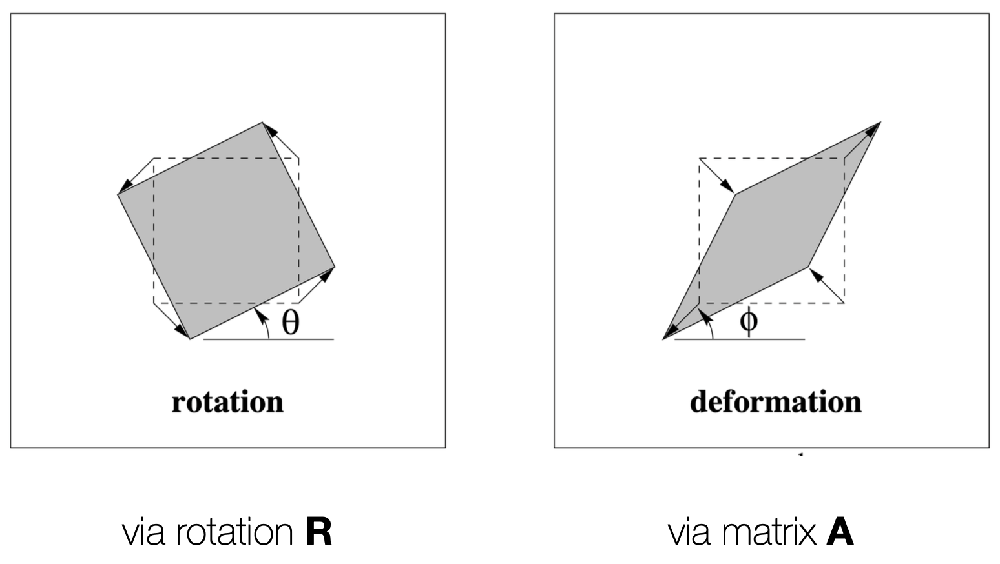

## Projective Transformation(Homography)
Homography: Projective Space $\mathbb{P}^2$의 한 점을 다른 Projective Space $\mathbb{P}^2$의 한 점으로 대응시키는 변환이다.  
이때, 한 직선 위의 세 점 $\mathbf{x}_1, \mathbf{x}_2, \mathbf{x}_3$은 Homography를 통해 다른 Projective Space에 매핑되어도 여전히 한 직선 위에 존재한다.  
즉, Homography는 직선성을 보존한다.  

<figure>
    
</figure>

- Homography는 3x3 행렬 $\mathbf{H}$로 표현된다.  
$$ 
\begin{bmatrix}
x'_1 \\
x'_2 \\
x'_3
\end{bmatrix}
= \begin{bmatrix}
h_{11} & h_{12} & h_{13} \\
h_{21} & h_{22} & h_{23} \\
h_{31} & h_{32} & h_{33}
\end{bmatrix}
\begin{bmatrix}
x_1 \\
x_2 \\
x_3
\end{bmatrix}
$$
    - $\mathbf{H}$는 non-singular 행렬이어야 한다.  
    - $\mathbf{H}$는 Scale-Invariant하다. 즉, $\mathbf{H}$의 모든 원소에 동일한 스케일을 곱해도 Homography는 동일하게 유지된다.  
    - 따라서 $\mathbf{H}$는 8 DoF를 갖는다.

- Homography의 점 변환이 $ \mathbf{x}' = \mathbf{H} \mathbf{x}$로 표현될 때 직선 $\mathbf{l}$의 변환은 다음과 같이 표현된다.  
$$
\mathbf{l}' = \mathbf{H}^{-T} \mathbf{l}
$$
    - 여기서 $\mathbf{H}^{-T}$는 $\mathbf{H}$의 역행렬의 전치 행렬이다.  
    - 증명:  
$$
\mathbf{l}'^T \mathbf{x}' = \mathbf{l}^T \mathbf{H}^{-T} \mathbf{H} \mathbf{x} = \mathbf{l}^T \mathbf{x} = 0
$$
    - 즉, $\mathbf{x}$가 직선 $\mathbf{l}$ 위에 있을 때, $\mathbf{x}'$는 직선 $\mathbf{l}'$ 위에 존재한다.

- Conic의 변환:  
$$
\mathbf{C}' = \mathbf{H}^T \mathbf{C} \mathbf{H}^{-1}
$$
$$
\mathbf{C^*}' = \mathbf{H} \mathbf{C^*} \mathbf{H}^{T}
$$
    - 여기서 $\mathbf{C}$는 Conic의 행렬 표현이다.  
    - 증명:  
$$
\mathbf{x'}^T \mathbf{C'} \mathbf{x'} = (H \mathbf{x})^T \mathbf{H}^{-T} \mathbf{C} \mathbf{H}^{-1} (\mathbf{H} \mathbf{x}) = \mathbf{x}^T \mathbf{C} \mathbf{x} = 0
$$
    - 즉, $\mathbf{x}$가 Conic $\mathbf{C}$ 위에 있을 때, $\mathbf{x}'$는 Conic $\mathbf{C}'$ 위에 존재한다.  

- Homography의 특징:   
    - 어떤 행렬 $\mathbf{H}$가 가역행렬이다 $\Leftrightarrow$ 어떤 행렬 $\mathbf{H}$가 Homography이다.  
    - 가역행렬은 선형 변환을 나타내며, 따라서 선형성을 보존한다. 따라서 모든 가역행렬은 Homography이다.

## Hierarchy of Transformations

### Translation
- Translation은 2D 평면에서 점을 이동시키는 변환이다.
- Inhomogeneous($\mathbf{x}',\mathbf{x},\mathbf{t}\in \mathbb{R}^2$)  
$$
\mathbf{x}' = \begin{bmatrix}
x' \\
y'
\end{bmatrix} = \begin{bmatrix}
x + t_x \\
y + t_y
\end{bmatrix}
= \mathbf{x} + \begin{bmatrix}
t_x \\
t_y
\end{bmatrix}
= \mathbf{x} + \mathbf{t}
$$
- Homogeneous($\mathbf{x}',\mathbf{x} \in \mathbb{P}^2$)  
$$
\mathbf{x}' = 
\begin{bmatrix}
I_{2} & \mathbf{t} \\
\mathbf{0}_{1\times2} & 1
\end{bmatrix}
\mathbf{x}
$$
- Translation은 2D 평면에서 점을 이동시키는 가장 기본적인 변환이다.
- DoF: 2 (이동 벡터 $\mathbf{t} = (t_x, t_y)$의 두 성분)
- Homogeneous 형태로 표현하면, 역변환이나 합성 변환을 쉽게 처리할 수 있다.

### Euclidean(Rigid) Transformation
- Euclidean Transformation은 회전과 이동을 포함하는 변환이다.  
- Inhomogeneous($\mathbf{x}',\mathbf{x},\mathbf{t}\in \mathbb{R}^2$)  
$$
\mathbf{x}' = \begin{bmatrix}
x' \\
y'
\end{bmatrix} = \begin{bmatrix}
\cos(\theta) x - \sin(\theta) y + t_x \\
\sin(\theta) x + \cos(\theta) y + t_y
\end{bmatrix}
= \mathbf{R} \mathbf{x} + \mathbf{t}
$$
- Homogeneous($\mathbf{x}',\mathbf{x} \in \mathbb{P}^2$)  
$$
\mathbf{x}' =
\begin{bmatrix}
\mathbf{R} & \mathbf{t} \\
\mathbf{0}_{1\times2} & 1
\end{bmatrix}
\mathbf{x}
$$
- Euclidean Transformation은 회전과 이동을 포함하는 변환으로, 객체 간의 상대적인 거리와 각도를 유지한다.  
- DoF: 3 (회전 각도 $\theta$와 이동 벡터 $\mathbf{t} = (t_x, t_y)$의 두 성분)
- 두 Euclidean Transformation의 합성 역시 Euclidean Transformation이 된다.
- 회전 $\mathbf{R}$과 이동 벡터 $\mathbf{t}$의 순서에 따라 결과가 달라진다. 기본적으로 사용하는 순서는 회전 후 이동이다.  

- **Isometries**  
$$
\mathbf{x}' = \begin{bmatrix}
\epsilon \cos(\theta) & -\sin(\theta) & t_x \\
\epsilon \sin(\theta) & \cos(\theta) & t_y \\
0 & 0 & 1
\end{bmatrix}
\mathbf{x}
$$
    - $\epsilon = 1$이면 Euclidean Transformation
    - $\epsilon = -1$이면 물체의 방향을 바꾼다(반사영).
    - 여전히 객체 간의 상대적인 거리와 각도를 유지한다.

### Similarity Transformation
- Similarity Transformation은 Euclidean Transformation에 스케일 변환을 추가한 것이다.  

$$
\mathbf{x}' = \begin{bmatrix}
s \cos(\theta) & -s \sin(\theta) & t_x \\
s \sin(\theta) & s \cos(\theta) & t_y \\
0 & 0 & 1
\end{bmatrix}
\mathbf{x}
= \begin{bmatrix}
s \mathbf{R} & \mathbf{t} \\
\mathbf{0}_{1\times2} & 1
\end{bmatrix}
\mathbf{x}
$$

- DoF: 4 (회전 각도 $\theta$, 스케일 $s$, 이동 벡터 $\mathbf{t} = (t_x, t_y)$의 두 성분)
- Similarity Transformation은 객체 간의 각도를 유지하면서 크기를 조절할 수 있다.(스케일 변환으로 인해 객체간의 상대적 거리는 유지되지 않는다.)  

### Affine Transformation
- Affine Transformation은 Similarity Transformation에 평행 이동과 기울기를 추가한 것이다.  

$$
\mathbf{x}' = \begin{bmatrix}
a_{11} & a_{12} & t_x \\
a_{21} & a_{22} & t_y \\
0 & 0 & 1
\end{bmatrix}
\mathbf{x}
= \begin{bmatrix}
\mathbf{A} & \mathbf{t} \\
\mathbf{0}_{1\times2} & 1
\end{bmatrix}
\mathbf{x}
$$

- DoF: 6 (2x2 행렬 $\mathbf{A}$의 4개 성분, 이동 벡터 $\mathbf{t} = (t_x, t_y)$의 두 성분)
- $\mathbf{A}$는 가역행렬.

- **Geometric Interpretation**
<figure>
    
    <figcaption>Rotation Transformation과 Affine Transformation의 비교</figcaption>
</figure>  

  - Affine Transformation를 기하적으로 해석하면, 회전, 스케일, 기울기, 평행 이동을 포함하는 변환이다.
  - 하지만 Affine Transformation은 평행한 직선은 여전히 평행한 직선으로 유지한다

- **Algebraic Interpretation**  
$$
\mathbf{x}' = \begin{bmatrix}
\mathbf{A} & \mathbf{t} \\
\mathbf{0}_{1\times2} & 1
\end{bmatrix}
\mathbf{x}
$$
    - $\mathbf{A}$는 항상 다음과 같이 분해될 수 있다.  
$$
\mathbf{A} = \mathbf{R(\theta)} \mathbf{R(-\phi)} \Sigma \mathbf{R(\phi)}
$$
    - 증명:  
$$
\mathbf{A} = \mathbf{U \Sigma V^T} = \mathbf{(U V^T) (V \Sigma V^T)} = \mathbf{R(\theta) R(-\phi) \Sigma R(\phi)}
$$
      - 여기서 $\mathbf{U, V}$의 행렬식(determinant)가 $+ 1$이 되도록 선택하면, 이를 회전 행렬로 표현할 수 있다.
    - 이와 같은 표현의 의미는, Affine Transformation이 기저를 특정 방향으로 회전시키고, 스케일링을 적용한 후, 다시 원래대로 복원시킨 후 다시 최종 회전시키는 과정을 포함한다는 것이다.  
    - 어떤 모양이 어느방향으로 늘어나고, 회전하는지에 대한 정보를 제공한다.  

- Affine Transformation의 특징:  
  - Affine Transformation은 선형 변환과 평행 이동을 포함하며, 직선성을 유지한다.
  - 평행한 직선은 여전히 평행한 직선으로 유지되지만, 거리와 각도는 보존되지 않는다.
    - 증명:  
      - 평행한 두 직선은 무한점(Infinity Point)에서 만나는데,  $\mathbf{x} = (x, y, 0)^T$에 대해, Affine Transformation은 무한점을 보존한다.  
$$
\mathbf{x'} =
\begin{bmatrix}
\mathbf{A} & \mathbf{t} \\
\mathbf{0}_{1\times2} & 1
\end{bmatrix}
\begin{bmatrix}
x \\
y \\ 0
\end{bmatrix}
= \begin{bmatrix}
x' \\
y' \\ 0
\end{bmatrix}
$$

    - 무한선(Infinity Line) $\mathbf{l} = (a, b, 0)^T$에 대해, Affine Transformation은 무한선을 보존한다.  
$$
\mathbf{l'} =
\begin{bmatrix}
\mathbf{A} & \mathbf{t} \\
\mathbf{0}_{1\times2} & 1
\end{bmatrix}
\begin{bmatrix}
a \\
b \\ 0
\end{bmatrix}
= \begin{bmatrix}
a' \\
b' \\ 0
\end{bmatrix}
$$

### Projective Transformation(Homography)
- Projective Transformation은 무한대의 점과 선까지 포함해 평면 상의 점을 대응시키는 가장 일반적인 변환이다.  

$$
\mathbf{x}' = \begin{bmatrix}
\mathbf{A} & \mathbf{t} \\
\mathbf{v}_{1\times 2} & v
\end{bmatrix}
\mathbf{x}
$$
- DoF: 8 ($\mathbf{A}$의 4개 성분, $\mathbf{t} = (t_x, t_y)$의 두 성분, $\mathbf{v} = (v_1, v_2)$의 두 성분, $v$의 성분은 Scale-Invariant하기 때문에 자유롭게 선택할 수 있다.)
- $v$는 0이 될 수 있음
- 직선성, cross-ratio(직선 위의 네 점의 비율) 보존
- Projective Transformation은 무한대의 점과 선을 더이상 보존하지 않는다.  
$$
\begin{bmatrix}
\mathbf{A} & \mathbf{t} \\
\mathbf{v}_{1\times 2} & v
\end{bmatrix}
\begin{bmatrix}
x \\
y \\ 0
\end{bmatrix}
= \begin{bmatrix}
\mathbf{A} \begin{bmatrix}
x \\
y
\end{bmatrix} + \mathbf{t} \\
v_1 x + v_2 y + v
\end{bmatrix}
$$
  - 이와 같이 무한대의 점 역시 Projective Transformation에선 이미지 상의 한 유한 점으로 대응된다.
  - 무한대의 직선 역시 Projective Transformation에선 이미지 상의 한 유한 직선으로 대응된다.

### Summary of Transformations

| Transformation  | DoF | 보존되는 성질                                            |
| --------------- | --- | -------------------------------------------------------- |
| **Translation** | 2   | 거리, 각도, 직선, 평행성 모두 보존 (단지 위치만 이동)    |
| **Euclidean**   | 3   | 거리, 각도, 직선, 평행성 보존 (**isometry**)             |
| **Similarity**  | 4   | 각도, 비율, 직선, 평행성 보존 (거리 × scale로 변화 가능) |
| **Affine**      | 6   | 직선, 평행성 보존 (거리·각도는 왜곡됨, **기울기 허용**)  |
| **Projective**  | 8   | 직선, **cross-ratio** 보존 (평행, 거리, 각도 보존 안 됨) |

$$
\mathbf{H} = \mathbf{H_S H_A H_P}
= \begin{bmatrix}
\mathbf{sR} & \mathbf{t} \\
\mathbf{0}_{1\times2} & 1
\end{bmatrix}
\begin{bmatrix}
\mathbf{K} & \mathbf{0} \\
\mathbf{0}_{1\times2} & 1
\end{bmatrix}
\begin{bmatrix}
\mathbf{I} & \mathbf{0} \\
\mathbf{v}_{1\times2} & v
\end{bmatrix}
= \begin{bmatrix}
\mathbf{A} & \mathbf{t} \\
\mathbf{v}_{1\times2} & v
\end{bmatrix}
$$  

- 여기서 $\mathbf{H_S}$는 Similarity Transformation, $\mathbf{H_A}$는 Affine Transformation, $\mathbf{H_P}$는 Projective Transformation을 나타낸다.
- 이처럼 일반적인 Homography는 Similarity, Affine, Projective Transformation의 조합으로 표현될 수 있다.
- 역변환을 할 때는 $\mathbf{H_P}^{-1} \mathbf{H_A}^{-1} \mathbf{H_S}^{-1}$ 순서대로 역원을 곱해주면 된다.

<figure>
    
    <figcaption>다양한 변환의 예시</figcaption>
</figure>

---
해당 포스트는 서울대학교 컴퓨터공학부 주한별 교수님의 컴퓨터비전 25-1학기 강의를 정리한 내용입니다.