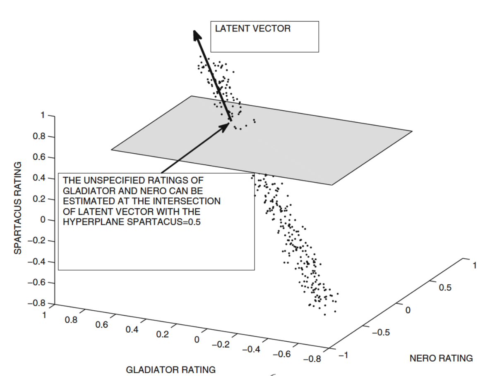
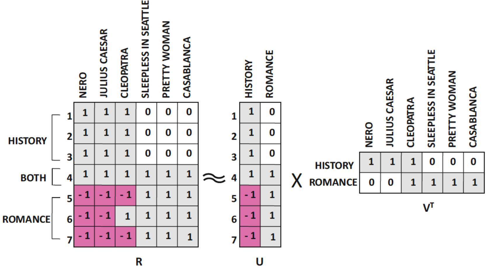
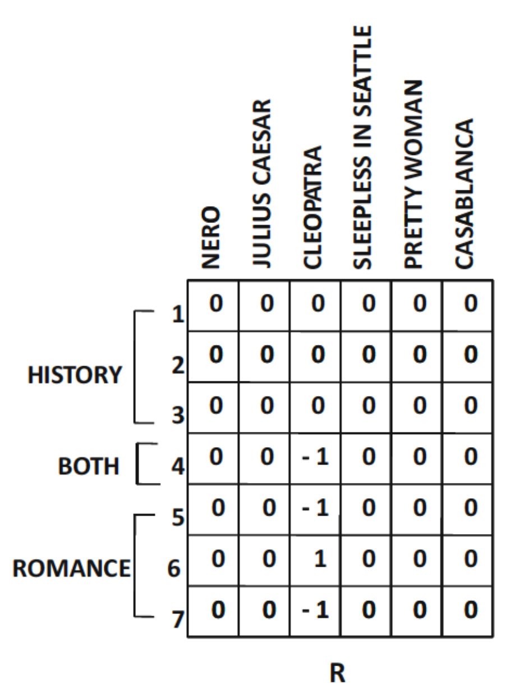
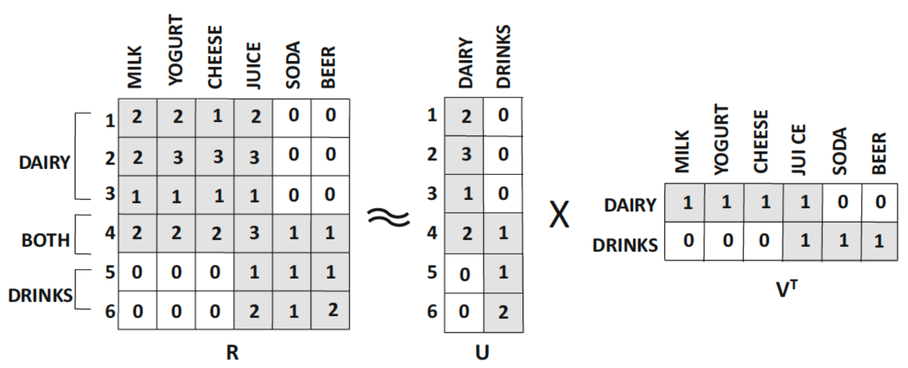
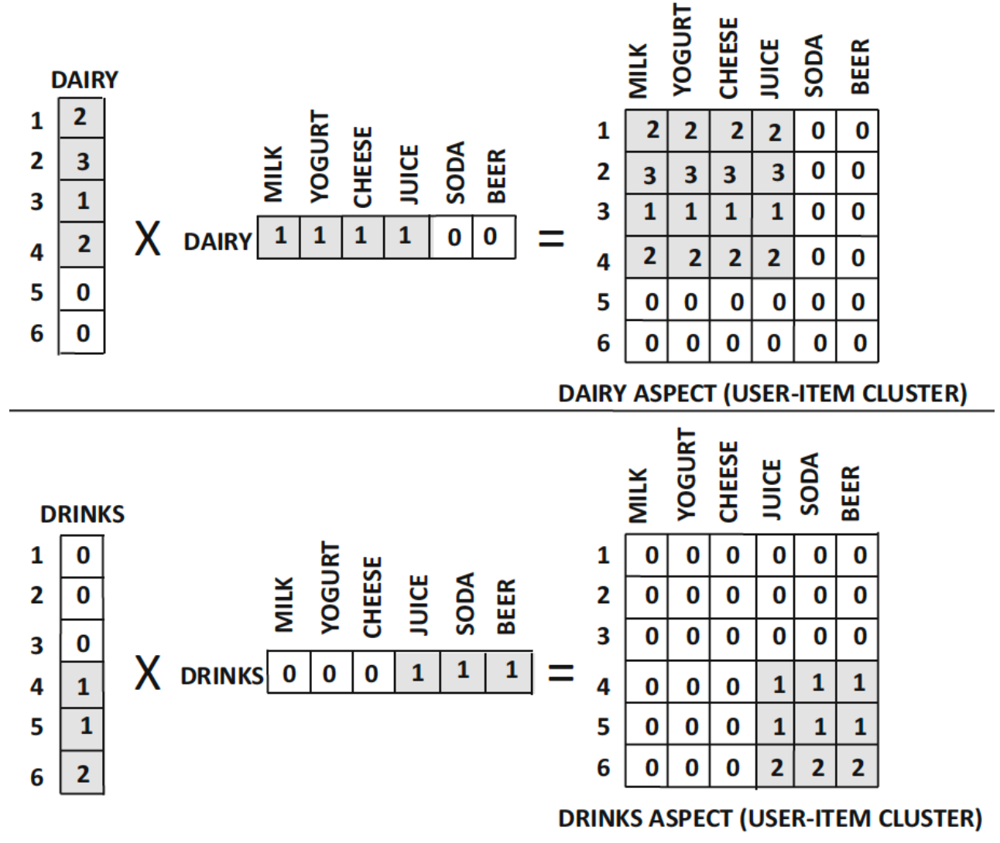

## Recommender Systems
추천 시스템(Recommender Systems)은 데이터를 기반으로 사용자에게 개인화된 추천을 제공하는 시스템이다.  

- **Goal of Recommender Systems**:  
    - Relevance: 사용자에게 적합한 아이템을 추천하는 것.
    - Novelty: 사용자에게 새로운 아이템을 추천하는 것.
    - Serendipity: 예상치 못한 유용한 아이템을 추천하는 것.
    - Diversity: 다양한 아이템을 추천하는 것.
    - Explanation: 추천 이유를 설명하는 것.

- **Versions of Recommender Systems**:
    - Prediction version: 사용자-아이템 간의 평점 예측.
    - Ranking version: 사용자에게 아이템을 순위별로 추천.
    - 예측 버전이 보다 일반적이고 유연성이 높다.

- **Basic Models of RS**:
    - **Data**  
        - User-Item Interaction: 사용자와 아이템 간의 상호작용 데이터.
        - Attribute Data: 사용자와 아이템의 속성 데이터.(예: 사용자 프로필, 아이템 설명 등)
    - **Modeling**  
        - Collaborative Filtering: 사용자와 아이템 간의 상호작용을 기반으로 추천.
        - Content-Based Filtering: 아이템의 속성을 기반으로 추천.
        - Hybrid Methods: Collaborative Filtering과 Content-Based Filtering을 결합한 방법.
        - Hybrid: 사용자와 아이템의 속성을 모두 활용하여 추천하는 방법.

### Collaborative Filtering
Collaborative Filtering은 사용자와 아이템 간의 상호작용 데이터를 기반으로 추천을 생성하는 방법이다.

- 이웃 기반 예측: 
    - 가정: 유사한 사용자 혹은 아이템은 유사한 선호도를 가진다.
    - Nearest Neighbors 개념과 유사.

#### Memory-Based CF
Memory-Based Collaborative Filtering은 사용자와 아이템 간의 상호작용 데이터를 직접 활용하여 추천을 생성하는 방법이다.

- **User-Based CF**:  
    - 유사한 사용자들을 찾아서 추천을 생성.
    - 예: 사용자 A와 유사한 사용자 B가 높은 평점을 준 아이템을 A에게 추천.

- **Item-Based CF**:  
    - 아이템 간의 유사성을 기반으로 추천을 생성.
    - 예: 아이템 X와 유사한 아이템 Y가 높은 평점을 받은 경우, X를 좋아하는 사용자에게 Y를 추천.

- **Limitations of Memory-Based CF**:
    - Scalability: 사용자와 아이템의 수가 많아질수록 계산 비용이 증가.
    - Sparsity: 사용자-아이템 상호작용 데이터가 희소할 경우 추천의 품질 저하.
    - Cold Start Problem: 새로운 사용자나 아이템에 대한 추천이 어려움.
- 일반적으로 item-based CF가 user-based CF보다 더 효과적이다.

##### User-based CF
- Formulation:  
    - $m$: 사용자 수
    - $n$: 아이템 수
    - $R \in \mathbb{R}^{m \times n}$: 사용자-아이템 평점 행렬

- 문제 유형:  
    - 평점 예측:  
        - 사용자 $u$가 아이템 $i$에 부여할 평점 $\hat{r}_{ui}$ 예측.
    - Top-K 추천:  
        - 사용자 $u$에게 가장 적합한 K개의 아이템 추천.
        - 아이템 $j$에 대해 가장 적합한 K명의 사용자 추천.

1. 데이터 준비:  
    - $I_u$: 사용자 $u$가 평가한 아이템 집합.
    - $\mu_u$: 사용자 $u$의 평균 평점.  
$$
\mu_u = \frac{1}{|I_u|} \sum_{k \in I_u} r_{uk}
$$
    
2. 사용자 간 유사도 계산:  
    - 피어슨 상관계수를 사용하여 사용자 간의 유사도 계산.  
    - 사용자 $u$와 $v$ 간의 유사도는 다음과 같이 정의된다.
$$
Sim(u, v) = \frac{\sum_{k \in I_u \cap I_v} (r_{uk} - \mu_u)(r_{vk} - \mu_v)}{\sqrt{\sum_{k \in I_u \cap I_v} (r_{uk} - \mu_u)^2} \sqrt{\sum_{k \in I_u \cap I_v} (r_{vk} - \mu_v)^2}}
$$

3. 중심화된 평점 계산:  

$$
s_{ui} = r_{ui} - \mu_u
$$

4. 최근접 이웃 사용자 선택:  
    - $P_u(j)$: target 사용자 $u$에게 가장 유사한 사용자 중 item $j$를 평가한 사용자 집합.

5. 예측 평점 계산:  
$$
\hat{r}_{uj} = 
\mu_u + \frac{\sum_{v \in P_u(j)} Sim(u, v) (r_{vj}-\mu_v)}{\sum_{v \in P_u(j)} |Sim(u, v)|}=
\mu_u + \frac{\sum_{v \in P_u(j)} Sim(u, v) s_{vj}}{\sum_{v \in P_u(j)} |Sim(u, v)|}
$$

- **Example Dataset**:  

| User   | Item 1 | Item 2 | Item 3 | Item 4 | Item 5 | Item 6 | Mean Rating | Cosine(i,3) | Pearson(i,3) |
| ------ | ------ | ------ | ------ | ------ | ------ | ------ | ----------- | ----------- | ------------ |
| User 1 | 7      | 6      | 7      | 4      | 5      | 4      | 5.5         | 0.956       | 0.894        |
| User 2 | 6      | 7      | ?      | 4      | 3      | 4      | 4.8         | 0.981       | 0.939        |
| User 3 | ?      | 3      | 3      | 1      | 1      | ?      | 2.0         | 1.000       | 1.000        |
| User 4 | 1      | 2      | 2      | 3      | 3      | 4      | 2.5         | 0.789       | -1.000       |
| User 5 | 1      | ?      | 1      | 2      | 3      | 3      | 2.0         | 0.645       | -0.817       |

- target user: User 3
- target item: Item 1, Item 6
- Top-2 Nearest Neighbors: User 1, User 2
- 예측 평점 계산:  
    - Item 1:  
$$
\hat{r}_{31} = \mu_3 + \frac{Sim(3, 1) s_{11} + Sim(3, 2) s_{21}}{|Sim(3, 1)| + |Sim(3, 2)|}
= 2.0 + \frac{0.894 \cdot 7 + 0.939 \cdot 6}{|0.894| + |0.939|} \approx 6.49
$$
      - Mean-Centered Rating:  
$$
\hat{r}_{31} = 2 + \frac{0.894 (7 - 5.5) + 0.939 (6 - 4.8)}{0.894 + 0.939} \approx 3.35
$$
    - Item 6:  
$$
\hat{r}_{36} = \mu_3 + \frac{Sim(3, 1) s_{16} + Sim(3, 2) s_{26}}{|Sim(3, 1)| + |Sim(3, 2)|}
= 2.0 + \frac{0.894 \cdot 4 + 0.939 \cdot 4}{|0.894| + |0.939|} = 4
$$
      - Mean-Centered Rating:
$$
\hat{r}_{36} = 2 + \frac{0.894 (4 - 5.5) + 0.939 (4 - 4.8)}{0.894 + 0.939} \approx 0.86
$$

- Variations in Filtering Peer Groups
    - Top-K 사용자를 고를 때, 타겟 사용자와 약하거나 음의 상관관계를 가진 사용자도 포함할 수 있다.
    - 이로 인해 부정확한 추천이 발생할 수 있으므로, 약하거나 음의 상관관계를 가진 사용자를 제외하는 것이 일반적이다.

##### Item-based CF
- 유사한 아이템을 기반으로 추천을 생성하는 방법
- 사용자 간의 유사도를 계산하는 것이 아니라, 아이템 간의 유사도를 계산하여 추천을 생성한다.
- 각 사용자 row의 rating은 0을 기준으로 중심화된 평점으로 변환한다.
- 유사도는 Adjusted Cosine Similarity를 사용.
- 수식:  
$$
AdjustedCosine(i, j) = \frac{\sum_{u \in U_i \cap U_j} (r_{ui} - \mu_u)(r_{uj} - \mu_u)}{\sqrt{\sum_{u \in U_i \cap U_j} (r_{ui} - \mu_u)^2} \sqrt{\sum_{u \in U_i \cap U_j} (r_{uj} - \mu_u)^2}}
$$  
  - $U_i$: 아이템 $i$를 평가한 사용자 집합

- 예측 평점 계산:  
$$
\hat{r}_{ut} = \frac{\sum_{j \in Q_t(u)} AdjustedCosine(j, t) \cdot (r_{uj})}{\sum_{j \in Q_t(u)} |AdjustedCosine(j, t)|} + \mu_u
$$  
    - $Q_t(u)$: 사용자 $u$가 평가한 아이템 집합 중 아이템 $t$와 유사한 top-K 아이템 집합
- 즉, 사용자 $u$ 자신의 기존 평점과 아이템 간의 유사도를 결합해 예측 수행

- **Example Dataset**:  
Mean-centered Ratings:  

| User-Id ↓ / Item-Id ⇒ | 1    | 2    | 3    | 4    | 5    | 6    |
| --------------------- | ---- | ---- | ---- | ---- | ---- | ---- |
| 1                     | 1.5  | 0.5  | 1.5  | -1.5 | -0.5 | -1.5 |
| 2                     | 1.2  | 2.2  | ?    | -0.8 | -1.8 | -0.8 |
| 3                     | ?    | 1    | 1    | -1   | -1   | ?    |
| 4                     | -1.5 | -0.5 | -0.5 | 0.5  | 0.5  | 1.5  |
| 5                     | -1   | ?    | -1   | 0    | 1    | 1    |

- Target User: User 3
- Target Item: Item 1, Item 6
- Cosine Similarity:  

| 기준 아이템 → / 비교 아이템 ↓ | 1      | 2      | 3      | 4      | 5      | 6      |
| ----------------------------- | ------ | ------ | ------ | ------ | ------ | ------ |
| Cosine(1, j)                  | 1.000  | 0.735  | 0.912  | -0.848 | -0.813 | -0.990 |
| Cosine(6, j)                  | -0.990 | -0.622 | -0.912 | 0.829  | 0.730  | 1.000  |

- Top-2 Nearest Neighbors:
    - Item 1: Item 3, Item 2
    - Item 6: Item 4, Item 5

- 예측 평점 계산:  
    - Item 1:  
$$
\hat{r}_{31} = \frac{AdjustedCosine(1, 2) \cdot r_{32} + AdjustedCosine(1, 3) \cdot r_{33}}{|AdjustedCosine(1, 2)| + |AdjustedCosine(1, 3)|} + \mu_3 = \frac{0.735 \cdot 1 + 0.912 \cdot 1}{|0.735| + |0.912|} + 2 = 3
$$
    - Item 6:
$$
\hat{r}_{36} = \frac{AdjustedCosine(6, 4) \cdot r_{34} + AdjustedCosine(6, 5) \cdot r_{35}}{|AdjustedCosine(6, 4)| + |AdjustedCosine(6, 5)|} + \mu_3 = \frac{0.829 \cdot -1 + 0.730 \cdot -1}{|0.829| + |0.730|} + 2 = 1
$$  

##### Implementation Issues
- Offline Phase  
    - user-user, item-item 유사도 계산
    - 각 사용자/아이템별 peer-group 계산

- Online Phase
    - 저장된 유사도와 peer-group을 활용하여 예측 평점 계산 

- **Computational Complexity of Offline Phase**:
    - $n'$: 사용자 한명이 평가한 아이템 수
    - $m'$: 아이템 하나가 받은 평가 수
    - 시간 복잡도:  
        - User-Based CF
          - 특정 사용자 $u$에 대해 peer-group 계산: $O(mn')$  
            이 사용자가 평가한 아이템 $n'$개에 대해 모든 다른 사용자와의 유사도 계산
          - 모든 사용자에 대해 peer-group 계산: $O(m^2 n')$  
            위 작업을 모든 사용자 쌍에 대해 유사도 계산 
        - Item-Based CF
          - 모든 아이템 쌍에 대해 유사도 계산: $O(n^2 m')$
            아이템 수는 $n$이고, 각 아이템이 받은 평점 수는 $m'$
    - 공간 복잡도:  
        - User-Based CF: $O(m^2)$   
            모든 사용자 쌍에 대한 유사도 저장
        - Item-Based CF: $O(n^2)$  
            모든 아이템 쌍에 대한 유사도 저장
    - 일반적으론 $m \gg n$이므로, Item-Based CF가 더 효율적이다.

- **Computational Complexity of Online Phase**:
    - 시간 복잡도:  
        - 유사도 top-K 이웃 기준 예측: $O(K)$
        - 전체 아이템에 대해 예측: $O(Kn)$

- **Comparing User-Based vs Item-Based CF**:
    - item-based는 user-based보다:  
        - 더 관련선 높은 추천을 제공
        - 더 안정적(아이템 수는 상대적으로 더 고정적)
    - user-based는 item-based보다:  
        - 사용자 수 증가시 업데이트 비용이 큼
        - 새로운 사용자가 자주 추가되는 경우 비효율적

- Strengths and Weaknesses of NB methods  
    - Strengths:  
        - 직관적이고 이해하기 쉬움.
        - 사용자와 아이템 간의 관계를 명확하게 모델링.
    - Weaknesses:  
        - 희소성 문제: 사용자-아이템 상호작용 데이터가 희소할 경우 추천의 품질 저하.
        - 확장성 문제: 대규모 환경에서는 offline 계산 비용이 비현실적

- Unified View of User-based & Item-based Methods  
    - User-based CF와 Item-based CF는 모두 사용자-아이템 평점 행렬을 기반으로 추천을 생성한다.
    - 타겟 $(u, j)$에 대해,  
        - 행과 열의 유사도를 결합하여 가장 유사한 평가값 탐색
        - 예측은 그 유사한 평가값들의 가중 평균으로 계산
    - 사실상 회귀 모델의 변형
        - 휴리스틱 기반 회귀모델
    - 문제점:
        - 아이템 간 상호의존성을 무시

#### Model-Based CF
Model-Based Collaborative Filtering은 사용자와 아이템 간의 상호작용 데이터를 기반으로 모델을 학습하여 추천을 생성하는 방법이다.  
NB 방법과 달리, 모델 기반 방법은 사용자-아이템 평점 행렬을 직접 사용하지 않고, 학습된 모델을 사용하여 추천을 생성한다. 따라서 학습 데이터와 예측 데이터가 확실히 구분된다.

결정 트리, 룰 기반 모델, 신경망 등 다양한 모델을 사용할 수 있다.  

- Model-Based의 장점:  
    - 공간 효율성  
        학습된 모델의 크기는 rating matrix보다 일반적으로 훨씬 작다.
    - 속도  
        NB 방법은 전처리 시간이 사용자/아이템 수에 대해 quadratic하게 증가하지만, 모델 기반 방법은 학습 후 예측이 빠르다.
    - 과적합 방지  
        모델 기반 방법은 일반적으로 더 강력한 일반화 능력을 가진다.

##### Latent Factor Models  
Latent Factor Models은 rating matrix의 대부분의 row/column이 강한 상관관계를 갖기에, low-rank matrix로 근사하는 아이디어를 기반으로 한다.  

<figure>
    
</figure> 

- **Geometric Intuition**:  
  - 3개의 영화 rating($\in[-1,1]$)이 높은 상관관계를 갖는 경우, 3D scatter plot에서 이 점들은 1차원 직선 상에 위치한다.
  - 노이즈가 없다면, 원래의 rating matrix의 rank는 1이다.
  - 위 예시 그림에서, 영화 Spartacus의 rating이 0.5로 주어졌다면, 다른 영화들의 rating은 latent vector와 SPARTACUS Rating = 0.5의 hyperplane간의 교점으로 추정 가능하다
  - 즉, $m \times n$ rating matrix의 rank가 $p \ll \min(m, n)$인 경우, 이 matrix는 $p$차원 hyperplane 위에 잘 표현될 수 있다
  - 따라서 평균 제곱 거리(MSE)를 최소화하는 latent vector를 찾는 것이 목표가 된다.
  - 만약 데이터에 상관관계가 거의 존재하지 않는다면, latent factor 모델은 잘 작동하지 않는다.

- **Low-Rank Approximation**:  
    - 완전한 rating matrix $R$를 가정하면
    - rank $k \ll \min(m, n)$인 행렬 $R$은 항상 $R \approx U V^T$로 표현될 수 있다.
      - $U \in \mathbb{R}^{m \times k}$, $V \in \mathbb{R}^{n \times k}$
    - 실제로는 $rank(R) > k$인 경우가 많지만, 근사적으로 위와 같은 형태로 표현할 수 있다.
    - 이때 오차는 Frobenius norm으로 측정된다.
$$
||R - UV^T||_F^2 = \sum (r_{ij} - u_i^T v_j)^2
$$

- **Example**:  
<figure>
    
</figure>

위 예시의 rating matrix는 7명의 사용자와 6개의 아이템(영화)에 대한 평점으로 구성되어 있다.(평점은 -1, 0, 1로 표현됨)  

- 위 rating matrix를 rank 2로 근사하여 위와 같이 $R \approx UV^T$ 형태로 표현할 수 있다.
  - $U$가 표현하게 되는 것은 사용자의 장르 성향이 되고
  - $V$가 표현하게 되는 것은 영화의 장르 구성으로 해석할 수 있다. 
  - $U, V$의 행과 열은 각각 사용자와 아이템의 latent feature를 나타낸다.

<figure style="width: 300px; text-align: center;">
    
</figure>

- Residual matrix  
    - 위 예시에서는 패턴을 따르지 않는 Cleopatra 영화의 평점이 오차로 남는다.

- Latent Factor의 의미 해석은 위 예시와 같이 항상 명확하게 해석되지는 않는다.  
  - 특히 양수값과 음수값이 혼합된 경우, latent factor의 의미를 해석하기 어려울 수 있다.
  - 그럼에도, $U$와 $V$의 행과 열은 각각 사용자와 아이템 특성 간 주요 상관 구조를 의미하는 latent concept으로 이해 가능하다. 

- **Incomplete Rating Matrix**:  
    - 실제로는 rating matrix가 완전하지 않은 경우도 있지만, 데이터 내재적으로 중복된 구조가 존재한다면, 여전히 rank $k$로 근사할 수 있다.

- **Matrix Factorization Principle**:  
    - $U, V$의 각 column:  
        latent concept에 대한 latent vector
    - $U, V$의 각 row:  
        사용자와 아이템의 latent factor
    - $\bar{u}_i$: $U$의 $i$번째 row  
        사용자 $i$의 latent 개념에 대한 성향

    - $\bar{v}_j$: $V$의 $j$번째 row  
        아이템 $j$가 latent 개념들과 관련된 정도

- **Prediction**:
    - 사용자 $i$가 아이템 $j$에 대해 부여할 평점 $\hat{r}_{uj}$는 다음과 같이 계산된다.  
$$
\hat{r}_{ij} = \bar{u}_i^T \bar{v}_j 
$$
    - 즉, 사용자 $u$의 latent factor와 아이템 $j$의 latent factor 간의 내적을 통해 예측 평점을 계산한다.

- **Unconstrained Matrix Factorization**:  
    - $U, V$를 학습하기 위해 MSE를 최소화하는 최적화 문제를 정의한다.
    - 최적화 문제는 다음과 같이 표현된다.   
      - $R$이 완전한 경우:  
$$
\min_{U, V} ||R - UV^T||_F^2
$$
        - 제약 조건 없음, Gradient Descent로 최적화 가능  

      - $R$이 불완전한 경우:
$$
\min_{U, V} \frac{1}{2} \sum_{(i, j) \in S} (r_{ij} - u_i^T v_j)^2
$$
        - $S$: 평가된 사용자-아이템 쌍의 집합
        - 이 역시 Gradient Descent로 최적화 가능
        - 파라미터 수: $m \times k + n \times k$ (사용자와 아이템의 latent factor 수)

- **Gradient Descent**:  
    - $U, V$의 각 요소에 대해 편미분을 계산하여 업데이트한다.
    - 목표함수 $J$에 대한 편미분  
$$
\frac{\partial J}{\partial u_{iq}} = \sum_{j: (i, j) \in S} (r_{ij} - u_i^T v_j)(-v_{jq}) = \sum_{j: (i, j) \in S} e_{ij} (-v_{jq}) 
$$
$$
\frac{\partial J}{\partial v_{jq}} = \sum_{i: (i, j) \in S} (r_{ij} - u_i^T v_j)(-u_{iq}) = \sum_{i: (i, j) \in S} e_{ij} (-u_{iq})
$$
    - 여기서 $e_{ij} = r_{ij} - u_i^T v_j$는 예측 오차이다.
    - Gradient Descent는 다음과 같이 업데이트된다.  
      1. $U, V$를 무작위로 초기화  
      2. 반복 수행:  
         - 관측된 오차 $e_{ij}$ 계산
         - 사용자 u의 각 요소 업데이트:
           $u_{iq} ← u_{iq} + α ∑ e_{ij} v_{jq}$
         - 아이템 v의 각 요소 업데이트:
           $v_{jq} ← v_{jq} + α ∑ e_{ij} u_{iq}$
      3. 수렴 조건 확인
    - Matrix Representation:  
        - $E = R - UV^T$(only for $S$(observed entries))
        - 업데이트  
            - $U ← U + α E V$
            - $V ← V + α E^T U$

- **Stochastic Gradient Descent (SGD)**:  
    - 전체 데이터셋을 사용하지 않고, 각 관측치에 대해 업데이트를 수행한다.
    - 각 관측치에 대해 $u_i$와 $v_j$를 업데이트하는 방식으로 진행된다.
    - 알고리즘:  
        1. $U, V$ 무작위 초기화
        2. 반복:
           - 관측된 $S$ 셔플
           - 각 $(i,j)$에 대해:
             $e_{ij}$ 계산
             각 $q$에 대해 $u_{iq}, v_{jq}$ 업데이트
        3. 수렴 조건 확인

- **Regularization**:  
    - 과적합을 방지하기 위해 정규화 항을 추가한다.
    - 최적화 문제는 다음과 같이 수정된다.  
$$
\min_{U, V} \frac{1}{2} \sum_{(i, j) \in S} (r_{ij} - u_i^T v_j)^2 + \frac{\lambda}{2} (\sum_{i=1}^m \sum_{s=1}^k u_{is}^2 + \sum_{j=1}^n \sum_{s=1}^k v_{js}^2)
$$
    - 여기서 $\lambda$는 정규화 강도를 조절하는 하이퍼파라미터이다.
    - 정규화 항은 각 요소의 제곱합을 포함하여, 모델의 복잡성을 줄이는 역할을 한다.
    - partial derivative:  
$$
\frac{\partial J}{\partial u_{iq}} = \sum_{j: (i, j) \in S} e_{uj} (-v_{jq}) + \lambda u_{iq}
$$
$$
\frac{\partial J}{\partial v_{jq}} = \sum_{i: (i, j) \in S} e_{uj} (-u_{iq}) + \lambda v_{jq}
$$  
    - update formula:  
$$
u_{iq} ← u_{iq} + α (∑_{j: (i, j) \in S} e_{ij} v_{jq} - \lambda u_{iq})
$$
$$
v_{jq} ← v_{jq} + α (∑_{i: (i, j) \in S} e_{ij} u_{iq} - \lambda v_{jq})
$$
    - matrix form:  
$$
U ← U + α (E V - λ U)
$$
$$
V ← V + α (E^T U - λ V)
$$  
    - 정규화 강도 $\lambda$ 선택법:  
        - Hold-out method:  
            - 데이터셋을 train, validation, test로 나누고, validation set에서 성능을 평가하여 가장 정확도가 높은 $\lambda$ 선택
        - Cross-validation:  
            - K-fold cross-validation을 사용하여 $\lambda$의 최적값을 찾는다.

- **Incorporating Bias**:  
    - 사용자와 아이템의 편향(bias)을 고려하여 모델을 개선할 수 있다.
    - 전체 평점 행렬 $R$이 global mean을 중심으로 정규화된다고 가정.  
    - 사용자 $u$의 편향 $o_u$와 아이템 $j$의 편향 $p_j$를 추가하여 예측 평점을 다음과 같이 수정한다.  
$$
\hat{r}_{ij} = \bar{u}_i^T \bar{v}_j + o_u + p_j
$$
    - 오차 계산:  
$$
e_{ij} = r_{ij} - (\bar{u}_i^T \bar{v}_j + o_u + p_j)
$$
    - 목적 함수:  
$$
J = \frac{1}{2} \sum_{(i, j) \in S} (r_{ij} - (\bar{u}_i^T \bar{v}_j + o_u + p_j))^2 + \frac{\lambda}{2} (\sum_{i,s} u_{is}^2 + \sum_{j,s} v_{js}^2 + \sum_{i} o_i^2 + \sum_{j} p_j^2)
$$
        - 편향 변수들을 별도로 관리하지 않고, factor matrix의 크기를 $m \times (k+2), n \times (k+2)$로 확장하여 처리할 수 있다.
        - $U,V$의 마지막 두 열에 $o_i, p_j$를 추가하고, 그에 해당하는 요소에 1을 삽입  
    - 최적화 문제:  
$$
\min J = \frac{1}{2} \sum_{(i, j) \in S} (r_{ij} - \sum_{s=1}^{k+2} u_{is} v_{js})^2 + \frac{\lambda}{2} \sum_{s=1}^{k+2} (\sum_{i=1}^m u_{is}^2 + \sum_{j=1}^n v_{js}^2)
$$
        - 제약조건:  
            - $V$의 $k+1$번째 열은 전부 1
            - $U$의 $k+2$번째 열은 전부 1
            - Gradient Descent시 해당 열들이 업데이트 되더라도 항상 1로 유지되도록 한다.  

- **Incorporating Implicit Feedback**:  
    - 사용자의 명시적 피드백뿐 아니라, 묵시적 피드백(예: 클릭, 조회 등)도 반영 가능
    - SVD++ 또는 비대칭 factor 모델:  
        - $V$: 명시적 피드백의 item factor
        - $Y$: 묵시적 피드백의 item factor
    - 아이디어:  
        - user factor는 명시적 피드백과 묵시적 피드백의 조합으로 형성
        - 사용자가 평가한 항목들의 implicit feedback을 고려하여 user factor를 생성

- **SVD++**:  
    - 기존의 Matrix Factorization에 implicit feedback을 추가한 모델
    - 수식:  
$$
R \approx (U + FY) V^T
$$
      - $U$: 명시적 피드백에 대한 사용자 factor
      - $F$: 사용자 x 아이템 implicit feedback matrix($m \times n$)
      - $Y$: implicit item x factor matrix($n \times (k+2)$)
    - 역할:  
        $FY$: 사용자가 선택적으로 평가한 항목들의 평균적인 latent factor, 이것을 $U$에 추가하여 implicit feedback을 반영
    - 비용: 모델 유연성이 증가함에 따라 계산 비용이 증가
    - 가정:  
      - $R$: mean-centered rating matrix
      - user & item bias가 factor 행렬에 포함되어 있다고 가정(즉 $k+2$ 차원으로 확장됨)
    - 예측:  
$$
\hat{r}_{ij} = \sum_{s=1}^{k+2} (u_{is} + \frac{1}{|I_i|} \sum_{h \in I_i} y_{hs}) v_{js}
$$
        - $I_i$: 사용자 $i$가 평가한 아이템 집합
        - $y_{hs}$: 아이템 $h$의 implicit factor
        - $v_{js}$: 아이템 $j$의 explicit factor
    - 목적 함수:  
$$
\min J = \frac{1}{2} \sum_{(i, j) \in S} (r_{ij} - \hat{r}_{ij})^2 + \frac{\lambda}{2} \sum_{s=1}^{k+2} \left( \sum_{i=1}^m u_{is}^2 + \sum_{j=1}^n v_{js}^2 + \sum_{h=1}^n y_{hs}^2 \right)
$$
        - $U$의 $k+2$번째 열은 전부 1
        - $V$의 $k+1$번째 열은 전부 1
        - $Y$의 마지막 두 열은 전부 0  
    - 파라미터 업데이트:  
        - 사용자 factor $u_{iq}$:  
$$
u_{iq} ← u_{iq} + α (e_{ij} v_{jq}- \lambda u_{iq})
$$  
        - 아이템 factor $v_{jq}$:
$$
v_{jq} ← v_{jq} + α (e_{ij} (u_{iq} + \frac{1}{\sqrt{|I_i|}} \sum_{h \in I_i} y_{hq}) - \lambda v_{jq})
$$  
        - implicit factor $y_{hq}$:  
$$
y_{hq} ← y_{hq} + α (\frac{e_{ij}u_{iq}}{\sqrt{|I_i|}} - \lambda y_{hq})
$$  

- **non-negative Matrix Factorization (NMF)**:  
    - NMF는 행렬의 모든 요소가 음수가 아닌 경우에만 적용되는 Matrix Factorization 기법이다.
    - 해석이 용이함, unary matrix(e.g. 구매 유무)에서 유용하게 사용됨.
    - 목적 함수:  
$$
\min_{U, V \geq 0, R \geq 0} ||R - UV^T||_F^2
$$
    - 업데이트 방식:  
$$
u_{ij} ← \frac{(RV)_{ij}u_{ij}}{(U V^T V)_{ij}+ \epsilon}, \quad v_{ij} ← \frac{(R^T U)_{ij}v_{ij}}{(V U^T U)_{ij}+ \epsilon}
$$
        - $\epsilon$는 0으로 나누는 것을 방지하기 위한 작은 값
    - 정규화 항 추가시:  
        - 정규항:  
$$
\frac{\lambda_1}{2} ||U||_F^2 + \frac{\lambda_2}{2} ||V||_F^2
$$
        - 업데이트:  
$$
u_{ij} ← \max\left(0, \frac{(RV \lambda_1 U)_{ij} u_{ij}}{(U V^T V)_{ij} + \epsilon}\right), \quad v_{ij} ← \max\left(0, \frac{(R^T U \lambda_2 V)_{ij} v_{ij}}{(V U^T U)_{ij} + \epsilon}\right)
$$
    
    - NMF의 해석력
      - 아래 예시는 고객이 구매한 수량을 기준으로 행렬이 구성되어 있다.  
      - NMF로 분해하면, $U$(고객 latent factor)와 $V$(상품 latent factor)가 도출된다.
      - 결과적으로 $r_{ij} \approx \sum_{s=1}^{k} u_{is} v_{js}$에 대해 다음과 같은 해석이 가능하다.  
$$
r_{ij} \approx (\text{고객 } i \text{의 } \text{유제품에 대한 선호도}) \times (\text{상품 } j \text{의 유제품 특성}) + (\text{고객 } i \text{의 } \text{음료에 대한 선호도}) \times (\text{상품 } j \text{의 음료 특성})
$$  

<figure>
    
</figure>  

- rank-K matrix factorization $UV^T$는 다음과 같이 k개의 구성요소로 분해될 수 있다.     
    - $UV^T = \sum_{i=1}^{k} U_i V_i^T$
    - $U_i$: $U$의 $i$번째 column
    - $V_i$: $V$의 $i$번째 column
    - 각 $m \times n$ 행렬 $U_i V_i^T$는 $i$번째 latent factor에 얼마나 강하게 연결되어 있는지를 나타낸다.  

<figure>
    
    <figcaption>Dairy, Drink aspect에 대한 사용자-아이템 선호</figcaption>
</figure>

- NMF는 implicit feedback에 대해서도 적용 가능하다.  
    - 구매 기록이 없으면 0(negative feedback)으로 간주
    - 그렇지 않으면 unobserved entry에 대한 오차가 커져 overfitting이 발생할 수 있다.
    - 특히 unary 행렬에 대해서는 0 취급이 타당함

- Issues with implicit feedback:  
    - missing을 0으로 간주할때, 전체 학습이 0 데이터에 지배될 수 있음(class imbalance 문제)
    - Ensemble approach:  
        - 0 샘플링: 전체 0 데이터 중 일부를 샘플링하여 학습에 사용
        - 해당 과정을 여러번 반복하여 모델을 학습하고, 최종 예측은 여러 모델의 평균으로 계산
        - 다양한 관점의 학습이 가능
    - Weighting approach:  
        - 0 데이터에 가중치를 부여하여 학습
        - $w_{ij} = 1 + \theta \cdot r_{ij}$ 형태로 가중치 설정
          - $r_{ij}$가 1일때 보다 큰 값을 가짐

- Ratings with both likes and dislikes:  
    - 평점이 1부터 5일때, 1은 매우 비선호, 5는 매우 선호를 나타냄
    - 이 경우, missing entry를 0으로 간주하는 것이 적절하지 않음
    - 따라서 반드시 관측된 entry set $S$에 대해서만 학습을 수행해야 함
    - SGD와 같은 방식을 사용할 수 있지만, non-negative constraint를 추가해야 함(즉, 업데이트 후 음수값이 나온다면 0으로 설정)
    - 이 경우에선 NMF의 해석 가능성이 사라진다
      - unary의 경우, 0은 비선호를 의미하지만, 평점이 있는 경우에는 0이 중립적인 상태를 나타내기 때문

#### Intergrating Factorization and Neighborhood Methods

- Understanding Matrix Factorization family:  
    - 목표: $R \approx UV^T$
    - 다양한 제약조건을 부여하면 해석 가능성을 높일 수 있다.
    - 제약 조건을 넣으면 분산은 줄지만, 편향이 증가한다.
    - 하지만 이로 인해 모델의 일반화 성능은 향상됨
  
- **Non-personalized bias centric model**:  
    - 모든 사용자와 아이템에 대해 동일한 편향을 적용하는 모델  
    - 예측 평점은 다음과 같이 계산된다.  
$$
\hat{r}_{ij} = + b_i^{user} + b_j^{item}
$$
    - $b_i^{user}$: 사용자 $i$의 편향(사용자의 관대함)
    - $b_j^{item}$: 아이템 $j$의 편향(아이템의 인기)
    - 이 모델은 사용자와 아이템 간의 상호작용을 고려하지 않으며, 단순히 평균과 편향만을 사용하여 예측한다.
    - 목적 함수:  
$$
J = \frac{1}{2} \sum_{(i, j) \in S} (r_{ij} - \hat{r}_{ij})^2 + \frac{\lambda}{2} (\sum_{i=1}^m (b_i^{user})^2 + \sum_{j=1}^n (b_j^{item})^2)
$$
    - Gradient Descent:  
$$
b_i^{user} ← b_i^{user} + α (e_{ij} - \lambda b_i^{user})
$$
$$
b_j^{item} ← b_j^{item} + α (e_{ij} - \lambda b_j^{item})
$$
    - $\hat{r}_{ij}$를 계산해 Bias Matrix $B_{ij}$로 저장
    - 이후 다른 모델에서 이 Bias Matrix를 사용하여 예측 평점을 보정할 수 있음
    - $r_{ij} - B_{ij}$ 계산해 이 residual을 개인화된 정보로 학습 가능(Robustness 향상)

- **Item-Based Model과 Latent Factor Model의 결합**:  
$$
\hat{r}_{ij} = b_i^{user} + b_j^{item} + \frac{\sum_{l \in Q_j(i) w_{lj}^{item} (r_{il} - b_i^{user} - b_i^{item})}}{\sqrt{|Q_j(i)|}}
$$
    - $b_i^{user}$: 사용자 $i$의 편향
    - $b_j^{item}$: 아이템 $j$의 편향
    - $Q_j(i)$: 사용자 $i$가 평가한 아이템 $j$와 유사한 k개의 아이템 집합
    - $w_{lj}^{item}$: 아이템 간의 유사도 가중치
    - 즉, 사용자 $i$가 평가한 아이템 $j$ 주변의 유사한 아이템들의 평점을 기반으로 예측 평점을 계산한다.
    - Gradient Descent:  
$$
b_i^{user} ← b_i^{user} + α (e_{ij} - \lambda b_i^{user})
$$
$$
w_{lj}^{item} ← w_{lj}^{item} + α_2(\frac{e_{ij} (r_{il} - B_{il})}{\sqrt{|Q_j(i)|}} - \lambda w_{lj}^{item})
$$
    - Implicit feedback 보강:  
      - $c_{lj}$ : 아이템 $l$과 $j$이 함께 평가된 정도
      - 많을수록 $r_{ij}$에 대한 영향력이 커져야함  
$$
\frac{\sum_{l \in Q_j(i)} c_{lj}}{\sqrt{|Q_j(i)|}}
$$
    - 최종 예측 평점:  
$$
\hat{r}_{ij} = b_i^{user} + b_j^{item} + \frac{\sum_{l \in Q_j(i)} w_{lj}^{item} (r_{il} - b_i^{user} - b_l^{item})}{\sqrt{|Q_j(i)|}} + \frac{\sum_{l \in Q_j(i)} c_{lj}}{\sqrt{|Q_j(i)|}}
$$

- **Latent Factor Model과 Neighborhood Model의 결합**:  
    - Latent factor model을 neighborhood model에 통합하여, 사용자와 아이템 간의 latent factor를 neighborhood 정보로 활용한다.
$$
\hat{r}_{ij} =
\underbrace{
\sum_{l \in Q_j(i)} \frac{w_{lj}^{\text{item}} \cdot (r_{il} - B_{il})}{\sqrt{|Q_j(i)|}} +
\sum_{l \in Q_j(i)} \frac{c_{lj}}{\sqrt{|Q_j(i)|}}
}_{\text{Neighborhood Component}} +
\underbrace{
\left( u_i + \sum_{h \in I_i} \frac{y_{hs}}{\sqrt{|I_i|}} \right) \cdot v_j
}_{\text{Latent Factor Component + Bias}}
$$
    - $b_i^{user}$와 $b_j^{item}$은 latent factor 모델의 bias로 대체
    - 최적화 모델:  
$$
\min J = \frac{1}{2} \sum_{(i, j) \in S} (r_{ij} - \hat{r}_{ij})^2 + \frac{\lambda}{2} \sum_{s=1}^{k+2} \left( \sum_{i=1}^m u_{is}^2 + \sum_{j=1}^n v_{js}^2 + \sum_{j=1}^n y_{js}^2 \right) + \frac{\lambda_2}{2} \sum_{j=1}^n \sum_{l \in Q_j(i)} [(w_{lj}^{\text{item}})^2 + (c_{lj})^2]
$$
        - 제약조건:  
            - $U$의 $k+2$번째 열은 전부 1 
            - $V$의 $k+1$번째 열은 전부 1
            - $Y$의 마지막 두 열은 전부 0
    - Gradient Descent:  
$$
u_{iq} ← u_{iq} + α (e_{ij} v_{jq} - \lambda u_{iq})
$$
$$
v_{jq} ← v_{jq} + α (e_{ij} (u_{iq} + \frac{1}{\sqrt{|I_i|}} \sum_{h \in I_i} y_{hq}) - \lambda v_{jq})
$$
$$
y_{hq} ← y_{hq} + α (\frac{e_{ij} u_{iq}}{\sqrt{|I_i|}} - \lambda y_{hq})
$$
$$
w_{lj}^{\text{item}} ← w_{lj}^{\text{item}} + α_2(\frac{e_{ij} (r_{il} - B_{il})}{\sqrt{|Q_j(i)|}} - \lambda_2 w_{lj}^{\text{item}})
$$
$$
c_{lj} ← c_{lj} + α_2(\frac{e_{ij}}{\sqrt{|Q_j(i)|}} - \lambda_2 c_{lj})
$$

#### Classification vs Collaborative Filtering
- **Classification**:  
    - 주어진 입력에 대해 특정 클래스를 예측하는 문제.
    - 예: 이메일이 스팸인지 아닌지 분류하는 문제.
    - 입력과 출력이 명확하게 정의되어 있다.

- **Collaborative Filtering**:  
    - 사용자와 아이템 간의 상호작용 데이터를 기반으로 추천을 생성하는 문제.
    - 독립 변수와 종속 변수가 명확하게 정의되지 않으며, 사용자와 아이템 간의 관계를 모델링한다.

### Content-Based Filtering
Content-Based Filtering은 아이템의 속성을 기반으로 추천을 생성하는 방법이다.  
과거 사용자의 선호도를 분석하여 유사한 아이템을 추천한다.  

- **Data**:  
    - 아이템의 속성 데이터(예: 텍스트, 이미지, 오디오 등).
    - 사용자 피드백(예: 평점, 클릭 등).

- **Steps**:  
    1. 전처리 및 특징 추출(아이템의 속성을 벡터로 표현).  
        예: 텍스트 아이템의 경우 TF-IDF, Word2Vec 등을 사용하여 벡터화.
    2. 사용자 프로필 학습  
        각 사용자마다 아이템의 속성을 기반으로 user-specific 모델을 학습.  
        모델은 사용자의 관심(평점, 클릭 등)을 아이템의 속성과 연결.  
        학습된 모델을 user-profile이라고 한다.  
    3. 사용자 프로필과 아이템 속성 간의 유사도를 계산 & 유사도가 높은 아이템을 추천.  

- **When to Use Content-Based Filtering**:
    - 아이템의 속성이 중요할 때(예: 영화, 음악, 책 등).
    - 다른 사용자 평가가 부족할 때

- **Pros & Cons**:
    - Pros:  
        - 사용자 선호도에 대한 명확한 설명 가능성.
        - 새로운 아이템에 대한 추천이 용이.
    - Cons:  
        - 아이템의 속성 데이터가 필요.(텍스트가 없다면 아이템 특성 추출이 어려움)
        - 사용자 프로필이 없으면 추천 불가(Cold Start Problem).
        - 과도한 개인화로 인해 추천의 다양성이 떨어질 수 있다.

### Knowledge-Based Recommender Systems
Knowledge-Based Recommender Systems는 사용자와 아이템 간의 상호작용 데이터 없이도 추천을 생성할 수 있는 방법이다.
- **Data**:  
    - 사용자 요구사항(예: 선호하는 아이템의 특성).
    - 아이템의 속성 데이터.
- **Constraint-Based Filtering**:  
    - 사용자의 요구사항을 만족하는 아이템을 추천.
    - 예: 사용자가 특정 가격대의 상품을 원할 때, 해당 가격대의 상품을 추천.  
- **Case-Based Reasoning**:  
    - 사용자가 제시한 특정 사례를 기반으로 유사한 사례를 찾아 추천.

### Hybrid Recommender Systems
Hybrid Recommender Systems는 여러 추천 방법을 결합하여 추천의 품질을 향상시키는 방법이다.
- 결합 방식:  
    - **Weighted Hybrid**: 각 추천 방법의 결과를 가중치로 결합.
    - **Hybrid Model**: 여러 추천 방법을 하나의 모델로 통합.

### Evaluation of Recomendor Systems
추천 시스템은 분류(Classification) 또는 회귀(Regression) 문제와 유사하게 평가할 수 있다.
- 예측 성능 -> 정답 평점과 예측 평점 간의 차이를 측정.
- 주요 평가 지표:
    - **ABS**: 절대 오차(Absolute Error)  
        - 예측 평점과 실제 평점 간의 절대 차이.  
$$
ABS = \frac{1}{|\mathcal{U}||\mathcal{I}|} \sum_{u \in \mathcal{U}, i \in \mathcal{I}} |r_{ui} - \hat{r}_{ui}|
$$
        - $\mathcal{U}$: 사용자 집합
        - $\mathcal{I}$: 아이템 집합
        - $r_{ui}$: 사용자 $u$가 아이템 $i$에 부여한 실제 평점
        - $\hat{r}_{ui}$: 사용자 $u$가 아이템 $i$에 대해 예측한 평점
    - **MAE**: 평균 절대 오차(Mean Absolute Error)  
        - 모든 사용자에 대한 ABS의 평균.  
$$
MAE = \frac{1}{|\mathcal{U}|} \sum_{u \in \mathcal{U}} \sum_{i \in \mathcal{I}} |r_{ui} - \hat{r}_{ui}|
$$
    - precision, recall, f1-score 등은 추천 시스템의 평가지표로 사용하기엔 너무 엄격하다.

### Domain Based Recommender Systems
1. Context-Aware Recommender Systems:  
    - 사용자의 현재 상황(예: 위치, 시간 등)을 고려하여 추천.
    - 예: 사용자가 특정 장소에 있을 때 해당 장소와 관련된 아이템을 추천.
2. Time-Sensitive Recommender Systems:  
    - 시간에 따라 사용자 선호도가 변할 수 있음을 고려하여 추천.
    - 예: 계절에 따라 선호하는 아이템이 달라질 수 있다.  
3. Location-Based Recommender Systems:  
    - 사용자의 위치 정보를 활용하여 추천.
    - 예: 사용자가 특정 지역에 있을 때 해당 지역의 아이템을 추천.  
4. Social Recommender Systems:  
    - 사용자의 소셜 네트워크 정보를 활용하여 추천.
    - 예: 페이스북 친구 추천

### Advanced Topics
- Cold Start Problem: 신규 사용자/아이템 → content/knowledge 기반이 더 강함
- Attack-Resistant RS: 악의적 평점 조작 대응
- Group RS: 여러 사용자에 대한 추천 (가족, 팀 등)
- Multi-Criteria RS: 다양한 기준에 따라 평가 (예: 영화 스토리 vs 음악)
- Active Learning: 정보 부족할 때 추가 평점 요청으로 보완
- Nonintrusiveness: 사용자에게 부담 없이 암묵적 데이터 수집 (클릭, 읽는 시간 등)
- Privacy: 민감한 정보 활용에 대한 보안 및 프라이버시 문제

---
해당 포스트는 서울대학교 산업공학과 박종헌 교수님의 데이터관리와 분석 25-1학기 강의를 정리한 내용입니다.  