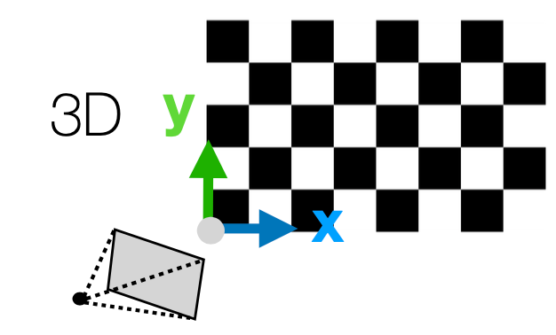

## Camera Calibration
카메라 보정(Camera Calibration)은 카메라의 내부 및 외부 파라미터를 추정하는 과정, 즉 Camera Matix $P$의 파라미터 $K, R, t$를 추정하는 과정

### DLT (Direct Linear Transform)
만약 어떤 물체의 3D 좌표 $\mathbf{X} = (X, Y, Z)$가 이미지 평면의 2D 좌표 $\mathbf{x}=(x, y)$로 투영된다고 가정할 때, 다음과 같은 관계가 성립.  

$$
\mathbf{x} = P \mathbf{X}
$$  
여기서 $P$는 Camera Matrix, 3 by 4 행렬.  

$$
\mathbf{x} = \begin{bmatrix}
x \\
y \\ 1
\end{bmatrix} = \begin{bmatrix}
p_{11} & p_{12} & p_{13} & p_{14} \\
p_{21} & p_{22} & p_{23} & p_{24} \\
p_{31} & p_{32} & p_{33} & p_{34}
\end{bmatrix} \begin{bmatrix}
X \\
Y \\ Z \\ 1
\end{bmatrix}
$$  

이때, $P$의 파라미터를 추정하기 위해 다음과 같은 선형 시스템을 구성할 수 있음.  

$$
\begin{bmatrix}
X & Y & Z & 1 & 0 & 0 & 0 & 0 & -xX & -xY & -xZ & -x \\
0 & 0 & 0 & 0 & X & Y & Z & 1 & -yX & -yY & -yZ & -y
\end{bmatrix} \begin{bmatrix}
p_{11} \\
p_{12} \\
p_{13} \\
p_{14} \\
p_{21} \\
p_{22} \\
p_{23} \\
p_{24} \\
p_{31} \\
p_{32} \\
p_{33} \\
p_{34}
\end{bmatrix} = 0
$$

$p = (p_{11}, p_{12}, p_{13}, p_{14}, p_{21}, p_{22}, p_{23}, p_{24}, p_{31}, p_{32}, p_{33}, p_{34})$는 Scaling factor를 제외하고 11 DoF를 가지며, 각 대응쌍은 2개의 선형 방정식을 제공하므로, 최소 6개의 대응쌍이 필요함.  

$$
\mathbf{A} \mathbf{p} = 0
$$  

이 문제는 SVD 등의 방법을 사용하여 해를 구할 수 있음. SVD를 사용하면 $\mathbf{A}$의 최소 제곱 해를 구할 수 있으며, 이때 $\mathbf{p}$는 $\mathbf{A}$의 최소 특이값에 해당하는 특이 벡터로 주어짐.  

### Decomposing Camera Matrix  
카메라 행렬 $P$는 다음과 같이 분해할 수 있음.  
$$
P = K [R | t] = K[R | - RC] = [KR | -KRC]
$$  
- $K$: 카메라 내부 파라미터 행렬, $3 \times 3$ upper triangular matrix
- $R$: 카메라 외부 파라미터 행렬, $3 \times 3$ orthogonal matrix
- $C$: 카메라 중심, $3 \times 1$ 벡터, null space of $P$
- $P$의 왼쪽 부분 $3 \times 3$ 행렬을 RQ 분해하여 $K$와 $R$을 구할 수 있음.

### Zhang's Method  
<figure>
  
</figure>

- World Coordinate System의 원점을 체커보드의 한 모서리에 설정
- x, y축은 체커보드 패턴의 가로, 세로 방향으로 설정
- z축은 체커보드의 수직 방향으로 설정  
  - 체커보드의 모든 점들은 z=0 평면에 위치  

$$
\begin{bmatrix}
x \\
y \\ 1
\end{bmatrix} \equiv K [R | t] \begin{bmatrix}
X \\
Y \\ Z \\ 1
\end{bmatrix}
$$  

- 이미지 평면으로의 투영을 나타내는 이 공식을, 체커보드의 점에 대해 대입하면 다음과 같음  
  
$$
\lambda \begin{bmatrix}
x \\
y \\ 1
\end{bmatrix} = K \begin{bmatrix}
    r_1 & r_2 & r_3 & t \end{bmatrix} \begin{bmatrix}
X \\
Y \\ 0 \\ 1
\end{bmatrix}
= K \begin{bmatrix}
    r_1 & r_2 & t
\end{bmatrix}
\begin{bmatrix}
X \\
Y \\ 1
\end{bmatrix}
$$  

- $K[r_1 \ r_2 \ t]$는 $3 \times 3$ 행렬이므로, Homography로 표현할 수 있음.  

$$
\lambda [h_1 \ h_2 \ h_3] = K [r_1 \ r_2 \ t]
$$  

$$
\lambda K^{-1} h_1 = r_1, \quad \lambda K^{-1} h_2 = r_2
$$

- $r_1, r_2$는 Ortonormal 벡터이므로(회전행렬), 서로의 내적이 0임. 따라서 다음과 같은 관계식을 세울 수 있음.  

$$
h_1^T K^{-T} K^{-1} h_2 = 0
$$
$$ 
h_1^T K^{-T} K^{-1} h_1 = h_2^T K^{-T} K^{-1} h_2
$$  

- $K^{-T} K^{-1}$는 대칭행렬이므로, Symmetric matrix $B$로 정의하면  

$$
h_1^T B h_2 = 0
$$
$$
h_1^T B h_1 = h_2^T B h_2
$$  

- 이와 같이 한 view에서 $B$에 대해 두개의 선형 방정식을 얻을 수 있음. 
- $B$는 대칭행렬이고, scaling factor를 무시하면 5 DoF를 가지므로, 최소 3개의 대응쌍이 필요함.  
- 따라서 한 체커보드 패턴에 대해 3개의 view가 필요함.  
- $B$를 추정한 후, Cholesky Decomposition을 통해 $K$를 구할 수 있음. 
  - Cholesky Decomposition: 대칭행렬을 $L L^T$ 형태로 분해하는 방법, 여기서 $L$은 lower triangular matrix
- $K$를 구한 후, $R$과 $t$를 추정할 수 있음.  
  - $r_1 = \lambda K^{-1} h_1$, $r_2 = \lambda K^{-1} h_2$이므로, $r_1$과 $r_2$를 다음과 같이 구할 수 있음.  
$$
r_1 = \frac{K^{-1} h_1}{\|K^{-1} h_1\|}, \quad r_2 = \frac{K^{-1} h_2}{\|K^{-1} h_2\|}
$$  
  - 여기서 $\|K^{-1} h_1\|$는 $\lambda$가 됨
  - $r_3$은 $R$의 세번째 열로, $r_3 = r_1 \times r_2$로 구할 수 있음.
  - $t$는 $t = \frac{K^{-1} h_3}{\lambda}$로 구할 수 있음.

## Lens Distortion  
렌즈 왜곡(Lens Distortion)은 카메라 렌즈의 비선형 특성으로 인해 이미지가 왜곡되는 현상.
- Radial Distortion: 이미지의 중심에서 멀어질수록 픽셀이 비정상적으로 확대되거나 축소되는 현상.
- Tangential Distortion: 렌즈가 완벽하게 수직이 아닐 때 발생하는 왜곡으로, 이미지의 특정 방향으로 픽셀이 이동하는 현상.  

$$
\begin{bmatrix}
x_d \\
y_d
\end{bmatrix} = (1 + k_1 r^2 + k_2 r^4 + k_3 r^6) \begin{bmatrix}
x \\
y
\end{bmatrix} + \begin{bmatrix}
2p_1 xy + p_2 (r^2 + 2x^2) \\
2p_2 xy + p_1 (r^2 + 2y^2)
\end{bmatrix}
$$  
- $x_d, y_d$: 왜곡된 이미지 좌표
- $x, y$: 원래 이미지 좌표
- $k_1, k_2, k_3, p_1, p_2$: distortion parameters
- $r^2 = x^2 + y^2$
- 카메라 파라미터 $K$를 알고 있다면, 픽셀 $(x_p, y_p, 1)$에 ideal pixel $(x, y)$를 얻어 왜곡된 픽셀 $(x_d, y_d)$를 구할 수 있음.  

---
해당 포스트는 서울대학교 컴퓨터공학부 주한별 교수님의 컴퓨터비전 25-1학기 강의를 정리한 내용입니다.