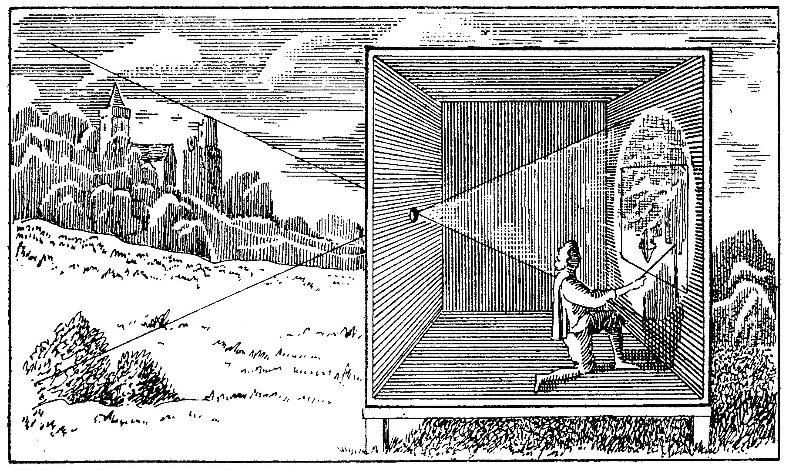
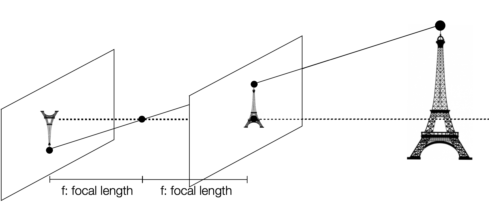
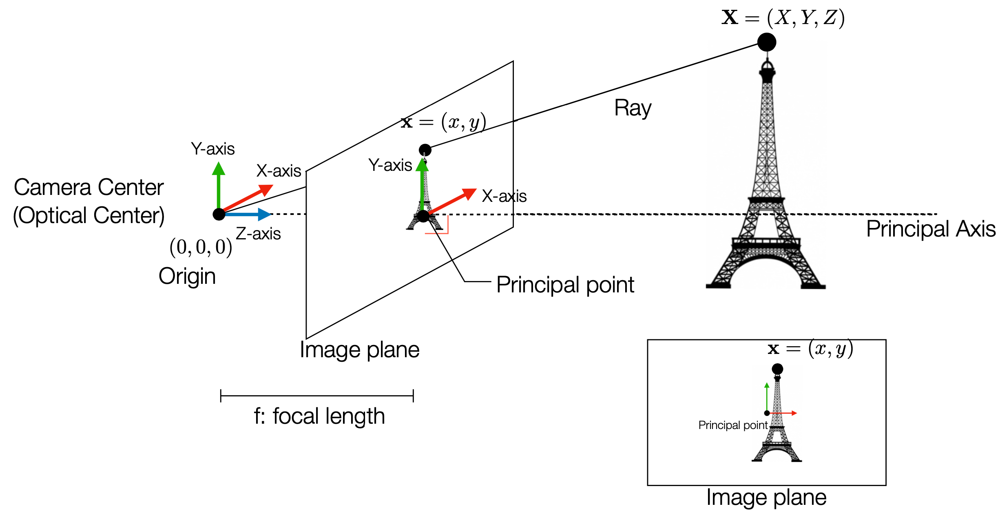
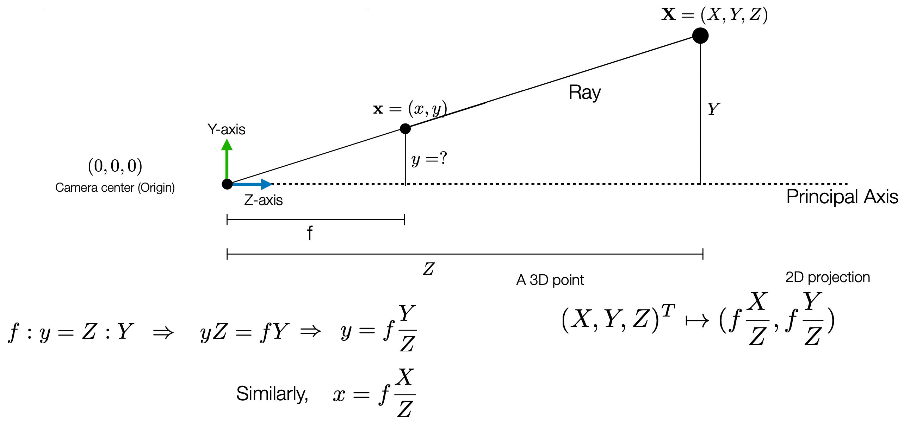
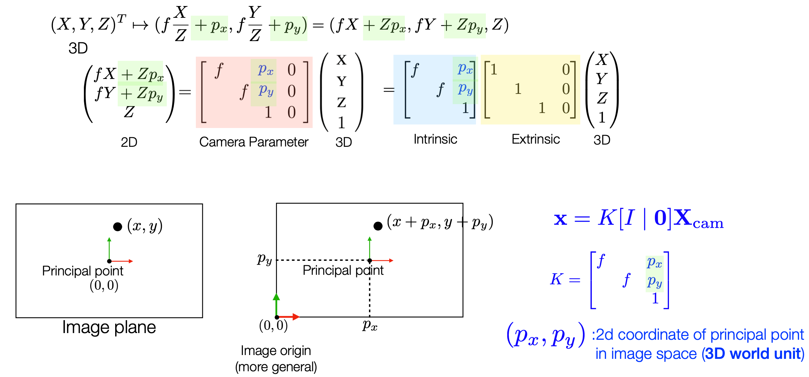
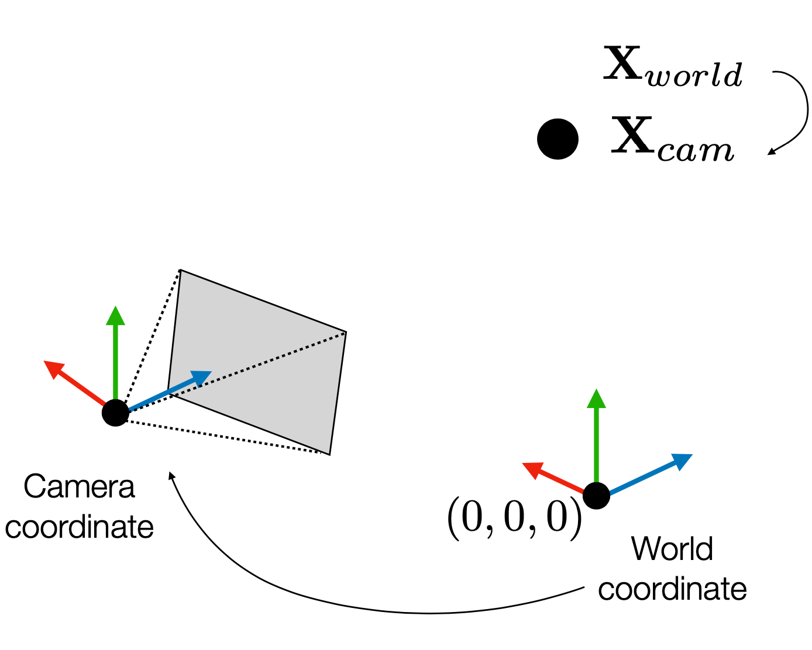
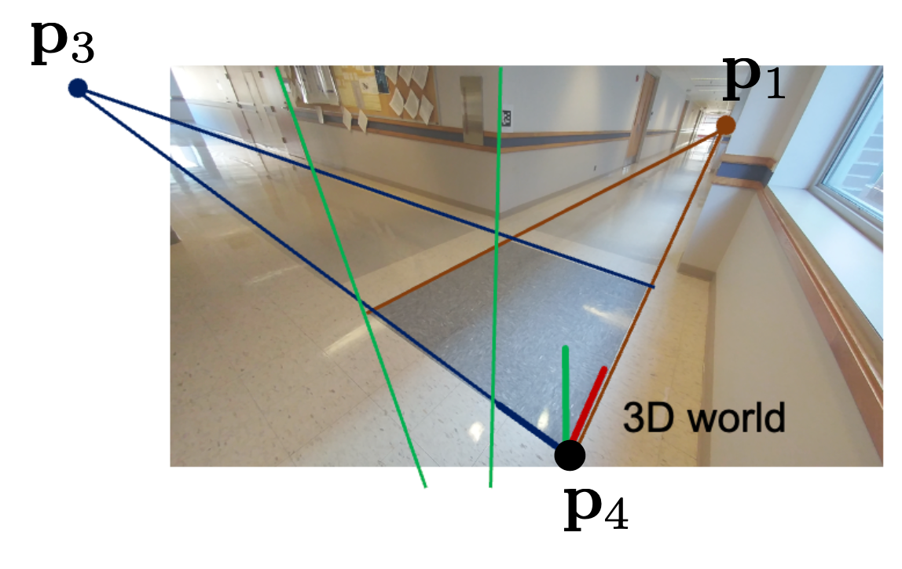
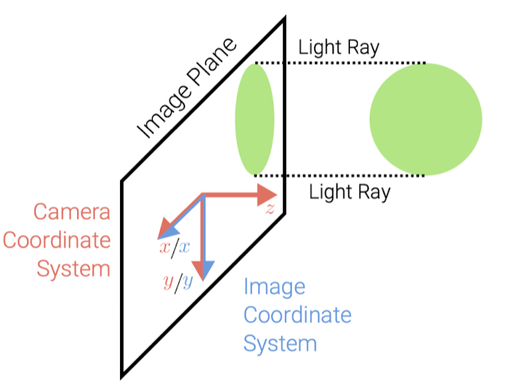

## Camera Model
카메라 모델은 3D 세계를 2D 이미지로 변환하는 과정을 설명하는 모델  
<figure>
  
</figure>  

위 이미지는 Camera Obscura로, 빛이 작은 구멍(pinhole)을 통해 들어와서 반대편 벽에 이미지가 투사되는 원리를 이용한 초기 카메라 모델  

<figure>
  
</figure>

Pihole로부터 상이 맺히는 지점까지의 거리를 focal length라고 하고, 현대 카메라는 이 원리를 이용해 가상의 상이 맺히는 지점을 설정해 이미지를 투영함.

<figure>
  
</figure>  

위 이미지에서 pinhole에 해당하는 Camera Center는 3D 세계의 좌표계를 기준으로 원점 $(0, 0, 0)$에 위치하며, 3D 세계의 점 $(X, Y, Z)$를 원점으로부터 focal length $f$만큼 떨어진 평면에 투영하여 2D 이미지 좌표 $(x, y)$를 얻음.  

### Camera Intrinsic Parameters  
<figure>
  
</figure>  

위 이미지는 카메라 중심(원점), $Z$축(주축), 이미지 평면, 그리고 3D 공간의 점 $\mathbf{X} =(X, Y, Z)$가 이미지 평면의 $\mathbf{x} = (x, y)$로 투영되는 모습을 보여줌.  
$f:y = Z:Y$의 비례관계를 이용하여 $yZ = fY, xZ = fX$, 곧 $y = \frac{fY}{Z}, x = \frac{fX}{Z}$로 표현할 수 있음. 해당 비례관계는 이 Ray 위의 다른 점 $\mathbf{X'} = (kX, kY, kZ)$에 대해서도 성립하고, 즉 해당 좌표는 Homogeneous 좌표계로 표현할 수 있음.  
$$ 
(X, Y, Z) \mapsto (fX/Z, fY/Z) \equiv (fX, fY, Z) = \begin{bmatrix}
f & 0 & 0 \\
0 & f & 0 \\ 0 & 0 & 1
\end{bmatrix} \begin{bmatrix}
X \\
Y \\ Z
\end{bmatrix}
$$  
- $(X, Y, Z)$: 3D inhomogeneous 좌표
- $(fX/Z, fY/Z)$: 2D 이미지 평면의 inhomogeneous 좌표
- $(fX, fY, Z)$: Projective 좌표계의 Homogeneous 좌표  

3D 좌표도 일관적으로 Homogeneous 좌표계로 표현한다면 다음과 같이 표현할 수 있음.  
$$
\begin{bmatrix}
fX \\
fY \\ Z
\end{bmatrix} = \begin{bmatrix}
f & 0 & 0 & 0 \\
0 & f & 0 & 0 \\
0 & 0 & 1 & 0 \\
\end{bmatrix} \begin{bmatrix}
X \\
Y \\ Z \\ 1
\end{bmatrix}
$$   

여기서 곱해지는 $3 \times 4$ 행렬을 Camera Matrix $P$ 라고 하며, 이는 또 다음과 같이 나눌 수 있음.  

$$
P = \begin{bmatrix}
f & 0 & 0 & 0 \\
0 & f & 0 & 0 \\
0 & 0 & 1 & 0 \\
\end{bmatrix} = \begin{bmatrix}
f & 0 & 0 \\
0 & f & 0 \\
0 & 0 & 1 \\
\end{bmatrix} \begin{bmatrix}
1 & 0 & 0 & 0 \\
0 & 1 & 0 & 0 \\
0 & 0 & 1 & 0 \\
\end{bmatrix} = K \cdot [I \ | \ 0]
$$  

- $K$: Camera Intrinsic Matrix
- $I$: $3 \times 3$ 단위 행렬
- $0$: $3 \times 1$ 영 벡터
- $[I \ | \ 0]$: Camera Extrinsic Matrix  

<figure>
  
</figure>  

지금까지는 카메라 중심이 원점에 위치한다고 가정했지만, 실제 카메라는 원점 $(0,0)$을 이미지 좌하단으로 설정함. 따라서 실제 카메라 중심 principal point를 $(p_x, p_y)$로 설정한다면, 투영된 좌표는 $(x, y)$가 아닌 $(x + p_x, y + p_y)$로 표현할 수 있음. 따라서 Camera Intrinsic Matrix는 다음과 같이 표현할 수 있음.(DoF = 3)   

$$
K = \begin{bmatrix}
f & 0 & p_x \\
0 & f & p_y \\
0 & 0 & 1 \\
\end{bmatrix}
$$  
$$
\mathbf{X} = (X, Y, Z) \mapsto (f\frac{X}{Z} + p_x, f\frac{Y}{Z} + p_y)
$$  

물체가 이미지에 투영될 때, 이상적인 평면에 투영되는 것이 아니라, 픽셀 단위로 투영됨. 이때 x축과 y축의 픽셀 크기가 다를 수 있음. 이 경우, x축과 y축의 focal length를 각각 다르게 설정해줄 수 있음.(DoF = 4) 

$$
K = \begin{bmatrix}
\alpha_x & 0 & x_0 \\
0 & \alpha_y & y_0 \\
0 & 0 & 1 \\
\end{bmatrix}
$$
$$
\mathbf{X} = (X, Y, Z) \mapsto (\alpha_x\frac{X}{Z} + x_0, \alpha_y\frac{Y}{Z} + y_0)
$$

비정상적인 상황에서, image plane의 x축과 y축이 서로 수직이 아닐 수도 있음. 이 경우, skew factor $s$를 도입하여 Camera Intrinsic Matrix는 다음과 같이 표현할 수 있음.(DoF = 5)  

$$
K = \begin{bmatrix}
f & s & x_0 \\
0 & f & y_0 \\
0 & 0 & 1 \\
\end{bmatrix}
$$  
$$
\mathbf{X} = (X, Y, Z) \mapsto (f\frac{X}{Z} + s\frac{Y}{Z} + x_0, f\frac{Y}{Z} + y_0)
$$

### Camera Extrinsic Parameters

$$
\begin{bmatrix}
fX \\
fY \\ Z
\end{bmatrix} = P \begin{bmatrix}
X \\
Y \\ Z \\ 1
\end{bmatrix} = \begin{bmatrix}
\alpha_x & s & x_0 \\
0 & \alpha_y & y_0 \\
0 & 0 & 1 \\
\end{bmatrix} \begin{bmatrix}
1 & 0 & 0 & 0 \\
0 & 1 & 0 & 0 \\
0 & 0 & 1 & 0 \\
\end{bmatrix} \begin{bmatrix}
X \\
Y \\ Z \\ 1
\end{bmatrix}
$$   

앞서 Camera Matrix $P$를 $K \cdot [I \ | \ 0]$로 표현했는데, 이 수식을 보면 Extrinsic Matrix의 존재 의의를 알 수 없음. 이는 지금까지 카메라 중심이 원점에 위치한다고 가정했기 때문임.  
Extrinsic Matrix는 카메라 중심이 원점에 위치하지 않을 때, 즉 카메라가 3D 공간에서 회전하거나 이동할 때 이를 반영하기 위해 사용됨.  

<figure>
    
</figure>  

어떤 점 $X$를 World Coordinate에서 바라본 좌표계를 카메라가 바라보는 좌표계로 변환하기 위해서는 World Coordinate에서의 좌표를 변환해야함.  
카메라가 가질 수 있는 위치의 변화는 회전과 이동으로 표현할 수 있음.  

$$ 
X_{cam} = R \cdot X_{world} + t = [R \ | \ t] \begin{bmatrix}
X_{world} \\
1
\end{bmatrix}
$$  
- $R$: $3 \times 3$ 회전 행렬
- $t$: $3 \times 1$ 이동 벡터
- $X_{cam}$: 카메라 좌표계에서의 점 $X$의 좌표
- $X_{world}$: 월드 좌표계에서의 점 $X$의 좌표
- 위와 같이 Homogeneous 좌표계로 표현할 수 있음.
- 촬영의 대상이 되는 물체의 좌표는 intrinsic parameters에 의해 이미지 평면으로 투영되기 전 모두 카메라 좌표계로 변환되어야함.  

### Camera Model  
일반화된 카메라 모델은 다음과 같이 표현할 수 있음.   

$$
\begin{bmatrix}
fX \\
fY \\ Z
\end{bmatrix} = \begin{bmatrix}
\alpha_x & s & x_0 \\
0 & \alpha_y & y_0 \\
0 & 0 & 1 \\
\end{bmatrix} [R \ | \ t] \begin{bmatrix}
X \\
Y \\ Z \\ 1
\end{bmatrix}
$$

Camera Matrix $P$는 다음과 같이도 표현할 수 있음.  
$$
P = K \cdot [R \ | \ t] = KR[I \ | \ -C_{world}]
$$  
- $C_{world}$는 월드 좌표계에서의 카메라 중심 좌표  

  - $X_{world} = C_{world}$일 때, $X_{cam} = 0$이므로, $0 = R \cdot C_{world} + t$가 됨.  
  - 따라서 $t = -R \cdot C_{world}$로 표현할 수 있음.  

- 카메라 중심의 투영  
$$
P \hat{C}_{world} = K \cdot [R \ | \ t] \hat{C}_{world} = KC_{cam} = 0
$$  
  - 카메라 중심은 이미지 평면에 투영되지 않음.
  - 따라서 카메라 중심의 투영은 항상 0이 됨.
  - 이를 이용해 월드 좌표계에서의 카메라 중심 $\hat{C}_{world}$를 추정할 수 있음.  

### Camera Anatomy  
$$
P = \begin{bmatrix}
    \vert & \vert & \vert & \vert \\
    \mathbf{p_1} & \mathbf{p_2} & \mathbf{p_3} & \mathbf{p_4} \\
    \vert & \vert & \vert & \vert
\end{bmatrix}
$$
- Homogeneous 좌표계에서 $(1, 0, 0, 0), (0, 1, 0, 0), (0, 0, 1, 0)$은 각각 x축, y축, z축의 무한점(vanishing point)를 나타냄.
- 따라서 이미지 평면에서의 x축, y축, z축의 무한점은 각각 $\mathbf{p_1}, \mathbf{p_2}, \mathbf{p_3}$로 표현할 수 있음.
  - 이때, 각 무한점을 구할때는 왼쪽의 $3 \times 3$ 행렬만 이용하므로, translation 벡터 $t$나 카메라 중심의 위치 $C_{world}$는 영향을 미치지 않음.
- $(0, 0, 0, 1)$은 월드 좌표계에서의 원점이므로, $\mathbf{p_4}$는 월드 원점의 투영을 나타냄.  

<figure>
  
  <figcaption>이미지 평면에서 p1, p2, p3는 각각 x축, y축, z축의 무한점의 투영</figcaption>
</figure>

### Backward Projection 
이미지 점 x로부터 역투영된 3D 점 $P^+x$를 얻을 수 있음  

$$
P^+x = P^T(PP^T)^{-1}x
$$

- $P^+$는 P의 유사 역행렬(pseudo-inverse)
- 이 $P^+x$는 카메라 중심에서 역투영된 3D 점의 Homogeneous 좌표
- 투영 확인:   
    $P(P^+x) = P(P^T(PP^T)^{-1}x) = x$  
    (역투영된 점을 다시 투영하면 원본 이미지 점 x가 나옴을 확인).
- 카메라 중심으로부터의 3D 광선:   
    이미지 점 x에 해당하는 3D 공간의 광선은 카메라 중심 C와 역투영된 점 $P^+x$를 지나는 선으로 표현될 수 있음   
    $X(\lambda) = C + \lambda P^+x$
- 광선의 투영 확인:  
    $PX(\lambda) = P(C + \lambda P^+x) = PC + \lambda PP^+x = 0 + \lambda x = \lambda x$  
    따라서, 이 광선은 이미지 평면에서 x를 지나게 됨.
- 즉, $P$를 알고 있다면, 이미지 점 x로부터 역투영된 3D 점 $P^+x$를 구할 수 있고, 이 점은 카메라 중심에서 해당 이미지 점을 향하는 광선 위에 위치함.

### Decomposition of Camera Matrix  
$$
P = K \cdot [R \ | \ t] = K R [I \ | \ -C] = [K R \ | \ -KRC]
$$
- 위와 같이 카메라 행렬을 분해할 수 있음.
- 카메라 중심 $C$는 $PC = 0$이므로, $P$의 null space로부터 구할 수 있음.
- $KR$은 각각 upper triangular matrix와 orthogonal matrix이므로, $P$의 왼쪽 $3 \times 3$ 행렬에 대해 RQ 분해를 수행하여 $K$와 $R$을 구할 수 있음.  
- traslation 벡터 $t$는 $t = -R \cdot C$로 구할 수 있음.
- 이와 같은 방법으로, 카메라 행렬 $P$가 주어졌을 때, 카메라의 intrinsic parameters $K$와 extrinsic parameters $R, t$를 추정할 수 있음.
- 이런 분해는 유일하지는 않음.  
  - 예를 들어, $KR$을 $KDDR$로 표현할 수 있음.  
  - 이때, $D$는 $D_{11} = D_{22} = \pm 1$이고, $D_{33} = 1$인 대각 행렬임.
  - 그렇다면 $KD$와 $DR$은 여전히 카메라 행렬 $P$를 만족함.
  - 따라서 $K$와 $R$은 수학적으로는 유일하지는 않음(4개의 선택지)
  - 하지만 cheirality condition($z > 0$)을 만족하는 해는 유일함.
  - 따라서 하나의 해가 선택됨.

### Affine Camera Model  
Affine 카메라 모델은 카메라의 focal length가 매우 커지는 경우에 대한 모델. focal length가 매우 커지면, 카메라의 투영이 거의 평행하게 이루어짐.  

$$
P_A = \begin{bmatrix}
m_{11} & m_{12} & m_{13} & t_1 \\
m_{21} & m_{22} & m_{23} & t_2 \\
0 & 0 & 0 & 1
\end{bmatrix}
$$   

- 왼쪽의 $3 \times 3$ 행렬은 Affine 변환을 나타내며, singular matrix가 됨.
- 마지막 행 $[0, 0, 0, 1]$은 Homogeneous 좌표계에서 "plane at infinity(principal plane)"를 나타냄.
- 카메라 중심은 $M_{2\times 3}$ 행렬의 null space에 위치함.
- Affine 카메라에서의 투영은 inhomogeneous 좌표계에서의 투영과 같음  

$$
\begin{bmatrix}
m_{11} & m_{12} & m_{13} & t_1 \\
m_{21} & m_{22} & m_{23} & t_2 \\
0 & 0 & 0 & 1
\end{bmatrix} \begin{bmatrix}
x \\
y \\ z \\ 1
\end{bmatrix} = \begin{bmatrix}
x' \\
y' \\ 1
\end{bmatrix} \sim \begin{bmatrix}
x' \\ y' 
\end{bmatrix}
=\begin{bmatrix}
m_{11} & m_{12} & m_{13} \\ m_{21} & m_{22} & m_{23} 
\end{bmatrix} \begin{bmatrix}
x \\
y \\ z
\end{bmatrix} + \begin{bmatrix}
t_1 \\
t_2
\end{bmatrix}
$$

이와 같은 구조에서는, 평행선(무한점)이 보존된다.  

$$
\begin{bmatrix}
m_{11} & m_{12} & m_{13} & t_1 \\
m_{21} & m_{22} & m_{23} & t_2 \\
0 & 0 & 0 & 1
\end{bmatrix} \begin{bmatrix}
x \\
y \\ z \\ 0
\end{bmatrix} = \begin{bmatrix}
x' \\
y' \\ 0 
\end{bmatrix}
$$  

#### Orthographic Projection
<figure>
  
</figure>

- 이상적인 Affine 카메라는 orthographic projection을 따름.
  - orthographic projection은 3D 공간의 점을 2D 평면에 투영할 때, 카메라 중심에서의 거리에 관계없이 모든 점을 동일한 방식으로 투영함.
  - 이때 Z축 방향의 정보는 사라지고, X축과 Y축의 정보만 남게 됨.

$$
\begin{bmatrix}
1 & 0 & 0 & 0 \\
0 & 1 & 0 & 0 \\
0 & 0 & 0 & 1
\end{bmatrix} \begin{bmatrix}
x \\
y \\ z \\ 1
\end{bmatrix} = \begin{bmatrix}
x \\
y \\ 1
\end{bmatrix} \sim \begin{bmatrix}
x \\ y
\end{bmatrix}
$$  

- 이미지의 크기만 투영과정에서 바뀌게 된다면, scaled orthographic projection이라고 함.  

$$
\begin{bmatrix}
\alpha & 0 & 0 & 0 \\
0 & \alpha & 0 & 0 \\
0 & 0 & 0 & 1
\end{bmatrix} 
$$

- 약간의 원근과, skew가 있는 경우, 일반적인 Affine Projection은 다음과 같이 표현할 수 있음.  
$$
\begin{bmatrix}
\alpha_x & s & 0 & 0 \\
0 & \alpha_y & 0 & 0 \\
0 & 0 & 0 & 1
\end{bmatrix}
$$  

---
해당 포스트는 서울대학교 컴퓨터공학부 주한별 교수님의 컴퓨터비전 25-1학기 강의를 정리한 내용입니다.