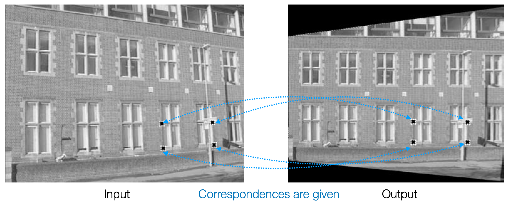

## Homography Estimation
Homography란 Projective Geometry에서 두 Projective 평면 사이의 변환을 나타내는 것으로, 이미지에서의 한 평면을 다른 평면으로 매핑하는 것을 의미함.  
Homography는 행렬로 표현되며, 3x3 행렬로 나타낼 수 있음.  
$$
x' = Hx
$$
여기서 $x$는 원본 이미지의 좌표, $x'$는 변환된 이미지의 좌표, $H$는 Homography 행렬임.  
<figure>
  
</figure>
위 이미지와 같이 두 이미지의 대응되는 평면을 구성하는 대응점들을 이용하여 Homography 행렬을 추정할 수 있음.  

### DLT (Direct Linear Transform)
Homography 행렬 $H$를 추정하기 위해 다음과 같은 간단한 선형 시스템을 구성할 수 있음.  

$$
\mathbf{x'} = H \mathbf{x}
$$  

$$
\begin{bmatrix}
x'_i \\
y'_i \\ 1
\end{bmatrix}
= \begin{bmatrix}
h_{11} & h_{12} & h_{13} \\
h_{21} & h_{22} & h_{23} \\
h_{31} & h_{32} & h_{33}
\end{bmatrix}
\begin{bmatrix}
x_i \\
y_i \\ 1
\end{bmatrix}
$$

변환된 좌표 $\mathbf{x'}$는 homogeneous 죄표계로 다음과 같이 표현할 수 있음.  
$$
x' = \frac{h_{11}x + h_{12}y + h_{13}}{h_{31}x + h_{32}y + h_{33}}
$$
$$
y' = \frac{h_{21}x + h_{22}y + h_{23}}{h_{31}x + h_{32}y + h_{33}}
$$  
 
두 식을 선형방정식 형태로 정리하면 다음과 같음.  

$$
h_{11}x + h_{12}y + h_{13} - h_{31}x'x - h_{32}y'x' - h_{33}x' = 0
$$
$$
h_{21}x + h_{22}y + h_{23} - h_{31}xy' - h_{32}y'y - h_{33}y' = 0
$$

이 식을 행렬 형태로 표현하면 다음과 같음.  
$$
\begin{bmatrix}
x & y & 1 & 0 & 0 & 0 & -x'x & -y'x & -x' \\
0 & 0 & 0 & x & y & 1 & -xy' & -y'y & -y'
\end{bmatrix}
\begin{bmatrix}
h_{11} \\
h_{12} \\
h_{13} \\
h_{21} \\
h_{22} \\
h_{23} \\
h_{31} \\
h_{32} \\
h_{33}
\end{bmatrix}
= 0
$$
$$
A\mathbf{h} = 0
$$  

$\mathbf{h} = (h_{11}, h_{12}, h_{13}, h_{21}, h_{22}, h_{23}, h_{31}, h_{32}, h_{33})^T$는 scaling factor를 제외하면 DoF(자유도)가 8인 벡터.  
하나의 대응쌍 $(\mathbf{x}, \mathbf{x'})$에 대해 2개의 선형 방정식을 얻을 수 있으므로, $H$를 추정하기 위해 최소 4개의 대응쌍이 필요함.  
완벽히 이상적인 대응쌍 4개가 주어지면, $A$ null space를 계산하여 $H$를 구할 수 있음. 하지만 현실에서는 대응쌍이 노이즈에 영향을 받거나, 4개 이상의 대응쌍이 주어지는 경우도 많음. 이런 경우에는 $A\mathbf{h} = 0$의 해가 정확히 정의가 되지 않음.  

- 대신 푸는 문제:  
$$
\min_{||\mathbf{h}|| = 1} ||A\mathbf{h}||
$$  
  - 즉, $A\mathbf{h}$의 크기를 최소화하는 $\mathbf{h}$를 찾는 것.
  - $||h|| = 1$은 trivial solution $\mathbf{h} = 0$을 제외하기 위한 조건.
  - 이 문제의 해는 SVD의 결과 $A = U\Sigma V^T$에서 $\mathbf{h} = V[:, -1]$로 구할 수 있음.
    - $V[:, -1]$은 $A$의 SVD로 얻은 singular vector 중 마지막 벡터로, 그 의미는 선형변환 $A$의 입력공간의 벡터 중 선형변환 결과가 가장 작은 벡터를 의미함.(근사된 null space)

- Cross Product
  - Homogeneous 좌표계에서 $\mathbf{x'} = H\mathbf{x}$와 같은 식에 대해서 equivalace까지 고려해야 함.
  - 따라서 $\mathbf{x'} \sim H\mathbf{x}$를 계산해야함
  - 이 식을 단순화하기 위해 Homogeneous 좌표계의 특징을 고려, 다음과 같이 cross product를 이용하여 표현할 수 있음.  
$$
\mathbf{x'} \times H\mathbf{x} = 0
$$  

### RANSAC(Random Sample Consensus)
RANSAC은 노이즈가 많은 데이터에서 좋은 모델을 추정하는 알고리즘이다.

- Line Example
  - Homogeneous 상의 두 점 $\mathbf{x}_1, \mathbf{x}_2$가 주어졌을 때, 이 두 점을 지나는 직선의 방정식은 외적으로 다음과 같이 표현할 수 있다.  
$$
\mathbf{l} = \mathbf{x}_1 \times \mathbf{x}_2
$$
  - 이를 행렬 형태로 표현하면 다음과 같다.  
$$
\begin{bmatrix}
\mathbf{x}_1^T \\
\mathbf{x}_2^T
\end{bmatrix}
\mathbf{l} = 0
$$
  - 만약 $m$개의 점이 주어졌다면, $m$개의 점을 지나는 직선의 방정식은 다음과 같이 표현할 수 있다.  
$$
\begin{bmatrix}
\mathbf{x}_1^T \\
\mathbf{x}_2^T \\
\vdots \\
\mathbf{x}_m^T
\end{bmatrix}
\mathbf{l} = 0
$$
  - 이 모든 점을 이용해 null space를 구하거나 근사하면, 이상치나 노이즈에 영향을 받는 직선을 구할 수도 있음
  - RANSAC은 이를 보완하기 위한 알고리즘이다.

- **RANSAC 알고리즘**
    1. $m$개의 점 중에서 2개의 점(선을 추정하는 예제)을 무작위로 선택한다.
    2. 이 두 점을 이용해 직선의 방정식을 구한다.
    3. 이 직선과 일정 거리(threshold) 이내에 있는 점들을 inlier로 간주한다.
    4. inlier의 개수를 저장한다.
    5. 이 과정을 여러 번 반복하여 inlier의 개수가 가장 많은 직선을 선택한다.
    6. 해당 inliner들을 이용해 최종 직선을 구한다.

- RANSAC의 수학적 조건과 성공 확률  
$$
p = 1 - (1 - \alpha^n)^k
$$  
  - $p$: 성공 확률(성공적으로 inlier를 찾을 확률)
  - $\alpha$: inlier의 비율
  - $n$: 한 번의 샘플링에서 선택하는 점의 개수
  - $k$: 반복 횟수
  - 이 식을 통해 몇 번의 반복이 필요한지 계산할 수 있다.

- Pros  
  - 노이즈가 많은 데이터에서도 좋은 모델을 추정할 수 있다.
  - 실제 예제들에 대해 잘 적용된다.
- Cons  
  - 반복 횟수 $k$가 많아질수록 계산 비용이 증가한다.
  - 최적의 모델을 찾지 못할 수도 있다.(답이 존재하지 않는 경우)
  - threshold 값, 반복 횟수 $k$ 등의 하이퍼파라미터를 휴리스틱하게 설정해야 한다.

- **RANSAC for Homography**
  - SIFT 등의 특징점 추출 알고리즘을 이용해 대응점을 추출한다.
  - 각 iteration 마다
    - 4개의 대응점을 무작위로 선택한다.
    - 이 4개의 대응점으로 DLT를 이용해 Homography 행렬 $H$를 추정한다.
    - 이 $H$를 이용해 모든 대응점에 대해 변환된 좌표를 계산한다.
    - 각 대응점과 변환된 좌표 사이의 거리를 계산한다.
    - threshold 이하인 대응점들을 inlier로 간주한다.
    - inlier의 개수를 저장한다.
  - 최적 inlier의 개수를 가진 Homography 행렬을 선택해
    - 다시 한번 전체 inlier를 이용해 DLT로 Homography 행렬을 추정한다.

- Algebraic error vs. Geometric error
  - Algebraic error: $||A\mathbf{h}||$를 최소화하는 Homography 행렬을 찾는 것.
  - Geometric error: 대응점의 실제 위치와 변환된 위치 사이의 거리를 최소화하는 Homography 행렬을 찾는 것.
  - RANSAC을 이용해 Homography를 추정할 땐, 대수적 오차를 기준으로 DLT를 하고, 기하적 오차를 기준으로 inlier를 찾는다

---
해당 포스트는 서울대학교 컴퓨터공학부 주한별 교수님의 컴퓨터비전 25-1학기 강의를 정리한 내용입니다.