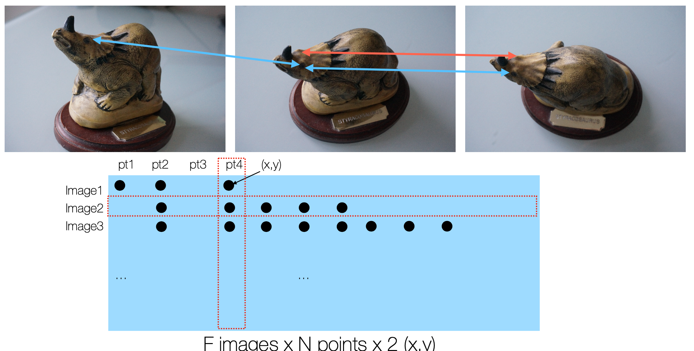

## Incremental Structure from Motion (SfM)
Incremental Structure from Motion (SfM)은 카메라의 위치와 3D 구조를 동시에 추정하는 방법으로, 주로 이미지 시퀀스에서 카메라의 움직임과 3D 포인트 클라우드를 생성하는 데 사용됨.  
- 직교 카메라 가정을 하지 않음(Affine 카메라 모델이 아님)
- 물체의 완벽한 포인트 궤적을 얻을 필요는 없음.(포인트가 가려져도 됨)
- 대규모 처리 가능

### 알고리즘  
1. Feature Matching
   - 모든 이미지 쌍 간 대응점 찾기
2. 초기 두 이미지 선택 & 카메라 위치 추정
    - 대응점이 충분한 두 이미지를 선택
    - 카메라의 상대 위치와 회전 추정
3. 새로운 이미지 추가
    - 새로운 이미지와 기존 이미지 간 대응점 찾기
    - 카메라 위치와 회전 추정
4. Triangulation
    - 새로운 이미지에서 추정된 카메라 위치와 기존 이미지의 대응점을 이용해 3D 포인트 생성
5. Bundle Adjustment  
    - 전체 카메라 위치와 3D 포인트를 동시에 최적화하여 오차 최소화  

### Feature Matching(Find Correspondences)
<figure>
  
</figure>

- 위 이미지와 같이 사진 개수 $F$와 특징점 $N$개에 대해 F by N by 2(x, y 좌표) 형태의 대응점 행렬을 생성
- 위 대응점 생성은 RANSAC을 통해 진행
  1. 초기 대응점들이 주어짐
  2. 반복:  
     1. 무작위로 5개의 대응점 선택
     2. 5 points algorithm을 이용해 Essential Matrix $E$ 추정(8 points로 DLT를 이용해 추정할 수도 있음)
     3. $E$를 이용해 모든 대응점에 대해 inlier와 outlier 분류
     4. inlier의 개수가 가장 많은 경우를 선택
  3. 최종적으로 inlier 대응점들로부터 Essential Matrix $E$ 추정
- 이를 통해 정제된 대응점 행렬을 얻을 수 있음.  

### Initial Pair Selection(Pose Estimation)
- 초기 대응점 행렬에서 충분한 대응점이 있는 두 이미지를 선택
- 정확한 depth 추정을 위해 baseline(카메라 중심 간 거리)가 충분히 큰 이미지 쌍을 선택하는 것이 중요
- 선택된 두 이미지의 대응점을 기반으로 카메라의 상대 위치와 회전을 추정
- Triangulation을 통해 reprojection error를 확인
- reprojection error가 충분히 낮은 경우에만 해당 이미지 쌍을 초기 이미지로 선택하고, 그러지 않은 경우 다른 초기 이미지 쌍을 선택

### Adding New Images
- 초기 이미지 쌍이 선택된 후, 새로운 이미지를 추가하는 과정
- 등록하려는 이미지의 투영 좌표와, 3D 포인트의 추정 좌표가 있으므로 PnP(Perspective-n-Point) 문제를 해결하여 카메라의 위치와 회전을 추정
- PnP를 RANSAC을 이용해 해결
  1. 무작위로 3개의 대응점 선택
  2. P3P를 이용해 카메라 행렬 $P$ 추정
  3. $P$를 이용해 나머지 모든 점들을 이미지에 투영
  4. 투영된 점들과 실제 이미지의 대응점 간의 오차를 계산해 inlier 계산
  5. 가장 많은 inlier를 가진 경우를 선택해 모든 점들을 이용해 EPnP로 최종 카메라 행렬 $P$ 추정

### Triangulation
- 이전 단계에서 새 이미지를 등록하면서, 해당 이미지의 2D 특징점 중 일부는 이미 재구성된 3D 점에 연결됨(PnP에 사용된 2D-3D 대응점)
- 하지만 새 이미지에는 아직 3D 점으로 재구성되지 않은 많은 2D 특징점들이 있을 수 있음
- 새로 등록된 이미지의 2D 특징점과 기존 이미지의 2D 특징점 간의 대응점을 찾아, 이 대응점을 이용해 Triangulation을 수행해 새로운 3D 점을 추가

### Bundle Adjustment
- SfM은 카메라 자세 추정과 3D 점 삼각측량 과정을 점진적으로 수행하는데, 각 단계에서 작은 오차가 발생할 수 있음
- 이러한 오차들이 누적되면 전체 3D 모델의 정확도가 떨어지게 됨
- Bundle Adjustment는 이러한 오류 누적 문제를 해결하기 위한 non-linear optimization 기법
- 각 점들에 대해 개별적으로 오차 조정을 하게 되면, 다른 점들의 오차에도 영향을 미치게 되어 전체적인 최적화가 어려워짐
- 따라서 Bundle Adjustment는 모든 카메라 위치와 3D 점을 동시에 최적화하여 전체 오차를 최소화하는 방식으로 동작함
- 목적함수:  
$$
\{P_c^*\}, \{X_n^*\} = \arg\min_{\{P_c\}, \{X_n\}} \sum_{c=1}^{C} \sum_{n=1}^{N} s_{c,n} || \pi(P_c, X_n) - x_{c,n} ||^2
$$
  - $P_c$: 카메라 행렬
  - $X_n$: 3D 점
  - $x_{c,n}$: 카메라 $c$에서 3D 점 $n$의 투영된 2D 좌표
  - $s_{c,n}$: 카메라 $c$에서 3D 점 $n$이 관측되었는지 여부(1이면 관측됨, 0이면 관측되지 않음)
  - $\pi(P_c, X_n)$: 카메라 행렬 $P_c$를 이용해 3D 점 $X_n$을 2D 좌표로 투영하는 함수
- 이를 최적화하기 위해, 각 카메라 행렬 $P_c$와 3D 점 $X_n$에 대해 편미분을 수행하여 기울기를 계산하는데, 이에 대한 Jacobian 행렬은 다음과 같음  
$$
J = \begin{bmatrix}
\frac{\partial \pi(P_c, X_n)}{\partial P_c} & \frac{\partial \pi(P_c, X_n)}{\partial X_n}
\end{bmatrix} \in \mathbb{R}^{(2N) \times (6C + 3N)}
$$
  - $C$: 카메라의 개수
  - $N$: 3D 점의 개수
  - 각 카메라마다 6개의 파라미터(3D 회전과 3D 이동)와 각 3D 점마다 3개의 파라미터가 있으므로, 총 $6C + 3N$개의 파라미터가 존재함
  - $x$좌표에 대한 관측 오차와, $y$좌표에 대한 관측 오차를 각각 계산하므로, Jacobian 행렬의 행의 개수는 $2N$이 됨
  - 즉 $J_{ij}$는 $i$번째 재투영 오차($x$ 혹은 $y$ 성분)의 $j$번째 파라미터(카메라 혹은 3D 점)에 대한 편미분 값임
- Gauss-Newton Algorithm을 이용해 최적화 수행  
$$
\beta_{s+1} = \beta_s - (J^T J)^{-1} J^T r
$$
    - $\beta_s$: 현재 파라미터 벡터(카메라와 3D 점의 파라미터)
    - $r$: 현재 오차 벡터(재투영 오차)
 
- 이 경우 Jacobian 행렬이 매우 크지만, 매우 Sparse한 행렬임
  - $j$번째 열이 $k$번째 카메라의 파라미터에 대한 편미분 값이라면, $i$번째 오차 성분이 $k$번째 카메라에 의해 관측되지 않는다면 해당 값은 0이 됨
  - $j$번째 열이 $m$번째 3D 점에 대한 편미분 값이라면, $i$번째 오차 성분이 $m$번째 점이 아닌 다른 점에 대한 오차라면, 해당 값은 0이 됨
  - 이 Sparsity를 이용해 최적화 과정에서 계산량을 줄일 수 있음  
$$
J = \begin{bmatrix} J_p & J_x \end{bmatrix}
$$
$$
J^T J = \begin{bmatrix} J_p^T J_p & J_p^T J_x \\ J_x^T J_p & J_x^T J_x \end{bmatrix} = \begin{bmatrix} A & B \\ B^T & D \end{bmatrix}
$$
  - 이떄 $D$는 각 3D 점들 사이에 대한 관계만을 포함하므로, $D$는 diagonal matrix가 됨
    - 따라서 $D$의 역행렬은 매우 쉽게 구해짐(대각원소들의 역수)
  - 따라서 $J^TJ$의 역행렬을 구할 때, $D$의 역행렬을 구하는 것을 매우 효율적으로 수행 가능(더 작은 부분들의 역행렬을 구해 전체 시스템의 역행렬을 구할 수 있으므로)

---
해당 포스트는 서울대학교 컴퓨터공학부 주한별 교수님의 컴퓨터비전 25-1학기 강의를 정리한 내용입니다.