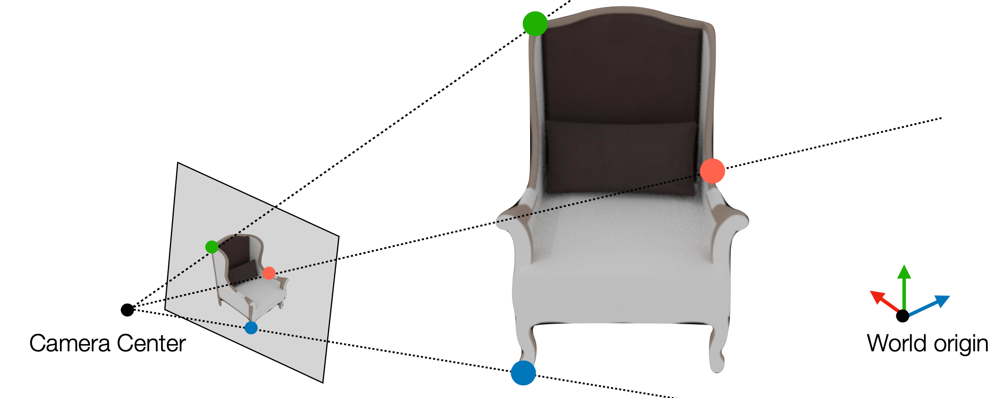
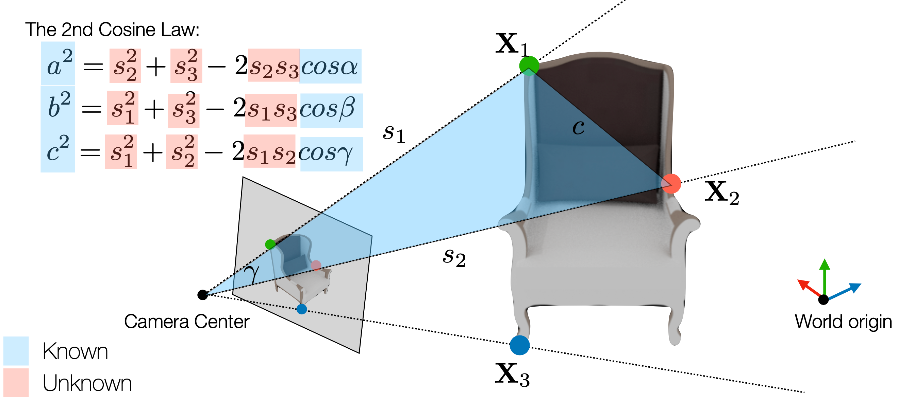

## Perspective-n-Point (PnP)
Perspective-n-Point (PnP) 문제는 카메라의 위치와 방향을 추정하는 문제로, 주어진 3D 점들과 그에 대응하는 2D 이미지 점들을 이용하여 카메라의 외부 파라미터(회전과 이동)를 추정하는 것을 목표로 함.
<figure>
  
</figure>

이 문제에선 3D-2D correspondences가 주어지고, 카메라 intrinsic parameters $K$도 알려져있음.  
correspondences가 주어져 있기 때문에, DLT(Direct Linear Transform) 방법을 사용해 해당 카메라의 Projection Matrix $P$를 추정할 수 있음.  
따라서 구하고자 하는 것은 카메라의 외부 파라미터인 회전 행렬 $R$과 이동 벡터 $t$임.  

$$
K[R | t] \equiv [P_1 \ P_2 \ P_3 \ P_4]
$$  
$$
\lambda [R | t] = K^{-1} [P_1 \ P_2 \ P_3 \ P_4]
$$
$$
\lambda R = K^{-1} [P_1 \ P_2 \ P_3] = UDV^T
$$  
- $K$: 카메라 intrinsic parameters
- $R$: 회전 행렬
- $t$: 이동 벡터
- $P_i$: Projection Matrix의 각 열
- $\lambda$: 스케일링 팩터
- $U, D, V$: SVD 분해 결과
  - 이때, 이 분해 결과는 회전 행렬 $R$을 분해한 것이므로, singular value $d_{11}, d_{22}, d_{33}$는 모두 $\lambda$에 근사할 수 있음.(회전 행렬의 singular value는 모두 1이기 때문)  

따라서, $R$을 구하기 위해서는 $U$와 $V$의 곱을 이용하여 다음과 같이 표현할 수 있음.  

$$
R = U V^T
$$
$$
t = \frac{1}{\lambda} K^{-1} P_4  
$$

### Minimum constraints  
위의 과정을 통해 $R$과 $t$를 구할 수 있지만, 더 효율적으로 구하는 방법이 있음
- DLT 방법은 $P$의 11 DoF를 추정하기 위해 최소 6개의 대응쌍이 필요함
- $K$는 5 DoF를 가지므로, $K$가 알려져있다면 $R$과 $t$를 구하기 위해서는 6 DoF만 필요함
- 각 대응쌍은 2개의 선형 방정식을 제공하므로, **최소 3개**의 대응쌍만으로도 $R$과 $t$를 구할 수 있음

### P4P
P4P (Perspective 4-Point) 문제는 4개의 3D-2D 대응쌍을 이용하여 카메라의 외부 파라미터를 추정하는 문제로 4개의 correspondences와 $K$가 주어졌을 때, Zhang's method([참고 포스트]())의 마지막 단계를 이용하여 $R$과 $t$를 구할 수 있음.  

$$
\lambda K^{-1} h_1 = r_1,\quad \lambda K^{-1} h_2 = r_2,\quad r_1 \times r_2 = r_3,\quad t = \frac{K^{-1} h_3}{\lambda}
$$  
- $h_i$: Correspondence 정보로 얻어낸 Homography 행렬의 열
- $r_i$: 회전 행렬의 열  

Homography를 구하기 위해 4개의 대응쌍이 필요하고, 이를 통해 $h_1, h_2, h_3$를 구할 수 있음. 하지만 여전히 4개의 대응쌍을 사용하고 있음

### P3P(General Case)
- $\tilde{X} = \lambda d$를 어떤 Ray라고 하면
- $\tilde{X}$의 projection은 다음과 같음(up-to scale)
$$
\mathbf{x} = K [I | -C] \tilde{X} = K [I | 0] (\lambda d,1)^T = K d
$$
- 따라서 어떤 ray를 지나는 점 $\mathbf{x}$와 $K$가 주어졌을 때, $d = K^{-1} \mathbf{x}$로 구할 수 있음.

<figure>
  
</figure>

P3P는 위 그림과 같이 세 투영점 $\mathbf{x}_1, \mathbf{x}_2, \mathbf{x}_3$와 그에 대응하는 3D 점 $\mathbf{X}_1, \mathbf{X}_2, \mathbf{X}_3$가 주어졌을 때, $K$를 활용해 ray로부터 카메라의 외부 파라미터 $R$과 $t$를 추정함.  

$$
a^2 = s_2^2 + s_3^2 - 2s_2 s_3 \cos(\alpha)
$$
$$
b^2 = s_1^2 + s_3^2 - 2s_1 s_3 \cos(\beta)
$$
$$
c^2 = s_1^2 + s_2^2 - 2s_1 s_2 \cos(\gamma)
$$
- $s_i$: Camera Center로부터 $\mathbf{X}_i$까지의 거리
- $\alpha, \beta, \gamma$: 각각 $(\mathbf{X}_2, \mathbf{X}_3)$, $(\mathbf{X}_1, \mathbf{X}_3)$, $(\mathbf{X}_1, \mathbf{X}_2)$를 향하는 ray 사이의 각도
- $a, b, c$: 각각 $(\mathbf{X}_2, \mathbf{X}_3)$, $(\mathbf{X}_1, \mathbf{X}_3)$, $(\mathbf{X}_1, \mathbf{X}_2)$ 사이의 거리
- 위의 식에서, $\alpha, \beta, \gamma, a, b, c$는 모두 알려져 있음.
- 따라서 3개의 미지수와 3개의 방정식이 있으므로, $u = \frac{s_2}{s_1}, v = \frac{s_3}{s_1}$로 치환해 3개의 연립방정식을 풀 수 있음.
  - 식을 정리하면 4차방정식 형태가 나오기 때문에 4개의 해를 갖게 됨.
  - 하지만 cheirality constraint($z>0$)를 만족하는 해는 4개 중 1개뿐임.
- $s_i$를 구하면, 카메라 좌표계에서의 점 $\mathbf{X}_i$의 좌표 $P_i^{cam}$을 구할 수 있고, 이를 바탕으로 카메라의 외부 파라미터 $R$과 $t$를 구할 수 있음.  
$$
P_i^{cam} = [R | t] \begin{bmatrix}
\mathbf{X}_i \\ 1
\end{bmatrix}
$$  

### EPnP 
$N >> 3$인 경우, P3P를 여러 번 적용하는 것은 비효율적임.  
world coordinate에서 $P_i^w$와 image plane의 대응점은 주어짐.  
- 아이디어: 모든 $P_i^w$를 네개의 점 $C_j^w$에 대한 선형 결합으로 표현  
$$
P_i^w = \sum_{j=1}^{4} \alpha_{ij} C_j^w
$$  
이때, $\alpha_{ij}$는 camera coordinate에서의 $P_i^{c}$에서도 똑같이 적용됨.(상대적 위치가 동일하기 때문)  
$$
P_i^{c} = \sum_{j=1}^{4} \alpha_{ij} C_j^{c}
$$

camera coordinate에서의 $P_i^{c}$는 다음과 같이 image plane으로 투영됨.  
$$
w_i \begin{bmatrix}
u_i \\
v_i \\ 1
\end{bmatrix} = \begin{bmatrix}
f_u & 0 & u_c \\
0 & f_v & v_c \\
0 & 0 & 1
\end{bmatrix} \sum_{j=1}^{4} \alpha_{ij} \begin{bmatrix}
x_i^c \\
y_i^c \\ z_i^c
\end{bmatrix}
$$
- $w_i$: scale factor($w_i = \sum_{j=1}^{4} \alpha_{ij} z_j^c$)
- $u_i, v_i$: image plane에서의 좌표 
- 따라서 다음 두 선형 방정식을 유도할 수 있음.  
$$
\sum_{j=1}^{4} \alpha_{ij} f_u x_j^c + \alpha_{ij} (u_c - u_i)z_j^c = 0
$$
$$
\sum_{j=1}^{4} \alpha_{ij} f_v y_j^c + \alpha_{ij} (v_c - v_i)z_j^c = 0
$$  
총 4개의 $x_j^c, y_j^c, z_j^c$에 대해 2개의 선형 방정식이 있으므로, 총 $2N$개의 선형 방정식을 얻을 수 있음.  
이 선형시스템을 풀어 4개의 점 $C_j^c$를 구해 $C_j^w$와의 correspondence를 통해 카메라의 외부 파라미터 $R$과 $t$를 구할 수 있음.

### PnP with RANSAC
1. 특징점 매칭: 3D-2D 대응쌍을 찾음(예: SIFT, ORB 등)
2. RANSAC 반복:
   - 3개의 대응쌍을 무작위로 선택하여 P3P를 적용
   - 카메라의 외부 파라미터 $R$과 $t$를 추정
   - 모든 대응쌍에 대해 추정된 $R$과 $t$를 이용해 inlier를 찾음
   - 반복적으로 실행하여, 가장 많은 inlier를 갖는 $R$과 $t$를 선택
3. EPnP 적용:
   - 선택된 inlier를 이용해 EPnP를 적용해 더 강건한 $R$과 $t$를 추정
4. 최적화:  
    - 마지막으로 projection error를 최소화하는 최적화 기법을 적용하여 $R$과 $t$를 더욱 정교하게 조정

---
해당 포스트는 서울대학교 컴퓨터공학부 주한별 교수님의 컴퓨터비전 25-1학기 강의를 정리한 내용입니다.