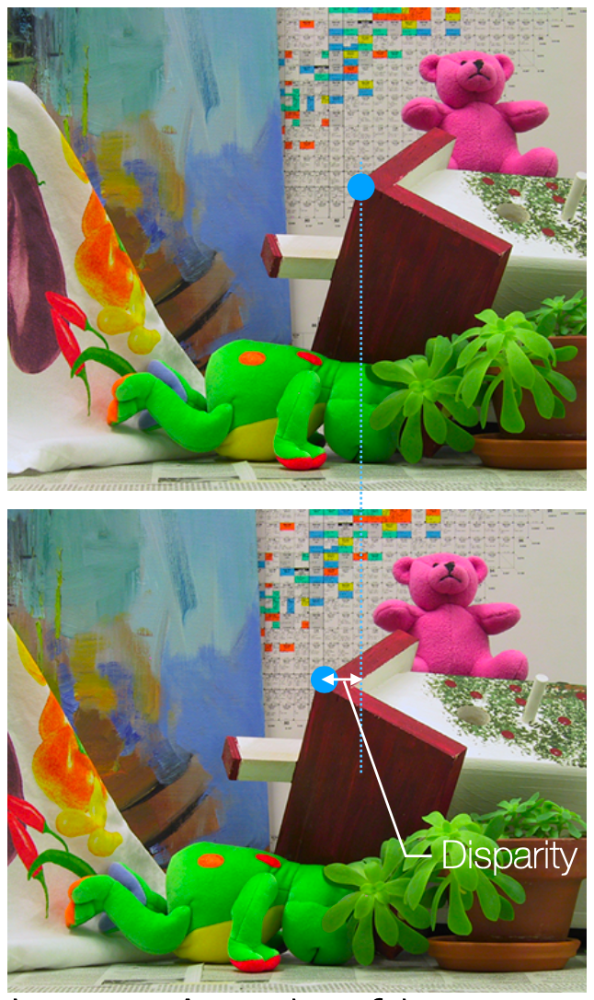
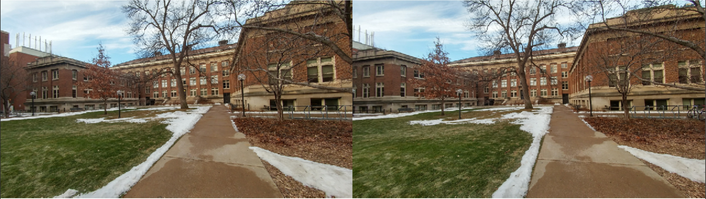
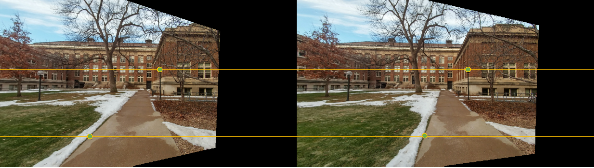
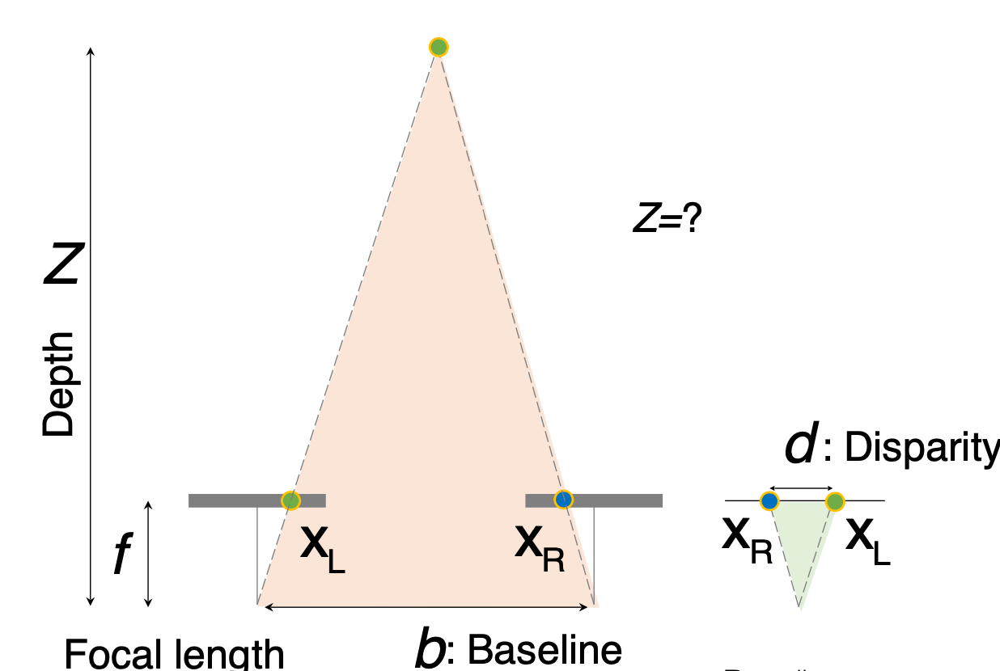
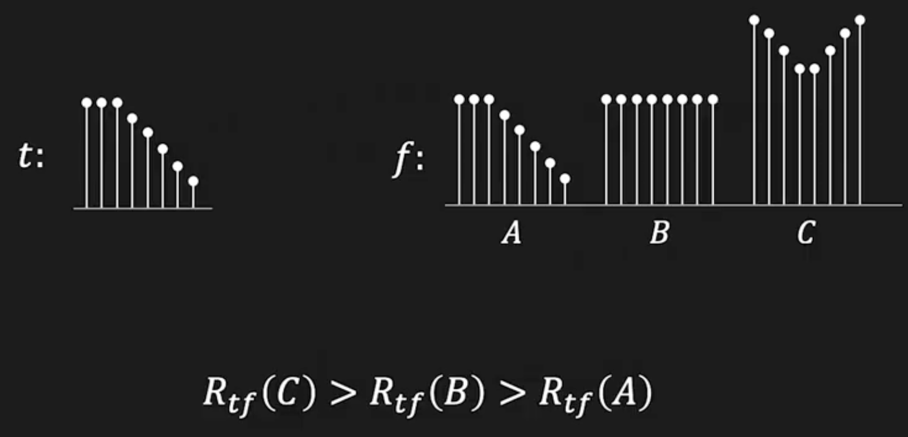
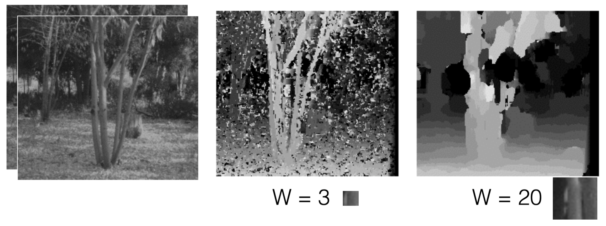
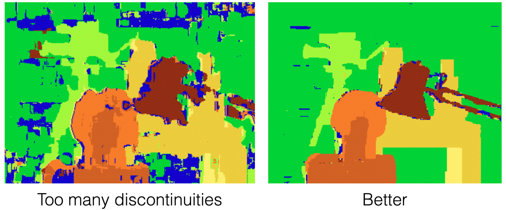

## Stereo Matching
Stereo Matching은 두 개의 서로 다른 시점에서 촬영된 이미지(스테레오 이미지)를 이용하여 3D 정보를 추정하는 과정이다.  
Stereo Matching의 목표는 두 이미지에서 동일한 물체의 대응점을 찾아서 깊이 정보를 추정하는 것이다.  

<figure>
  
</figure>

위 이미지와 같이 두 이미지의 대응점을 찾아 두 대응점 사이의 거리(Disparity)를 계산하여 깊이 정보를 추정할 수 있다.  
위 이미지와 같이 대응점을 찾기 위해선, 카메라가 x축을 기준으로 평행 이동하면서 촬영한 두 이미지가 필요하다. 하지만 실제 데이터에서는 카메라가 축을 기준으로 평행하는 경우가 많지 않고, 카메라의 회전 등이 포함된 경우가 많다.  
따라서 Stereo Matching에서는 두 이미지를 평행 이동한 것으로 변환(Rectification)한 후 대응점을 찾는다
<figure>
  
  <figcaption>변환 전 두 이미지</figcaption>
</figure>  
<figure>
  
  <figcaption>변환 후 두 이미지</figcaption>
</figure>

### How to Rectify  
Rectification은 다음과 같은 과정을 통해 이루어진다.
- Rotate Camera: epipolar line이 baseline과 평행하도록 카메라를 회전시킨다.(소프트웨어적으로 회전)
- Compute Homography: 두 이미지에 대해 각각 원본 이미지로부터 회전된 이미지로의 Homography를 계산한다.
- 계산된 Homography는 epipole을 무한점 $(1, 0, 0)$으로 이동시킨다  

### Depth Estimation
<figure>
  
</figure>

- 앞선 과정을 거쳐 Rectification된 두 이미지에서 찾아낸 두 대응점 $x_L$과 $x_R$의 좌표값의 차이를 이용해 disparity $d$를 계산할 수 있다.  
- 이때 baseline $b$를 밑변으로 하고 depth $Z$를 높이로 하는 삼각형과, disparity $d$를 밑변으로 하고 focal length $f$를 높이로 하는 삼각형은 닮음이다.
- 따라서 다음과 같은 관계가 성립한다.  
$$
\frac{Z}{d} = \frac{f}{b}
$$
- 따라서, depth $Z$는 다음과 같이 계산할 수 있다.  
$$
Z = \frac{f \cdot b}{d}
$$
- 따라서 알맞은 correspondence만 찾아낸다면, disparity를 이용해 depth를 계산할 수 있다.  
  
### Stereo Matching  
이와 같은 전처리 과정을 거친 다음, 같은 $y$축에 위치한 점들을 비교해 대응점을 찾아야한다.  
이를 위해 두 대응점 간의 유사도를 계산하는 방법이 필요하다.  
- **Sum of Absolute Differences (SAD)**: 두 대응점과 주변의 픽셀 차이의 절댓값 합을 계산한다.  
$$
\text{SAD}(k, l) = \sum_{(i, j) \in T} |E_l(i, j) - E_r(i + k, j + l)|
$$  
- **Sum of Squared Differences (SSD)**: 두 대응점과 주변의 픽셀 차이의 제곱합을 계산한다.  
$$
\text{SSD}(k, l) = \sum_{(i, j) \in T} (E_l(i, j) - E_r(i + k, j + l))^2
$$
- **Normalized Cross-Correlation (NCC)**: 두 대응점과 주변의 픽셀 차이를 정규화하여 상관관계를 계산한다.  
$$
\text{NCC}(k, l) = \frac{\sum_{(i, j) \in T} (E_l(i, j) )(E_r(i + k, j + l))}{\sqrt{\sum_{(i, j) \in T} (E_l(i, j) )^2} \cdot \sqrt{\sum_{(i, j) \in T} (E_r(i + k, j + l))^2}}
$$
- SSD 방법에서, 최적화 문제는 다음과 같이 표현할 수 있다.  
$$
E(i, j) = \sum_{m} \sum_{n} (f[m, n]-t[m-i, n-j])^2
$$  
- 여기서 $f$는 유사도의 기준이 되는 template, $t[m-i, n-j]$는 template와 비교할 위치 $(i, j)$에서의 이미지 패치 $t$이다.  
$$
E(i, j) = \sum_{m} \sum_{n} (f^2[m, n] + t^2[m-i, n-j] - 2f[m, n]t[m-i, n-j])
$$
- 위 식에서 $f^2[m, n]$와 $t^2[m-i, n-j]$는 상수이므로, 최적화 문제는 다음과 같이 단순화된다.  
$$
max_{i, j} \sum_{m} \sum_{n} 2f[m, n]t[m-i, n-j]
$$
- $\sum_{m} \sum_{n} f[m, n]t[m-i, n-j]$는 cross-correlation을 의미하므로, 결국 최적화 문제는 template $t$와 이미지 패치 $f$의 cross-correlation을 최대화하는 문제로 변환된다.  
$$
max_{i, j} R_{t,f}(i, j) = \sum_{m} \sum_{n} f[m, n]t[m-i, n-j] = t \otimes f
$$
- 하지만 위와 같이 cross-correlation을 계산하는 것은 다음과 같은 문제가 있다.  
<figure>
  
</figure>  

위 이미지와 같이, cross-correlation을 계산할 때, template $t$와 가장 일치하는 이미지 패치 $A$가 최대값을 갖는 것이 아니라, 단순히 픽셀 값이 큰 이미지 패치 $B, C$가 더 큰 값을 갖게 된다.
- 따라서 NCC와 같은 정규화 방식을 사용하여, 이미지 패치의 크기에 영향을 받지 않도록 해야한다.
- 이와 같은 매칭 방법은 텍스쳐가 부족한 이미지, 반복되는 패턴이 있는 이미지, 반사체가 있는 이미지 등에서는 잘 작동하지 않는다.

### Window Size
Depth Estimation을 위해서는 대응점을 찾기 위해 이미지 패치의 크기를 정해야 한다.  
이떄 이미지 패치의 크기를 크게 설정하면, 부드러운 disparity map을 얻게되지만, 작은 물체나 세부적인 부분을 놓칠 수 있다. 반대로 이미지 패치의 크기를 작게 설정하면, 작은 물체나 세부적인 부분을 잘 잡을 수 있지만, 노이즈에 민감해져서 부드러운 disparity map을 얻기 어려워진다.  
<figure>
  
  <figcaption>Window Size에 따른 disparity map의 변화</figcaption>
</figure>

### Energy Minimization
<figure>
  
</figure>

위 이미지를 보면, 왼쪽 이미지는 disparity map이 불연속적이고 노이즈가 많아 실제 객체의 형태를 제대로 반영하지 못하고 있다. 반면 오른쪽 이미지는 disparity map이 부드럽고, 실제 객체의 형태를 잘 반영하고 있다. 이는 인접한 픽셀 간의 disparity 값이 비슷하도록 smoothing을 적용했기 때문이다.  

- **Energy Minimization**: Streo matching을 에너지 최소화 문제로 정의해, 더 나은 disparity map을 얻도록 하는 문제 정의이다.  
$$
E(d) = E_{d}(d) + \lambda E_{s}(d)
$$  
    1. $E_{d}(d)$: 데이터 에너지, 각 픽셀의 disparity 값이 얼마나 잘 맞는지를 측정한다. 앞서 언급한 SAD, SSD, NCC 등을 이용해 계산할 수 있다.  
    2. $E_{s}(d)$: Smoothness 에너지, 인접한 픽셀 간의 disparity 값이 얼마나 비슷한지를 측정한다. 일반적으로 인접한 픽셀 간의 disparity 값의 차이를 최소화하는 방식으로 계산한다.  
$$
E_{s}(d) = \sum_{(p,q) \in \varepsilon} V(d_p - d_q)
$$  
        - 여기서 $\varepsilon$는 인접한 픽셀들의 집합, $V$는 disparity 값의 차이에 대한 비용 함수이다.

---
해당 포스트는 서울대학교 컴퓨터공학부 주한별 교수님의 컴퓨터비전 25-1학기 강의를 정리한 내용입니다.