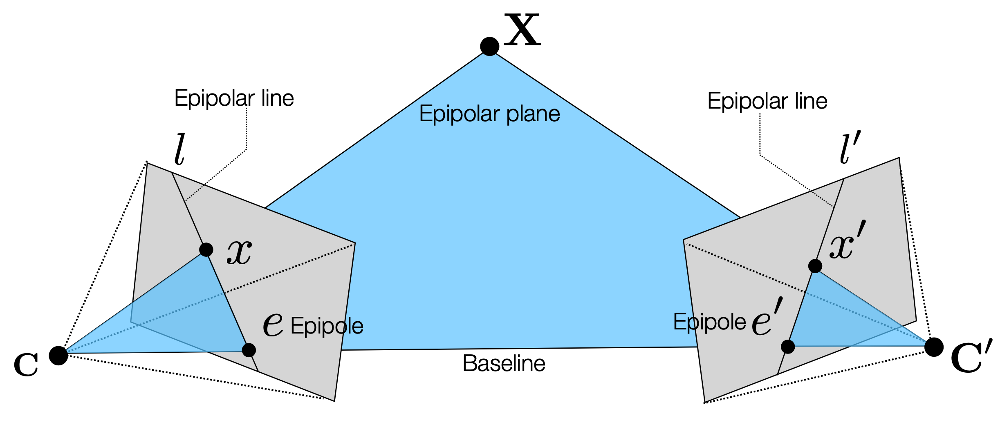
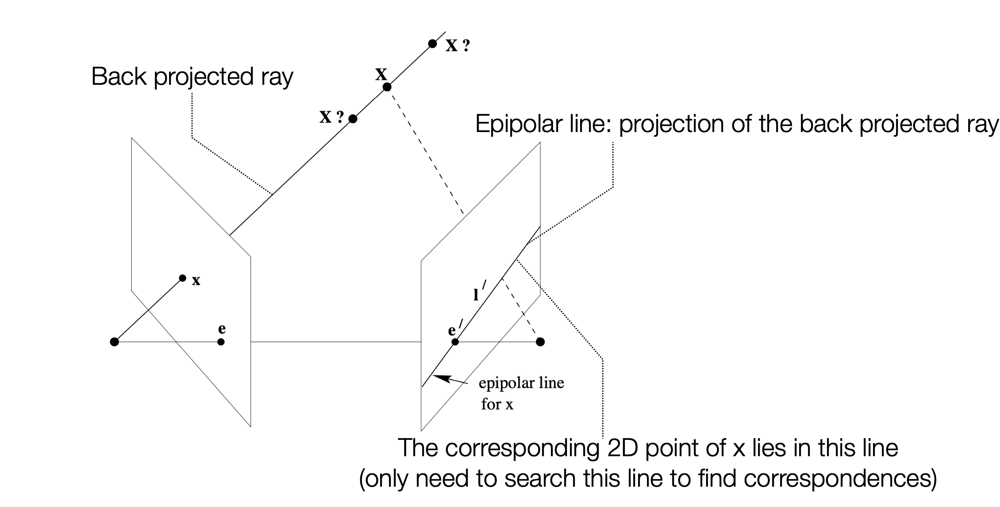
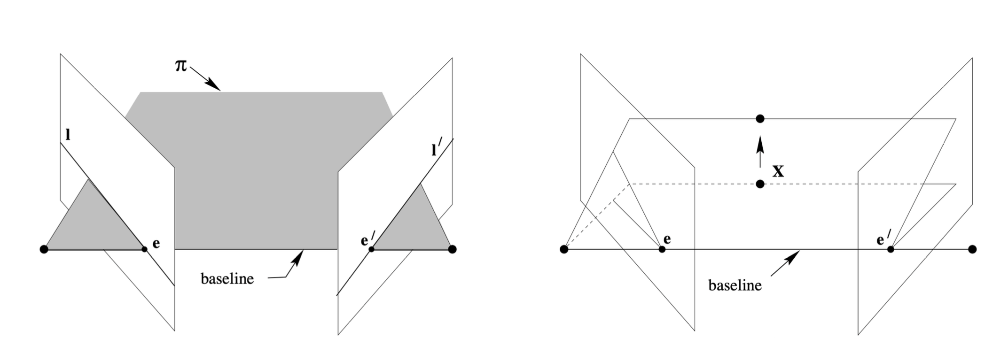
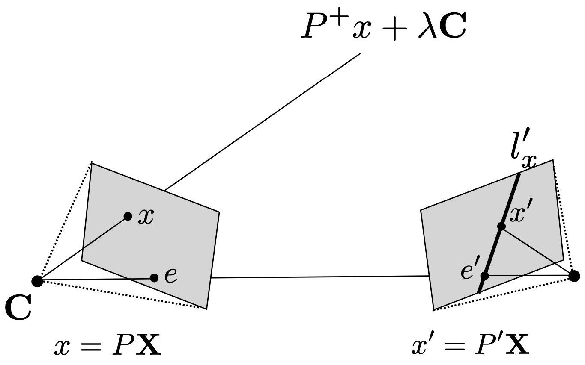
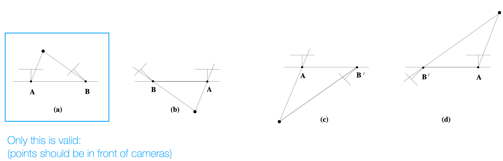
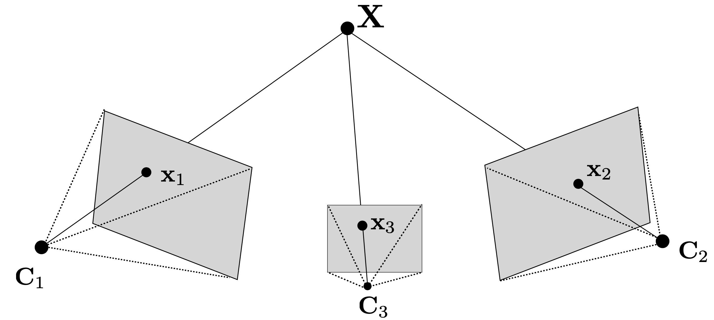
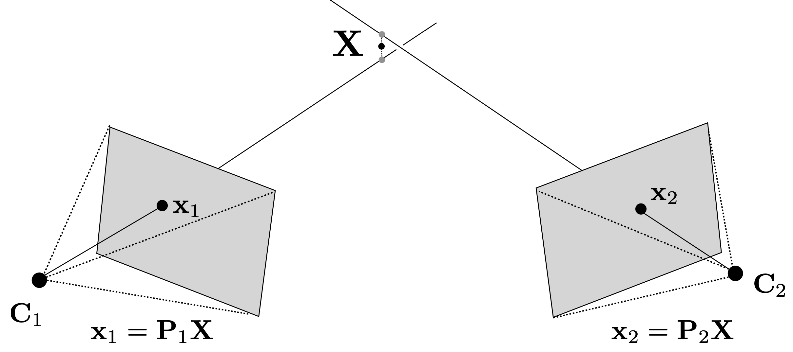

## Two-View Geometry(Epipolar Geometry)
<figure>
  
</figure> 

- Epipolar Geometry는 두 개의 카메라 뷰 간의 기하학적 관계를 설명하는 것으로, 두 카메라가 서로 다른 위치에서 동일한 장면을 촬영할 때 발생하는 기하학적 제약을 나타냄.   
- 3D 공간에서의 점 $X$이 카메라 $C$와 $C'$에서 각각의 이미지 평면에 투영될 때, 이 두 투영된 점은 서로의 이미지 평면에서 특정한 기하학적 관계를 가짐.  
- 카메라 $C$ 이미지 평면에 투영된 점 $x$와 카메라 $C'$ 이미지 평면에 투영된 점 $x'$는 서로 제약된 관계를 가짐
- 카메라 $C'$의 중심을 $C$에 투영한 점을 **epipole** 이라고 정의함 
  - $e$는 카메라 $C'$의 중심이 카메라 $C$의 이미지 평면에 투영된 점
  - $e'$는 카메라 $C$의 중심이 카메라 $C'$의 이미지 평면에 투영된 점
- 이 두 epipole을 잇는 직선을 **baseline** 이라고 함
- 점 $X$, 카메라 $C$의 중심 $C$, 카메라 $C'$의 중심 $C'$가 이루는 평면을 **epipolar plane** 이라고 함
  - **baseline**은 항상 epipolar plane에 포함됨
  - epipolar plane이 이미지 평면과 교차하는 선을 **epipolar line** 이라고 함  
- 이 특징을 이용해, 두 카메라의 calibration을 알고있다면, 한 이미지에서의 점 $x$가 주어졌을 때, 다른 이미지에서의 대응점 $x'$를 찾기 위해 epipolar line을 이용할 수 있음.

### Properties of Epipolar Lines
<figure>
    
</figure>

- 어떤 이미지 위의 점 $x$가 주어졌을 때, 이 점에 대응하는 epipolar line은 카메라 $C'$의 이미지 평면에서 $x'$가 위치할 수 있는 모든 위치를 나타냄.   
- 이는 $x$의 back-projected ray를 카메라 $C'$의 이미지 평면에 투영한 것과 같음.

<figure>
    
</figure>

- 점 $X$가 달라짐에 따라 epipolar plane은 baseline을 중심으로 회전함.
- 따라서 baseline은 장면에 상관없이 카메라의 위치에 따라 고정되어 있음

### Algebraic Representation
카메라 $C'$의 epipolar line을 얻기 위해선, $x$를 역투영하여 카메라 $C'$의 이미지 평면에 투영해야 함.  

$$
x \mapsto l'
$$

이는 점을 선으로 변환하는 과정으로, rank이 2인 행렬 $\mathbf{F}$를 사용하여 표현할 수 있음.  

$$
l' = \mathbf{F} x
$$  

$x'$는 $l'$에 위치해야 하므로, 다음과 같은 제약을 만족해야 함.  

$$
x'^T l' = x'^T \mathbf{F} x = x^T \mathbf{F}^T x' = 0
$$    

### Geometric Representation

$l'$은 $x'$와 $e'$를 포함하는 직선이므로, 다음과 같은 식을 만족  

$$
l' = e' \times x' = [e']_{\times} x' = [e']_{\times} H_{\pi} x = \mathbf{F} x
$$
- 여기서 $H_{\pi}$는 카메라 $C$에서 카메라 $C'$로의 Homography를 나타냄. 가역의 2D-2D 변환이므로 rank = 3
- $[e']_{\times}$는 $e'$의 skew-symmetric 행렬로, $e'$와의 외적을 나타냄, 점 $e'$에 대한 skew-symmetric 행렬이므로 rank = 2
- 따라서 $\mathbf{F}$는 rank = 2인 행렬이 됨

### Fundamental Matrix F
<figure>
    
</figure>

- $C$ 이미지 평면 위 점 $x$에 대해, camera matrix $P$를 알고있다고 가정
- $x$의 back-projected ray는 다음과 같이 표현됨.  
$$
P^{+} x + \lambda C
$$
  - 여기서 $P^{+}$는 $P$의 Pseudo-inverse
  - $\lambda$는 스케일링 팩터 
  - $C$는 카메라 $C$의 중심
- Ray의 projection에는 두 점이 지남  
  - $C$ : 카메라 $C$의 중심 ($\lambda = \infty$)
  - $P^{+} x$ : 카메라 $C$의 이미지 평면에 투영된 점 ($\lambda = 0$)
- 이 두 점을 $C'$의 이미지 평면에 투영하면, 다음과 같은 점을 얻음.  
   - $e' = P'C$ : 카메라 $C$의 중심이 카메라 $C'$의 이미지 평면에 투영된 점(epipole)
   - $P' P^{+} x$ : 카메라 $C$의 이미지 평면에 투영된 점이 카메라 $C'$의 이미지 평면에 투영된 점
- $C'$의 epipolar line $l'$는 따라서 다음과 같이 표현됨.  
$$
l' = e' \times P' P^{+} x = [e']_{\times} P' P^{+} x
$$
- 따라서, $\mathbf{F} = [e']_{\times} P' P^{+}$로 정의할 수 있음.
- 카메라 $C$의 중심을 원점으로 설정하면 다음과 같은 일반화 성립  
$$
P = K [I | 0], \quad P' = K' [R | t]
$$  
$$
P^{+} = \begin{bmatrix}
    K^{-1} \\ 0
\end{bmatrix} \in \mathbb{R}^{4 \times 3}, \quad C = \begin{bmatrix}
    \mathbf{0} \\ 1
\end{bmatrix} \in \mathbb{R}^{4}
$$
$$
e = P \begin{bmatrix}
    -R^{T} t \\ 1
\end{bmatrix} = K R^{T} t \quad (\text{scaling factor -1은 무시})
$$
$$
e' = P' \begin{bmatrix}
    \mathbf{0} \\ 1
\end{bmatrix} = K' t
$$
$$
\begin{aligned}
\mathbf{F} &= [e']_{\times} P'P^{+} \\
    &= [P'C]_{\times} P'P^{+} \\
    &= [K't]_{\times} K' R K^{-1} \\
    &= K'^{-T} [t]_{\times} R K^{-1} \\
    &= K '^{-T} R [R^T t]_{\times} K^{-1} \ (\because [Mx]_{\times} = M^{*}[x]_{\times}, R^{*} = det(R) R^{-T}= R^{-T}=R) \\
    &= K'^{-T} R K^{T} [e]_{\times}
\end{aligned}
$$
- 즉, $F$를 $K, K', R, t$를 이용해 표현할 수 있음.
- $0=l^T x' = x'^T l = x'^T \mathbf{F} x = x \mathbf{F}^T x'$로 표현할 수 있음.
- 반대로, $x'\mathbf{F}^T x = 0$이 성립하면, $x'$와 $x$는 한 평면 위에 위치
- 따라서, 카메라 내부 파라미터를 모르더라도, 대응쌍들로부터 Fundamental Matrix $F$를 추정할 수 있음.
- $F$는 rank 2인 homogeneous 3x3 행렬로, 따라서 DoF는 7(9-1(rank 2)-1(homogeneous))임.
- 카메라 파라미터를 알고있다면, 다음과 같이 계산 가능  
    - 일반적 카메라  
    $$
    F = [e']_{\times} P' P^{+}
    $$
    - Canonical 카메라($P = K[I | 0], P' = [M | m])$)  
    $$
    F = [e']_{\times} M = M^{-T} [e']_{\times}, \quad (e'= m, e = M^{-1} m)
    $$
    - Cameras at not infinity($P = K[I | 0], P' = K'[R | t]$)  
    $$
    F = K'^{-T} [t]_{\times} R K^{-1}= [K't]_{\times} K'R K^{-1} = K'^{-T} R K^{T} [KR^{T} t]_{\times}
    $$  

#### Estimating Fundamental Matrix F from Correspondences
- 대응쌍 $(x, x')$가 주어졌을 때, $F$를 추정하기 위해 다음과 같은 제약 조건을 이용할 수 있음.
$$
x'^T \mathbf{F} x = 0
$$  
- $\mathbf{x} = (x, y, 1)^T$와 $\mathbf{x'} = (x', y', 1)^T$로 표현하면, 다음과 같은 선형 방정식을 얻을 수 있음.  
$$
x'x f_{11} + x'y f_{12} + x' f_{13} + y'x f_{21} + y'y f_{22} + y' f_{23} + x' f_{31} + y' f_{32} + f_{33} = 0
$$
- 이 식을 행렬 형태로 표현하면 다음과 같음.  
$$
\begin{bmatrix}
   x'x & x'y & x' & y'x & y'y & y' & x' & y' & 1
\end{bmatrix} \begin{bmatrix}
    f_{11} \\
    f_{12} \\
    f_{13} \\
    f_{21} \\
    f_{22} \\
    f_{23} \\
    f_{31} \\
    f_{32} \\
    f_{33}
\end{bmatrix} = 0
$$
  - $N$개의 대응쌍이 있다면, $A \in \mathbb{R}^{N \times 9}$인 행렬을 알 수 있음
  - $\mathbf{f}$는 $A$의 null space에 속하는 벡터
  - 따라서 선형독립인 8개의 대응쌍이 주어지면, $A$의 null space를 계산하여 $F$를 구할 수 있음.(8 points algorithm)
- 하지만, $\mathbf{F}$는 7 DoF를 가지므로, 7개의 대응쌍만으로도 $F$를 추정할 수 있음.(7 points algorithm)
  - 7개의 대응쌍이 선형 독립이라 가정하면, rank-nullity theorem에 의해 다음과 같은 관계가 존재  
$$
\text{rank}(A) + \text{nullity}(A) = 9 \implies \text{nullity}(A) = 2
$$
  - 따라서, $A$의 null space는 2차원 공간이 되고, 이 공간의 기저 벡터가 되는 $F_1, F_2$가 구해짐($f_1, f_2$를 다시 행렬형태로 복구한것)
  - $F$의 일반해는 $F = \lambda F_1 + (1-\lambda) F_2$로 표현할 수 있음.(스케일 모호성)
  - 이때, $\text{rank}(F) = 2$이므로 $det(F) = 0$이 성립해야 함.
  - 이 제약조건으로 $\lambda$를 구할 수 있음.

- 8 points algorithm을 노이즈에 강건하게 만들기 위해 다음 과정을 거칠 수 있음.  
  1. 2D 점들을 정규화  
    원점을 점들의 중심으로 이동시키고, RMS(Root Mean Square) 거리가 $\sqrt{2}$가 되도록 스케일링  
$$
\hat{x_i} = T x_i, \quad \hat{x'_i} = T' x'_i
$$
  2. 정규화된 대응쌍들로부터 $\hat{F}$를 계산  
    8 points algorithm과 DLT(Direct Linear Transform) 방법을 사용하여 $\hat{F}$를 계산  
    제약조건 $det(\hat{F}) = 0$을 만족하도록 $\hat{F}$를 조정
  3. $\hat{F}$를 원래 좌표계로 되돌림  
    $F = T'^{T} \hat{F} T$

### Pure Translation 

두 카메라가 회전 없이 오직 평행이동(translation)만 하는 경우, 즉 $R = I$인 경우
- $C$의 카메라 파라미터는 $P = K[I | 0]$이고, $C'$의 카메라 파라미터는 $P' = K'[I | t]$임
- 따라서 $\mathbf{F}$는 다음과 같이 표현됨.  
$$
\mathbf{F} = [e']_{\times} K'RK^{-1} = [e']_{\times} KK'^{-1} = [e']_{\times} = \begin{bmatrix}
    0 & 0 & 0 \\
    0 & 0 & -1 \\
    0 & 1 & 0
\end{bmatrix}
$$  
    - $e' = (1, 0, 0)^T$으로, x축을 따라 평행이동하는 경우임을 가정(따라서 $C$에서 무한점으로 투영됨)
      - $e' = P' \begin{bmatrix} \mathbf{0} \\ 1 \end{bmatrix} = K' t = (t_1, 0, 0)^T$이기 때문
$$
x'^T \mathbf{F} x = 0 \implies \begin{bmatrix}
    x' & y' & 1 
\end{bmatrix} \begin{bmatrix}
    0 & 0 & 0 \\
    0 & 0 & -1 \\
    0 & 1 & 0
\end{bmatrix} \begin{bmatrix}
    x \\
    y \\
    1
\end{bmatrix} = 0
$$  
    - 따라서 $y' = y$, 즉, epipolar line은 $y = y'$로, x축을 따라 평행이동하는 경우에는 epipolar line이 수평선이 됨.  

### Essential Matrix E
- 카메라 내부 파라미터를 알고있는 경우, Fundamental Matrix $F$는 Essential Matrix $E$로 변환될 수 있음.
- $x = K[R | t] X$의 관계에서, $K^{-1} x = [R | t] X$로 $K$의 역행렬을 곱해 정규화할 수 있음.
  - 이때 $\hat{x} = K^{-1} x$는 정규화된 이미지 좌표로, 카메라 내부 파라미터를 제거한 형태임.
- "정규화"된 카메라 행렬은 다음과 같이 정의됨  
$$
P = [I | 0], \quad P' = [R | t]
$$
- $\mathbf{F}$는 다음과 같이 정리할 수 있음  
$$
\begin{aligned}
x'^T \mathbf{F} x &= 0 \\
x'^T K'^{-T} [t]_{\times} R K^{-1} x &= 0 \\
\hat{x}'^T [t]_{\times} R \hat{x} &= 0 \\
\hat{x}'^T E \hat{x} &= 0
\end{aligned}
$$
- 여기서 $E = K'^{T} F K = [t]_{\times} R$로 정의되는 행렬을 Essential Matrix라고 함.
  - $E$는 rank 2인 행렬로, DoF는 5(3($t$의 DoF) + 3($R$의 DoF) - 1(homogeneous))임.
  - $E$는 항상 같은 singular value 두개와, 0인 singular value 하나를 가지는 SVD 분해를 가짐.
- $E$로부터의 $t, R$의 추출은 다음과 같이 이루어짐.  
$$
\begin{aligned}
E &= U D V^T (\text{where } D = \text{diag}(\lambda, \lambda, 0) \equiv \text{diag}(1, 1, 0)) \\
&= U(ZX)V^T  \\
& = (U Z U^T)(U X V^T) \\
\end{aligned}
$$
$$
\text{where } Z = \begin{bmatrix}
    0 & 1 & 0 \\
    -1 & 0 & 0 \\
    0 & 0 & 0
\end{bmatrix}, \quad X = \begin{bmatrix}
    0 & \pm 1 & 0 \\
    \mp 1 & 0 & 0 \\
    0 & 0 & 1
\end{bmatrix}
$$
- $UZU^T$는 정의상 skew-symmetric 행렬이고, $UXV^T$는 회전 행렬이므로, $[t]_{\times} = UZU^T$와 $R = UXV^T$로 유일하게 결정됨.
  - $t = \pm u_3$ (여기서 $u_3$는 $U$의 세번째 열)  
$$ 
t \times t = [t]_{\times} t = UZU^T t = ZU^T t = \begin{bmatrix}
    u_2 \\
    -u_1 \\
    0
\end{bmatrix} t = 0, \quad \therefore \quad t = \pm u_3
$$
  - 하지만 projective ambiguity로 인해 가능한 네가지의 조합이 발생
    - $P = [I | 0], P' = [U W V^T | \pm u_3] \text{ or } [U W^{T} V^T | \pm u_3]$  
    - 그렇지만 아래 그림과 같이 실제로 가능한 조합은 한가지뿐(재구성한 3D 점이 카메라의 앞쪽에 위치해야 함)
<figure>
    
</figure>

## Triangulation
<figure>
    
</figure>

Triangulation은 두 개 이상의 카메라 뷰를 이용하여 3D 공간의 점을 추정하는 과정. 두개 이상의 calibrated 카메라가 주어졌을 때, 각 카메라의 이미지 평면에 투영된 점들을 이용하여 3D 공간의 점을 추정할 수 있음.  

<figure>
    
</figure>

하지만 주어진 점들로부터 얻은 back-projected ray들은 노이즈로 인해 정확히 일치하지 않는 경우가 대부분임. 따라서 이를 최적화 문제로 해결해야함.  

- 점 $X$가 카메라 $C_1$의 이미지 평면에 투영되어 점 $\mathbf{x_1} = (x_1, y_1, 1)$이 된다고 가정  
$$
x_1 = P_1 X 
$$
- $P_1$은 행 $p_1^1, p_1^2, p_1^3$로 구성됨
- $\mathbf{x_1} \equiv P_1 X \implies \lambda \mathbf{x_1} = P_1 X \text{ or } \mathbf{x_1} \times P_1 X = 0$
- 위 식을 다시 쓰면  
$$
x_1({p_1^3}^T X) - {p_1^1}^T X = 0
$$
$$
y_1({p_1^3}^T X) - {p_1^2}^T X = 0
$$
- 따라서 $X$는 다음과 같은 두개의 선형 방정식을 만족해야 함.  
$$
\begin{bmatrix}
    x(p_1^3)^T - {p_1^1}^T \\
    y(p_1^3)^T - {p_1^2}^T
\end{bmatrix} X = 0
$$
- $X$는 homogeneous 좌표계에서 표현되는 $4 \times 1$ 벡터이므로, 3 DoF를 가짐, 따라서 2쌍의 대응점이 필요  
$$
\begin{bmatrix}
    x_1(p_1^3)^T - {p_1^1}^T \\
    y_1(p_1^3)^T - {p_1^2}^T \\
    x_2(p_2^3)^T - {p_2^1}^T \\
    y_2(p_2^3)^T - {p_2^2}^T \\
\end{bmatrix} X = 0
$$  
- SVD를 이용해 $||A X||_2$를 최소화하는 $X$를 구할 수 있음.(DLT(Direct Linear Transform) 방법)
- 하지만 이는 기하학적 오류를 최소화하는 것이 아니므로 기하적 오류 또한 최소화하는 작업이 필요함  
$$
X^* = \arg\min_X \sum_{i=1}^{N} ||x_i - P_i X||_2^2 = \arg\min_X \sum_{i=1}^{N} (\frac{P_i^1X}{P_i^3 X} - x_i)^2 + (\frac{P_i^2X}{P_i^3 X} - y_i)^2
$$
- 즉, DLT를 이용해 $X$를 초기화 한 후, 최적화 문제를 풀어 기하적 오류를 최소화하는 $X^*$를 구할 수 있음.(non-linear optimization)

---
해당 포스트는 서울대학교 컴퓨터공학부 주한별 교수님의 컴퓨터비전 25-1학기 강의를 정리한 내용입니다.