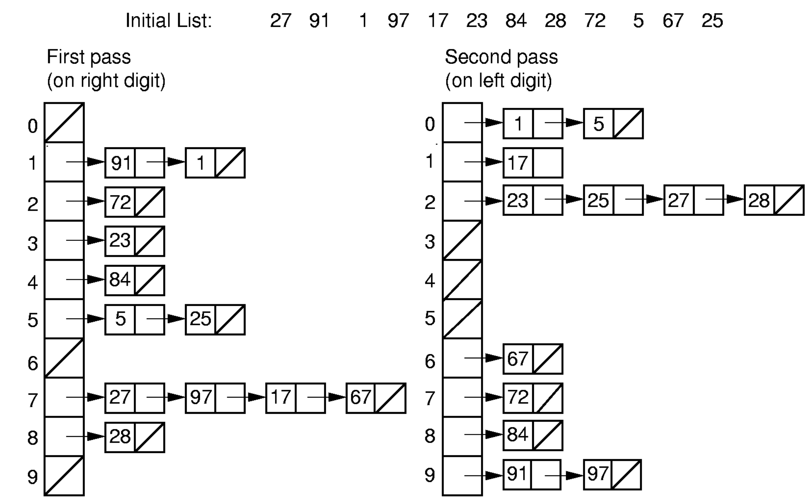

# Sorting
데이터를 순서대로 정렬하는 작업으로, 그 비용은 비교 횟수(Number of Comparisons)와 교환 횟수(Number of Swaps)로 측정된다.  
## Exchange Sorting
- Exchange Sort은 원소 쌍의 위치를 교환(swap)하여 배열을 정렬하는 방식의 알고리즘이다.
- Exchange Sort은 inversion을 하나하나 줄이며 정렬하는데, 이떄 inversion은 정렬 순서가 잘못된 원소 쌍을 의미한다.  
- 한 번의 swap은 inversion을 1개 제거하고, 최대 inversion은 역순 배열에서 발생하며, 이 경우 inversion의 개수는 $n(n-1)/2$가 된다.  
- 평균적으로 모든 permutation의 평균 inversion은 $n(n-1)/4$이다.  
- 따라서, Exchange Sort는 평균적으로 $\Omega(n^2)$ swap이 필요하다.
### Insertion Sort
1. 배열의 첫번째 원소 $A[0]$는 이미 정렬되어 있다고 가정한다.
2. 두 번째 원소부터 시작하여 배열의 각 원소 $A[i]$를 정렬된 부분 배열의 적절한 위치에 삽입한다.
3. 삽입시 $A[i]$보다 큰 원소들을 오른쪽으로 이동시키고, $A[i]$를 그 위치에 삽입한다.
4. 이 과정을 배열의 끝까지 반복한다.

```java
void InsertionSort(E[] A) {
    for (int i = 1; i < A.length; i++) {
        for (int j = i; (j > 0) && (A[j].compareTo(A[j-1]) < 0); j--) {
            swap(A, j - 1, j);
        }
    }
}
```
- Best Case: 
  - Comparisons: $O(n)$ - 각 원소는 바로 앞 원소보다 크거나 같으므로 비교 1번만 하고 멈춤
  - Swaps: $O(0)$ - 이미 정렬된 경우, 각 원소를 비교할 때마다 교환이 발생하지 않음
  - Total: $O(n)$
- Worst Case: 
  - Comparisons: $O(n^2)$ - 역순으로 정렬된 경우, 삽입 연산 시 모든 원소를 비교해야함($\frac{n(n-1)}{2}$)
  - Swaps: $O(n^2)$ - 모든 원소를 교환해야함
  - Total: $O(n^2)$
- Average Case: 
  - Comparisons: $O(n^2)$
  - Swaps: $O(n^2)$
  - Total: $O(n^2)$
- 거의 정렬된 리스트에 대해서 매우 효율적

### Bubble Sort
Bubble Sort는 인접한 원소를 비교하여 정렬하는 알고리즘으로, 다음과 같은 방식으로 동작한다.  
1. Input 배열에서 첫 번째 원소와 두 번째 원소를 비교한다.
2. 두 원소의 순서가 잘못되어 있다면, 두 원소를 교환한다.
3. 두 번째 원소와 세 번째 원소를 비교하고, 순서가 잘못되어 있다면 교환한다.
4. 이 과정을 배열의 끝까지 반복한다.
5. 해당 과정을 `Input 배열의 길이 - 1` 만큼 반복한다.

```java
void BubbleSort(E[] A) {
    for (int i = 0; i < A.length - 1; i++) {
        for (int j = A.length - 1; j > i; j--) {
            if (A[j].compareTo(A[j-1]) < 0) {
                swap(A, j - 1, j);
            }
        }
    }
}
```
- Best Case: 
  - Comparisons: $O(n^2)$ - 정렬 여부와 상관없이 모든 원소를 비교해야함
  - Swaps: $O(0)$ - 이미 정렬되어 있다면 교환이 발생하지 않음
  - Total: $O(n^2)$
- Worst Case: 
  - Comparisons: $O(n^2)$
  - Swaps: $O(n^2)$ - 모든 원소를 교환해야함
  - Total: $O(n^2)$
- Average Case: 
  - Comparisons: $O(n^2)$
  - Swaps: $O(n^2)$
  - Total: $O(n^2)$

하지만 만약 Bubble Sort에서 한 번의 패스에서 교환이 발생하지 않는다면, 배열이 이미 정렬된 것으로 판단하고 알고리즘을 종료할 수 있다. 이 경우 Best Case는 $O(n)$이 된다.
```java
void OptimizedBubbleSort(E[] A) {
    for (int i = 0; i < A.length - 1; i++) {
        boolean swapped = false;
        for (int j = A.length - 1; j > i; j--) {
            if (A[j].compareTo(A[j-1]) < 0) {
                swap(A, j - 1, j);
                swapped = true;
            }
        }
        if (!swapped) {
            break;  // 정렬 완료, 루프 조기 종료
        }
    }
}
```

### Shell Sort
Shell Sort는 Insertion Sort의 개선된 버전으로, Insertion Sort는 원소가 거의 정렬된 상태에서 효율적이기 때문에, Shell Sort는 멀리 떨어진 원소끼리 비교 및 교환을 수행하여 대략적으로 정렬한 후, Insertion Sort를 수행한다.  
1. 큰 gap으로 부분적으로 정렬한다.
2. 각 부분에 대해 Insertion Sort를 수행한다.
3. gap을 줄여가며 반복한다.
4. 최종적으로 gap이 1이 될 때까지 Insertion Sort를 수행한다. 이때는 거의 정렬된 상태이므로, Insertion Sort가 효율적으로 동작한다.

```java
void ShellSort(E[] A) {
    for (int i = A.length / 2; i >= 2; i /= 2) {
        for (int j = 0; j < i; j++) {
            InsertionSort2(A, j, i);
        }
    }
    InsertionSort2(A, 0, 1);
}
void InsertionSort2(E[] A, int start, int gap) {
    for (int i = start + gap; i < A.length; i += gap) {
        for (int j = i; (j >= gap) && (A[j].compareTo(A[j - gap]) < 0); j -= gap) {
            swap(A, j - gap, j);
        }
    }
}
```

- Insertion Sort는 거의 정렬된 상태에서 효율적이므로, Shell Sort는 gap을 줄여가며 Insertion Sort를 수행하여 전체적으로 정렬한다.
- Shell Sort는 평균적으로 $O(n^{3/2})$의 시간 복잡도를 가지고, 이는 Insertion Sort의 $O(n^2)$보다 빠르다.  

#### Example
초기 배열: 8 5 3 7 6 2 4 1
- 원소 개수 n = 8  
- gap = 4  

1. gap = 4
- 부분 배열 1: 8 6 (0, 4)
  - 8 > 6, swap(0, 4)
  - 배열: 6 5 3 7 8 2 4 1
- 부분 배열 2: 5 2 (1, 5)
  - 5 > 2, swap(1, 5)
  - 배열: 6 2 3 7 8 5 4 1
- 부분 배열 3: 3 4 (2, 6)
  - 3 < 4, swap 없음
- 부분 배열 4: 7 1 (3, 7)
  - 7 > 1, swap(3, 7)
  - 배열: 6 2 3 1 8 5 4 7

2. gap = 2
- 부분 배열 1: 6 3 8 4 (0, 2, 4, 6)
  - 6 > 3, swap(0, 2)
    - 배열: 3 2 6 1 8 5 4 7
  - 6 > 8, swap 없음
  - 6 > 4, swap(2, 6)
    - 배열: 3 2 4 1 8 5 6 7
- 부분 배열 2: 2 1 5 7 (1, 3, 5, 7) 
  - 2 > 1, swap(1, 3)
    - 배열: 3 1 4 2 8 5 6 7
  - 2 < 5, swap 없음
  - 5 < 7, swap 없음

1. gap = 1
- Insertion Sort를 수행한다.

## Selection Sort
Selection Sort는 배열에서 가장 작은 원소를 찾아서 정렬하는 알고리즘

### Selection Sort
전형적인 Selection Sort는 배열에서 가장 작은 원소를 찾아서 정렬하는 알고리즘으로, 다음과 같은 방식으로 동작한다.
1. 배열에서 가장 작은 원소를 찾는다.
2. 가장 작은 원소를 정렬되지 않은 부분의 첫 번째 원소와 교환한다.
3. 정렬되지 않은 부분에서 다시 가장 작은 원소를 찾아서, 정렬되지 않은 부분의 첫 번째 원소와 교환한다.
4. 이 과정을 배열의 끝까지 반복한다.

```java
void SelectionSort(E[] A) {
    for (int i = 0; i < A.length - 1; i++) {
        int minIndex = i;
        for (int j = A.length - 1; j > i; j--) {
            if (A[j].compareTo(A[minIndex]) < 0) {
                minIndex = j;
            }
        }
        if (minIndex != i) {
            swap(A, i, minIndex);
        }
    }
}
```
- Best Case: 
  - Comparisons: $O(n^2)$ - 모든 원소를 비교해야함
  - Swaps: $O(0)$ - 이미 정렬되어 있다면 교환이 발생하지 않음
  - Total: $O(n^2)$
- Worst Case: 
  - Comparisons: $O(n^2)$ - 모든 원소를 비교해야함
  - Swaps: $O(n)$ - 각 단계에서 최소 하나의 교환이 발생함
  - Total: $O(n^2)$
- Average Case:
  - Comparisons: $O(n^2)$ - 모든 원소를 비교해야함
  - Swaps: $O(n)$ - 각 단계에서 최소 하나의 교환이 발생함
  - Total: $O(n^2)$
- Bubble Sort에 비해 교환 횟수가 적어, 교환 비용이 큰 경우에 더 효율적

### Heap Sort
Heap Sort는 Heap 구조를 이용하여 정렬하는 알고리즘으로, 다음과 같은 방식으로 동작한다.
1. 배열을 Max Heap으로 변환한다.
2. Max Heap에서 가장 큰 원소를 제거하고, 배열의 마지막 원소와 교환한다.
3. Max Heap에서 가장 큰 원소를 제거한 후, Max Heap을 재구성한다.
4. 이 과정을 배열이 비어있을 때까지 반복한다.

```java
void HeapSort(E[] A) {
    MaxHeap<E> H = new MaxHeap<>(A, A.length);
    for (int i = A.length - 1; i >= 0; i--) {
        A[i] = H.removeMax(); // 최대 원소를 제거하고 Output 배열에 삽입
    }
}
```
- Heap Sort의 시간 복잡도
  - Build Heap: $O(n)$ - 배열을 Max Heap으로 변환하는 과정
  - Remove Max: $O(\log n)$ - 최대 원소를 제거하고 Max Heap을 재구성하는 과정 
  - $k$개의 최댓값을 얻기:
    - Heap sort의 경우에는 상위 $k$개의 원소를 얻기 위해 전체 정렬을 수행할 필요 없이 $k$개의 원소만 제거하면 된다.

## Divide and Conquer Sorting
Divide and Conquer Sorting은 배열을 분할하고 정복하여 정렬하는 알고리즘으로, 대표적으로 Merge Sort와 Quick Sort가 있다.
### Merge Sort
Merge Sort는 배열을 반으로 나누고, 각 부분을 재귀적으로 정렬한 후, 두 부분을 합쳐서 정렬하는 알고리즘이다.  
1. 배열을 반으로 나눈다.
2. 각 부분을 재귀적으로 Merge Sort를 수행한다.
3. 두 부분을 합쳐서 정렬한다.

```java
void MergeSort(E[] A, E[] tmp, int left, int right) {
    int mid = (left + right) / 2;
    if (left == right) return; // base case
    MergeSort(A, tmp, left, mid); // 왼쪽 부분 정렬
    MergeSort(A, tmp, mid + 1, right); // 오른쪽 부분 정렬
    Merge(A, tmp, left, mid, right); // 두 부분 합치기
}
void Merge(E[] A, E[] tmp, int left, int mid, int right) {
    for (int i = left; i <= right; i++) {
        tmp[i] = A[i]; // 임시 배열에 복사
    }
    int i = left, j = mid + 1, k = left;
    while (i <= mid && j <= right) {
        if (tmp[i].compareTo(tmp[j]) <= 0) {
            A[k++] = tmp[i++];
        } else {
            A[k++] = tmp[j++];
        }
    }
    while (i <= mid) {
        A[k++] = tmp[i++];
    }
    while (j <= right) {
        A[k++] = tmp[j++];
    }
}
```
- Merge Sort의 두가지 최적화 방안
    1. Insertion Sort  
    작은 크기의 배열에 대해서는 Insertion Sort가 훨씬 빠르고, merge로 인해 추가적인 메모리 사용이 발생하지 않으므로, 작은 크기의 배열에 대해서는 Insertion Sort를 사용한다.
    2. End-of-list Check 제거  
    기존 방법에서는 merge 과정에서 두 부분의 끝에 도달했는지 확인하는 과정을 포함하고 있었으나, 이는 불필요한 비교를 발생시킨다.  
    두 리스트 중 한쪽을 역순으로 복사해, 경계없이 두 리스트를 합치는 방식으로 최적화할 수 있다.  

```java
void MergeSortOpt(E[] A, E[] tmp, int left, int right) {
    int i, j, k, mid = (left + right) / 2;
    if (left == right) return; // base case
    if (mid - left >= THRESHOLD) {
        MergeSortOpt(A, tmp, left, mid); // 왼쪽 부분 정렬
    } else {
        InsertionSort(A, left, mid - left + 1); // 작은 크기일 때 Insertion Sort
    }
    if (right - mid >= THRESHOLD) {
        MergeSortOpt(A, tmp, mid + 1, right); // 오른쪽 부분 정렬
    } else {
        InsertionSort(A, mid + 1, right - mid); // 작은 크기일 때 Insertion Sort
    }
    for (i = left; i <= mid; i++) tmp[i] = A[i]; // 임시 배열에 왼쪽 부분 복사
    for (j = 1; j <= right - mid; j++) tmp[right - j + 1] = A[mid + j]; // 임시 배열에 오른쪽 부분 역순 복사
    for (i = left, j = right, k = left; i <= mid && j > mid; k++) {
        if (tmp[i].compareTo(tmp[j]) <= 0) {
            A[k] = tmp[i++];
        } else {
            A[k] = tmp[j--];
        }
    }
}
```
- Merge Sort의 시간 복잡도
  - Best Case: $O(n \log n)$
  - Worst Case: $O(n \log n)$
  - Average Case: $O(n \log n)$
- Merge Sort는 리스트에 대해 순차적으로 접근하므로, Linked List에 대해서도 효율적으로 동작한다.
- Merge Sort는 추가적인 공간(`tmp` 배열)이 필요하다.

### Quick Sort
Quick Sort는 배열을 분할하고 정복하여 정렬하는 알고리즘으로, 다음과 같은 방식으로 동작한다.
1. 배열에서 피벗(pivot)을 선택한다.
2. 피벗을 기준으로 배열을 두 부분으로 나눈다.
   - 피벗보다 작은 원소는 왼쪽 부분에, 큰 원소는 오른쪽 부분에 위치시킨다.
3. 왼쪽 부분과 오른쪽 부분에 대해 재귀적으로 Quick Sort를 수행한다.
4. 피벗을 기준으로 두 부분을 합쳐서 정렬한다.

```java
void QuickSort(E[] A, int left, int right) {
    if (left >= right) return;
    int pivotIndex = findPivot(A, left, right); // 피벗 선택
    swap(A, pivotIndex, right); // 피벗을 배열의 마지막 원소로 이동
    int partitionIndex = partition(A, left, right - 1, A[right]); // 피벗을 기준으로 배열 분할
    swap(A, partitionIndex, right); // 피벗을 올바른 위치로 이동
    QuickSort(A, left, partitionIndex - 1);
    QuickSort(A, partitionIndex + 1, right);
}

int partition(E[] A, int left, int right, E pivot) {
    while (true) {
        while (left <= right && A[left].compareTo(pivot) < 0) left++; // 피벗보다 작은 원소 찾기
        while (left <= right && A[right].compareTo(pivot) > 0) right--; // 피벗보다 큰 원소 찾기
        if (left >= right) break;
        swap(A, left, right);
        left++; right--;
    }
    return left; // 나눠진 두 부분 중 두번째 부분의 시작 인덱스 반환
}

int findPivot(E[] A, int left, int right) {
    return (left + right) / 2; // 중간 원소를 피벗으로 선택
}
```
- Quick Sort의 시간 복잡도
  - Best Case: $O(n \log n)$ - 피벗이 항상 중앙에 위치할 때
  - Worst Case: $O(n^2)$ - 피벗이 항상 최소값 또는 최대값일 때(정렬된 배열)
  - Average Case: $O(n \log n)$  
$$
\begin{align*}
    T(n) &= cn + \frac{1}{n} \sum_{k=0}^{n-1} T(k) + \frac{1}{n} \sum_{k=0}^{n-1} T(n - k - 1) \\
    nT(n) &= cn^2 + 2 \sum_{k=0}^{n-1} T(k) \\
    (n+1)T(n+1) &= c(n+1)^2 + 2 \sum_{k=0}^{n} T(k) \\
    (n+1)T(n+1) - nT(n) &= c(n+1)^2 - cn^2 + 2 \sum_{k=0}^{n} T(k) - 2 \sum_{k=0}^{n-1} T(k) \\
    &= c(2n + 1) + 2T(n) \\
    (n+1)T(n+1) &= c(2n + 1) + (n+2) T(n) \\
    T(n+1) &= \frac{c(2n + 1)}{n+1} + \frac{n+2}{n+1} T(n) \leq 2c + \frac{n+2}{n+1} T(n) \\
    & = 2c + \frac{n+2}{n+1} (2c + \frac{n+1}{n} T(n-1)) \\
    & = 2c + \frac{n+2}{n+1} (2c + \frac{n+1}{n} (2c + \frac{n-1}{n-1} T(n-2))) \\
    & = 2c + \frac{n+2}{n+1} (2c + \ldots + \frac{4}{3}(2c + \frac{3}{2} T(1))) \\
    & = 2c(1 + \frac{n+2}{n+1} + \frac{n+2}{n+1} \cdot \frac{n+1}{n} + \ldots + \frac{n+2}{n+1} \cdot \frac{n+1}{n} \cdots \frac{3}{2})\\
    & = 2c (1 + (n+2) (\frac{1}{n+1} + \frac{1}{n} + \ldots + \frac{1}{2})) \\
    & = 2c (1 + (n+2) \cdot \frac{1}{2} \cdot \log n) \\
\end{align*}
$$  
    - 여기서 $cn$은 파티션에 걸리는 시간, $\frac{1}{n} \sum_{k=0}^{n-1} T(k)$은 왼쪽 부분에 대한 재귀 호출, $\frac{1}{n} \sum_{k=0}^{n-1} T(n - k - 1)$은 오른쪽 부분에 대한 재귀 호출을 의미한다.  

- Quick Sort의 최적화  
    - 피벗 선택 전략
        - 피벗은 중앙값에 가까운 값을 선택하는 것이 좋지만, 배열의 정보가 없는 경우에는 중앙값을 선택하기 어려움
        - 가장 왼쪽, 중앙, 가장 오른쪽 원소 세 값의 중간값을 피벗으로 선택한다면 최악의 경우를 피할 수 있음
    - Small Array Optimization
        - 배열의 크기가 작을 때는 Insertion Sort를 사용하는 것이 더 효율적임
    - Tail Recursion Optimization
        - Quick Sort는 재귀 호출을 사용하므로, Tail Recursion을 사용하여 스택 오버플로우를 방지할 수 있음
        - 왼쪽 부분에 대해 재귀 호출을 수행하고, 오른쪽 부분에 대해서는 반복문을 사용하여 처리한다.

## Distribution Sort
Distribution Sort는 데이터를 분포에 따라 정렬하는 알고리즘으로, 대표적으로 Bin Sort와 Radix Sort가 있다.
### Bin Sort
Bin Sort는 0부터 n-1까지의 정수로 이루어진 배열을 정렬하는 알고리즘으로, 단순히 각 원소를 값에 해당하는 인덱스에 저장하는 방식으로 동작한다.

```java
for (int i = 0; i < n; i++) {
    B[A[i]] = A[i]; // A[i]를 B의 인덱스 A[i]에 저장
}
```

하지만 위와 같은 형태로는 중복된 값을 처리할 수 없고, 키의 범위가 n보다 크게 설정하지 못해 확장성이 떨어진다. 따라서 Linked List를 사용하고 MaxKey를 따로 설정하여 처리한다.

```java
static void BinSort(Integer A[]) {
    List<Integer>[] B = (LList<Integer>[]) new List[MaxKey];
    Integer item;
    for (int i = 0; i < MaxKey; i++) {
        B[i] = new LList<Integer>(); // 각 인덱스에 빈 리스트 생성
    }
    for (int i = 0; i < A.length; i++) {
        B[A[i]].add(A[i]); // A[i]를 해당 인덱스의 리스트에 추가
    }
    for (int i = 0; i < MaxKey; i++) {
        for (B[i].moveToStart(); (item = B[i].getValue()) != null; B[i].next()) {
            output.add(item); // 각 리스트의 원소를 Output에 추가
        }
    }
}
```
- Bin Sort의 시간 복잡도: $O(n + k)$
  - $n$: 입력 배열의 크기
  - $k$: 키의 범위 (MaxKey)
- MaxKey가 작으면 Bin Sort는 매우 효율적이지만, MaxKey가 클 경우에는 실행 시간이 증가하고 메모리 사용량이 많아질 수 있다.

### Radix Sort
Radix Sort는 숫자의 자릿수를 기준으로 정렬하는 알고리즘으로, BinSort와 유사하지만 더 적은 메모리를 사용한다. 숫자만 정렬할 수 있다.  
가장 낮은 자릿수부터 시작하여, 각 자릿수에 대해 Bin Sort를 수행한다.

<figure>
    
</figure>

위 이미지와 같이 Linked List를 사용하여 각 자릿수에 대해 Bin Sort를 수행할 수도 있지만, 배열을 사용하여 각 자릿수에 대해 정렬할 수도 있다.

1. 각 Bin(0-9)에 몇개의 원소가 있는지 count 배열을 통해 저장한다.
2. count 배열을 누적합하여 각 Bin의 끝 인덱스를 계산한다.
3. 각 Bin에 대해 해당 Bin의 원소를 배치하고, 그 자리의 count 값을 감소시킨다.

```java
static void RadixSort(Integer A[], Integer[] B, int k, int r, int[] count) {
    int i, j, rtok; // r은 Bin의 개수(진법의 기수), k는 자릿수의 개수
    for (i = 0, rtok = 1; i < k; i++, rtok *= r) {
        for (j = 0; j < r; j++) count[j] = 0; // 각 Bin 초기화
        for (j = 0; j < A.length; j++) count[(A[j] / rtok) % r]++; // 각 Bin에 원소 개수 저장
        for (j = 1; j < r; j++) count[j] += count[j - 1]; // 누적합 계산
        for (j = A.length - 1; j >= 0; j--) { 
            B[--count[(A[j] / rtok) % r]] = A[j];
        }
        for (j = 0; j < A.length; j++) A[j] = B[j]; // 원본 배열에 결과 저장
    }
}
```

- Radix Sort의 시간 복잡도: $O(nk + rk)$
  - $k$: 자릿수의 개수
  - $r$: 진법의 기수 (예: 10진법에서는 $r=10$)
  - $n$: 입력 배열의 크기
  - 각 pass마다 n개의 원소를 처리하는데 O(n), r 크기의 count 배열을 초기화하고 누적합을 계산하는 데 O(r) 시간이 걸린다.
  - 총 k번의 pass를 수행하므로, 전체 시간 복잡도는 O(nk + rk)이다.
- $r$진수로 $k$자리 수를 표현할때 표현할 수 있는 값의 개수는 $r^k$이므로, $r^k \geq n$이 되도록 $k$를 설정해야 한다. 따라서 시간 복잡도를 다음과 같이 표현 가능
$$
O(n \log_r M + r \log_r M) \approx O(n \log n)
$$
    - 여기서 $M$은 입력 배열의 최대값이다.

- Radix Sort의 공간복잡도: $O(n + r)$
  - 입력 배열과 출력 배열, 그리고 count 배열을 사용하므로, 총 $n + r$개의 공간이 필요하다.

- Quick Sort와의 비교(같은 입력 n개의 정수 배열을 정렬하는 경우)
  - 모든 key가 다르다면
    - $k = \log_r M \geq \log_r n$, 즉 key의 최대값 M은 n보다 크거나 같아야 한다.
    - 따라서 자리수가 커지고 pass가 많아질수록 Radix Sort의 성능이 Quick Sort보다 떨어진다.
  - 많은 중복값이 있는 경우
    - $M<n$일 확률이 높으므로, $k = \log_r M < \log_r n$이 된다.
    - 따라서 자릿수가 작아지고 pass가 적어지므로 Radix Sort의 성능이 Quick Sort보다 우수하다.

- $r$ 값의 설정
  - 만약 $r$이 작다면, $k$ 값이 커지게 되므로 시간 복잡도가 증가한다.
  - 만약 $r$이 크다면, count 배열의 크기가 커지므로 공간 복잡도가 증가한다.
    - $r>M$인 경우는, 단순히 Bin Sort를 수행하는 것과 동일하다.

#### Example
- $r = 4$
- $k = 2$
- 입력 배열: `[6, 2, 11, 3, 9]`

1. 1번째 pass (1의 자리수 기준)
   - 각 자리수: `[2, 2, 3, 3, 1]`
   - count 배열: `[0, 1, 2, 2]`(`{0: 0, 1: [9], 2: [6, 2], 3: [11, 3]}`)
   - 누적합: `[0, 1, 3, 5]`
   - 배치:  
      - `A[4] = 9 -> bin[1]` (`--count[1] = 0, B[0] = 9`)
      - `A[3] = 3 -> bin[3]` (`--count[3] = 4, B[4] = 3`)
      - `A[2] = 11 -> bin[3]` (`--count[3] = 3, B[3] = 11`)
      - `A[1] = 2 -> bin[2]` (`--count[2] = 2, B[2] = 2`)
      - `A[0] = 6 -> bin[2]` (`--count[2] = 1, B[1] = 6`)
    - 결과 배열: `[9, 6, 2, 11, 3]`
2. 2번쨰 pass(2의 자리수 기준)
   - 각 자리수: `[2, 1, 0, 2, 0]`
   - count 배열: `[2, 1, 2, 0]`(`{0: [2, 3], 1: [6], 2: [9, 11]}`)
   - 누적합: `[2, 3, 5, 5]`
   - 배치:  
      - `A[4] = 3 -> bin[0]` (`--count[0] = 1, B[1] = 3`)
      - `A[3] = 11 -> bin[2]` (`--count[2] = 4, B[4] = 11`)
      - `A[2] = 2 -> bin[0]` (`--count[0] = 0, B[0] = 2`)
      - `A[1] = 6 -> bin[1]` (`--count[1] = 2, B[2] = 6`)
      - `A[0] = 9 -> bin[2]` (`--count[2] = 3, B[3] = 9`)
   - 결과 배열: `[2, 3, 6, 9, 11]`

## Emperical Comparison
- Insertion, Bubble, Selection Sort는 작은 배열에 대해서는 빠르지만, n이 커질수록 성능이 급격히 떨어진다.
- Quick Sort와 Merge Sort는 일관적으로 좋은 성능을 보인다
- Radix Sort는 Radix4 보다 Radix8이 더 빠르다(더 적은 자릿수를 사용하기 때문)
  - 다른 $O(n\log n)$ 알고리즘에 비해 평균적으로 느리다($k > log_r n$인 경우가 많음)

## Theoretical Lower Bound
- 정렬은 $n!$개의 순열 중 어떤 순열인지 확인하는 과정이다.
- 각 permutation은 decision tree의 leaf node에 해당하며, decision tree의 높이는 최소한 $\log(n!)$이다.
- Stirling's approximation에 따르면, $\log(n!) \approx n \log n$이므로, 모든 정렬 알고리즘은 최소한 $O(n \log n)$의 시간 복잡도를 가진다.

---
해당 포스트는 서울대학교 컴퓨터공학부 강유 교수님의 자료구조 25-1학기 강의를 정리한 내용입니다.