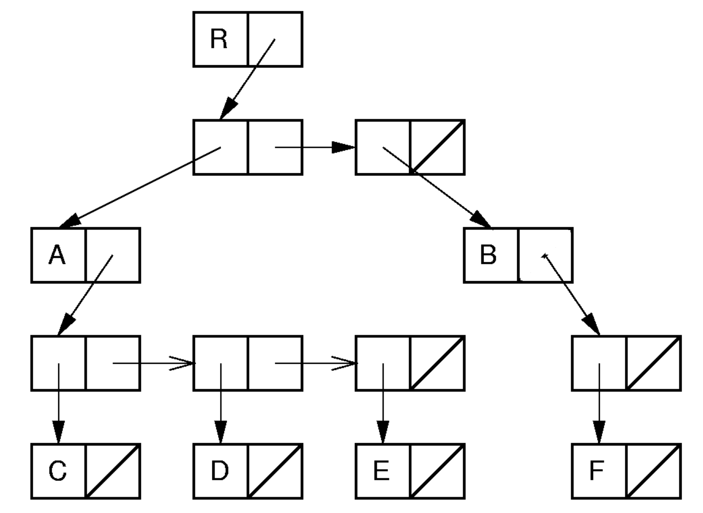
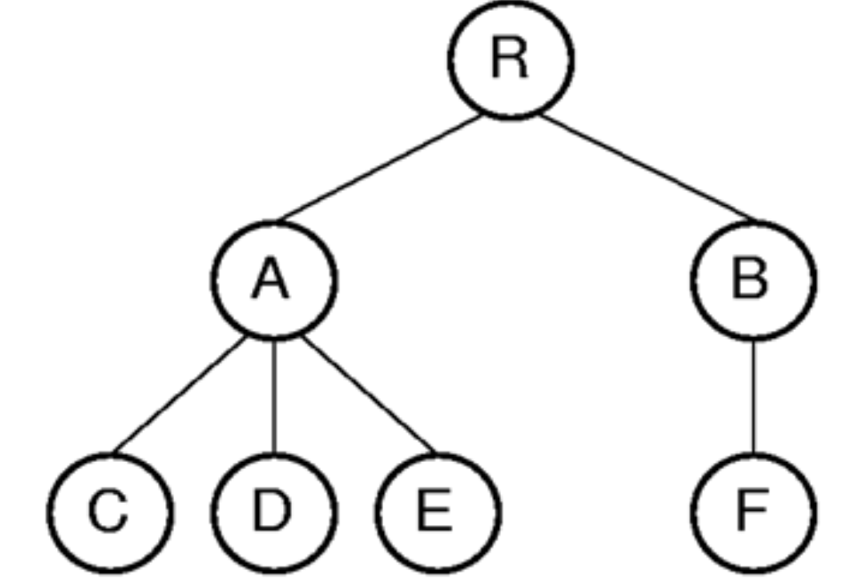

## Non-Binary Trees
Non-Binary Trees는 각 노드가 두 개 이상의 자식을 가질 수 있는 트리 구조  

### ADT
```java
interface GTNode<E>{
    public E value();
    public boolean isLeaf();
    public GTNode<E> parent();
    public GTNode<E> leftmostChild();
    public GTNode<E> rightSibling();
    public void setValue(E value);
    public void setParent(GTNode<E> parent);
    public void insertFirst(GTNode<E> child);
    public void insertNext(GTNode<E> child);
    public void removeFirst();
    public void removeNext();
}
```
- `value()`는 노드의 값을 반환
- `isLeaf()`는 노드가 리프 노드인지 확인
- `parent()`는 부모 노드를 반환
- `leftmostChild()`는 가장 왼쪽 자식 노드를 반환
- `rightSibling()`는 오른쪽 형제 노드를 반환
- `setValue(E value)`는 노드의 값을 설정
- `setParent(GTNode<E> parent)`는 부모 노드를 설정
- `insertFirst(GTNode<E> child)`는 첫 번째 자식 노드를 삽입
- `insertNext(GTNode<E> child)`는 다음 형제 노드를 삽입
- `removeFirst()`는 첫 번째 자식 노드를 제거
- `removeNext()`는 다음 형제 노드를 제거
- 이 ADT는 Non-Binary Tree의 기본적인 연산을 정의하며, 각 노드가 여러 자식을 가질 수 있도록 설계됨.  

### Traversal  
- Binary Tree에서는 Preorder, Inorder, Postorder가 정의됨
- Non-Binary Tree에서는 Preorder, Postorder만 정의됨
  - Inorder는 왼쪽 자식을 순회하고, 현재 노드를 방문하고, 오른쪽 자식을 순회하는 방식인데, Non-Binary Tree에서는 왼쪽 자식과 오른쪽 자식을 구분할 수 없으므로 정의되지 않음  
- Preorder Traversal   
```java
static <E> void preorder(GTNode<E> root) {
    PrintNode(root);
    if (!root.isLeaf()) {
        GTNode<E> child = root.leftmostChild();
        while (child != null) {
            preorder(child);
            child = child.rightSibling();
        }
    }
}
```
- Postorder Traversal    
```java
static <E> void postorder(GTNode<E> root) {
    if (!root.isLeaf()) {
        GTNode<E> child = root.leftmostChild();
        while (child != null) {
            postorder(child);
            child = child.rightSibling();
        }
    }
    PrintNode(root);
}
```
### Parent Pointer Implementation
- Non-Binary Tree를 구현할 때, 각 노드가 부모 노드를 가리키는 포인터를 추가하여 구현할 수 있음
<figure>
  
</figure>

- 위 이미지에 대해, Parent Pointer Implementation을 적용한 결과는 다음과 같음

| Parent's Index | Label | Node's Index |
| -------------- | ----- | ------------ |
| Null           | R     | 0            |
| 0              | A     | 1            |
| 0              | B     | 2            |
| 1              | C     | 3            |
| 1              | D     | 4            |
| 1              | E     | 5            |
| 2              | F     | 6            |
| Null           | W     | 7            |
| 7              | X     | 8            |
| 7              | Y     | 9            |
| 7              | Z     | 10           |

- 이 구현에서는 각 노드가 부모 노드를 가리키는 포인터를 추가하여, 트리 구조를 표현함
- 서로 다른 두 노드가 한 트리 안에 속하는지의 여부를 쉽게 확인할 수 있음  
  
```java
public boolean differ(int a, int b) {
    Integer root1 = FIND(a);
    Integer root2 = FIND(b);
    return root1 != root2;
}
public Integer FIND(Integer x) {
    if (parent[x] == null) {
        return x;
    } 
    while (parent[x] != null) {
        x = parent[x];
    }
    return x;
}
```

### Union-Find
- Union-Find는 두 집합의 비교에 중요하게 사용되는 연산
  - Union: 두 집합을 합치는 연산
  - Find: 두 원소가 같은 집합에 속하는지 확인하는 연산

#### Implementation
- Naive Implementation
    - Union: $A \cup B$의 모든 원소에 대해 $id(i)$(객체 i가 속한 집합의 대표 원소)를 업데이트, $O(n)$
    - Find: $id(i)$를 반환, $O(1)$
- Parent Pointer Implementation
    - Union: $A$와 $B$의 root를 찾아서, 한 집합의 root를 다른 집합의 root로 설정, $O(FIND)$
    - Find: $id(i)$를 찾을 떄, 부모 루트를 타고 거슬러 올라가면서 찾음, $O(\log n)$
      - Path Compression
        - Find 연산을 수행할 때, 경로 상의 모든 노드의 부모를 root로 설정하여, 다음 Find 연산에서 더 빠르게 찾을 수 있도록 함
        - $O(\log n)$에서 $O(1)$로 최적화됨
- **Union**  

```java
public void union(int a, int b) {
    Integer rootA = FIND(a);
    Integer rootB = FIND(b);
    if (rootA != rootB) {
        parent[rootB] = rootA; // rootB의 부모를 rootA로 설정
    }
}
```
이때, 두 집합(트리)를 합칠 때, 더 작은 트리를 더 큰 트리의 자식으로 설정하는 것이 효율적임. `FIND` 연산 등을 수행할 때, 트리의 높이를 최소화하여 탐색 시간을 줄일 수 있기 때문임.
- Weighted union rule
  - Union 연산을 수행할 때, 두 트리의 크기를 비교하여 더 작은 트리를 더 큰 트리의 자식으로 설정하는 방법
  - 이 방법은 트리의 높이를 최소화하여, 최대 $\log n$의 높이를 유지하게 함
- **증명**
    - 가정:
      - 초기에는 각 노드가 하나의 독립적인 트리 → 높이 0
      - n 개의 노드 → n 개의 트리
    - 어떤 노드 $v$가 속한 트리 $A$의 높이를 $h$라고 할 때, $h$가 증가하기 위해선 $A$가 더 큰 트리로 합쳐져야 함
    - 이때 합쳐진 트리의 크기는 $|A|$의 최소 두 배 이상이 되어야 함
      - $|A| \leq |B|$인 트리 $B$와 합쳐질 때, $|A \cup B| = |A| + |B| \geq 2|A|$
    - 따라서, 트리의 높이가 증가할 때마다 트리의 크기는 최소 두 배 이상 증가하게 됨
    - 노드 $v$는 처음에 자기 자신만을 포함하는 트리로 시작하므로, 높이가 $0$일 때 트리의 크기는 $1$이 됨
    - 깊이가 늘어날 때마다 트리의 크기는 최소 두 배 이상 증가하게 되므로, 최종 트리 $|T|$의 크기는 $|T| \geq 2^h$가 됨
    - 그런데 트리의 크기는 $n$이므로, $|T| \leq n$이 됨
    - 따라서, $2^h \leq n$, 즉 $h \leq \log_2 n$이 성립함

- **Path Compression(Find)**
  - Find 연산을 수행할 때, 경로 상의 모든 노드의 부모를 root로 설정하여, 다음 Find 연산에서 더 빠르게 찾을 수 있도록 함

```java
public Integer FIND(Integer x) {
    if (parent[x] == null) {
        return x;
    }
    parent[x] = FIND(parent[x]); // 경로 상의 모든 노드의 부모를 root로 설정
    return parent[x];
}
```

### General Tree Implementation  

#### List of Children
- 각 노드가 자식 노드의 리스트를 가지고 있는 방식
- 예:  
<figure>
  
</figure>

| Index | Value | Parent | Children  |
| ----- | ----- | ------ | --------- |
| 0     | R     | -      | [1, 3]    |
| 1     | A     | 0      | [2, 4, 6] |
| 2     | C     | 1      | []        |
| 3     | B     | 0      | [5]       |
| 4     | D     | 1      | []        |
| 5     | F     | 3      | []        |
| 6     | E     | 1      | []        |

- **Pros**
  - `parent()`, `leftmostChild()` 연산이 $O(1)$로 빠름
  - 두 트리가 같은 array에 있다면, `UNION` 연산이 효율적
    - 합쳐지는 트리의 루트 노드에 parent를 설정하고, 자식 리스트에 단순히 추가하는 방식으로 구현 가능
- **Cons**
  - `rightSibling()` 연산이 $O(n)$으로 느림
  - linked list가 아닌 array-based로 구현할 경우, 노드의 개수를 미리 알아야함

#### Leftmost Child/Right Sibling
- 각 노드가 왼쪽 자식과 오른쪽 형제 노드를 가리키는 포인터를 가지고 있는 방식
- 예:  

| Index | Value | Parent | Leftmost Child | Right Sibling |
| ----- | ----- | ------ | -------------- | ------------- |
| 0     | R     | -      | 1              | -             |
| 1     | A     | 0      | 3              | 2             |
| 2     | B     | 0      | 6              | -             |
| 3     | C     | 1      | -              | 4             |
| 4     | D     | 1      | -              | 5             |
| 5     | E     | 1      | -              | -             |
| 6     | F     | 2      | -              | -             |

- **Pros**
  - `parent()`, `leftmostChild()`, `rightSibling()` 연산이 $O(1)$로 빠름
  - list of children 방식에서는 각 노드마다 자식 리스트를 관리해야 했지만, 이 방식에서는 자식 개수에 상관없이 각 노드가 두 개의 포인터(`leftmostChild`, `rightSibling`)만을 관리하므로, 메모리 사용이 효율적

- **Cons**
  - array-based로 구현할 경우, 노드의 개수를 미리 알아야함

#### Dynamic Node

1. ver-1: List of Children의 Linked List 방식

<figure>
  
</figure>

- **Pros**
  - `parent()`, `leftmostChild()` 연산이 $O(1)$로 빠름
  - 두 트리의 결합이 효율적
    - 합쳐지는 트리의 루트 노드에 parent를 설정하고, 자식 리스트에 단순히 추가하는 방식으로 구현 가능
  - 미리 노드의 개수를 알 필요 없음
  
- **Cons**
  - `rightSibling()` 연산이 $O(n)$으로 느림
  - 링크 기반이지만, 자식들을 관리하기 위해 내부적으로 fixed-size array 또는 reallocable array가 필요  

2. ver-2:   
   
<figure>
  
</figure>

- 이 방식에서는 각 노드가 `leftmostChild` 포인터, `rightSibling` 포인터를 자식 수에 상관없이 고정 크기를 가짐
- ver1과 비교해 유연하지만, 더 많은 공간 요구

#### Dynamic Left-Chid/Right-Sibling
<figure>
  
</figure>

- Non-binary tree를 binary tree처럼 변환해, `leftmostChild`는 왼쪽 포인터, `rightSibling`는 오른쪽 자식 포인터로 저장
- 기존 Left-Chid/Right-Sibling과 비교해 pre-allocate 메모리 필요 없음
- 기존 ver-2와 비교해 더 적은 공간을 씀

### Sequential Implementations
- 연산과는 상관 없이, 트리 구조의 공간을 최소화하는 방법이 필요할 때도 있음
  - 트리를 저장할때는 연산을 고려할 필요가 없음
- Sequential Implementations는 트리 저장에 최소한의 공간을 사용하는 방법론
  - 트리의 노드들을 pre-order로 순회하여, 노드의 값을 배열에 저장
  - pointer 저장 필요 없음

#### For Binary Trees
<figure>
  
</figure>

1. Null pointer를 `/`로 표시
   - `AB/D//CEG///FH//I//`
   - 각 `/`는 왼쪽 자식 혹은 오른쪽 자식이 없음을 나타냄
   - 각 노드 외에도 `/`를 추가로 저장함으로써 저장되는 overhead가 발생함
   - sparse한 트리에서는 공간 낭비가 심함

2. Internal Node를 bit로 표시
   - 노드 값 옆에 `'`를 붙여서 Internal Node를 표시
   - Full binary tree에서는 null pointer 기호 필요없음 
   - `A'B'/DC'E'/G//F'H//I//`
   - Space Overhead: 각 Internal Node마다 1 bit를 추가로 저장

### For Non-Binary(General) Trees
<figure>
  
</figure>

- Pre-order로 순회하여, 노드의 값을 배열에 저장
- 각 subtree의 마지막에 `)`를 추가하여, 각 subtree의 끝을 표시
- `RAC)D)E))BF)))`

---
해당 포스트는 서울대학교 컴퓨터공학부 강유 교수님의 자료구조 25-1학기 강의를 정리한 내용입니다.