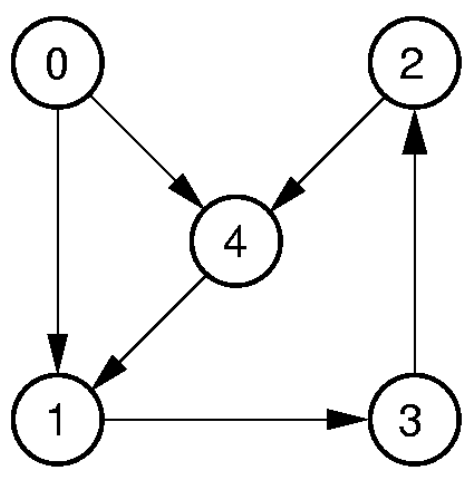
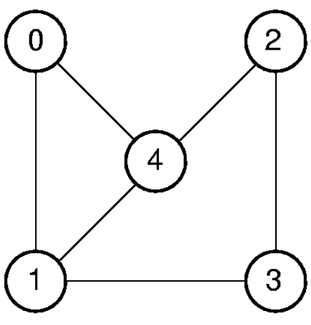

그래프($G = (V,E)$)는 정점(vertices, $V$)과 정점 사이의 연결인 간선(edges, $E$)으로 구성된 자료구조로, 다양한 문제를 모델링하는 데 사용됨.  
- **Undirected Graph**: 간선이 방향을 가지지 않음
- **Directed Graph**: 간선이 방향을 가짐
- **Weighted Graph**: 간선에 가중치가 있음
- **Unweighted Graph**: 간선에 가중치가 없음
- **Path**: 정점의 순서대로 연결된 간선들의 집합 $P = (v_1, v_2, \ldots, v_n)$
  - 모든 정점이 서로 다른 경우 Simple Path라고 표현함
- **Cycle**: Path의 시작과 끝 정점이 동일한 경우 $C = (v_1, v_2, \ldots, v_n, v_1)$
  - Simple Cycle: Cycle에서 시작 정점과 끝 정점을 제외한 모든 정점이 서로 다른 경우
- **Connected Component**: 그래프의 모든 정점이 서로 연결되어 있는 부분 그래프  

## Graph Representation
그래프를 표현하는 방법에는 크게 두 가지가 있음: 인접 행렬(Adjacency Matrix)과 인접 리스트(Adjacency List).
### Adjacency Matrix
인접 행렬은 그래프의 정점 간의 연결 관계를 2차원 배열로 표현하는 방법  
- Directed Graph  
<figure>
    
</figure>  

|     | 0   | 1   | 2   | 3   | 4   |
| --- | --- | --- | --- | --- | --- |
| 0   | 0   | 1   | 0   | 0   | 1   |
| 1   | 0   | 0   | 0   | 1   | 0   |
| 2   | 0   | 0   | 0   | 0   | 1   |
| 3   | 0   | 0   | 1   | 0   | 0   |
| 4   | 0   | 1   | 0   | 0   | 0   |

- Undirected Graph  
<figure>
    
</figure>

|     | 0   | 1   | 2   | 3   | 4   |
| --- | --- | --- | --- | --- | --- |
| 0   | 0   | 1   | 0   | 0   | 1   |
| 1   | 1   | 0   | 0   | 1   | 1   |
| 2   | 0   | 0   | 0   | 1   | 1   |
| 3   | 0   | 1   | 1   | 0   | 0   |
| 4   | 1   | 1   | 1   | 0   | 0   |
 
### Adjacency List
인접 리스트는 각 정점이 연결된 다른 정점들의 리스트로 표현하는 방법
- Directed Graph

| Index | Value | Neighbors |
| ----- | ----- | --------- |
| 0     | 0     | [1, 4]    |
| 1     | 1     | [3]       |
| 2     | 2     | [4]       |
| 3     | 3     | [2]       |
| 4     | 4     | [1]       |

- Undirected Graph

| Index | Value | Neighbors |
| ----- | ----- | --------- |
| 0     | 0     | [1, 4]    |
| 1     | 1     | [0, 3, 4] |
| 2     | 2     | [3, 4]    |
| 3     | 3     | [1, 2]    |
| 4     | 4     | [0, 1, 2] |

### Representation Cost
- Adjacency Matrix: $O(|V|^2)$
  - 모든 정점 간의 연결 관계를 저장하므로, 정점의 개수가 $|V|$일 때 $|V|^2$의 공간이 필요함
- Adjacency List: $O(|V| + |E|)$
  - 각 정점과 그에 연결된 간선들을 저장하므로, 정점의 개수가 $|V|$이고 간선의 개수가 $|E|$일 때 $|V| + |E|$의 공간이 필요함
  - $|E|$의 최대값은 $O(|V|^2)$
    - 증명:   
        - Directed Graph의 경우, 각 정점이 다른 모든 정점과 연결될 수 있으므로 최대 $|V|(|V| - 1)$개의 간선이 존재할 수 있음
        - Undirected Graph의 경우, 각 정점 쌍에 대해 간선은 하나만 있으므로 최대 $\frac{|V|(|V| - 1)}{2}$개의 간선이 존재할 수 있음
  - 따라서 $|E|$가 $|V|^2$보다 작은 Sparse Graph에서는 Adjacency List가 더 공간 효율적임
  - 반면 간선이 많은 Dense Graph에서는 Adjacency Matrix가 더 공간 효율적임  

## ADT
```java
interface Graph{
    public void Init(int n); // 그래프 초기화
    public int n(); // 정점의 개수 반환
    public int e(); // 간선의 개수 반환
    public int first(int v); // 정점 v의 첫 번째 이웃 반환
    public int next(int v, int w); // 정점 v의 다음 이웃 w 반환
    public void setEdge(int i, int j, int w); // 정점 i와 j 사이에 가중치 w인 간선 추가
    public void delEdge(int i, int j); // 정점 i와 j 사이의 간선 제거
    public boolean isEdge(int i, int j); // 정점 i와 j 사이에 간선이 있는지 여부 반환
    public int weight(int i, int j); // 정점 i와 j 사이의 간선 가중치 반환
    public void setMark(int v, int value); // 정점 v에 마크 설정
    public int getMark(int v); // 정점 v의 마크 반환
}
```
## Graph Traversal
그래프를 각 정점들을 한번씩만 방문하는 방법을 그래프 탐색(Graph Traversal)이라고 함.  
그래프 탐색은 크게 두 가지 방법이 있음: 깊이 우선 탐색(DFS, Depth First Search)과 너비 우선 탐색(BFS, Breadth First Search).  

```java
void graphTraverse(Graph G){
    int v;
    for(v = 0; v < G.n(); v++){
        G.setMark(v, UNVISITED); // 모든 정점의 마크를 UNVISITED로 초기화
    }
    for(v = 0; v < G.n(); v++){
        if(G.getMark(v) == UNVISITED){
            doTraverse(G, v); // UNVISITED인 정점에 대해 탐색 시작
        }
    }
}
```
### Depth First Search (DFS)
깊이 우선 탐색(DFS)은 그래프의 한 정점에서 시작하여 가능한 깊게 탐색한 후, 더 이상 갈 수 없게 되면 마지막으로 방문한 정점으로 돌아가서 다시 탐색을 계속하는 방식  
1. 시작 정점의 마크를 VISITED로 설정
2. 시작 정점의 모든 이웃 정점에 대해
   - 이웃 정점의 마크가 UNVISITED인 경우, 해당 정점으로 이동하고 다시 1번부터 반복
   - 이웃 정점의 마크가 VISITED인 경우, 해당 정점으로 돌아가서 다음 이웃 정점을 탐색
3. 모든 이웃 정점을 탐색한 후, 마지막으로 방문한 정점으로 돌아가서 탐색을 계속함
4. 모든 정점이 방문될 때까지 반복함

```java
void DFS(Graph G, int v){
    G.setMark(v, VISITED); // 현재 정점 방문 처리
    for(int w = G.first(v); w != -1; w = G.next(v, w)){
        if(G.getMark(w) == UNVISITED){ // 이웃 정점이 UNVISITED인 경우
            DFS(G, w); // 재귀적으로 DFS 호출
        }
    }
}
```

- Cost
  - 시간 복잡도: $O(|V| + |E|)$
    - 모든 정점과 간선을 한번씩 탐색하므로
  - 공간 복잡도: $O(|V|)$
    - 재귀 호출 스택에 최대 $|V|$개의 정점이 쌓일 수 있음  
### Breadth First Search (BFS)
너비 우선 탐색(BFS)은 그래프의 한 정점에서 시작하여, 해당 정점의 모든 이웃 정점을 먼저 방문한 후, 그 이웃 정점들의 이웃 정점을 방문하는 방식  
1. 시작 정점의 마크를 VISITED로 설정하고, 큐에 추가
2. 큐에서 정점을 하나씩 꺼내어 해당 정점의 모든 이웃 정점에 대해
   - 이웃 정점의 마크가 UNVISITED인 경우, 해당 정점의 마크를 VISITED로 설정하고 큐에 추가
   - 이웃 정점의 마크가 VISITED인 경우, 무시하고 다음 이웃 정점을 탐색
3. 큐가 비어있을 때까지 2번을 반복함

```java
void BFS(Graph G, int start){
    Queue<Integer> Q = new AQueue<Integer>(G.n()); // 큐 초기화
    G.setMark(start, VISITED); // 시작 정점 방문 처리
    Q.enqueue(start); // 시작 정점을 큐에 추가
    while(!Q.isEmpty()){
        int v = Q.dequeue(); // 큐에서 정점 꺼내기
        for(int w = G.first(v); w < G.n(); w = G.next(v, w)){
            if(G.getMark(w) == UNVISITED){ // 이웃 정점이 UNVISITED인 경우
                G.setMark(w, VISITED); // 이웃 정점 방문 처리
                Q.enqueue(w); // 이웃 정점을 큐에 추가
            }
        }
    }
}
```
- Cost
  - 시간 복잡도: $O(|V| + |E|)$
    - 모든 정점과 간선을 한번씩 탐색하므로
  - 공간 복잡도: $O(|V|)$
    - 큐에 최대 $|V|$개의 정점이 쌓일 수 있음  

## Topological Sort
위상 정렬(Topological Sort)은 Directed Acyclic Graph(DAG)에서 정점들을 순서대로 나열하는 방법으로, 각 정점의 선행 조건을 만족하는 순서로 정렬함.  
주어진 작업들이 있을때, 선행 작업이 완료된 후에만 수행할 수 있는 작업들의 순서를 결정하는 데 사용됨.(예: J2는 J1 이후에 시작해야 하고 J4는 J2, J3 이후에 시작해야 한다면 J1, J2, J3, J4 순서로 작업을 수행해야 함)

### DFS 기반 Topological Sort  
DFS를 수행하며, 각 정점을 방문할 때마다 해당 정점을 순서 리스트에 추가함.
```java
void topSort(Graph G){
    for(int i = 0; i < G.n(); i++){
        G.setMark(i, UNVISITED); // 모든 정점의 마크를 UNVISITED로 초기화
    }
    for (int i = 0; i < G.n(); i++){
        if(G.getMark(i) == UNVISITED){
            tophelp(G, i); // UNVISITED인 정점에 대해 DFS 수행
        }
    }
}
void tophelp(Graph G, int v){
    G.setMark(v, VISITED); // 현재 정점 방문 처리
    for(int w = G.first(v); w < G.n(); w = G.next(v, w)){
        if(G.getMark(w) == UNVISITED){ // 이웃 정점이 UNVISITED인 경우
            tophelp(G, w); // 재귀적으로 DFS 호출
        }
    }
    order.add(v); // 현재 정점을 순서 리스트에 추가
}
```
- 최종적으로는 `order` 리스트에 정점들이 역순으로 저장됨. 따라서 `order.reverse()`를 호출하여 올바른 순서로 정렬함.  

### Queue 기반 Topological Sort(Kahn's Algorithm)
Kahn's Algorithm은 위상 정렬을 수행하기 위해 큐를 사용하는 방법
1. 각 정점이 얼마나 많은 간선이 들어오는지 (indegree) 세고
2. indegree가 0인 정점은 바로 출력(= 그 정점은 선행 조건이 없음)
3. 그 정점과 연결된 간선을 제거 (즉, 그 정점이 다른 정점의 선행 조건이었다면 그 조건을 제거)
4. 새로운 indegree 0 정점이 생기면 queue에 넣음
5. 이 과정을 반복해 전체 정점을 출력


```java
void topsort(Graph G) {
    Queue<Integer> Q = new AQueue<Integer>(G.n());
    int[] Count = new int[G.n()];

    // 진입 차수 계산
    for (int v = 0; v < G.n(); v++)
        for (int w = G.first(v); w < G.n(); w = G.next(v, w))
            Count[w]++;

    // 진입 차수 0인 정점 queue에 삽입
    for (int v = 0; v < G.n(); v++)
        if (Count[v] == 0) Q.enqueue(v);

    // 위상 정렬
    while (Q.length() > 0) {
        int v = Q.dequeue();
        order.add(v); // 현재 정점을 순서 리스트에 추가
        for (int w = G.first(v); w < G.n(); w = G.next(v, w)) {
            Count[w]--; // 해당 정점의 진입 차수 감소
            if (Count[w] == 0)
                Q.enqueue(w); // 진입 차수가 0이 된 정점을 queue에 추가
        }
    }
}
```

## Shortest Path
최단 경로 문제는 그래프에서 두 정점 사이의 최단 경로를 찾는 문제.
- 두 정점 간 최단 경로 찾기
- 한 정점에서 다른 모든 정점까지의 최단 경로 찾기
- 모든 정점 간 최단 경로 찾기
- $\delta(u, v)$: 정점 $u$에서 정점 $v$까지의 최단 경로의 길이
- $w(u, v)$: 정점 $u$에서 정점 $v$까지의 간선 가중치  

### Dijkstra's Algorithm
Dijkstra's Algorithm은 그래프에서 한 정점에서 다른 모든 정점까지의 최단 경로를 찾는 알고리즘.
- 입력: 가중치가 있는 Directed Graph $G = (V, E)$와 시작 정점 $s \in V$
1. 시작 정점 $s$의 거리를 0으로 설정하고, 나머지 정점의 거리를 무한대로 설정
2. 모든 정점을 방문하지 않은 상태로 초기화
3. 방문하지 않은 정점 중에서 거리가 가장 짧은 정점을 선택
4. 선택한 정점에서 인접한 모든 정점에 대해
   - 선택한 정점에서 인접한 정점까지의 거리를 계산
     - 계산된 거리 = 선택한 정점의 거리 + 선택한 정점과 인접 정점 사이의 간선 가중치
   - 계산된 거리가 해당 인접 정점의 현재 거리보다 작으면, 해당 인접 정점의 거리를 업데이트
5. 선택한 정점을 방문 처리
6. 모든 정점을 방문할 때까지 3번부터 반복함

```java
void dijkstra(Graph G, int s, int[] D){
    for (int v = 0; v < G.n(); v++){
        D[v] = Integer.MAX_VALUE; // 모든 정점의 거리를 무한대로 초기화
    }
    D[s] = 0; // 시작 정점의 거리를 0으로 설정
    for (int i = 0; i < G.n(); i++){
        int v = minVertex(G, D); // 거리가 가장 짧은 정점 선택
        G.setMark(v, VISITED); // 선택한 정점 방문 처리
        if (D[v] == Integer.MAX_VALUE) break; // 더 이상 방문할 정점이 없으면 종료
        for (int w = G.first(v); w < G.n(); w = G.next(v, w)){
            if (D[w] > D[v] + G.weight(v, w)){ // 선택한 정점에서 인접한 정점까지의 거리가 더 짧은 경우
                D[w] = D[v] + G.weight(v, w); // 인접 정점의 거리 업데이트
            }
        }
    }
}
```
- Cost: `minVertex`로 가장 짧은 거리의 정점을 선택하고, 선택된 정점의 모든 이웃 정점을 탐색하는 과정 두가지로 구성
1. 모든 테이블을 순회하여 최소값을 찾는 경우:   
    - 모든 정점의 `D` 값을 순회하여 최소값을 찾는 경우, 시간 복잡도는 $O(|V|)$
    - `minVertex` 함수는 모든 정점에 대해 수행되므로 $O(|V|^2)$
    - 각 정점의 이웃 정점을 relax하는 과정(거리를 확인하고 갱신하는 과정)은 모든 간선을 한번씩 탐색하므로, 시간 복잡도는 $O(|E|)$
    - 따라 전체 시간 복잡도는 $O(|V|^2 + |E|)$
    - 보통 $|E|$가 $|V|^2$보다 작으므로, 최종적으로 $O(|V|^2)$로 표현됨  

```java
int minVertex(Graph G, int[] D){
    int v = 0; // 미방문 정점 초기화
    for (int i = 1; i < G.n(); i++){
        if (G.getMark(i) == UNVISITED){
            v = i; // 첫 번째 미방문 정점으로 설정
            break;
        }
    }
    for (int i = 0; i < G.n(); i++){
        if (G.getMark(i) == UNVISITED && D[i] < D[v]){
            v = i; // 현재 정점이 미방문 상태이고, 거리가 더 짧은 경우
        }
    }
    return v; // 가장 짧은 거리를 가진 미방문 정점 반환
}
```

2. min-heap(우선순위 큐)를 사용하는 경우:  
    - 우선순위 큐를 사용하여 최소값을 찾는 경우, 시간 복잡도는 $O(\log |V|)$
    - 모든 정점에 대해 `minVertex`를 호출하므로 $O(|V| \log |V|)$
    - `D` 값이 줄어들면 heap에서 다시 정렬하는 과정이 필요하므로, 각 정점의 이웃 정점을 relax하는 과정은 $O(|E| \log |V|)$ 
    - 따라서 전체 시간 복잡도는 $O((|V| + |E|) \log |V|)$    

```java
int minVertex(Graph G, PriorityQueue<Integer> pq){
    while (!pq.isEmpty()){
        int v = pq.poll(); // 우선순위 큐에서 최소값을 가진 정점 꺼내기
        if (G.getMark(v) == UNVISITED){
            return v; // 미방문 정점 반환
        }
    }
    return -1; // 모든 정점이 방문된 경우
}
```

#### Correctness of Dijkstra's Algorithm
- Claim: Dijkstra's Algorithm에서 정점 $u$가 집합 $S$에 포함될 때, $d(u,s) = \delta(s, u)$, 즉 $u$까지의 최단 거리가 확정
  - $d(u,s)$: Dijkstra's Algorithm에서 정점 $u$까지의 거리
  - $\delta(s, u)$: 그래프에서 정점 $s$에서 정점 $u$까지의 최단 경로의 길이
- Proof by Induction
  - **Base Case**: 시작 정점 $s$는 집합 $S$에 포함되며, $d(s,s) = \delta(s, s) = 0$이므로 성립
  - **Inductive Step**: 정점 $u$가 집합 $S$에 포함될 때, $d(s,u) = \delta(s, u)$이 성립한다고 가정
    - $S$ 바깥에서, $d(s,v)$값이 가장 작은 정점 $v$를 선택
    - $S$와 $S$ 바깥의 집합 $S'$ 경계의 첫 정점 쌍 $(x, y)$를 선택
    - 이 경우 relaxation을 통해 $d(s,y) \leq d(s,x) + w(x, y)$가 성립함
    - Induction Hypothesis에 의해 $d(s,x) = \delta(s, x)$이므로, $d(s,y) \leq \delta(s, x) + w(x, y)$
    - $x \to y$는 $S$의 내부와 $y$를 연결하는 첫 번째 간선이므로, $d(s,y) \leq \delta(s, x) + w(x, y) = \delta(s, y)$이 성립함
    - 이때 첫번째 가정에 따라 $d(s,v) \leq d(s,y) = \delta(s, y)$
    - $x \to y$가 $S$의 내부와 $y$를 연결하는 첫 번째 간선이므로, $\delta(s, y) \leq \delta(s, v)$이 성립함
    - 따라서 $d(s,v) \leq d(s,y) = \delta(s, y) \leq \delta(s, v)$이 성립함
    - 정의상 $\delta(s, v) \leq d(s,v)$이므로, $d(s,v) = \delta(s, v)$이 성립함

## Minimum Spanning Tree (MST)
최소 신장 트리(Minimum Spanning Tree, MST)는 가중치가 있는 그래프에서 모든 정점을 포함하면서 Cycle이 없고 가중치의 합이 최소인 트리를 찾는 문제.
- 해가 유일하지 않음
- 하지만 해가 존재하는 경우, 모든 해의 가중치 합은 동일함
- 가중치의 합이 최소라는 것은, 사이클이 없음을 보장함
  - 만약 사이틀이 있으면, 사이클의 간선 중 하나를 제거하여 가중치의 합을 줄일 수 있음
  - 따라 MST는 Cycle이 없는 트리임  

### Prim's Algorithm
시작 정점에서부터 인접한 정점 중 가중치가 가장 작은 간선을 선택하여 트리를 확장하는 방식(Greedy Approach)
1. 시작 정점의 마크를 VISITED로 설정하고, 해당 정점을 MST에 추가
2. MST에 포함되지 않은 정점 중에서, MST에 포함된 정점과 연결된 간선 중 가중치가 가장 작은 간선을 선택
3. 선택한 간선의 다른 정점을 MST에 추가하고, 해당 정점의 마크를 VISITED로 설정
4. 모든 정점이 MST에 포함될 때까지 2번부터 반복함

```java
void Prim(Graph G, int s, int[] D, int[] V){ // G: 그래프, s: 시작 정점, D: 거리 배열, V: 부모 정점 배열
    int v, w;
    for (v = 0; v < G.n(); v++){
        D[v] = Integer.MAX_VALUE; // 모든 정점의 거리를 무한대로 초기화
    }
    D[s] = 0; // 시작 정점의 거리를 0으로 설정
    for (int i = 0; i < G.n(); i++){
        v = minVertex(G, D); // 거리가 가장 짧은 정점 선택
        G.setMark(v, VISITED); // 선택한 정점 방문 처리
        if (v != s) {
            AddEdgeToMST(V[v], v); // MST에 간선 추가
        }
        if (D[v] == Integer.MAX_VALUE) break; // 더 이상 방문할 정점이 없으면 종료
        for (w = G.first(v); w < G.n(); w = G.next(v, w)){
            if (D[w] > G.weight(v, w)){ // 선택한 정점에서 인접한 정점까지의 거리가 더 짧은 경우
                D[w] = G.weight(v, w); // 인접 정점의 거리 업데이트
                V[w] = v; // 인접 정점의 부모 정점을 선택한 정점으로 설정
            }
        }
    }
}
```
- Cost: Dijkstra's Algorithm와 유사하게, Prim's Algorithm도 모든 정점에 대해 `minVertex`를 호출하고, 선택된 정점의 모든 이웃 정점을 relax하는 과정으로 구성됨.
- 따라서 시간 복잡도는 $O(|V|^2 + |E|)$ 또는 $O((|V| + |E|) \log |V|)$로 표현됨.  

#### Correctness of Prim's Algorithm
- Claim: Prim's Algorithm에서 매 단계에서 선택하는 간선을 포함하는 트리는 반드시 어떤 MST와 동일한 비용을 갖는 트리의 부분 집합임
- Proof by Induction
  - **Base Case**:  
    - Prim's Algorithm이 선택한 첫번째 간선 $e = (u, v)$와 어떤 MST $T^*$에 대해  
        1. $e \in T^*$, 즉 $T^*$에 간선 $e$가 포함됨  
            이미 $e$를 포함하므로 만족
        2. $e \notin T^*$, 즉 $T^*$에 간선 $e$가 포함되지 않음  
            이 경우, $T^*$에 $e$를 추가하면 Cycle이 생김
            - Cycle 내에는 $u$를 포함하는 간선 $f$가 존재함
            - Prim's Algorithm은 최소 비용 간선을 선택했으므로, $w(e) \leq w(f)$
            - $T' = T^* - f + e$는 $T^*$와 동일한 정점 집합을 가지며, $w(T') = w(T^*) - w(f) + w(e) \leq w(T^*)$
            - 이때 $T^*$는 MST이므로, $w(T') = w(T^*)$가 성립함
            - 따라서 $T'$는 MST이고 $T'$에 $e$가 포함됨
   - **Inductive Step**: $k-1$번째 단계까지 Prim's Algorithm이 선택한 간선들을 어떤 MST $T^*$의 부분 집합으로 가정
      - Prim's Algorithm이 $k$번째 단계에서 선택한 간선 $g = (x, y)$에 대해
        1. $g \in T^*$, 즉 $T^*$에 간선 $g$가 포함됨  
            - 이미 $g$를 포함하므로 만족
        2. $g \notin T^*$, 즉 $T^*$에 간선 $g$가 포함되지 않음  
            - 이 경우, $T^*$에 $g$를 추가하면 Cycle이 생김
            - Cycle 내에는 $S$와 $V\not{S}$를 잇는 간선 $h$가 존재함
            - Prim's Algorithm은 최소 비용 간선을 선택했으므로, $w(g) \leq w(h)$
            - $T' = T^* - h + g$는 $T^*$와 동일한 정점 집합을 가지며, $w(T') = w(T^*) - w(h) + w(g) \leq w(T^*)$
            - 이때 $T^*$는 MST이므로, $w(T') = w(T^*)$가 성립함
            - 따라서 $T'$는 MST이고 $T'$에 $g$가 포함됨

### Kruskal's Algorithm
Kruskal's Algorithm은 그래프의 간선을 가중치 순으로 정렬한 후, Cycle이 생기지 않도록 간선을 선택하여 MST를 구성하는 방식  
1. 그래프의 모든 간선을 가중치 순으로 정렬
2. 최소 가중치의 간선부터 선택
3. 해당 간선의 두 정점이 같은 트리에 속하지 않으면, 해당 간선을 MST에 추가
4. MST가 완성될 때까지 2번부터 반복함

```java
void Kruskal(Graph G, int[] D, int[] V){
    List<Edge> edges = new ArrayList<>();
    for (int v = 0; v < G.n(); v++){
        for (int w = G.first(v); w < G.n(); w = G.next(v, w)){
            if (v < w) { // 간선 중복 방지
                edges.add(new Edge(v, w, G.weight(v, w)));
            }
        }
    }
    Collections.sort(edges); // 간선을 가중치 순으로 정렬
    for (Edge edge : edges){
        int u = edge.u;
        int v = edge.v;
        if (Find(u) != Find(v)){ // Cycle이 생기지 않는 경우
            Union(u, v); // 두 정점을 같은 트리로 합침
            AddEdgeToMST(u, v); // MST에 간선 추가
        }
    }
}
```
- Cost: 간선을 정렬하는 과정이 $O(|E| \log |E|)$이고, 각 간선에 대해 Union-Find를 수행하는 과정이 $O(|E| \alpha(|V|))$이므로, 전체 시간 복잡도는 $O(|E| \log |E| + |E| \alpha(|V|))$로 표현됨.
  - 대부분의 경우 $|E| \log |E|$(간선 정렬)이 지배적이므로, $O(|E| \log |E|)$

---
해당 포스트는 서울대학교 컴퓨터공학부 강유 교수님의 자료구조 25-1학기 강의를 정리한 내용입니다.