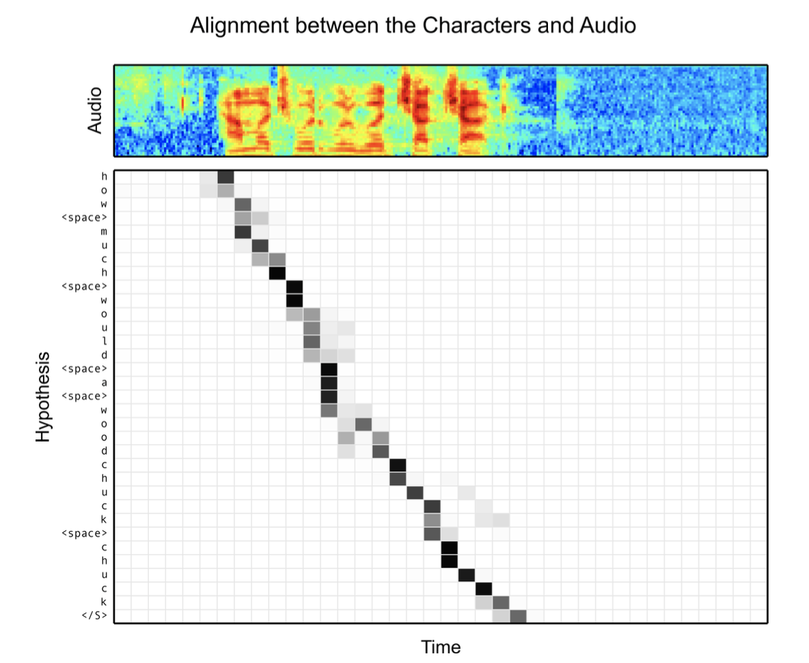

## Abstract
LAS(Listen, Attend and Spell) 모델을 소개. 해당 모델은 음성 데이터를 단어가 아니라 문자(character) 단위로 출력.  
기존 음성 인식 시스템(DNN-HMM 기반)은 하이브리드 모델을 사용함(음향 모델, 언어 모델, 발음 사전). LAS는 이러한 복잡한 구조를 하나의 신경망으로 통합하여, 음성 입력을 직접 문자 시퀀스로 변환(end-to-end 방식)함.  
LAS는 Listner와 Speller로 구성됨. Listner는 피라미드 구조의 RNN을 사용해 음성 입력의 시퀀스를 줄여서 인코딩하고, Speller는 Attention 메커니즘을 사용해 Listner의 출력에서 문자 시퀀스를 생성함.  
LAS는 문자 간의 독립을 가정하지 않아서, 기존 CTC(Connectionist Temporal Classification) 기반 모델보다 더 정확한 음성 인식을 가능하게 함.

## Introduction
기존 Deep Neural Network 기반 음성 인식 모델은 여러 별도의 모듈(음향 모델, 언어 모델, 발음 사전)을 사용하고 있음. 각각의 모듈은 별도의 목적 함수로 학습됨.  
이런 단점을 위해서 end-to-end 방식의 음성 인식 모델이 제안됨. 대표적인 방법으로 Connectionist Temporal Classification(CTC)와 Attention 기반 sequence-to-sequence 모델이 있음.  
기존 방법론의 한계로는, CTC 모델은 출력 간의 독립성을 가정해, 언어 모델의 정보를 충분히 활용하지 못함. Attention 기반 모델은 음성 인식에서는 음소 단위의 매핑으로만 적용되고, 문장 전체로의 end-to-end 방식으로는 적용되지 않음.  
본 논문에서는 음성 인식에서 end-to-end 방식의 LAS(Listen, Attend and Spell) 모델을 제안함. LAS는 음성 입력을 문자 단위로 직접 변환하는 모델로, 출력 간 조건부 독립성을 가정하지 않고 HMM에 의존하지 않음. 어텐션 메커니즘을 사용하여 음성 입력의 모든 부분에 접근하고 어느 부분에 집중할지 결정함.  
이 모델의 핵심적인 접근은 다음과 같음:  
- **Listener의 피라미드 구조**  
     RNN을 사용하여 음성 입력의 시퀀스를 줄여서 인코딩함. 이를 통해 어텐션 메커니즘이 처리해야할 타임 스텝의 수를 줄여 효율성을 높임.  
- **문자 단위의 출력**  
     음성 입력을 단어가 아닌 문자(character) 단위로 출력하여 OOV(Out-Of-Vocabulary) 문제를 해결하고, 다양한 철자도 자연스럽게 처리함  

<figure>

<figcaption>철자 단위로 음성 인식을 수행함으로써, "triple a"와 같은 음성을 "triple a", "aaa" 등 다양한 철자 형태로 인식할 수 있음.</figcaption>
</figure>  

- **독립성 가정의 제거**  
     출력 간의 독립성을 가정하지 않아서, CTC 기반 모델보다 더 정확한 음성 인식을 가능하게 함.

## Related Work  
딥러닝은 음성 인식 분야에서 주로 분류 문제로 접근되어 왔음.(예: 프레임 단위의 음성 특징을 음소로 분류) 시퀀스를 처리하는 문제에서는 딥러닝을 HMM, CRF와 같은 전통적인 시퀀스 모델과 결합하여 사용함. 이런 경우에 생기는 문제는, 여러 모듈을 결합해야해 end-to-end 방식으로 학습하기 어렵고, 데이터 분포의 복잡한 확률 구조를 단순화(예: 독립성 가정)해야 함.  
시퀀스-투-시퀀스(sequence-to-sequence) 모델은 입력 벡터를 고정 길이의 벡터로 인코딩해, 디코더가 이를 기반으로 출력 시퀀스를 생성하는 구조. 학습시에는 디코더 입력에 정답(ground truth)을 사용하고, 추론시에는 이전 출력이 다음 입력으로 사용되며, beam search를 통해 여러 후보 시퀀스를 생성함.  
어텐션 메커니즘은 seq2seq 모델에서 인코딩 벡터 하나만으로 긴 시퀀스의 정보를 포함하기 어려운 문제를 해결하기 위해 도입됨. 어텐션은 디코딩 단계에서 인코딩된 입력 시퀀스의 모든 부분에 접근해 어떤 부분에 집중할지 결정하고 정보 전달과 gradient 전파를 수월하게 함.  
기존 음성인식에 end-to-end 방식의 접근법은 CTC와 Attention 기반 모델이 있음. 
- **CTC**  
  - 입력과 출력 시퀀스의 길이가 다를 때, 출력 시퀀스의 길이를 조정하기 위해 사용됨.  
  - CTC는 출력 시퀀스의 길이를 줄이기 위해 중복된 출력을 하나의 출력으로 합쳐 입출력의 길이가 다른 문제를 해결함.
  - 예:  
    - 입력: "hello world"의 음성 신호
    - 출력: "h h h e e l l o o o --- w w o r l d d d" -> "hello world"
- **Attention 기반 모델**  
  - 기존 attention 기반 모델은 음소 수준에서 seq2seq 모델을 사용하여 음성 인식을 수행함.(음성 -> 음소)
  - 당시 음성 -> 문자 단위의 end-to-end 방식은 구현되지 않았음.  

## Model  
<figure>

<figcaption>전체 모델 구조
</figure>

- 입력($\mathbf{x}$)  
$$
\mathbf{x} = (x_1, x_2, \ldots, x_T)
$$
  - filter bank spectra 특징의 시퀀스.

- 출력($\mathbf{y}$)  
$$
\mathbf{y} = (\text{<sos>}, y_1, y_2, \ldots, y_S, \text{<eos>})
$$
  - 문자(character) 단위의 시퀀스. `<sos>`는 시작 토큰, `<eos>`는 종료 토큰.
  - $y_i \in \{a, b, c, \ldots, z, 0, 1, \ldots, 9, \text{<space>}, \text{<comma>}, \text{<period>}, \text{<apastrophe>}, \text{<unk>} \}$  

각 문자는 다음과 같이 생성됨  
$$
P(\mathbf{y} | \mathbf{x}) = \prod_i P(y_i | y_{<i}, \mathbf{x})
$$  

즉 이전 문자들과 음성 입력을 모두 참고해 다음 문자의 확률을 계산.  

### Listen
pyramidal Bidirectional LSTM을 사용하여 음성 입력의 시퀀스를 줄여서 인코딩함.  
기존 Bidirectional LSTM은 $i$번째 타임스텝의 $j$층의 은닉 상태를 다음과 같이 처리함.

$$
h_{i}^j = \text{BLSTM}(h_{i-1}^j, h_{i}^{j-1})
$$  

여기서 $h_{i-1}^j$는 이전 타임스텝의 은닉 상태, $h_{i}^{j-1}$는 이전 층의 은닉 상태.  
pBLSTM은 은닉 시퀀스를 다음과 같이 절반으로 줄여 다음 은닉층으로 전달함.  

$$
h_{i}^j = \text{pBLSTM}(h_{i-1}^j, [h_{2i}^{j-1}, h_{2i+1}^{j-1}])
$$

입력 시퀀스 $\mathbf{x} = (x_1, x_2, \ldots, x_T)$는 최종 은닉 상태 $\mathbf{h} = (h_1, h_2, \ldots, h_U)$로 변환됨. 여기서 $U = T / 2^L$이고, $L$은 pBLSTM의 층 수임.  
해당 논문의 모델에선 3개의 pBLSTM 층을 사용하여 입력 시퀀스를 8분의 1로 줄임.  
따라서 어텐션 계산의 시간 복잡도는 $O(TS)$에서 $O(US)$로 줄어듦.  

### Attention and Spell
어텐션 메커니즘을 사용하여 Listner의 출력 $\mathbf{h}$에서 문자 시퀀스 $\mathbf{y}$를 생성함.  

$$
\begin{align*}
c_i &= \text{AttentionContext}(s_i, \mathbf{h}) \\
s_i &= \text{RNN}(s_{i-1}, y_{i-1}, c_{i-1}) \\
P(y_i | y_{<i}, \mathbf{x}) &= \text{CharacterDistribution}(s_i, c_i)  
\end{align*}
$$

여기서 $s_i$는 디코더의 이전 상태, 이전 문자, 이전 어텐션 컨텍스트 벡터를 입력으로 받아 현재 상태를 계산함, $c_i$는 어텐션 컨텍스트 벡터, $P(y_i | y_{<i}, \mathbf{x})$는 다음 문자의 확률 분포임.  
어텐션 컨텍스트 벡터 $c_i$는 Listner의 출력 $\mathbf{h}$의 가중합으로 계산됨.  
$$
c_i = \sum_{u} \alpha_{i,u} h_u
$$  
여기서 $\alpha_{i,u}$는 어텐션 가중치로, 디코더의 은닉 상태 $s_i$와 Listner의 출력 $h_u$를 기반으로 계산됨.  
$$
\alpha_{i,u} = \frac{\exp(e_{i,u})}{\sum_{u'} \exp(e_{i,u'})}
$$  
여기서 $e_{i,u}$는 디코더의 은닉 상태와 Listner의 출력 사이의 유사도를 나타내는 값으로, 다음과 같이 계산됨.  
$$
e_{i,u} = <\phi(s_i), \psi(h_u)>
$$  
여기서 $\phi$와 $\psi$는 MLP 레이어로, 각각 디코더의 은닉 상태와 Listner의 출력을 변환함.  

### Learning

목적 함수는 주어진 음성 입력 $\mathbf{x}$에 대해 정답 문자 시퀀스 $\mathbf{y}$를 최대화하는 것.  

$$
\max_{\theta} P(\mathbf{y} | \mathbf{x}; \theta) = \max_{\theta} \prod_{i} P(y_i | y_{<i}, \mathbf{x}; \theta) = \max_{\theta} \sum_{i} \log P(y_i | y_{<i}, \mathbf{x}; \theta)
$$

학습 단계에서는 정답 문자 시퀀스 $\mathbf{y}$를 사용하여 모델의 파라미터 $\theta$를 업데이트함. 하지만 이런 방법은 추론 단계에서 자기 자신의 이전 출력을 입력으로 사용하기 때문에 에러가 한번 발생하면 이후 출력에 중대한 영향을 미침. 따라서 해당 논문에서는 10%의 확률로 정답 문자 대신 이전 출력의 문자를 사용해 모델을 학습함. 이를 Scheduled Sampling이라고 함.  

$$
\max_{\theta} \sum_{i} \log P(y_i | \tilde{y}_{<i}, \mathbf{x}; \theta)
$$  
$$
\tilde{y}_i \sim CharacterDistribution(s_i, c_i)
$$  

이와 같은 방식을 통해 디코더가 자기 출력에 의존해야하는 상황에 대비할 수 있음.  

### Decoding and Rescoring  
디코딩 단계에서는 beam search를 사용하여 여러 후보 문자 시퀀스를 생성함. 미리 정의한 beam size만큼 후보를 유지하고, 각 후보에 대해 다음 문자의 확률을 계산하여 다시 상위 beam size만큼 후보를 선택. 이 논문에서는 32개의 beam size를 사용하여, 매 단계마다 $32 \times Vocabulary$개의 후보를 생성함.  
Rescoring 단계에서는 생성된 후보 시퀀스에 대해 추가적인 평가를 수행함. 외부 언어모델을 사용하여 후보 시퀀스의 확률을 재계산하고, 짧은 시퀀스를 선호하는 경향을 보완하기 위해 길이 보정(length normalization)을 적용함.  

$$
s(y|x) = \frac{\log P(y|x)}{|y|_c} + \lambda \log P_{LM}(y)
$$  
여기서 $|y|_c$는 시퀀스의 길이, $P_{LM}(y)$는 언어 모델에 의한 시퀀스의 확률, $\lambda$는 언어 모델의 가중치임. 확률의 로그값의 합이므로, 시퀀스의 길이가 길어질수록 확률이 낮아지는 경향이 생김. 이를 보완하기 위해 길이 보정을 적용함. log sum은 음수이므로, 더 큰 값으로 나눠지면 값이 커짐.  

## Experiments  
- **데이터셋**  
  - Google voice search dataset을 사용
  - 3백만개의 발화
  - 2000시간의 분량
  - 10시간의 검증 데이터와 16시간의 테스트 데이터로 나눔
  - 유튜브와 실생활 소음으로 noise를 추가함

- **입력 특징**  
  - 40차원 log-mel filter bank spectra 특징을 사용
  - 25ms의 윈도우 크기와 10ms의 스트라이드를 사용하여 특징 추출  

- **모델 설정**
  - Listner: 3개의 pBLSTM 층, 각 층마다 해상도 절반으로 축소, 각 층의 은닉 상태 크기는 512(각 방향으로 256)
  - Speller: 2개의 LSTM 층, 각 층의 은닉 상태 크기는 512

- **학습 설정**
  - Asynchronous SGD를 사용하여 학습
  - 학습률은 0.2, decay는 0.98 (3백만 utterence마다)
  - 배치 크기는 32 utterence

- **디코딩 설정**
  - beam size는 32
  - n-gram 언어모델로 rescoring

- **결과**  

| Model                       | Clean WER | Noisy WER |
| --------------------------- | --------- | --------- |
| CLDNN-HMM (baseline)        | 8.0%      | 8.9%      |
| LAS (no LM)                 | 16.2%     | 19.0%     |
| LAS + LM Rescore            | 12.6%     | 14.7%     |
| LAS + Sampling (10%)        | 14.1%     | 16.5%     |
| LAS + Sampling + LM Rescore | 10.3%     | 12.0%     |
  
Sampling 적용, 언어모델 재조정 시 WER가 크게 감소함  

### Attention Visualization
<figure>

<figcaption>어텐션 가중치 시각화 예시. 각 행은 디코더의 출력 문자, 각 열은 Listner의 출력 타임스텝을 나타냄.</figcaption>
</figure>
어텐션 가중치 시각화를 통해 디코더가 Listner의 출력에서 어떤 부분에 집중하는지 확인할 수 있음. monotonic하게 alignment을 형성하는 것을 볼 수 있음.  

### Effects of Beam Width
<figure>

<figcaption>Beam Width에 따른 WER 변화. Beam Width가 증가할수록 WER가 감소함을 확인할 수 있음.</figcaption>  
</figure>

Beam Width가 증가할수록 WER가 감소함을 확인할 수 있음. Beam Width가 32일 때 가장 낮은 WER를 기록하고, 그 이후로는 큰 변화가 없음.

### Effects of Utterance Length
<figure>

<figcaption>발화 길이에 따른 오류 종류 변화</figcaption>
</figure>
짧은 발화 길이의 문장은 insertion, substitution 오류가 많고, 긴 발화 길이의 문장은 deletion 오류가 많음. 데이터의 분포는 짧은 발화 길이가 많아 긴 문장에 대한 일반화는 부족함.

### Word Frequency
<figure>

<figcaption>단어 빈도에 따른 Word Recall 변화</figcaption>
</figure>
단어 빈도가 높을수록 Word Recall이 높아지고, 빈도가 낮을수록 Word Recall이 낮아지고 분산이 커짐. 또한 acoustic uniqueness가 높은 단어는 Word Recall이 높은 경향을 보여줌.  

## Conclusion
LAS는 HMM, 발음 사전, phoneme 없이 음성을 문자 시퀀스로 변환하는 end-to-end 모델임. pyramidal BLSTM으로 긴 음성 시퀀스를 압축하고 attention 기반 decoder가 중요한 부분에 집중해 문자를 생성함. 출력 간 조건부 독립 가정을 하지 않아 문맥 반영 가능하며 OOV 단어 처리 가능함. language model을 결합하면 기존 HMM 기반 시스템과 유사한 성능을 보였고 end-to-end 학습의 단순성과 효과를 입증함.  

