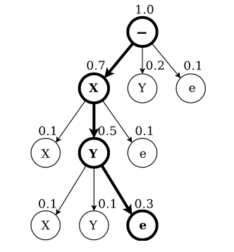

## Abstract
시퀀스 데이터의 학습 문제에서는 전처리 되지 않은 입력 데이터로부터 레이블 시퀀스를 예측하게 됨. 예를 들어, 음성 인식에서는 연속된 음향 신호로부터 음소 또는 단어 시퀀스를 예측함. RNN(Recurrent Neural Networks)은 이러한 시퀀스 데이터의 학습에 효과적이지만, 입력과 출력 시퀀스의 길이가 다를 때는 어려움이 있음. 본 논문에서는 CTC(Connectionist Temporal Classification)라는 새로운 학습 방법을 제안함. CTC는 RNN을 사용하여 분절되지 않은 시퀀스 데이터를 레이블링하는 방법으로, 입력과 출력 시퀀스의 길이가 다를 때도 효과적으로 학습할 수 있도록 함. 

## Introduction
비분절(unsegmented) 시퀀스 라벨링 문제는 음성인식, 필기체 인식, 생물학적 시퀀스 분석 등 다양한 분야에서 발생함. 이런 데이터는 일반적으로 노이즈가 있고, 실수값(time series)로 표현되며, 출력 라벨은 이산적인 값임.  
기존 방법으로는 HMM(Hidden Markov Model)과 CRF(Conditional Random Field)가 있지만, 이들은 모델을 직접 설계해야하기 때문에 해당 도메인에 대한 전문 지식이 필요함. 또한, 라벨들이 독립적이라고 가정하기 때문에, 출력 간의 종속성을 고려하지 못함. HMM은 생성 모델이기 때문에, label prediction 문제인 시퀀스 라벨링 문제에 적합하지 않음.  
RNN은 별도의 feature engineering 없이 시퀀스 데이터를 처리할 수 있는 장점이 있고, 시간 정보를 활용하기 용이하며, 노이즈에 강해 시계열 모델링에 강하지만, 기존 시퀀스 라벨링 문제에 적용하기 어려웠음. 한 프레임 단위의 예측만 가능하기 때문에 학습을 위해서 분절된 데이터가 필요하고, 예측 결과를 라벨 시퀀스로 변환하는 과정이 필요함. 예를 들어,  

| 시간 프레임 | 0–10ms | 10–20ms | 20–30ms | ... | 100–110ms |
| ----------- | ------ | ------- | ------- | --- | --------- |
| 라벨        | `s`    | `s`     | `s`     | ... | `a`       |

위와 같이 각 프레임에 어떤 음소가 대응되는지 정확히 알아야하고, 이와 같은 데이터를 만들기 위해서는 수동으로 라벨링을 해야함. 이는 시간과 비용이 많이 들고, 라벨링 오류가 발생할 수 있음.   
기존의 타협점은 RNN-HMM 하이브리드 모델로, HMM이 시퀀스 구조를 모델링하고, RNN이 각 프레임의 확률을 예측하는 방식이었음. 하지만, 이 방법은 여전히 HMM의 가정에 의존하고, RNN의 능력을 충분히 활용하지 못함.   
이 논문은 RNN만으로 직접 시퀀스 라벨링을 수행하는 방법을 제안함. RNN 출력을 라벨 시퀀스의 확률 분포로 해석해, 이를 통해 목표 시퀀스의 확률을 최대화하는 목적 함수를 도출하고 학습함.  

## Temporal Classification
Temporal Classification은 입력 시퀀스의 각 시간 프레임에 대해 라벨을 예측하는 문제. 이 문제는 입력과 출력 시퀀스의 길이가 다를 수 있으며, 출력 라벨은 이산적인 값으로 표현됨.

- 입력 공간: 실수 $m$ 차원 벡터의 시퀀스  

$$
\mathcal{X} = (\mathbb{R}^{m})^*
$$

- 출력 공간: 이산 라벨의 시퀀스  

$$
\mathcal{Z} = L^*
$$

- 학습 데이터: 
  - 입력 시퀀스 $\mathbf{x} = (x_1, x_2, \ldots, x_T)$
  - 출력 라벨 시퀀스 $\mathbf{z} = (z_1, z_2, \ldots, z_U), U \leq T$  

- 학습 목표: 입력 시퀀스를 받아 라벨 시퀀스를 출력하는 seq2seq 함수  

$$
h: \mathcal{X} \mapsto \mathcal{Z}
$$  

### Label Error Rate (LER)
라벨 시퀀스를 예측하는 문제에서, 예측된 라벨 시퀀스와 실제 라벨 시퀀스 간의 차이를 측정하기 위해 LER(Label Error Rate)를 사용함. LER은 다음과 같이 정의됨:  

$$
\text{LER}(h, S') = \frac{1}{Z} \sum_{(x, z) \in S'} \text{ED}(h(x), z)
$$  

- $S'$: 테스트 집합
- $Z$: 테스트 데이터 총 라벨 개수
- $\text{ED}(h(x), z)$: 예측된 라벨 시퀀스와 실제 라벨 시퀀스 간의 편집 거리(Edit Distance)   

## Connectionist Temporal Classification (CTC)
RNN의 출력을 라벨 시퀀스의 확률 분포로 해석하고, 이를 통해 목표 시퀀스의 확률을 최대화하는 방법. 

### From Network Outputs to Labellings
RNN의 입력 시퀀스는 $\mathbf{x} = (x_1, x_2, \ldots, x_T) \in (\mathbb{R}^m)^T $이고, 출력 시퀀스는 $\mathbf{y} = (y_1, y_2, \ldots, y_T) \in (\mathbb{R}^n)^T$로 표현됨. RNN은 각 시간 프레임에 대해 라벨의 확률 분포를 출력함. 이때, 각 $y_t \in \mathbb{R}^{|L|+1}$은 소프트맥스 출력으로, $|L|$은 라벨의 개수임. blank 라벨을 포함하여 $|L| + 1$ 차원의 벡터로 표현됨.   
path $\pi = (\pi_1, \pi_2, \ldots, \pi_T)$는 각 시간 프레임에 대해 어떤 라벨이 선택되었는지 나타내는 시퀀스, $\pi \in L'^T$로 표현됨. 여기서 $L'$은 라벨 집합에 blank 라벨을 추가한 집합임. Path의 확률은 다음과 같이 정의됨:  

$$
P(\pi | \mathbf{x}) = \prod_{t=1}^T y_t^{\pi_t}
$$  

여기서 $y_t^{\pi_t}$는 시간 $t$에서 라벨 $\pi_t$의 확률임. 해당 수식은 입력 시퀀스 $\mathbf{x}$가 주어졌을 때, path $\pi$가 선택될 조건부 확률을 나타냄.  
Path를 최종 라벨 시퀀스로 바꾸는 규칙은 collapse 함수 $\mathcal{B} : L'^T \mapsto L^{\leq T}$로 정의됨. 이 함수는 다음과 같은 규칙을 따름:  
1. 연속된 동일한 라벨을 하나로 합침.
2. blank 라벨은 제거함.  
예시:  

| Path $\pi$                  | Collapse $B(\pi)$ |
| --------------------------- | ----------------- |
| `["-", "a", "-", "a"]`      | `"aa"`            |
| `["-", "a", "a", "-", "b"]` | `"ab"`            |
| `["-", "-", "c", "-", "-"]` | `"c"`             |

최종 라벨 시퀀스의 확률은 다음과 같이 정의됨:  

$$
p(\mathbf{l} | \mathbf{x}) = \sum_{\pi \in \mathcal{B}^{-1}(\mathbf{l})} P(\pi | \mathbf{x})
$$  
여기서 $\mathcal{B}^{-1}(\mathbf{l})$는 라벨 시퀀스 $\mathbf{l}$에 대응되는 모든 path의 집합임.

### Constructing the Classifier
학습된 CTC 모델을 이용해 실제 라벨 시퀀스를 예측하는 과정은 다음과 같음:  
$$
h(\mathbf{x}) = \arg\max_{\mathbf{l} \in L^{\leq T}} p(\mathbf{l} | \mathbf{x})
$$  
즉, 입력 시퀀스 $\mathbf{x}$에 대해 가장 높은 확률을 가지는 라벨 시퀀스를 선택함. 하지만 $p(\mathbf{l} | \mathbf{x})$를 직접 계산하기 위해선, 해당 라벨에 대응되는 모든 path를 고려해야 하므로 계산량이 많아짐. 이를 해결하기 위해 CTC는 다음과 같은 방법을 사용함:  

1. **Best Path Decoding**: 입력 시퀀스 $\mathbf{x}$에 대해 가장 높은 확률을 가지는 path를 찾음.   

$$
\begin{align*}
h(\mathbf{x}) &\approx \mathcal{B}(\pi^*) \\
\text{where } \pi^* &= \arg\max_{\pi \in L'^T} P(\pi | \mathbf{x}) \\
\end{align*}
$$  

2. **Prefix Search Decoding**: 모든 path space를 탐색하는 대신, prefix search를 사용하여 가능한 path를 효율적으로 탐색함. 
   1. 빈 prefix로 시작
   2. 확률이 높은 prefix부터 순차적으로 확장(cf. beam search)
   3. 각 prefix가 끝나는 확률과 더 확장될 확률 비교
   4. 최종적으로 가장 높은 확률을 가지는 prefix를 선택함.  

<figure>
  
    <figcaption>Prefix Search Decoding 예시. 각 prefix의 확률을 계산하고, 가장 높은 확률을 가지는 prefix를 선택함.</figcaption>
</figure>

## Training the Network  
CTC의 학습 목표는 입력 시퀀스 $\mathbf{x}$에 대해 실제 라벨 시퀀스 $\mathbf{l}$의 확률을 최대화하는 것임. 이를 위해 CTC의 목적 함수는 최대 우도 원리로부터 유도됨.  

### The CTC Forward-Backward Algorithm  
CTC에서는 라벨 시퀀스 $\mathbf{l}$에 대한 확률을 계산해야함.  

$$
p(\mathbf{l} | \mathbf{x}) = \sum_{\pi \in \mathcal{B}^{-1}(\mathbf{l})} P(\pi | \mathbf{x})
$$  

문제는 $\mathcal{B}^{-1}(\mathbf{l})$의 크기가 매우 커서 직접 계산하기 어려움. 이를 해결하기 위해 CTC는 forward-backward 알고리즘을 사용함.  
가장 먼저, 라벨 시퀀스 $\mathbf{l}$를 확장하여 $\mathbf{l}'$로 만듦. $\mathbf{l}'$는 $\mathbf{l}$의 각 라벨 사이에 blank 라벨을 추가한 시퀀스임. 예를 들어, $\mathbf{l} = (a, b)$라면, $\mathbf{l}' = (-, a, -, b,-)$가 됨. 따라서 $\mathbf{l}'$의 길이는 $2|\mathbf{l}| + 1$이 됨.  
그 다음, forward variable $\alpha_t(s)$를 정의함. $\alpha_t(s)$는 시간 $t$에서 상태 $s$에 도달할 확률을 나타냄.    

$$
\alpha_t(s) = \sum_{\pi \in N^T : \mathcal{B}(\pi_{1:t}) = \mathbf{l'}_{1:s}} \prod_{t'=1}^t y_{\pi_{t'}}^{t'}
$$    

이 식의 의미는 시간 $t$에서 상태 $s$에 도달하는 모든 path의 확률을 합산하는 것임. 여기서 $N^T$는 길이가 $T$인 모든 path의 집합임.   
예를 들어, $\mathbf{l} = (\text{h}, \text{e}, \text{l}, \text{l}, \text{o})$인 경우, $\mathbf{l}' = (-, \text{h}, -, \text{e}, -, \text{l}, -, \text{l}, -, \text{o}, -)$가 됨. 해당 예시에서 $\alpha_3(4)$는 시간 $t=3$에서 확장된 라벨 시퀀스의 네 번째 상태인 $\text{e}$에 도달하는 확률을 나타냄.

$$
\begin{align*}
   \alpha_3(4) &= P(\text{-he}| \mathbf{x}) + P(\text{hhe}| \mathbf{x}) + P(\text{h-e}| \mathbf{x}) + P(\text{hee}| \mathbf{x}) \\
    &= y_1^{\text{-}} y_2^{\text{h}} y_3^{\text{e}} + y_1^{\text{h}} y_2^{\text{h}} y_3^{\text{e}} + y_1^{\text{h}} y_2^{\text{-}} y_3^{\text{e}} + y_1^{\text{h}} y_2^{\text{e}} y_3^{\text{e}}
\end{align*}
$$

하지만 이와 같이 계산할 경우 계산량이 매우 커짐, CTC는 동적 프로그래밍을 사용하여 이 계산을 효율적으로 수행함.

$$
\begin{align*}
   \alpha_3(4) &= P(\text{-he}| \mathbf{x}) + P(\text{hhe}| \mathbf{x}) + P(\text{h-e}| \mathbf{x}) + P(\text{hee}| \mathbf{x}) \\
    &= y_1^{\text{-}} y_2^{\text{h}} y_3^{\text{e}} + y_1^{\text{h}} y_2^{\text{h}} y_3^{\text{e}} + y_1^{\text{h}} y_2^{\text{-}} y_3^{\text{e}} + y_1^{\text{h}} y_2^{\text{e}} y_3^{\text{e}} \\
    &= y_3^{\text{e}} \left( y_1^{\text{-}} y_2^{\text{h}} + y_1^{\text{h}} y_2^{\text{h}} + y_1^{\text{h}} y_2^{\text{-}} + y_1^{\text{h}} y_2^{\text{e}} \right) \\
    &= y_3^{\text{e}} \left(\alpha_2(2) + \alpha_2(3) + \alpha_2(4) \right)
\end{align*}
$$  

위 식을 정리하면, timestep $t$에서 상태 $s$에 도달하는 경우는, 이전 timestep $t-1$에서 동일한 상태 $s$로부터 오는 경우와 상태 $s-1$로부터 오는 경우, 두 단계 전 상태 $s-2$로부터 오는 경우가 있음. 이를 통해 다음과 같은 재귀식을 얻을 수 있음:   

$$
\alpha_t(s) = 
\begin{cases}
    (\alpha_{t-1}(s) + \alpha_{t-1}(s-1)) \cdot y_t^{\mathbf{l'_s}} & \text{if } \mathbf{l'}_s = \text{blank} \text{ or } \mathbf{l'}_s = \mathbf{l}_{s-2} \\
    (\alpha_{t-1}(s) + \alpha_{t-1}(s-1) + \alpha_{t-1}(s-2)) \cdot y_t^{\mathbf{l'_s}} & \text{otherwise}
\end{cases}
$$  

여기서 케이스를 구분하는 이유는, 현재 상태가 blank 라벨이라면, blank는 단순한 경계 구분을 하는 것이므로 직전 blank로부터의 전이를 고려할 필요 없음. 또한 두 타임스텝 전의 라벨이 현재 출력 라벨과 동일하다면, 두 라벨은 blank로 구분이 되어야 하는데 바로 넘어오게 되면 collapse 규칙에 의해 하나로 합쳐지기 때문에, 해당 경우는 고려해선 안됨.  
최종적으로 특정 라벨 시퀀스 $\mathbf{l}$에 대한 확률은 다음과 같이 계산됨:  

$$
p(\mathbf{l} | \mathbf{x}) = \alpha_T(|\mathbf{l}'|) + \alpha_T(|\mathbf{l}'| - 1)
$$ 

비슷하게 backward variable $\beta_t(s)$를 정의할 수 있음. $\beta_t(s)$는 시간 $t$에서 상태 $s$에 도달한 후, 최종 상태까지 도달할 확률을 나타냄.   

$$
\beta_t(s) =
\begin{cases}
    (\beta_{t+1}(s) + \beta_{t+1}(s+1)) \cdot y_t^{\mathbf{l'_s}} & \text{if } \mathbf{l'}_s = \text{blank} \text{ or } \mathbf{l'}_s = \mathbf{l}_{s-2} \\
    (\beta_{t+1}(s) + \beta_{t+1}(s+1) + \beta_{t+1}(s+2)) \cdot y_t^{\mathbf{l'_s}} & \text{otherwise}
\end{cases}
$$

이와 같은 방식은 계산량을 매우 줄여주지만, overflow 문제를 일으킬 수 있음. 따라서, 다음과 같은 방법으로 rescaling을 적용함:  

$$
\begin{align*}
    \hat{\alpha}_t(s) &= \frac{\alpha_t(s)}{\sum_{s=1}^{|\mathbf{l'}|} \alpha_t(s')} \\
    \hat{\beta}_t(s) &= \frac{\beta_t(s)}{\sum_{s=1}^{|\mathbf{l'}|} \beta_t(s')}
\end{align*}
$$  

마지막으로 로그 확률을 사용하면 다음과 같이 계산됨:   

$$
\begin{align*}
    \log p(\mathbf{l} | \mathbf{x}) &= \log \left(\alpha_T(|\mathbf{l}'|) + \alpha_T(|\mathbf{l}'| - 1)\right) \\
    &= (\prod_{t=1}^T \sum_{s=1}^{|\mathbf{l}'|} \alpha_t(s)) \cdot \log \left(\hat{\alpha}_T(|\mathbf{l}'|) + \hat{\alpha}_T(|\mathbf{l}'| - 1)\right) \\
    &\approx \sum_{t=1}^T \log \left(\sum_{s=1}^{|\mathbf{l}'|} \alpha_t(s)\right)
\end{align*}
$$
    
### Maximum Likelihood Training
입력 시퀀스 $\mathbf{x}$에 대해 우리가 원하는 라벨 시퀀스를 $\mathbf{z}$라고 하면, CTC의 목적 함수는 다음과 같이 정의됨:  

$$
O^{ML} (S, N_w) = - \sum_{(x, z) \in S} \log p(\mathbf{z} | \mathbf{x})
$$  

즉, 전체 학습 데이터 $S$에 대해, 각 입력 시퀀스 $\mathbf{x}$에 대해 실제 라벨 시퀀스 $\mathbf{z}$의 확률을 최대화하는 것을 목표로 함.  
해당 손실 함수에 대해 그라디언트를 얻기 위해 softmax 출력 $y_t^k$에 대한 편미분을 계산하면, 다음과 같은 식을 얻을 수 있음:  

$$
\frac{\partial O^{ML}}{\partial y_t^k} = - \frac{\partial \log p(\mathbf{z} | \mathbf{x})}{\partial y_t^k}
$$  

forward-backward 알고리즘을 사용하여 $\frac{\partial p(\mathbf{z} | \mathbf{x})}{\partial y_t^k}$를 계산할 수 있음.  

$$
\frac{\partial p(\mathbf{z} | \mathbf{x})}{\partial y_t^k} = \frac{1}{(y_t^k)^2} \sum_{s \in lab(z, k)} \alpha_t(s) \cdot \beta_t(s)
$$  

여기서 $lab(z, k)$는 라벨 시퀀스 $\mathbf{z}$에서 라벨 $k$가 나타나는 위치의 집합  
softmax 출력 전 로짓값 $u_t^k$에 대한 편미분은 다음과 같이 계산됨:   

$$
\frac{\partial O^{ML}}{\partial u_t^k} = y_t^k - \frac{1}{y_t^k Zt} \sum_{s \in lab(z, k)} \hat{\alpha}_t(s) \cdot \hat{\beta}_t(s)
$$  

$$
Z_t = \sum_{s} \frac{\hat{\alpha}_t(s) \cdot \hat{\beta}_t(s)}{y_t^k}
$$

## Experiments
CTC와 기존 방법(HMM, RNN-HMM)과의 비교실험을 진행함
### Dataset
- **TIMIT**
  - 영어 음성 데이터셋
  - 프레임 단위의 음향신호와 정답 음소 시퀀스 제공
  - 6300개의 발화, 61개의 음소 라벨
  - Train set: 4620
  - Test set: 1680
  - Validation set: 5% 랜덤 선택
- Feature Extraction
  - 10ms 프레임, 5ms 오버랩
  - 12차원 MFCC (Mel-Frequency Cepstral Coefficients) + 에너지 + 1차 미분(총 26차원)

### Experimental Setup
- **Bidirectional LSTM**
  - 100개의 블록
  - 출력: 62차원 (61개의 음소 + blank)
  - 총 파라미터: 114,662
- **Training**
  - Backpropagation through time (BPTT) 사용
  - Online Gradient Descent
  - Learning rate: $10^{-4}$
  - Momentum: 0.9
  - Input noise: $\mathcal{N}(0, 0.6)$
  - Blank threshold: 99.99%
    - CTC decoding 과정에서 출력 시퀀스를 섹션으로 나눌 때 쓰는 임계값
- 비교 대상
  - HMM
    - HTK Toolkit 사용
    - Gaussian Mixture Model (GMM) 기반
    - context-dependent 와 context-independent 모델 비교
  - RNN-HMM
    - BLSTM + HMM
      - HMM의 alignment, RNN의 frame-level prediction 결합
    - learning rate: $10^{-5}$

### Experimental Results  

평가 지표로는 LER(Label Error Rate)를 사용함.  

| 시스템                  | LER (%)          |
| ----------------------- | ---------------- |
| Context-independent HMM | 38.85            |
| Context-dependent HMM   | 35.21            |
| Hybrid (BLSTM + HMM)    | 33.84 ± 0.06     |
| Hybrid (weighted error) | 31.57 ± 0.06     |
| **CTC (best path)**     | **31.47 ± 0.21** |
| **CTC (prefix search)** | **30.51 ± 0.19** |

- CTC는 프리-세그먼트 정보 없이도 hybrid 모델보다 낮은 LER을 달성함
- prefix search decoding은 best path decoding보다도 더 성능 좋음
- Hybrid 방식은 가중치 보정(weighted error) 같은 편법을 써야 잘되는데, CTC는 그런 것 없이 순수하게 라벨 시퀀스 확률만으로 학습

## Conclusion
이 방법은 RNN으로 시퀀스 라벨링 문제를 해결하고, 기존 신경망 분류기의 프레임워크에 자연스럽게 들어맞으며, 동일한 확률적 원칙에 기반함. 사전 분할된 데이터 없이도 학습이 가능하고, 네트워크가 시퀀스 라벨링을 직접 학습할 수 있도록 해줌. 과제에 특화된 사전 지식 없이도 적용 가능하며, 실제 시퀀스 라벨링 문제에서 HMM과 HMM-RNN 하이브리드보다 더 나은 성능을 보임.