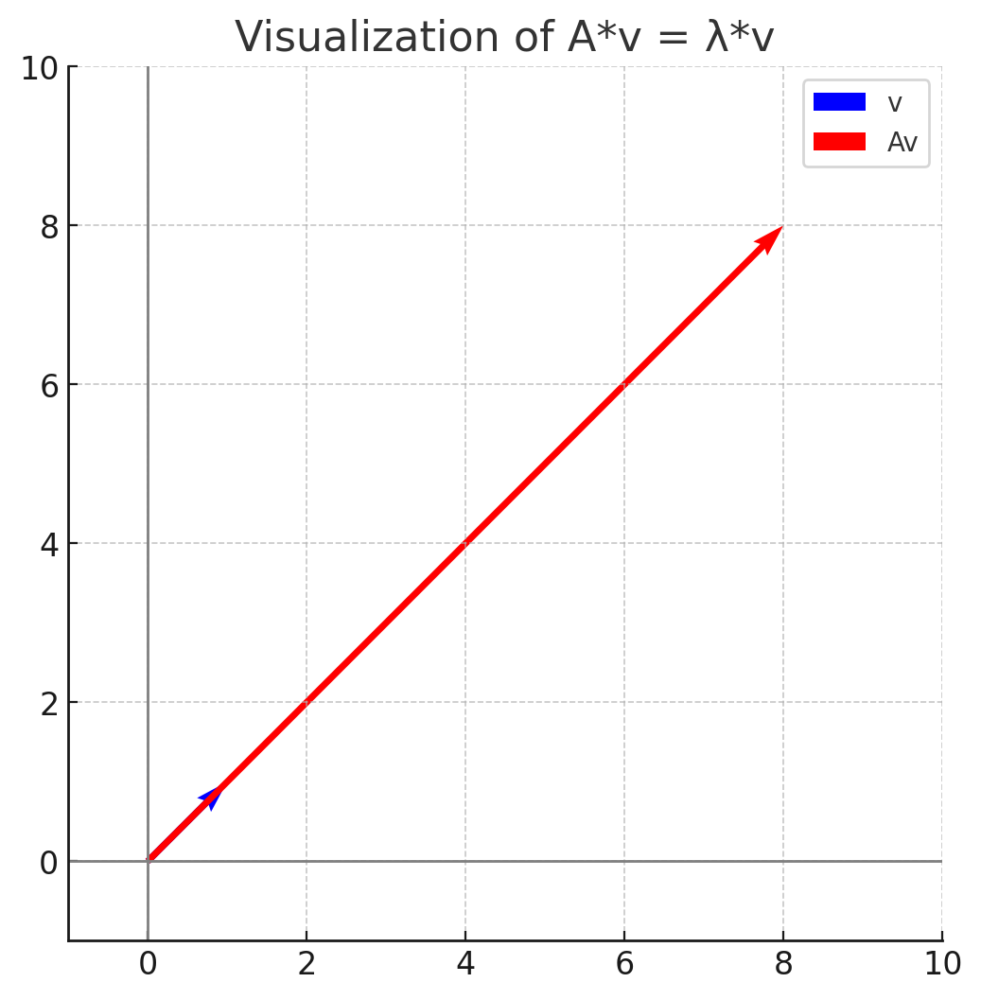
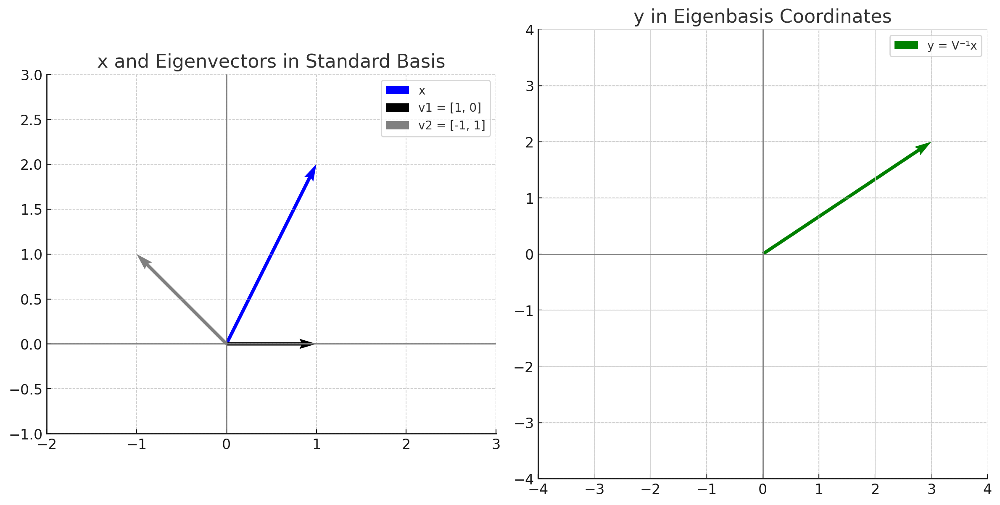
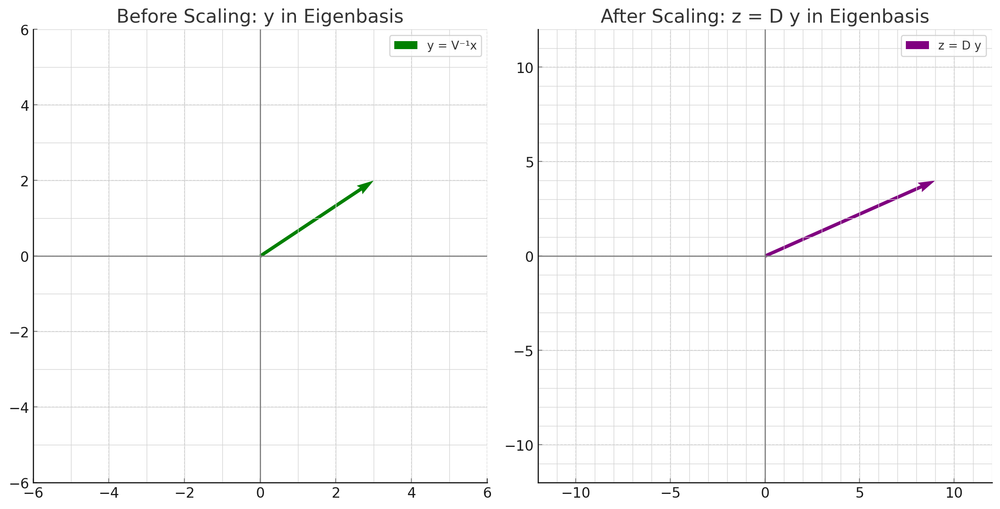
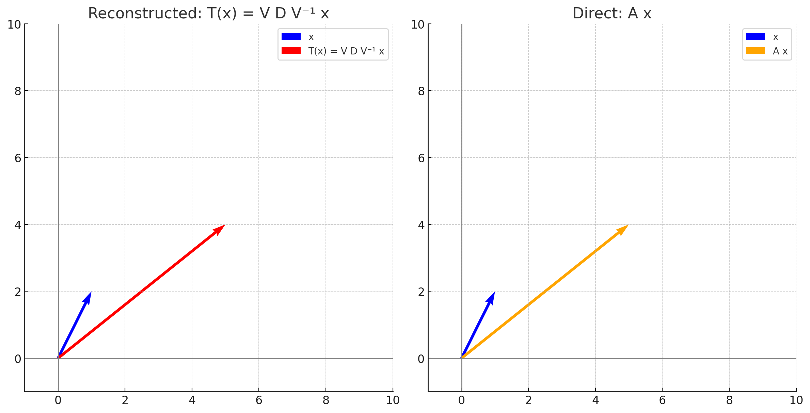
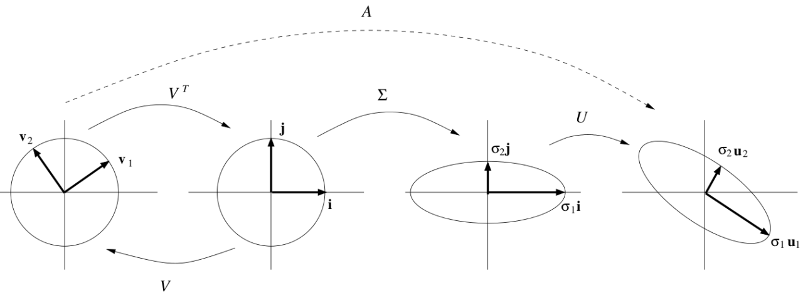

## Eigenvectors and Eigenvalues
- **정의**: 행렬 $A \in \mathbb{R}^{n \times n}$의 고유벡터(eigenvector)와 고유값(eigenvalue)은 다음과 같은 관계를 만족하는 non-zero 벡터 $v \in \mathbb{R}^n$와 스칼라 $\lambda \in \mathbb{R}$이다. 
  
    $$ A v = \lambda v $$

    - 고유벡터는 항상 그에 대응하는 고유값과 함께 정의되는데, 고유벡터가 영벡터라면 어떤 $\lambda$에 대해서도 $A\mathbf{0} = \lambda \mathbf{0}$이므로 의미가 없다.

- **선형 변환의 관점**: 고유벡터는 행렬 $A$에 의해 변환될 때 방향이 바뀌지 않는 벡터이며, 고유값은 이 벡터의 크기가 얼마나 늘어나거나 줄어드는지를 나타낸다.  
  
  $$
  A v = \begin{pmatrix} 2 & 6 \\ 5 & 3 \end{pmatrix} \begin{pmatrix} 1 \\ 1 \end{pmatrix} = \begin{pmatrix} 8 \\ 8 \end{pmatrix} = 8 \begin{pmatrix} 1 \\ 1 \end{pmatrix} = \lambda v 
  $$  

<figure>
  
  <figcaption>행렬 A의 고유벡터 시각화</figcaption>
</figure>

- 고유벡터의 **스칼라 배수**는 여전히 고유벡터이다. 즉, 만약 $v$가 고유벡터라면, $c v$ ($c \in \mathbb{R}$)도 고유벡터이다. 즉, 고유벡터의 span에 속하는 모든 벡터는 고유벡터이다.  
  - 증명:  
    $$ A (c v) = c (A v) = c (\lambda v) = \lambda (c v) $$

- 계산상 이점: 고유벡터를 행렬에 곱할때는, 행렬-벡터 곱셈이 아닌 단순히 스칼라곱으로 계산해 연산 횟수를 줄일 수 있다.  
  - 예:  

$$
\begin{pmatrix} 2 & 6 \\ 5 & 3 \end{pmatrix} \begin{pmatrix} 1 \\ 1 \end{pmatrix}
$$ 

    연산 횟수 6  

$$
8 \begin{pmatrix} 1 \\ 1 \end{pmatrix}
$$  

    연산 횟수 2  

## Characteristic Polynomial 

행렬 $A$의 고유값 $\lambda$에 대해 다음과 같은 관계식이 성립한다.  

$$
\begin{align*}
A v &= \lambda v \\
A v - \lambda v &= 0 \\
(A - \lambda I) v &= 0
\end{align*}
$$  

위 방정식에 대해, 앞서 살펴본 대로 고유값이 존재한다면, 고유벡터 $v$는 영벡터가 아니므로, 선형변환 $A - \lambda I$는 non-trivial solution을 갖는다.   
즉, 행렬 $A - \lambda I$의 열들은 선형 종속이고, 따라서 행렬식이 0이 된다. 즉, 다음과 같은 식을 만족한다.  

$$
\text{det}(A - \lambda I) = 0
$$  

이 식을 **Characteristic Polynomial**이라고 하며, 이 다항식의 근이 바로 행렬 $A$의 고유값이다.

- $A - \lambda I$의 해공간(null space)은 고유값 $\lambda$에 대응하는 고유벡터들의 집합이고, 이를 **eigenspace**라고 한다.
- eigenspace는 영벡터와 고유값 $\lambda$에 대응하는 고유벡터들의 span으로 구성된다.

### Example: Characteristic Polynomial을 이용한 고유값 & 고유벡터 계산  


$$
A = \begin{pmatrix} 2 & 6 \\ 5 & 3 \end{pmatrix}
$$  


$$ 
\begin{align*}  
\text{det}(A - \lambda I) &= \text{det}\left(\begin{pmatrix} 2 - \lambda & 6 \\ 5 & 3 - \lambda \end{pmatrix}\right) \\
&= (2 - \lambda)(3 - \lambda) - 30 \\
&= \lambda^2 - 5\lambda - 24 \\
&= (\lambda - 8)(\lambda + 3) = 0
\end{align*}
$$  

따라서, 고유값은 $\lambda_1 = 8$, $\lambda_2 = -3$이다.  
고유값 $\lambda_1 = 8$에 대응하는 고유벡터는 다음과 같이 계산할 수 있다.  

$$
\begin{align*}  
(A - 8I)v &= 0 \\
\begin{pmatrix} -6 & 6 \\ 5 & -5 \end{pmatrix} \begin{pmatrix} x_1 \\ x_2 \end{pmatrix} &= 0 \\
\end{align*}
$$  

이 방정식의 해는 $x_1 = x_2$이므로, 따라서 고유벡터는 $v_1 = \begin{pmatrix} 1 \\ 1 \end{pmatrix}$이다.  

마찬가지로 고유값 $\lambda_2 = -3$에 대응하는 고유벡터는 다음과 같이 계산할 수 있다.  

$$
\begin{align*}
(A + 3I)v &= 0 \\
\begin{pmatrix} 5 & 6 \\ 5 & 6 \end{pmatrix} \begin{pmatrix} x_1 \\ x_2 \end{pmatrix} &= 0 \\
\end{align*}
$$ 

이 방정식의 해는 $x_1 = -\frac{6}{5} x_2$이므로, 따라서 고유벡터는 $v_2 = \begin{pmatrix} -6 \\ 5 \end{pmatrix}$이다.  

### Example: Finding all Eigenvalues and Eigenvectors  

행렬 $A \in \mathbb{R}^{5 \times 5}$에 대해, 다음과 같은 characteristic polynomial이 주어졌다고 가정하자.  

$$
\text{det}(A - \lambda I) = (\lambda - 2)^3 (\lambda - 5) (\lambda - 8)  
$$  

이 경우, 고유값 $\lambda_1 = 2$의 **대수적 중복도**(algebraic multiplicity)는 3이고, $\lambda_2 = 5$와 $\lambda_3 = 8$의 대수적 중복도는 각각 1이다.

- **대수적 중복도**(algebraic multiplicity): characteristic polynomial에서 특정 고유값에 대한 근의 중복도를 나타낸다.
- **기하적 중복도**(geometric multiplicity): 특정 고유값에 대응하는 eigenspace의 차원이다. 즉, 해당 고유값에 대한 고유벡터의 개수를 나타낸다.
- **대수적 중복도**는 **기하적 중복도**의 상한이다. 즉, 특정 eigenspace의 차원은 해당 고유값의 대수적 중복도보다 작거나 같은 양수이다.
  - eigenvalue가 존재한다면, 그에 대응하는 non-zero eigenvector가 존재하므로, 기하적 중복도는 항상 1 이상이다.

## Null Space  

- **정의**: 행렬 $A \in \mathbb{R}^{m \times n}$의 null space는 다음과 같은 벡터들의 집합이다.  
  
    $$ 
    \text{Null}(A) = \{ x \in \mathbb{R}^n : Ax = 0 \} 
    $$  

    - null space의 벡터 $x$는 행렬 $A$의 모든 행과 수직임 (내적이 0이므로)  

### Rank-Nullity Theorem  

- **정의**: 행렬 $A \in \mathbb{R}^{m \times n}$에 대해, 다음 관계가 성립한다.  

    $$
    \text{rank}(A) + \text{nullity}(A) = n
    $$  

    - 여기서 $\text{rank}(A)$는 행렬 $A$의 열 공간의 dimension, $\text{nullity}(A)$는 null space의 dimension이다.  
    
    - **직교성을 이용한 설명**:  
      - null space의 모든 벡터는 행렬 $A$의 모든 행과 수직이므로, null space $\text{nullity}(A)$는 행 공간 $\text{Row}(A)$의 직교 보완 공간(orthogonal complement)이다.
      - 따라서  

        $$  
        \begin{align*}
        & \text{dim}(\text{Row}(A)) + \text{dim}(\text{nullity}(A)) \\
        &=\text{rank}(A) + \text{nullity}(A)\\
        &=n
        \end{align*}
        $$  

## Diagonalization  

- **정의**: 행렬 $A \in \mathbb{R}^{n \times n}$를 대각화(diagonalization)한다는 것은, 행렬 $A$를 다음과 같은 형태로 표현하는 것을 의미한다.  

    $$ D = V^{-1} A V $$

    - 여기서 $D$는 대각 행렬(diagonal matrix), 즉 대각선 원소만 있고 나머지 원소는 모두 0인 행렬이다.
    - $V$는 역행렬이 존재하는 행렬이어야 한다.
    - 모든 행렬 $A$가 대각화 가능한 것은 아니다.

- **$V$, $D$ 찾기**:  
  - $VD = AV$인 관계를 이용한다. 
  - $V$와 $D$를 다음과 같이 나타낼 수 있다.  

    $$
    V = \begin{pmatrix} v_1 & v_2 & \cdots & v_n \end{pmatrix}, \quad D = \begin{pmatrix} \lambda_1 & 0 & \cdots & 0 \\ 0 & \lambda_2 & \cdots & 0 \\ \vdots & \vdots & \ddots & \vdots \\ 0 & 0 & \cdots & \lambda_n \end{pmatrix}
    $$  

    - 여기서 $v_i$는 행렬 $V$의 열 벡터이고, $\lambda_i$는 행렬 $D$의 대각 원소이다.  
  - 위 식을 전개하면 다음과 같은 관계가 성립한다.  

    $$
    A v_i = \lambda_i v_i
    $$  

    - 즉, $v_i$는 행렬 $A$의 고유벡터이고, $\lambda_i$는 해당 고유벡터에 대응하는 고유값이다.  
  - $V$의 열 벡터는 행렬 $A$의 고유벡터들로 구성되어야 하며, 이들은 서로 선형 독립이어야 한다.(역행렬 $V^{-1}$이 존재하기 위해서)
  - 즉, 행렬 $A$의 대각화 가능성은 다음과 같은 조건을 만족해야 한다.  
    - 행렬 $V$가 역행렬이 존재해야 하므로, 행렬 $A$는 $n$개의 서로 선형 독립인 고유벡터를 가져야 한다.  

## Eigendecomposition  

- **정의**: 대각화 가능한 행렬 $A \in \mathbb{R}^{n \times n}$에 대해, 다음과 같은 형태로 표현하는 것을 eigendecomposition이라고 한다.  

    $$ A = V D V^{-1} $$  

    - 여기서 $V$는 행렬 $A$의 고유벡터들로 구성된 행렬이고, $D$는 행렬 $A$의 고유값들로 구성된 대각 행렬이다.  
  - 즉, eigendecomposition은 행렬을 고유벡터와 고유값으로 분해하는 것이다.  
  - 이때, $V$의 열 벡터는 서로 선형 독립이어야 하며, 따라서 역행렬 $V^{-1}$이 존재해야 한다.  
  - 또한, $D$의 대각 원소는 $A$의 고유값들이다.  

### 선형 변환의 관점 
선형 변환 $T(x) = Ax$를 $T(x) = V(D(V^{-1}x))$로 표현할 수 있다. 이는 다음과 같은 과정으로 나누어 생각할 수 있다. 
  1. **기저 변환**: $V^{-1}x$를 통해 벡터 $x$를 고유벡터의 기저로 변환한다.
  2. **element-wise scaling**: $D$를 통해 각 고유벡터에 대응하는 고유값으로 벡터를 스케일링한다.
  3. **기저 복원**: $V$를 통해 다시 원래의 기저로 변환한다.
  - **예시**: 
$$
A = \begin{pmatrix} 3 & 1 \\ 0 & 2 \end{pmatrix}
$$  

$$
\lambda_1 = 3, \lambda_2 = 2, v_1 = \begin{pmatrix} 1 \\ 0 \end{pmatrix}v_2 = \begin{pmatrix} -1 \\ 1 \end{pmatrix}
$$  

  - 입력값  
  $$
  x = \begin{pmatrix} 1 \\ 2 \end{pmatrix}
  $$  

    1. 기저 변환:  
    $$
    V^{-1}x = \begin{pmatrix} 1 & 1 \\ 0 & 1 \end{pmatrix} \begin{pmatrix} 1 \\ 2 \end{pmatrix} = \begin{pmatrix} 3 \\ 2 \end{pmatrix}
    $$  
    <figure>
      
    </figure>

    3. element-wise scaling:  
    $$
    D(V^{-1}x) = \begin{pmatrix} 3 & 0 \\ 0 & 2 \end{pmatrix} \begin{pmatrix} 3 \\ 2 \end{pmatrix} = \begin{pmatrix} 9 \\ 4 \end{pmatrix}
    $$  
    
    <figure>
      
    </figure>

    4. 기저 복원:  
    $$
    V(D(V^{-1}x)) = \begin{pmatrix} 1 & -1 \\ 0 & 1 \end{pmatrix} \begin{pmatrix} 9 \\ 4 \end{pmatrix} = \begin{pmatrix} 5 \\ 4 \end{pmatrix}$$  
    <figure>
      
    </figure>

### $A^k$를 통한 선형 변환의 반복  

선형 변환 $T(x) = Ax$를 $k$번 반복 적용하는 경우, 다음과 같은 관계가 성립한다.  

$$
\begin{align*}
T^k(x) &= A^k x \\
 &= (V D V^{-1})^k x \\
 &= (V D^k V^{-1})(V D V^{-1})(V D V^{-1}) \cdots (V D V^{-1}) x \\
 &= V D^k V^{-1} x
\end{align*}
$$  

$D^k$는 다음과 같이 쉽게 계산할 수 있다.  

$$
D^k = \begin{pmatrix} \lambda_1^k & 0 & \cdots & 0 \\ 0 & \lambda_2^k & \cdots & 0 \\ \vdots & \vdots & \ddots & \vdots \\ 0 & 0 & \cdots & \lambda_n^k \end{pmatrix}
$$  

따라서 Eigendecomposition을 이용하면, 선형 변환의 반복 적용을 효율적으로 계산할 수 있다.  


## Symmetric Matrices  

- **정의**: 행렬 $A \in \mathbb{R}^{n \times n}$가 대칭 행렬(symmetric matrix)이라면, 다음과 같은 관계가 성립한다.  

    $$ A = A^T $$

- **Theorem**: 만약 행렬 $A$가 대칭 행렬이라면, 서로 다른 고유값에 대응하는 고유벡터는 서로 직교한다.  
  - 증명:  
    - 서로 다른 고유값 $\lambda_1, \lambda_2$에 대응하는 고유벡터 $v_1, v_2$가 있다고 가정하자.  
    - 이때, $A v_1 = \lambda_1 v_1$와 $A v_2 = \lambda_2 v_2$가 성립한다.  
    - 각 식의 양변에 $v_2^T$, $v_1^T$를 곱하면 다음과 같은 관계가 성립한다.  

      $$ v_2^T A v_1 = \lambda_1 v_2^T v_1 $$  
      $$ v_1^T A v_2 = \lambda_2 v_1^T v_2 $$  

    - 대칭 행렬이므로 $(v_2^T A v_1)^T = v_1^T A^T v_2 = v_1^T A v_2$가 성립한다.
    - 따라서, $(v_2^T A v_1)^T = v_1^T A v_2$이므로, 다음과 같은 관계가 성립한다.  

      $$ (\lambda_1 v_2^T v_1)^T = \lambda_2 v_1^T v_2 $$
      $$ \lambda_1 v_1^T v_2 = \lambda_2 v_1^T v_2 $$

    - 만약 $\lambda_1 \neq \lambda_2$라면, $v_1^T v_2 = 0$이므로, $v_1$과 $v_2$는 서로 직교한다.
    - 따라서, 서로 다른 고유값에 대응하는 고유벡터는 서로 직교한다.  

### Spectral Decomposition

행렬 $A$가 $A = P D P^{-1}$ 형태로 대각화 가능하고, $P$의 열이 정규 직교 고유벡터로 구성되며 $D$가 고유값으로 구성된 대각 행렬이라면, $P^{-1} = P^T$이므로 다음과 같은 형태로 표현할 수 있다.  

$$
A = P D P^T 
$$  

outer product expansion을 이용하여 다음과 같이 표현할 수 있다.  

$$
A = \sum_{i=1}^{n} \lambda_i v_i v_i^T
$$  

- 여기서 $v_i$는 행렬 $A$의 고유벡터이고, $\lambda_i$는 해당 고유벡터에 대응하는 고유값.  

각 항 $\lambda_i v_i v_i^T$는 rank 1 행렬로, 각각 입력 벡터 $x$를 $v_i$에 의해 생성된 부분공간으로 투영(projection)하는 투영 행렬이다.  

- **Spectral Theorem**: 대칭 행렬 $A \in \mathbb{R}^{n \times n}$에 대해, 다음과 같은 정리가 성립
  - $A$는 $n$개의 실수 고유값을 가진다
  - 고유값의 대수적 중복도는 기하적 중복도와 같다
  - 다른 고유값에 대응하는 고유벡터는 서로 직교한다
  - 직교 고유벡터로 대각화 가능하다  

## Singular Value Decomposition (SVD)
특이값 분해(Singular Value Decomposition, SVD)는 직사각형 행렬 $A \in \mathbb{R}^{m \times n}$를 다음과 같은 형태로 분해하는 방법이다.  

$$
A = U \Sigma V^T
$$  

$$
A = \begin{pmatrix} u_1 & u_2 & \cdots & u_m \end{pmatrix} \begin{pmatrix} \sigma_1 & 0 & \cdots & 0 \\ 0 & \sigma_2 & \cdots & 0 \\ \vdots & \vdots & \ddots & \vdots \\ 0 & 0 & \cdots & \sigma_n \\ 0 & 0 & \cdots & 0 \end{pmatrix} \begin{pmatrix} v_1^T \\ v_2^T \\ \vdots \\ v_n^T \end{pmatrix}
$$

- $U \in \mathbb{R}^{m \times m}$: $A$의 열공간의 직교 기저를 이루는 직교 행렬
  - $U$의 열 벡터는 $A A^T$의 고유벡터  
- $V \in \mathbb{R}^{n \times n}$: $A$의 행공간의 직교 기저를 이루는 직교 행렬
  - $V$의 열 벡터는 $A^T A$의 고유벡터
- $\Sigma \in \mathbb{R}^{m \times n}$: 대각 행렬로, 대각 원소는 $A$의 특이값(singular values)
  - 특이값은 $A^T A$의 고유값의 제곱근으로 정의되며, $\sigma_i = \sqrt{\lambda_i}$ ($\lambda_i$는 $A^T A$의 고유값)이다.   
  - $A^T A$의 고유값은 항상 0 이상의 실수이고, 따라서 특이값도 항상 0 이상의 실수이다.
    - $x^T (A^T A) x = (Ax)^T A x = \|Ax\|^2 = \lambda \|x\|^2 \geq 0$

- **Outer Product Expansion**: SVD를 이용하여 행렬 $A$를 다음과 같이 표현할 수 있다.  

$$
A = \sum_{i=1}^{r} \sigma_i u_i v_i^T
$$

- **Reduced Form**: 만약 $m \geq n$이고, $A$가 $r$개의 0이 아닌 특이값(singular values)을 가진다면, SVD는 다음과 같이 표현할 수 있다.  

$$
\begin{align*}
A &= \begin{pmatrix} u_1 & u_2 & \cdots & u_m \end{pmatrix} \begin{pmatrix}\sigma_1 & 0 & \cdots & 0 & \cdots & 0 \\ 0 & \sigma_2 & \cdots & 0 & \cdots & 0 \\ \vdots & \vdots & \ddots & \vdots &  & \vdots \\ 0 & 0 & \cdots & \sigma_r & \cdots & 0 \\ \vdots & \vdots & & \vdots & \ddots & \vdots \\ 0 & 0 & \cdots & 0 & \cdots & 0 \end{pmatrix}
\begin{pmatrix} 
v_1^T \\ v_2^T \\ \vdots \\ v_n^T \end{pmatrix}\\
&= \begin{pmatrix} u_1 & u_2 & \cdots & u_r \end{pmatrix} \begin{pmatrix} 
\sigma_1 & 0 & \cdots & 0 \\ 
0 & \sigma_2 & \cdots & 0 \\ 
\vdots & \vdots & \ddots & \vdots \\
0 & 0 & \cdots & \sigma_r 
\end{pmatrix}
\begin{pmatrix} v_1^T \\ v_2^T \\ \vdots \\ v_r^T \end{pmatrix}
\end{align*}
$$

- **Theorem**: $A \in \mathbb{R}^{m \times n}$에 대해, $A^T A$의 고유벡터로 구성된 정규직교기저 $\{v_1, v_2, \ldots, v_n\}$(고유값 $\sigma_1^2, \sigma_2^2, \ldots, \sigma_n^2$)가 주어지고, $A$가 $r$개의 0이 아닌 특이값(singular values, $\sigma_1, \sigma_2, \ldots, \sigma_r$)을 가질 때, $\{A v_1, A v_2, \ldots, A v_r\}$는 $A$의 열공간(column space)의 직교 기저를 이룬다.  
  - 증명:  
    - $i \neq j$인 $v_i, v_j$는 서로 직교하므로, $(A v_i)^T (A v_j) = v_i^T A^T A v_j = \sigma_j^2 v_i^T v_j = 0$, 따라서 $A v_i$와 $A v_j$는 서로 직교한다.
    - $\{A v_1, A v_2, \ldots, A v_n\}$ 벡터들의 길이는 signular value이므로($\because \|A v_i\| = v_i^T A^T A v_i = v_i^T \sigma_i^2 v_i = \sigma_i^2 \|v_i\|^2 = \sigma_i^2$), $1 \leq i \leq r$일때 $A v_i$는 0이 아니고 따라서 $\{A v_1, A v_2, \ldots, A v_r\}$는 선형 독립이다.
    - 또한 $\{A v_1, A v_2, \ldots, A v_r\}$는 $A$의 선형 변환에 의해 생성된 벡터들이므로, $A$의 열공간(column space)에 속한다.
    - $y = Ax$인 임의의 벡터 $y$에 대해
      - $x = c_1 v_1 + c_2 v_2 + \ldots + c_n v_n$로 표현할 수 있으므로, 다음과 같이 쓸 수 있다.   
        
        $$
        \begin{align*}
        y &= A(c_1 v_1 + c_2 v_2 + \ldots + c_n v_n) \\
        &= c_1 A v_1 + c_2 A v_2 + \ldots + c_n A v_n \\
        &= c_1 A v_1 + c_2 A v_2 + \ldots + c_r A v_r + 0 + \ldots + 0 \\
        \end{align*}
        $$

    - 따라서 $y$는 $\{A v_1, A v_2, \ldots, A v_r\}$의 선형 결합으로 표현할 수 있고, $\{A v_1, A v_2, \ldots, A v_r\}$는 서로 선형 독립(직교)이므로, $A$의 열공간(column space)의 기저를 이룬다.
    - 이때 $A$의 열공간이 $r$개의 기저로 span되므로, $A$의 rank는 $r$이다.

- **SVD의 존재성(existence)**: 모든 행렬 $A \in \mathbb{R}^{m \times n}$에 대해, SVD는 항상 존재한다.  
  - 증명:  
    - 위 theorem에서 얻은 $A$ 열공간의 직교 기저 $\{A v_1, A v_2, \ldots, A v_r\}$를 정규화하여, $\{u_1, u_2, \ldots, u_r\}$를 얻는다.
    - 이때, $u_i = \frac{A v_i}{\|A v_i\|}$이므로, 다음과 같은 관계가 성립한다.  

      $$
      A v_i = \|A v_i\| u_i = \sigma_i u_i \quad (1 \leq i \leq r)
      $$

    - $\{u_1, u_2, \ldots, u_r\}$를 확장하여 $\mathbb{R}^m$의 직교 기저 $\{u_1, u_2, \ldots, u_m\}$를 얻을 수 있다.
    - 위 theorem에서 $\mathbb{R}^n$의 직교 기저 $\{v_1, v_2, \ldots, v_n\}$를 얻을 수 있었다.  
    - 따라서 다음과 같은 관계가 성립한다.   

    $$ 
    AV = \begin{pmatrix} A v_1 & A v_2 & \cdots & A v_n \end{pmatrix} = \begin{pmatrix} \sigma_1 u_1 & \sigma_2 u_2 & \cdots & \sigma_r u_r & 0 & \cdots & 0 \end{pmatrix} = U \Sigma
    $$

    - $V$는 정규 직교 행렬이므로, $V^T$는 $V^{-1}$이 되고, 따라서 $U \Sigma V^T = AVV^T = A$가 성립한다.
    - 따라서, 모든 행렬 $A \in \mathbb{R}^{m \times n}$에 대해, SVD는 항상 존재한다.  

### SVD의 기하학적 해석
SVD는 행렬 $A$를 다음과 같은 세 가지 변환으로 해석할 수 있다.
1. **기저 변환**: $V^T$를 통해 입력 벡터 $x$를 $V$의 기저로 변환한다.
2. **스케일링**: $\Sigma$를 통해 각 기저 벡터에 대응하는 특이값으로 벡터를 스케일링한다.
3. **출력 기저로 변환**: $U$를 통해 각 스케일링된 벡터를 다시 출력 공간의 기저로 변환한다.  

<figure>
  
</figure>  

### Applications of SVD 

- **Dimensionality Reduction**: SVD는 데이터의 차원을 축소하는 데 사용된다. $m \times n$ 데이터 행렬 $A$를 $k$개의 특이값만을 사용하여 축소하면, $m \times k + k + n \times k$의 공간만을 사용하여 저장할 수 있다.  

$$
A \approx U_k \Sigma_k V_k^T = \begin{pmatrix} u_1 & u_2 & \cdots & u_k \end{pmatrix} \begin{pmatrix} \sigma_1 & 0 & \cdots & 0 \\ 0 & \sigma_2 & \cdots & 0 \\ \vdots & \vdots & \ddots & \vdots \\ 0 & 0 & \cdots & \sigma_k \end{pmatrix} \begin{pmatrix} v_1^T \\ v_2^T \\ \vdots \\ v_k^T \end{pmatrix}
$$  

```python
from skimage import data
from skimage.color import rgb2gray
from skimage.transform import resize
import matplotlib.pyplot as plt

# 이미지 로드 및 전처리 (흑백 + 크기 축소)
original_image = rgb2gray(data.astronaut())  # RGB → 그레이스케일
original_image = resize(original_image, (128, 128), anti_aliasing=True)  # 속도/선명도 균형

# SVD 분해
U, S, VT = np.linalg.svd(original_image, full_matrices=False)

# 다양한 rank 수준에서 복원
ranks = [5, 20, 50, 100]
reconstructed_images = []

for k in ranks:
    S_k = np.diag(S[:k])
    U_k = U[:, :k]
    VT_k = VT[:k, :]
    A_k = U_k @ S_k @ VT_k
    reconstructed_images.append(A_k)

# 시각화
fig, axes = plt.subplots(1, len(ranks) + 1, figsize=(15, 4))
axes[0].imshow(original_image, cmap='gray')
axes[0].set_title("Original")
axes[0].axis('off')

for ax, img, k in zip(axes[1:], reconstructed_images, ranks):
    ax.imshow(img, cmap='gray')
    ax.set_title(f"Rank-{k}")
    ax.axis('off')

plt.tight_layout()
plt.show()
```

<figure>
  
  <figcaption>k값에 따른 이미지 축소 비교</figcaption>
</figure>  

- **Homogeneous Least Squares Problem**: $Ax = 0$의 정확한 해가 존재하지 않을때, 가장 작은 제곱 오차를 갖는 해를 찾는 문제  

$$
\min_{\|x\|=1} \|Ax\|^2
$$  

이 문제의 해는 SVD를 통해 얻은 $V$의 마지막 열 벡터에 해당한다. 즉, $x = V_n$이 된다.  

- 증명:  

목적함수는 다음과 같이 쓸 수 있다.  

$$
\min_{\|x\|=1} \|Ax\|^2 = \min_{\|x\|=1} x^T A^T A x \quad (\text{subject to } \|x\|=1)
$$  

목적함수로부터 다음과 같은 Lagrangian을 정의할 수 있다.  

$$
\mathcal{L}(x, \lambda) = x^T A^T A x - \lambda (x^T x - 1)
$$

도함수를 계산하면,  

$$
\frac{\partial \mathcal{L}}{\partial x} = 2 A^T A x - 2 \lambda x = 0
$$  

즉, lagrange multiplier $\lambda$는 $A^T A$의 고유값이고, 목적함수값도 $x^T A^T A x = \lambda$가 된다.  
따라서 목적 함수를 최소화하려면, $\lambda$를 최소화하는 고유벡터 $x$를 찾아야 하고, 이는 $V$의 마지막 열 벡터에 해당한다.