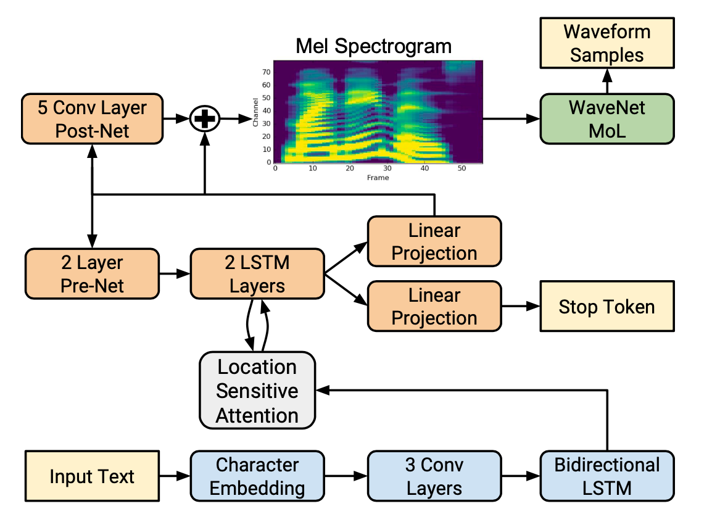

## Abstract  
이 논문은 Tacotron2라는 TTS 시스템을 제안함. Tacotron2는 두 개의 주요 구성 요소로 이루어져 있음. 첫 번째는 문자 임베딩을 mel-spectrogram으로 변환하는 sequence-to-sequence 모델이고, 두 번째는 mel-spectrogram을 음성 파형으로 변환하는 WaveNet vocoder임.   
높은 수준의 음성 합성 성능을 달성하였고, ablation study를 통해 Tacotron2의 설계 선택의 효과를 검증함. 기존의 언어학적 특징, F0, 길이 정보 등 대신 간단한 mel-spectrogram만으로도 WaveNet이 효과적으로 작동함을 입증함.

## Introduction
TTS는 자연스러운 인간 음성을 생성하는 기술. 기존 접근 방식은 크게 두 가지로 나뉨:  
1. **Concatenative Synthesis**: 미리 녹음된 음성 단위를 연결하여 음성을 생성하는 방식.
2. **Statistical Parametric Synthesis**: HMM, DNN 등을 사용하여 음성 특성의 시퀀스를 생성하여 그를 기반으로 vocoder가 음성을 합성하는 방식.  

WaveNet은 raw audio 파형을 직점 생성하는 모델로, 기존 방법들보다 자연스러운 음성을 생성할 수 있음. 그러나 WaveNet은 입력으로 사용할 언어학/음향적 특성을 필요로 하며, 이는 복잡하고 전문적인 지식이 필요함.  
기존 Tacotron은 문자 시퀀스를 mel-spectrogram으로 변환하는 모델로, 언어학적 전처리 없이도 음성합성이 가능함, 하지만 WaveNet 만큼의 자연스러운 음성을 생성하지 못함.  
Tacotron2는 이러한 문제를 해결하기 위해, 문자 시퀀스를 mel-spectogram으로 변환하는 sequence-to-sequence 모델과 mel-spectrogram을 음성 파형으로 변환하는 WaveNet vocoder를 결합함.  

## Model Architecture  
<figure>
  
  <figcaption>Tacotron2 Architecture</figcaption>
</figure>  

Tacotron2는 크게 두 부분으로 나뉨:  
1. sequence-to-sequence 모델: 문자 시퀀스를 mel-spectrogram 시퀀스로 변환
2. WaveNet vocoder: mel-spectrogram 시퀀스를 음성 파형으로 변환  

### Intermediate Feature Representation  
Tacotron2의 모델 구조는 텍스트와 오디오 사이에 mel-spectrogram을 중간 표현으로 사용함.  

이 mel-spectrogram은 음성의 주파수 성분을 나타내는 feature로, 사람의 청각 구조에 맞춰 저주파를 강조한 스펙트로그램임.  

mel-spectrogram은 오디오를 STFT(Short-Time Fourier Transform)로 선형 스펙트로그램으로 변환한 후, mel 필터뱅크를 적용하여 mel 스케일로 변환하고, 로그 스케일로 압축, 너무 작은 값은 0.01로 클리핑하여 계산을 안정화함.  

### Spectrogram Prediction Network
1. 입력: 문자 시퀀스에 대해, 각 문자를 512차원 문자 임베딩으로 변환
2. **Encoder**: 
   - 3층 CNN (각 층은 512개의 필터, 5x1 커널 크기) -> `시퀀스 길이 x 512`
     - 문자 시퀀스의 n-gram 정보를 추출
     - ReLU 활성화 함수 / 배치 정규화 적용
   - Bidirectional LSTM (양방향 256차원 LSTM) -> `시퀀스 길이 x 512`
     - CNN의 출력을 시간적으로 확장
     - 양방향 LSTM을 사용하여 양쪽 문맥 정보를 모두 활용
3. **Location Sensitive Attention**:
   - 일반적인 어텐션 매커니즘이 아닌, 이전 계산의 위치 정보를 활용하는 어텐션  

   $$
   \text{score}(s_t, h_j, f_j) = v^T \tanh(W_s s_t + W_h h_j + W_f f_j)
   $$  
   
   - 여기서 $s_t$는 현재 디코더 상태, $h_j$는 인코더 $j$번째 출력, $f_j$는 이전까지의 어텐션 가중치 누적을 convolution으로 처리한 값
   - 시간적 특징을 활용해, 이전까지의 출력들이 어떤 위치에 집중했는지 반영

4. **Decoder**:
   - Pre-net: 이전 타임스텝의 예측 mel-spectrogram을 2층의 fully connected layer로 처리하여 256차원으로 변환
   - LSTM: 2층의 LSTM을 사용해 Pre-net의 출력과 어텐션 컨텍스트 벡터를 결합하여 hidden state를 생성
   - Linear Projection: LSTM의 출력을 다시 context 벡터와 결합하여 mel-spectrogram의 예측값을 생성
   - Stop token predictor: LSTM과 context 벡터를 사용하여 stop token을 예측 (음성 합성이 끝났는지 여부)
   - Post-net: 예측된 mel-spectrogram에 5층의 CNN을 적용하여 보정된 mel-spectrogram을 생성

### WaveNet Vocoder
디코더에서 예측된 mel-spectrogram을 입력으로 받아 음성 파형을 생성하는 WaveNet vocoder.  

1. Dialated Causal Convolution: 이전까지의 생성 waveform을 기반으로, 현재 생성할 waveform의 값을 예측
    - 30개의 1D Convolution 레이어를 사용
    - Causal: 현재 시점의 출력은 이전 시점의 입력에만 의존
    - Dilated: 입력 샘플 사이 간격을 늘려, 더 넓은 컨텍스트를 고려
    - dilation pattern: 1, 2, 4, 8, 16, 32, 64, 128, 256, 512
    - 위 구조를 3번 반복

2. Conditioning Stack: mel-spectrogram은 1초에 80개 정도의 프레임, 하지만 오디오 샘플은 1초에 24000개 정도의 샘플이 필요함.  
   - 2개의 Transposed Convolution 레이어를 사용하여 mel-spectrogram을 24000Hz로 upsample

3. Output Layer: Mixture of Logistic Distributions (MoL)로, 각 샘플에 대해 10개의 로지스틱 분포를 사용하여 음성 파형의 확률 분포를 모델링
   - 실제 정답값의 확률의 negative log likelihood를 손실 함수로 사용

## Experiments & Results
### Training Setup
- Tacotron과 WaveNet은 각각 독립적으로 학습
- Tacotron:
  - Teacher Forcing: 실제 mel-spectrogram을 다음 입력으로 사용
  - Optimizer: Adam
  - Learning Rate: $10^{-3}$ to $10^{-5}$ (exponential decay)
  - $L_2$ 정규화 사용
- WaveNet:
  - Ground Truth 정렬된 mel-spectrogram을 입력으로 사용
  - Optimizer: Adam
  - Learning Rate: $10^{-4}$
  - EMA 사용(Exponential Moving Average, decay=0.9999)
  - Target Waveform은 127.5로 정규화해 훈련 안정화

### Evaluation
- 평가 metric: MOS (Mean Opinion Score)
  - 최소 8명의 평가자가 한 문장의 음성에 대해 1~5점으로 평가
  - 총 100개 문장

| 시스템                         | MOS             |
| ------------------------------ | --------------- |
| Parametric TTS                 | 3.49 ± 0.10     |
| Tacotron + Griffin-Lim         | 4.00 ± 0.09     |
| Concatenative TTS              | 4.17 ± 0.09     |
| WaveNet (Linguistic input)     | 4.34 ± 0.05     |
| **Tacotron 2 (mel + WaveNet)** | **4.53 ± 0.07** |
| Ground truth (녹음 음성)       | 4.58 ± 0.05     |

Ground truth와 비교했을 때, Tacotron2는 매우 자연스러운 음성을 생성함.  

- 추가 실험: 실제 음성과 Tacotron2의 출력 비교 실험
  - 평균 점수가 0.27 ± 0.15, 소폭으로 실제 음성을 선호하는 경향
  - 발음 실수와 부자연스러운 강세에 대한 문제 제기됨

### Ablation Study  

1. Predicted vs. Ground Truth Features

| 훈련 \ 합성  | Predicted         | Ground Truth  |
| ------------ | ----------------- | ------------- |
| Predicted    | **4.526 ± 0.066** | 4.449 ± 0.060 |
| Ground Truth | 4.362 ± 0.066     | 4.522 ± 0.055 |

- 훈련과 합성에 모두 예측된 mel-spectrogram을 사용한 경우가 가장 높은 점수를 기록하고, 모두 ground truth를 사용한 경우는 두 번째로 높은 점수를 기록함.
- 훈련 데이터와 합성 데이터가 일관적일때 가장 좋은 성능을 보임.

2. Linear Spectrograms

| 시스템                           | MOS               |
| -------------------------------- | ----------------- |
| Tacotron2 (Linear + Griffin-Lim) | 3.944 ± 0.091     |
| Tacotron2 (Linear + WaveNet)     | 4.510 ± 0.054     |
| Tacotron2 (Mel + WaveNet)        | **4.526 ± 0.066** |

- Linear spectrogram을 사용한 경우는 mel-spectrogram을 사용한 경우보다 낮은 점수를 기록함.

3. Post-net 제거

| 설정        | MOS      |
| ----------- | -------- |
| 없음        | 4.43     |
| 있음 (기본) | **4.53** |

4. WaveNet 축소

| 레이어 수          | dilation 패턴         | receptive field          | MOS (±95% CI)     |
| ------------------ | --------------------- | ------------------------ | ----------------- |
| **30**             | 3 cycle × 10 (1\~512) | 6,139 samples (약 256ms) | **4.526 ± 0.066** |
| 24                 | 4 cycle × 6           | 505 samples (약 21.0ms)  | 4.547 ± 0.056     |
| 12                 | 2 cycle × 6           | 253 samples (약 10.5ms)  | 4.481 ± 0.059     |
| 30 (dilation 없이) | 30개 모두 dilation=1  | 61 samples (약 2.5ms)    | **3.930 ± 0.076** |

- WaveNet을 경량화해도 성능이 크게 저하되지 않음을 확인함.
- dialation이 전혀 없는 경우는 성능이 크게 저하됨.

## Conclusion
Tacotron 2는 텍스트를 입력으로 받아 멜 스펙트로그램을 예측하고, 이를 WaveNet vocoder에 입력해 고품질 오디오를 생성하는 완전한 엔드투엔드 TTS 시스템이다. 이 구조는 기존의 복잡한 언어학적 전처리 없이도 자연스러운 음성을 합성할 수 있으며, WaveNet은 멜 스펙트로그램 하나만으로도 사람 수준에 가까운 소리를 만들어낸다. 실험 결과, Tacotron 2는 MOS 기준으로 실제 음성에 근접한 점수를 기록했고, 구성 요소 분석을 통해 성능에 영향을 주는 설계를 정량적으로 검증하였다. 이로써 Tacotron 2는 TTS 시스템의 단순화와 고품질 음성 합성을 동시에 가능하게 하는 모델임을 입증했다.