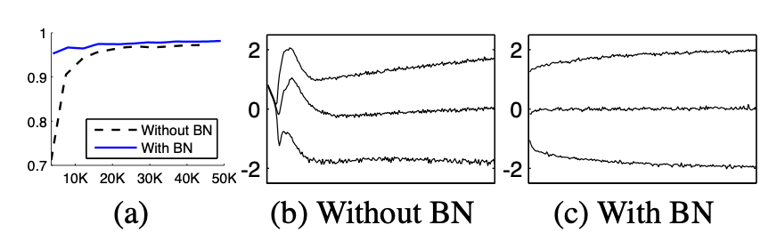
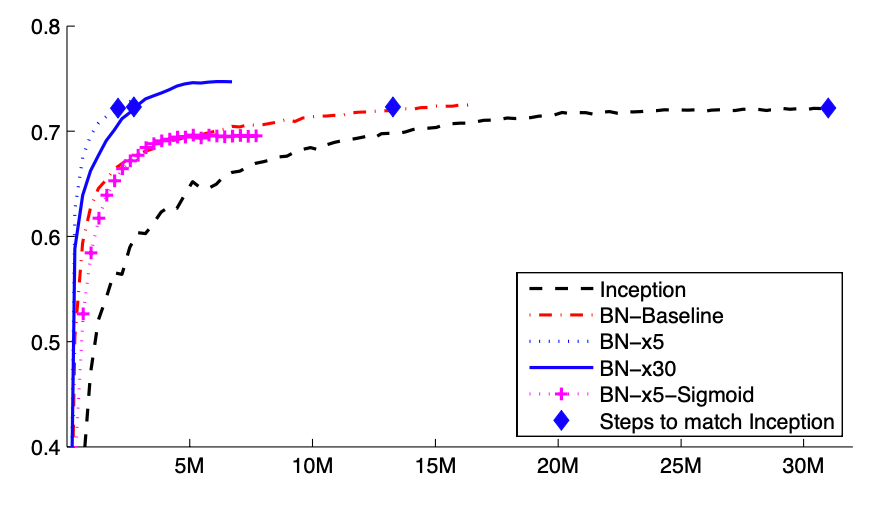

## Introduction
심층 신경망(Deep Neural Networks, DNN)의 학습의 어려움은 각 층의 입력 분포가 학습 도중 계속 변하기 때문임. 이를 **Internal Covariate Shift**라고 하며, 이는 학습 속도를 저하시킴.  

$$
\ell = F_2(F_1(u, \Theta_1), \Theta_2)
$$  

위 식에서, $F_2$의 입력 $x = F_1(u, \Theta_1)$은 학습이 진행되며 $\Theta_1$이 업데이트됨에 따라 분포가 변함. 이로 인해 매 학습 단계마다 $F_2$가 새로운 분포에 적응해야 함. 이런 변화는 다음 층이 매번 새로운 분포에 적응해야 하므로, 높은 학습률을 사용하기 어렵고, 학습이 느려짐.  
특히, sigmoid, tanh 등의 activation 함수는 입력 분포가 변할 때 출력이 saturate되어 gradient가 거의 0이 되는 문제가 발생함.(Vanishing Gradient Problem)  
이 논문에서는 이러한 문제를 해결하기 위해 **Batch Normalization**(배치 정규화) 기법을 제안함. 배치 정규화는 미니배치 단위로 각 층의 입력을 정규화하여 Internal Covariate Shift를 줄이고, 학습 속도를 크게 향상시킴.  

$$
\hat{x} = \frac{x - \mu_B}{\sqrt{\sigma_B^2 + \epsilon}}, \quad y = \gamma \hat{x} + \beta
$$  

- $\mu_B, \sigma_B^2$: 미니배치 $B$의 평균과 분산
- $\epsilon$: 작은 상수로, 분모가 0이 되는 것을 방지
- $\gamma, \beta$: 학습 가능한 파라미터(표현력 유지)  

## Towards Reducing Internal Covariate Shift

Internal Covariate Shift는 네트워크 파라미터가 학습 중 업데이트됨에 따라 각 층의 입력 분포가 계속 바뀌는 현상으로, 이 현상을 줄이면 학습 속도를 높일 수 있음. 따라서 각 층의 입력 분포를 고정하는 방법이 필요함.

기존 연구에서는 입력 데이터를 정규화하거나 whitening하는 방식이 사용되었지만, 네트워크 내부의 각 층의 입력값(activation)을 정규화하는 방법은 제한적이었음. 또한 기존 방식들은 정규화를 학습과 별도로 수행하거나, 간헐적으로 적용하였으며, 이는 다음과 같은 문제가 있음.

예를 들어, 어떤 층의 입력을 $x = u + b$라 할 때, 평균 정규화를 적용하면:

$$
\hat{x} = x - \mathbb{E}[x] = u + b - \mathbb{E}[u + b] = u + b - \mathbb{E}[u] - b = u - \mathbb{E}[u]
$$

이 경우 정규화된 출력 $\hat{x}$는 $b$에 의존하지 않게 되어, 학습 과정에서 $b \leftarrow b + \Delta b$로 파라미터를 업데이트하더라도 출력은 바뀌지 않음. 그 결과 loss 또한 변화하지 않아, 학습이 무력화되고 파라미터 $b$만 계속 커지는 현상이 발생할 수 있음.

따라서 정규화는 반드시 네트워크 내부 연산으로 포함되어야 하며, 학습 흐름과 통합되어야 함. 즉, 정규화 연산도 미분 가능한 구조로 설계되어야 함.

정규화를 일반화된 함수 형태로 나타내면 다음과 같음:

$$
\hat{x} = \text{Norm}(x, X)
$$

여기서 $x$는 현재 샘플의 출력, $X$는 하나의 뉴런 또는 하나의 activation에 대해, 미니배치에 포함된 모든 샘플들이 출력한 값들의 집합을 의미함. 정규화 연산이 학습 가능한 구조가 되기 위해선 다음 두 미분 항을 모두 고려해야 함:

$$
\frac{\partial \hat{x}}{\partial x}, \quad \frac{\partial \hat{x}}{\partial X}
$$

즉, 정규화 함수 $\text{Norm}$은 입력 $x$뿐 아니라, 전체 배치 $X$에 대해 미분 가능해야 함. 기존 방법론들은 주로 $x$에 대해서만 미분을 적용하고, $X$ 전체에 대한 의존성은 무시하였기 때문에 gradient가 제대로 전달되지 않아 학습이 불안정해질 수 있음.

또한 whitening 기법은 이론적으로는 입력의 분포를 평균 0, 단위 분산으로 만들고 변수 간 상관관계도 제거하지만, 다음과 같은 실질적 어려움이 있음:
- 공분산 행렬 $\text{Cov}[x]$ 계산과 역제곱근 연산이 필요함
- 계산 복잡도가 높고 ($O(d^3)$), 역전파도 어려움
- 배치 크기가 작을 경우 공분산 행렬이 특이(singular)해져 정칙화가 필요함

이러한 이유로 whitening은 실전 딥러닝 모델에 적용하기 어려움.

또 다른 기존 방식에서는 각 샘플 단위 또는 위치별로 정규화를 수행하였으나, 이 경우 전체 입력 간의 절대값 스케일 정보가 손실되어 네트워크의 표현력을 제한하게 됨. 특히 convolutional layer의 경우, 공간적 일관성까지 해칠 수 있음.

따라서 Internal Covariate Shift를 효과적으로 줄이기 위해선 정규화가 네트워크 내부에 통합되어, 학습 가능한 구조로 설계되어야 하며, 전체 배치에 대한 의존성과 gradient 흐름을 고려한 정규화 방식이 필요함.

## Normalization via Mini-Batch Statistics

Whitening은 Internal Covariate Shift를 줄이는 데 효과적이지만, 계산 비용과 역전파의 어려움 때문에 실제 딥러닝 학습에서는 적용하기 어려움. 이에 따라 저자들은 Whitening을 단순화하고, 미니배치 통계량만을 이용해 각 뉴런의 출력을 정규화하는 방법을 제안함.

이 방식은 whitening과 달리 차원 간의 상관관계를 제거하지 않고, 각 차원을 독립적으로 정규화함:

$$
\hat{x}^{(k)} = \frac{x^{(k)} - \mathbb{E}[x^{(k)}]}{\sqrt{\text{Var}[x^{(k)}] + \epsilon}}
$$  

$k$번째 뉴런의 출력 $x^{(k)}$에 대해, 미니배치 내에서 평균 $\mathbb{E}[x^{(k)}]$과 분산 $\text{Var}[x^{(k)}]$을 계산하여 정규화함. 여기서 $\epsilon$은 수치적 안정성을 위한 작은 상수로, 분모가 0이 되는 것을 방지함.

또한, BN은 정규화 후 표현력을 유지하기 위해 학습 가능한 스케일과 시프트 파라미터를 도입함:

$$
y^{(k)} = \gamma^{(k)} \hat{x}^{(k)} + \beta^{(k)}
$$

이로써 정규화는 네트워크 구조 안에서 미분 가능하게 작동하고, 학습 중에도 안정적인 분포를 유지하게 됨.

### Training and Inference with Batch-Normalized Networks

BN을 적용하기 위해서는 네트워크의 특정 activation $x^{(k)}$에 대해 Batch Normalizing Transform을 삽입함. 이 연산은 학습 가능한 파라미터 $\gamma^{(k)}$, $\beta^{(k)}$를 포함하며, 다음과 같이 구성됨:

1. 미니배치 $B = \{x_1, ..., x_m\}$에 대해 평균과 분산 계산:

$$
\mu_B = \frac{1}{m} \sum_{i=1}^m x_i, \quad
\sigma_B^2 = \frac{1}{m} \sum_{i=1}^m (x_i - \mu_B)^2
$$

2. 정규화 및 스케일-시프트 적용:

$$
\hat{x}_i = \frac{x_i - \mu_B}{\sqrt{\sigma_B^2 + \epsilon}}, \quad
y_i = \gamma \hat{x}_i + \beta
$$

학습 중에는 위와 같은 미니배치 통계를 사용하여 정규화함. 이 정규화는 각 샘플의 출력이 같은 미니배치 내 다른 샘플의 값에도 영향을 받는다는 특징을 가짐. 따라서 정규화는 deterministic하지 않으며, 일종의 노이즈 또는 regularization 효과도 발생함.

추론 시에는 미니배치가 존재하지 않으므로, 학습 중 누적된 평균과 분산(예: moving average)을 사용하여 정규화를 수행함:

$$
\hat{x} = \frac{x - \mathbb{E}[x]}{\sqrt{\text{Var}[x] + \epsilon}}
$$

이로써 추론 단계에서는 출력이 입력에만 의존하는 순차적(deterministic) 연산이 되며, 배치 크기에 관계없이 안정적인 동작을 보장함.  

#### Algorithm : Training a Batch-Normalized Network

입력:  
- 신경망 $N$ (학습 가능한 파라미터 $\Theta$ 포함)  
- 정규화를 적용할 activation들의 집합 $\{x^{(k)}\}_{k=1}^{K}$

출력:  
- 추론에 사용 가능한 batch-normalized 네트워크 $N^\text{inf}_\text{BN}$

절차:

1. 초기 네트워크 $N$을 training용 네트워크 $N^\text{tr}_\text{BN}$으로 복사함

2. 각 정규화 대상 activation $x^{(k)}$에 대해 다음을 수행:

   a. Batch Normalization Transform $y^{(k)} = \text{BN}_{\gamma^{(k)}, \beta^{(k)}}(x^{(k)})$를 삽입함  
   b. 기존에 $x^{(k)}$를 입력으로 사용하던 레이어가 이제 $y^{(k)}$를 입력으로 받도록 수정함

3. 전체 네트워크는 파라미터 $\Theta$와 $\{\gamma^{(k)}, \beta^{(k)}\}_{k=1}^{K}$를 포함하여 학습됨

4. 학습이 완료되면, $N^\text{tr}_\text{BN}$을 추론용 네트워크 $N^\text{inf}_\text{BN}$으로 복사함

5. 추론을 위한 준비로, 각 BN 레이어에 대해 다음을 수행:

   a. 여러 미니배치를 통해 $\mu_B$, $\sigma^2_B$를 계산하고 평균을 저장하여 전체 기대값 추정치를 얻음:

   $$
   \mathbb{E}[x] \leftarrow \mathbb{E}_B[\mu_B], \quad \text{Var}[x] \leftarrow \frac{m}{m - 1} \mathbb{E}_B[\sigma^2_B]
   $$

   b. 학습 중 사용했던 BN 연산 $y = \gamma \cdot \hat{x} + \beta$를  
   추론 시 사용할 고정된 선형 변환으로 다음과 같이 대체함:

   $$
   y = \frac{\gamma}{\sqrt{\text{Var}[x] + \epsilon}} \cdot x + \left( \beta - \frac{\gamma \cdot \mathbb{E}[x]}{\sqrt{\text{Var}[x] + \epsilon}} \right)
   $$

   즉, BN 연산 전체를 하나의 affine transform으로 바꿈.

6. 이제 $N^\text{inf}_\text{BN}$은 입력 $x$에 대해 deterministic한 추론 결과를 출력할 수 있음

### Batch-Normalized Convolutional Networks

Batch Normalization은 완전연결층뿐 아니라 convolutional layer에도 적용 가능함.  
일반적인 합성곱 연산은 다음과 같이 구성됨:

$$
z = g(Wu + b)
$$

여기서 $g$는 비선형 함수 (예: ReLU), $u$는 입력, $W$는 필터, $b$는 편향임.

BN은 이 구조에서 비선형 함수 이전, 즉 $z = Wu + b$에 대해 적용함.  
입력 $u$를 정규화하지 않고 $z$를 정규화하는 이유는, $u$는 이전 층의 비선형 결과이므로 그 분포가 더 복잡하고 비선형적이기 때문임. 반면 $z$는 선형 변환 결과이므로 Gaussian 형태에 가까워 정규화가 더 안정적임.

BN을 적용하면 다음과 같은 변형이 이루어짐:

$$
z = g(\text{BN}(Wu))
$$

이때 BN은 $z$의 각 차원에 대해 독립적으로 평균과 분산을 계산하고 정규화함.  
편향 $b$는 정규화에서 평균을 빼는 연산에 의해 소거되므로, BN이 포함된 구조에서는 굳이 $b$를 따로 둘 필요가 없음. 대신 BN의 학습 파라미터 $\beta$가 그 역할을 대체함.

합성곱 계층에서는 입력이 4차원 텐서로 주어짐 (배치 크기, 채널 수, 높이, 너비).  
BN은 각 채널별로 정규화를 수행하며, 이를 위해 같은 채널의 모든 위치와 모든 배치 샘플을 모아 평균과 분산을 계산함.  
예를 들어, 배치 크기가 $m$, feature map의 크기가 $p \times q$일 경우, 각 채널에 대해 $m \cdot p \cdot q$개의 값이 정규화에 사용됨.

이를 통해 convolution 연산의 공간적 일관성을 유지한 채 정규화를 적용할 수 있으며, 채널별로 하나의 $\gamma^{(k)}$, $\beta^{(k)}$를 학습함.

추론 시에는 학습 중 저장된 전체 평균과 분산을 사용하므로, convolution된 feature map의 각 위치에 대해 동일한 정규화 연산이 적용됨.

결과적으로, Batch Normalization은 convolutional layer에서도 동일한 원리로 작동하지만, 통계량 계산은 공간 위치와 배치 차원을 모두 포함하여 수행된다는 점에서 완전연결층과의 차이가 있음.
  

### Batch Normalization enables higher learning rates

딥 뉴럴 네트워크는 학습률(learning rate)이 너무 크면 종종 gradient 폭주나 gradient 소실 문제로 인해 학습이 불안정해지거나 발산함. 특히, 활성함수의 비선형 구간(saturation region)에 입력이 들어가면 gradient가 0에 가까워져 학습이 정지되는 경우도 있음.

Batch Normalization은 이러한 문제를 완화하여 **더 높은 학습률을 안정적으로 사용할 수 있게 만듦**. 그 이유는 다음과 같음:

1. 정규화를 통해 각 층의 입력 분포를 안정화하므로, 파라미터가 크게 변해도 출력이 갑자기 바뀌지 않음.
2. 정규화는 활성함수가 비선형의 saturation 영역에 진입하지 않도록 도와줌.
3. 정규화된 입력에 대해 gradient가 더 잘 흐르며, loss landscape이 더 평탄해져 큰 스텝으로도 안정적으로 수렴 가능함.

또한 BN은 레이어의 출력이 파라미터의 크기에 덜 민감해지게 만듦. 예를 들어, BN은 다음을 만족함:

$$
\text{BN}(aWu) = \text{BN}(Wu)
$$

이 식은 BN이 weight의 스케일링에 대해 불변함을 나타냄. 즉, weight가 커져도 BN 이후의 출력은 같거나 비슷하므로, 학습 중 파라미터가 커져도 gradient가 안정적으로 흐를 수 있음.

BN을 적용하면 레이어의 Jacobian(gradient 전달 행렬)의 singular value가 1에 가까워질 가능성이 높아짐. 이는 gradient 소실이나 폭주 없이 학습이 더 잘 되는 조건 중 하나로 알려져 있음. 논문에서는 다음과 같은 단순화된 해석을 제시함:

- 두 개의 연속된 BN 레이어가 있다고 가정
- 정규화된 입력과 출력이 각각 평균 0, 분산 1을 유지하며 서로 uncorrelated하다고 가정
- 이 경우, 선형 근사 $z = Jx$에 대해 $JJ^T = I$가 성립함

결과적으로, BN은 큰 학습률에도 불구하고 안정적으로 학습이 가능하게 하고, 빠른 수렴을 유도함.

### Batch Normalization regularizes the model

Batch Normalization은 Internal Covariate Shift를 줄이기 위한 목적으로 설계되었지만, 실제로는 regularization 효과도 함께 나타남.

BN은 학습 시 각 샘플의 출력이 같은 미니배치에 있는 다른 샘플들에 의해 영향을 받는 구조임.  
즉, 하나의 샘플을 정규화할 때 사용되는 평균과 분산은 배치 전체의 통계에 기반하므로, 모델은 항상 약간의 확률적 변동성 하에서 학습하게 됨.

이러한 배치 기반 정규화는 다음과 같은 효과를 가짐:

- 동일한 샘플이라도 각 학습 스텝마다 정규화된 값이 조금씩 달라짐
- 이는 모델이 과적합되기 어렵게 만들고, 일반화 성능을 향상시킴
- 일종의 노이즈 주입 효과가 있으며, 이는 Dropout과 유사한 작용을 함

실험적으로 BN을 사용하는 네트워크는 Dropout 없이도 좋은 일반화 성능을 보이는 경우가 많았음.  
BN을 적용한 네트워크에서는 Dropout을 제거하거나 그 비율을 낮추는 것이 오히려 성능을 향상시키기도 함.

따라서 BN은 입력 분포를 안정화하는 역할뿐 아니라, 명시적인 정규화 기법 없이도 모델의 일반화 능력을 높이는 암묵적 정규화 기법으로 작동함.

## Experiments

BN의 효과를 검증하기 위해 저자들은 간단한 MNIST 실험부터 복잡한 ImageNet 분류까지 다양한 실험을 수행함.  
실험 목적은 다음과 같음:

- Internal Covariate Shift가 실제로 학습에 방해가 되는지 확인
- Batch Normalization이 학습 속도와 정확도에 어떤 영향을 주는지 평가
- BN이 Dropout 등 기존 regularization 기법을 대체하거나 보완할 수 있는지 관찰

### Activations over time
<figure>

<figcaption>Activations over time</figcaption>
</figure>

MNIST 데이터셋을 사용해 작은 fully-connected 네트워크를 실험함.  
네트워크는 3개의 은닉층을 가지며, 각 층에는 sigmoid activation이 사용됨.  
하나의 비교군에는 BN을 각 층에 적용하고, 다른 하나는 BN 없이 학습을 진행함.

학습 결과, BN을 사용한 네트워크가 더 빠르게 수렴하고 더 높은 정확도를 달성함. 또한, BN이 적용된 네트워크의 중간층 입력 분포는 시간에 따라 매우 안정적으로 유지되었으며, BN이 없는 경우는 분포의 평균과 분산이 학습 과정에서 크게 요동침.

이 실험은 Internal Covariate Shift가 실제로 존재하며, BN이 이를 효과적으로 완화함을 보여줌.

### ImageNet classification

BN의 성능을 대규모 이미지 분류 문제에서도 검증하기 위해 ImageNet 데이터셋에 대해 Inception 네트워크를 사용함.  
Inception 구조에 BN을 적용한 여러 변형을 실험하며, 기본 구조는 그대로 유지하고 BN을 각 비선형 함수 앞에 삽입함.

#### Accelerating BN Networks

단순히 BN을 추가하는 것만으로도 학습 속도가 크게 향상됨.  
또한 BN이 활성화 함수의 saturation 문제를 완화하고 gradient 흐름을 개선하기 때문에,  
학습률을 높이고, Dropout을 제거하며, L2 정규화 강도를 낮추는 등  
기존에 필요한 조심스러운 튜닝을 줄일 수 있음.

BN이 포함된 Inception 변형에서는 다음과 같은 조정이 이루어짐:

- 학습률을 5배 또는 30배 높임
- Dropout을 제거
- L2 regularization 강도 축소
- 학습률 감쇠 속도 증가
- Local Response Normalization 제거
- 학습 샘플 섞기 강화
- 데이터 증강 감소

이러한 조정은 BN이 네트워크의 안정성과 일반화 능력을 유지하는 데 도움이 된다는 것을 시사함.

#### Single-Network Classification
<figure>

<figcaption>Accelerating BN Networks</figcaption>
</figure>

| Model       | Steps to 72.2% | Max Accuracy |
| ----------- | -------------- | ------------ |
| Inception   | 31.0 M         | 72.2%        |
| BN Baseline | 13.3 M         | 72.7%        |
| BN + 5x LR  | 2.1 M          | 73.0%        |
| BN + 30x LR | 2.7 M          | 74.8%        |

BN을 적용한 네트워크는 동일한 정확도에 도달하는 데 필요한 학습 스텝 수가 훨씬 적었음.  
예를 들어, BN 없이 3100만 스텝이 필요하던 Inception 네트워크는,  
BN을 적용한 경우 210만 스텝만으로 동일한 정확도에 도달함 (약 14배 빨라짐).

또한 BN을 사용하여 학습률을 더욱 높인 경우, 학습은 다소 느리게 시작되지만  
최종 정확도는 더욱 향상됨. BN을 통해 sigmoid와 같은 비선형 함수도 안정적으로 학습이 가능함을 실험적으로 보임.

#### Ensemble Classification

BN이 적용된 Inception 네트워크들을 앙상블로 구성하여  
ImageNet 분류 과제에서 당시 최고 성능을 초과하는 결과를 달성함.

- Top-5 validation error: 4.9%
- Top-5 test error: 4.82% (ILSVRC 서버 기준)

이는 당시 인간 수준 분류 정확도보다 낮은 오류율이며,  
BN의 도입이 단일 네트워크뿐 아니라 앙상블에서도 성능을 향상시킴을 보여줌.

## Conclusion

이 논문에서는 딥 뉴럴 네트워크 학습을 가속화하고 안정화하기 위해  
Internal Covariate Shift 문제를 해결하고자 **Batch Normalization (BN)**이라는 새로운 메커니즘을 제안함.

BN은 각 층의 입력을 평균 0, 분산 1로 정규화하는 연산을 네트워크 구조 안에 직접 포함시키며,  
이를 미니배치 단위로 수행함으로써 효율적인 학습을 가능하게 함.  
정규화는 미분 가능한 방식으로 설계되어 gradient descent와 함께 작동하며,  
정규화 후 학습 가능한 scale과 shift 파라미터($\gamma$, $\beta$)를 통해 표현력 손실 없이 구조에 통합됨.

BN은 다음과 같은 이점을 가짐:

- Internal Covariate Shift를 완화하여 학습을 가속화함
- 큰 학습률을 사용할 수 있어 수렴 속도가 빨라짐
- Dropout 없이도 regularization 효과를 제공함
- 비선형 함수(saturating nonlinearity) 사용 시에도 안정적인 학습 가능
- 추론 시에는 학습 중 누적된 통계량을 사용하여 deterministic한 결과를 얻을 수 있음

실험적으로 BN은 작은 네트워크(MNIST)와 대규모 네트워크(ImageNet Inception) 모두에서  
학습 속도와 정확도 측면에서 뛰어난 성능을 보였으며,  
BN을 적용한 앙상블 모델은 당시 최고 수준의 ImageNet 분류 성능을 달성함.

결론적으로, BN은 딥러닝 학습의 효율성과 안정성을 높이는 매우 단순하면서도 효과적인 기법이며,  
다양한 구조와 상황에서 널리 활용될 수 있는 기반 기술로 자리잡을 수 있음을 입증함.
